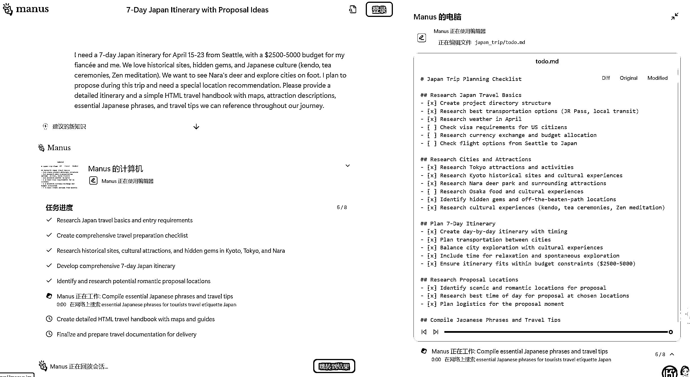

# 从 Dify 到 Manus，这次 AI Agent 的变革给我们带来了哪些启发

> 原文：[`www.yuque.com/for_lazy/zhoubao/inmkxsaig27u6ft6`](https://www.yuque.com/for_lazy/zhoubao/inmkxsaig27u6ft6)

## (14 赞)从 Dify 到 Manus，这次 AI Agent 的变革给我们带来了哪些启发

作者： 雨飞

日期：2025-03-12

大家好，我是雨飞，一直聚焦 AI 编程和 AI 应用这个方向。

最近在 AI 界掀起了一件大事，那就是以多智能体+云环境的产品 Manus 被广泛讨论，引来各界的关注。而就在 3 月初的时候，作为开源的 AI Agent
应用开发平台的 Dify 升级了自己的 1.0 版本，这个版本引入了更灵活的插件机制，和 Agent
策略，但由于改动太多，一上线就导致各种问题。在最近几天，Dify 升级完 1.0.1 之后，这些 Bug
才被修复。为此，根据我自己的开发和实践经验，写下这篇关于 AI Agent 的文章，希望对大家有所启发。

## 一、从 Dify 的 Bug 开始讲起

参加过之前 Coze 航海的圈友可能比较容易理解 Dify，它就是一个有开源和云服务版本的 Coze，同样支持工作流搭建、编排，智能体开发等功能。官方给
Dify 的定义就是一个开源的 LLM 应用开发平台。

这次 1.0 版本的 Dify，主要做了一个非常大的改动，那就是引入了自己的插件市场，包括大家比较常见的 Perplexity 搜索插件，Firecrawl
爬虫插件，以及 ComfyUI 等等。这个插件市场就有点类似我们稍后会具体讲到的 MCP 协议。另外，增加了 Agent
的节点，各种插件支持热插拔操作，可以在不停机服务的时候去更新插件。

更多相关信息可以看 Dify 的官方 blog ：<[`dify.ai/blog/dify-v1-0-building-a-vibrant-`](https://dify.ai/blog/dify-v1-0-building-a-vibrant-) plugin-ecosystem>

这次更新无疑是比较重要的，但很不幸，Dify 这次更新引入了无数的 Bug，导致 1.0.1 版本光修复的记录就多达 80 多个。

当然，Dify 这次更新如果在互联网公司看来就好比升级了一个新版本，用户登录不了 APP 了一样，非常严重，但我们还是可以看出来一些他们迭代和更新的思路。

第一点，**工具、插件和模型解耦** ，作为开发者可以随时随地的使用任意一个插件去完成自己想要的功能开发，而不受底层厂商的约束。

第二点，**Agent 的重要性，Dify 引入了单独的 Agent 节点，并且提供了 Agent
策略的插件，用于实现更高级的工作流任务。包括但不限于，资源调度、状态管理，推理过程记录和工具使用** 。

不过有点遗憾的是，Dify 并没有在 Agent 的流程上进行进一步的优化和创新，还是遵循了以前的 Agent
设计模式。也就是很多人都见过的一篇文章，提到的 Agent 的雏形，包括记忆、规划、执行以及工具四个部分。

但从去年开始， Agent 技术一直不温不火，为何今年开始讨论的声音又热起来了呢？

我想答案有两点，第一，AI
大模型能力的加强，使得理解和规划任务的能力变得更厉害了。支持的上下文变长，可以支持规划和分解更多的内容。这个比较容易理解，去年我们使用过智普、kimi、千问等国产模型做过
Agent，其核心的原因就是这些模型理解不了我们编写的提示词模板，导致整个任务执行过程的失败。而今年下半年开始，大模型的能力变强、费用变低，导致了
Agent 的实现难度和成本都在下降。

第二点，以 DeepSeek 为首国产力量的崛起，让 AI Agent 被认为是 RAG 技术下一站接班人的技术和产品被更多的人所熟知，AI
本身的普及性变高，在这种热情下，Agent 的话题热度也就居高不下了。

当然，这种 Agent
的范式会存在几个问题，比如各个厂家提供的工具接口不一致，开发者要适配各家的内容就需要自己去做兼容。而且一旦某个厂家更新了依赖版本，就很有可能带来其他工具调用失败。为了解决此类问题，就需要把目光放在我们下面提到的
MCP 上面。

## 二、Claude 和 MCP （Model Context Protocol）

Claude 对 MCP 的描述十分简单，它是一个开发的协议，用于 LLM 应用与外部数据源和工具进行无缝的集成。简单来说，MCP
就是规定了服务方和开发者应该遵循的协议，只要是按照 MCP 构建的服务器，都可以用一套代码进行连接和开发。

这个样子就解决了各个厂商提供的 API 服务接口不兼容，开发者需要重复造轮子的麻烦。

一个典型的 MCP 架构如上图所示，包括了服务器和客户端部分。由于 Claude 没有限制服务器和客户端连接的次数，因此一个客户端可以连接多个 MCP
服务器，也就是我们经常看到的一个工作流，比如用户可以通过 MCP 完成读取本地文件，写入到数据库，然后把代码上传到 Github 等一系列复杂的操作。

目前支持 MCP 的客户端有很多，包括 Claude Desktop、Cursor、Windsurf 以及 Cline 插件、Roo Code
插件等，都可以调用 MCP 去完成复杂任务。

虽然 MCP 有这些优势，但是讨论的热度其实并不算高，原因也非常明显。首先，由于 Windows 电脑本身和 MCP 兼容性存在一些问题，很多
Windows 用户根本配置不了 MCP，更别说使用了。而且就算配置好了 MCP，效果也会和 Mac 用户相比，要弱不少。

另外，比较关键的一点，很多人都不知道有哪些 MCP 可以用，这就好比别人告诉你这个东西很厉害，但是具体到某一个功能时，我们就不知道该如何选择或者安装 MCP
了。

## 三、Manus 的创新之处

这时， Monica 团队推出的 Manus，作为一款通用型 AI Agent 产品，开始爆火。除开网上的分析，讨论说 Manus
是一款套壳软件之外，我们更应该看到他们在产品设计和开发中做了哪些优化。毕竟已经出现很多开源的复刻产品，虽然形态上有所区别，但这足以说明技术本身并不是壁垒，任何开发团队都有机会实现这样的产品。

从上图中我们可以看到，Manus 本身内置了一台云电脑，可以将本地数据传输到云电脑中进行处理，保证了本地数据和环境不被修改。其次，Manus
设计了一套任务规划和执行调度的机制，国外是使用 Claude 3.7 实现，然后根据任务的不同，去分别调用不同的 Agent, 每个 Agent
可以去使用自己的工具完成任务。最后，会生成整个任务的报告并记录到文件中返回给用户。

这个过程就解决了我们之前提到的 MCP 选择的问题，根据一些逆向测试，Manus 直接帮我们内置了 29 种
工具，包括网络部署、浏览器操作、命令行操作、文件操作以及消息通知类工具。**这就解决了用户自行安装 MCP
可能带来的麻烦，毕竟很多时候，用户在使用的时候，并不想自己去解决一些复杂的事情，只想和 AI 对话，然后得到结果** 。

再给大家举个例子，字节的 Coze，看起来很美好，可以自定义工作流去完成复杂任务。但实际上，根据我和一些圈友的交流，Coze
本身的模版、商业化的道路并不顺利，很多开发者并没有赚到多少钱，绝大多数是依靠商单定制（资源型，需要机会）。这是因为，普通人不需要学会如何使用
Coze，他们需要的是可以一键执行的软件，最好是使用越简单越好，功能越强越好。

Manus 的这款产品，在爆火的时候，就告诉用户，哇，你完全不需要学习很复杂的技术，安装各种各样的环境、插件，甚至不需要有高配置的电脑，就只需要输入一句话让
AI 帮你完成你想做的任何事情。当然，这件事情现在可能还不现实，但随着 AI 技术的进一步发展，或许很快就能成为现实。

再比如，影刀目前已经在探索 AI 自动生成影刀的工作流，我在想 Coze 也有可能尝试类似的做法，只需要让用户输入自己想要的内容，就能生成工作流、智能体。

## 四、小结

至此，整个 Agent 产品，我们已经讲的差不多了，简单总结下我看到的和实际的一些体验。

1、做 Agent 产品，一定要用最好的大模型，了解 AI 技术的边界和成本。

2、Agent 产品，尽量给用户少的选择，最好就是开箱易用，用户决策成本越少，使用难度就越低。复杂的实现策略，应该交给开发者和服务端。

3、长期记忆非常关键，目前的策略主要是依赖大模型本身上下文加向量数据库的模式，如果有人能在这个方面有所突破，就能做成更好的产品。

4、MCP 应该会是 25 年非常有潜力的项目，基于现有的 MCP 直接封装成垂直领域的产品也非常有变现潜力。

5、直观的效果展示和 UI 设计，应该能吸引更多的人。Manus 这种 UI 设计模式上就做了细微的创新。

6、建立一个评价 Agent 性能和效果的评估体系和数据集，以便在模型迭代更新的时候，可以快速适配和看到效果。

7、利用 AI 编程工具，例如 Cursor，也有机会做成类似的 Agent 产品，市场潜力和价值可能会更大。

* * *

评论区：

暂无评论