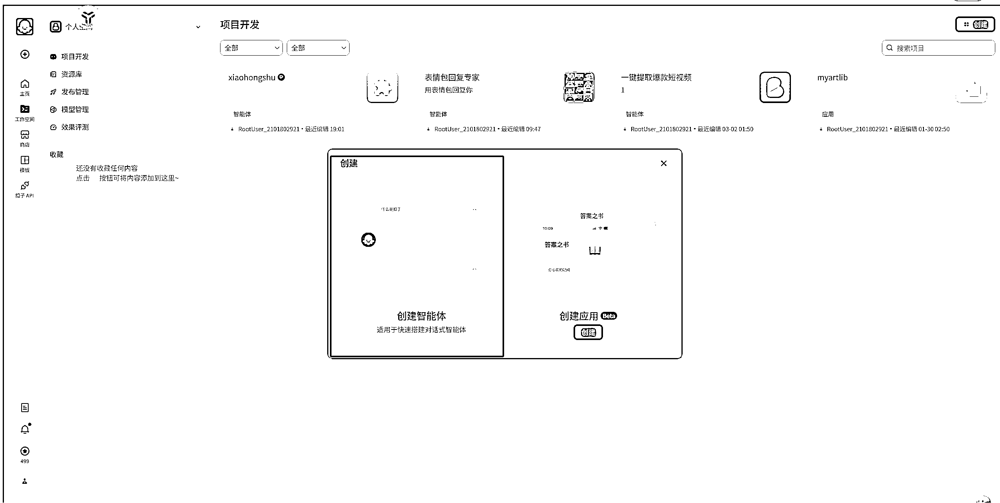
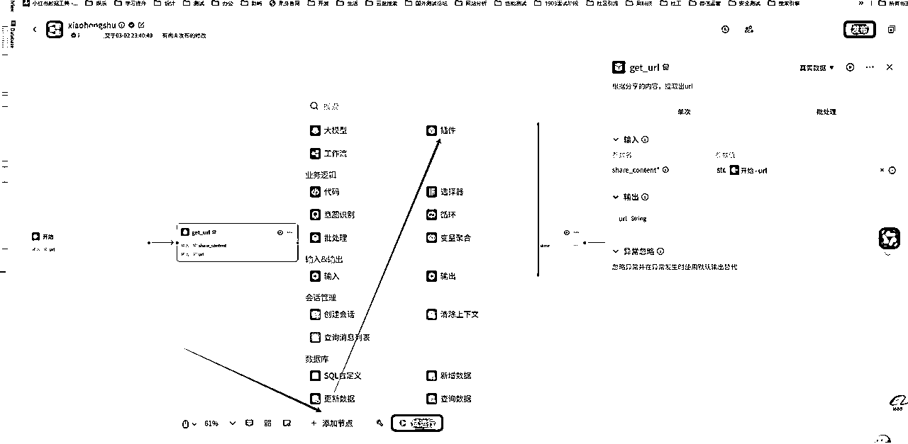

# 小红书一键提取图文标题到飞书多维表格

> 原文：[`www.yuque.com/for_lazy/zhoubao/pyy2w2ramx57rq1g`](https://www.yuque.com/for_lazy/zhoubao/pyy2w2ramx57rq1g)

## (精华帖)(127 赞)小红书一键提取图文标题到飞书多维表格

作者： 富贵

日期：2025-03-14

各位生财的圈友，大家好，我是富贵。

长安文化创始人，公司的主营业务是小红书高客单线索类，目前自持素人矩阵号 3000➕，MCN 合作达人 10000➕。

最近又和生财联合创办了 AI MCN 公司，需要大量的内容创作，近期在 AI 工作流上动了很多脑筋。

因为是流量型公司，所以对技术的一切理解都基于如何更好的降本增效，为了提高公司小伙伴们的效率，一直在“小红书黑科技”上，苦心钻研，外部采买➕自主研发，属于资深的老韭菜了。

因为我们的技术同学不是专业搞 AI 的，也许文档里会有很多本可以简化的弯路，如果 AI 行业相关的圈友，还请大家帮忙多提建议呀。

# **图文配置教程（苹果手机版）**

总流程：核心逻辑就是通过快捷指令调用 API 接口执行 coze 工作流，需要使用 coze 的 token+workflowid

第一步：然后 coze 工作流做的工作是识别 app 的短连接还原成长连接或者复制的就是长连接，然后请求小红书接口第二步：返回相关参数，通过 JavaScript 脚本整合 json 保存变量然后调用飞书表格 API 接口

第三步：飞书表格接口需要授权+请求表格 base 路径+表格 id

第四步：飞书表格我共享的模版会自动把图片链接转附件加入飞书表格显示封面

第五步：根据我共享的表格模版会自动进行标题和文案的 AI（DeepSeek）创作

最终效果呈现苹果手机点击小红书笔记链接，一键同步到飞书多维表格，因为教程是刚写，所有还有很多复杂的场景都可以实现，比如直接拆解爆款视频，爆款图文，进行二创，根据比较生成词云等等，待完善

## **一、飞书账号准备**

飞书官网：[`www.feishu.cn/`](https://www.feishu.cn)

**如果已经注册过飞书账号，这一步跳过，直接看第二步。**

**1.注册飞书账号**

1.1、访问 [`accounts.feishu.cn/accounts/page/login?app_id=11&no_trap=1&redirect_uri=https://www.feishu.cn/login_redirect&template_id=7159153320657698818`](https://accounts.feishu.cn/accounts/page/login?app_id=11&no_trap=1&redirect_uri=https://www.feishu.cn/login_redirect&template_id=7159153320657698818)

1.2、填写手机号完成注册

**2.创建企业**

2.1.1、登录后点击"创建企业"

2.1.2、填写企业名称等信息（信息随便填就行，对使用没有影响）

2.1.3、完成企业创建

## **二、创建多维表格**

1.打开模板链接（需要运营提供模板链接）。要先登录飞书账号在打开哈。

[小红书笔记 coze 笔记收藏](https://ccn5rcywl0hv.feishu.cn/base/IWOYb11Mxa5vRhsfF8ScIZtknqd?from=from_copylink)

2.点击上面的模板链接后，稍等一会会自动弹出模板弹框，点击‘使用该模板’。

点击云盘然后新建多维表格

3.模板就会自动保存到你的账号。

4.确认一下模板链接是以 xxx.feishu.cn/base/开头的。如果不是的话，要删除模板，重新创建多维表格（就是按第一步重新操作），不然用不了哈。

5.点击右上角‘分享’，弹框下面的权限把 ‘可阅读’ 切换到 ‘可编辑’。

6.在浏览器顶部多维表格链接里，记录以下信息：

复制 URL 中的 多维表格 Token（即 base/后面的字符串）

复制当前表格的 表格 ID（即 table=后面的字符串）

**这两个信息要保存好，等会用到。**

然后就是 coze 注册

# 使用飞书或者抖音扫码都可以

然后 coze 工作流配置扫码登录创建工作流

填写建立

### 代码内容

// 在这里，您可以通过 ‘params’ 获取节点中的输入变量，并通过 'ret' 输出结果

// 'params' 和 'ret' 已经被正确地注入到环境中

// 下面是一个示例，获取节点输入中参数名为‘input’的值：

// const input = params.input;

// 下面是一个示例，输出一个包含多种数据类型的 'ret' 对象：

// const ret = { "name": ‘小明’, "hobbies": [“看书”, “旅游”] };

async function main({ params }: Args): Promise {

// 构建输出对象

const list
=[{"title":params.title,"nickname":params.nickname,"desc":params.desc,"imageUrl":params.imageUrl,"noteid":params.noteid}]

let records= [];

for(let item of list){

let record ={"fields":"{}"};

let fields = {};

fields.标题 = item.title ;

fields.作者 = item.nickname ;

fields.文案 = item.desc ;

fields.图片链接 = item.imageUrl ;

fields.帖子 id = item.noteid ;

record.fields = JSON.stringify(fields);

records.push(record);

}

const ret = {

info: records

}

return ret;

}

关键步骤使用 coze 的接口调用实现跨平台保存笔记

通过 coze 的调试验证 API 是否可以试用

使用接口调用需要获取 token 和 workflowid

给个人空间工作流添加授权

## 随便填写一个小红书笔记链接

[[`www.xiaohongshu.com/explore/67bc5f55000000000900e3dc?xsec_token=ABg1aRY_LIGGAmq12SC74oFzz6Ig-`](https://www.xiaohongshu.com/explore/67bc5f55000000000900e3dc?xsec_token=ABg1aRY_LIGGAmq12SC74oFzz6Ig-) ZCelcWkBM2te5YyA=&xsec_source=pc_user]([`www.xiaohongshu.com/explore/67bc5f55000000000900e3dc?xsec_source=pc_user&xsec_token=ABg1aRY_LIGGAmq12SC74oFzz6Ig-`](https://www.xiaohongshu.com/explore/67bc5f55000000000900e3dc?xsec_source=pc_user&xsec_token=ABg1aRY_LIGGAmq12SC74oFzz6Ig-) ZCelcWkBM2te5YyA=)

填写的格式是这样

"url":
"[`www.xiaohongshu.com/explore/67bc5f55000000000900e3dc?xsec_token=ABg1aRY_LIGGAmq12SC74oFzz6Ig-
ZCelcWkBM2te5YyA=&xsec_source=pc_user"`](https://www.xiaohongshu.com/explore/67bc5f55000000000900e3dc?xsec_source=pc_user)

工作流页面就是工作流 id

测试成功只需要 2 个参数给苹果快捷指令即可 1 token 2 workflow_id

### 五、获取快捷指令

5.1、在苹果手机浏览器或微信上打开链接，点击获取快捷指令

[`www.icloud.com/shortcuts/391e0cd9346c4fdf8fa100ae37e573ee`](https://www.icloud.com/shortcuts/391e0cd9346c4fdf8fa100ae37e573ee)

5.2、在手机上打开快捷指令应用，点击‘自动选题库’

5.3、向下滑，找到图片中这条链接，把获得的 Token 以及 coze 工作流填入(即&token=后面添加)，填写完点击右上角的 ‘x’ 就可以了。

### 六、设置触发方式

6.1、进入苹果手机设置页面，点击 ‘辅助功能’

6.2、点击 ‘触控’

6.3、点击 ‘辅助触控’，如果没有开启，就点击开启辅助触控

6.4、选择 ‘单点’ 。你也可以选择 ‘轻敲背面两下’，看个人操作喜欢

6.5、选择 ‘自动选题库’就可以了。

### 七、小红书使用操作

7.1、点击小红书笔记右上角

7.2、点击 ‘复制链接’

7.3、点击手机上的控制键，就会提示自动保存到多维表格。

## 常见问题解答

注意事项：

1.请妥善保管 Token，不要泄露给他人

2.如遇同步失败，请检查：

网络连接是否正常

Token 是否正确

飞书应用权限是否正常

3.如有问题请联系客服

## DeepSeek 数据分析教程

1.用电脑浏览器打开 deepseek 官网 [`www.deepseek.com/`](https://www.deepseek.com)

2.点击 ‘开始对话’，进入对话框。如果还没登录会自动跳到注册页面。注意：要先注册账号才能使用。

3.deepseek 注册登录后，就会弹出对话框

4.打开飞书多维表格页面，点击右上角‘...’，选择 ‘导出’ - Excel/CSV 文件

5.默认选 csv，点击 ‘下载’

6.下载后把文件名改成 one.csv，方便上传到 deepseek 对话

7.在 deepseek 页面对话框，点击‘大头针’logo 按钮，上传 one.csv 文件

8.把提示词模板，复制到对话框里，点击‘发送’，deepseek 就会自动分析笔记内容

**提示词模板：****↓↓↓**

根据 one.csv 文件是小红书笔记内容，请分析出笔记的内容结构、标题公式、情感分析、关键词，标签分布、智能打标签、笔记内容结构。

1.标题公式：根据笔记标题划分笔记类型，分析标题特点和结构，最好能总结出公式、常用的关键词

2.情感分析：哪些关键词或内容能调动用户情绪、吸引用户

3.关键词体系：关键词类型、关键词出现次数、关键词在标题、笔记内容中出现频率

4.笔记标签：标签类型、统计重要标签

5.笔记内容结构：分析内容的结构内容并统计归类，优缺点等

6.根据数据详细说说：用户核心需求、内容优化建议等

7.分析完内容后，统计你分析的数据和结论，写十个标题、写十遍笔记内容、写十个标签。

* * *

评论区：

三林 : 感谢喂饭教程

vincent : 大佬，真的牛🐮

易芝 AI|RPA 版 : 在深耕 ai 和红书，富贵方便🔗交流么

刺猬🐬 : 感谢富贵哥，是生财的富贵哥。不是那破什么的富贵哥

富贵 : 我加了个视频进去的，能看到吗，哥？视频里写了生财专享

富贵 : 可以啊，线下互相掏手机，掏完了可以交流。

刺猬🐬 : 嗯嗯，还得是富贵哥，太牛了，喂饭教程

易芝 AI|RPA 版 : 哈哈哈啥时候组局