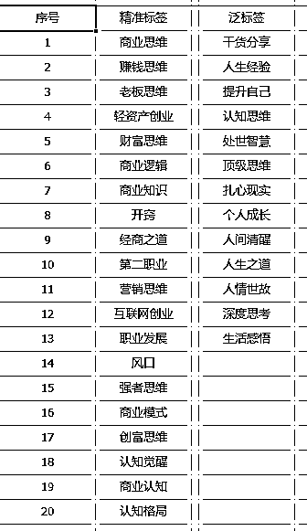
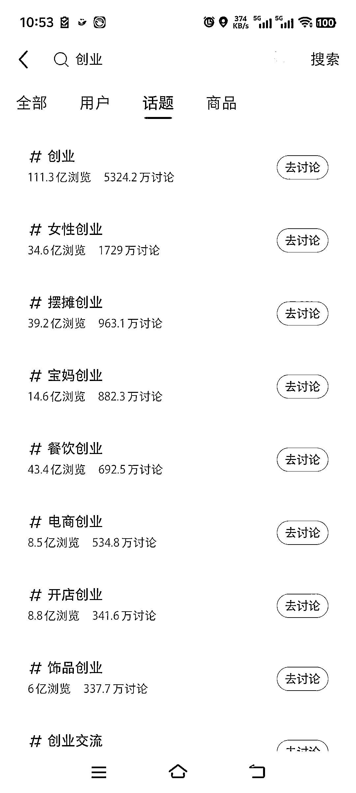
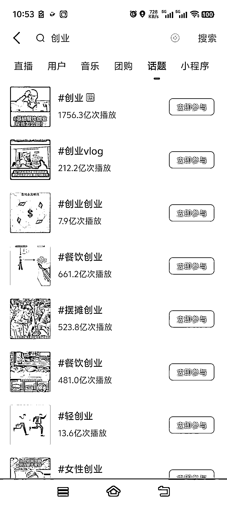
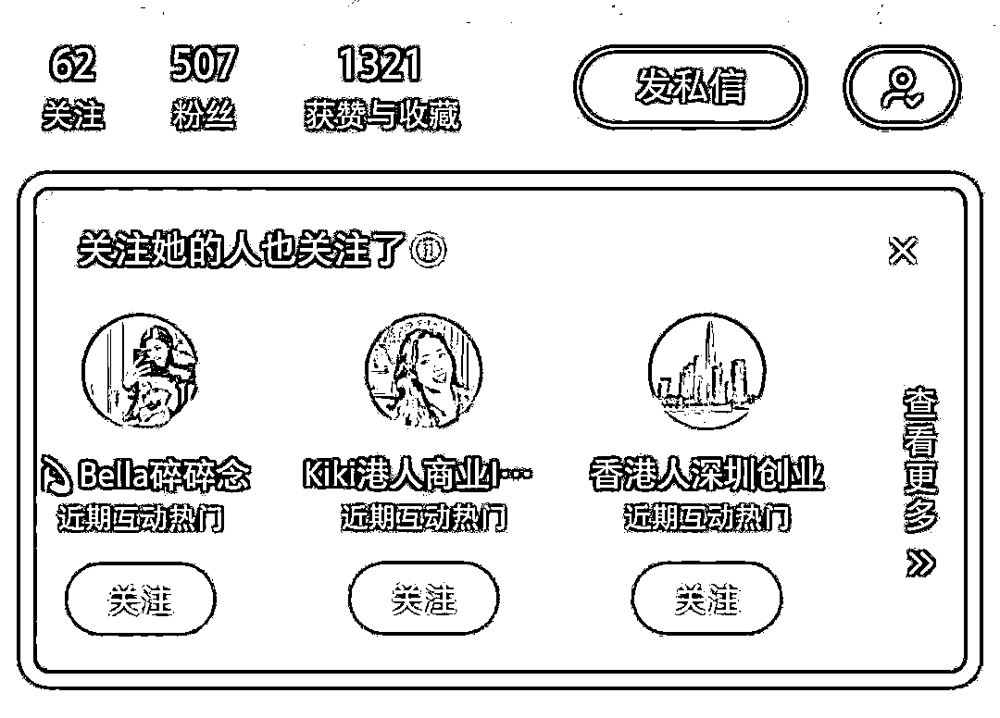
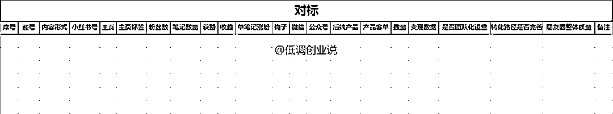

# 矩阵流量指导手册（打粉 20 万总结出的一线实战方案）

> 原文：[`www.yuque.com/for_lazy/zhoubao/eg0vh93whpzx7tbb`](https://www.yuque.com/for_lazy/zhoubao/eg0vh93whpzx7tbb)

## (109 赞)矩阵流量指导手册（打粉 20 万总结出的一线实战方案）

作者： 低调哥

日期：2025-03-10

后从事过多个赛道进行矩阵获客，总计获客 20w+，今天把一线实战方案给大家进行一次集中式分享，写一份矩阵流量的实战方案，从 0-1-100 手把手教你搭建矩阵流量团队。

**一、为什么矩阵获客？**

两个字：复制，做流量这件事，不要陷入一种死胡同，就是非要和自己较真，很多人最容易陷入的死胡同就是 IP 获客。

其实大多数人的表现力也好，能力也好，其实和真正的头部 IP 竞争的优势并不明显。

很多人都会陷入了一种，一通操作猛如虎，一看播放 250 的现状，而且还买了一堆的设备，再加上自己的时间，精力，各方面的原因导致了流量根本没有打起来。

其实哪怕打起来了也很累，因为不可复制，哪怕培养起来了一个 IP，也怕对方跑路。

还有很多行业其实并不需要 IP，最简单的图文模式，甚至简单的视频模式就可以进行获客。

时刻告诉自己我们需要的是精准的流量，如何更短的路径实现这个目标才是我们的目的，不需要刻舟求剑，也不需要南辕北辙。

废话就不多说了，相信大家也懂这些道理，总之可以复制放大的模式，才是好的模式。IP 这种模式获客也没错，大道三千，选择适合自己的。

**二、矩阵流量实操方案**

**1、赛道选择：**

做矩阵流量这个事情，不是什么行业都适合，很多天花板比较低的行业就不适合，比如我们去年一个赛道我们铺了几百个号，直接这个赛道就基本上让我们吃了，而且同行出现了各种举报，甚至最搞笑的是同行居然打电话过来要搞我们。

这个赛道，一方面是流量数量，第二方面是变现维度。

就是你的转化模型 OK，流量吃得下，单粉的产值持续稳定。

做任何项目，第一个考虑的并不是流量维度，是变现唯独，也就是赛道。

其次持续复购的私域，尤其是一次性引流可以持续产生价值的赛道，才是真正的好赛道。

而且尽量选择哪种相对阳光正规的项目，因为这样的流量也比较好做，越是不正规的平台越是管控，你就始终在和平台斗智斗勇，这样下去整个团队都很内耗。

**2、对标搜集：**

很多同行为什么流量做的差，没有一个好习惯，也就是不愿意去看对标。

下面讲几个常用的对标搜集方法：

**①行业关键词/话题标签**

列出行业关键词搜索/也是一些内容标签

拿创业粉丝举例，先把用户常见搜索的内容，或者是作品内容附带的标签整理出来。

**②平台的话题功能：**

众多平台都存在这个话题功能，这是最好筛选对标的一个渠道。

**  **

**③相关账号推荐：**

你关注了对标账号之后，下方会出现类似的账号。

**  **

**④首页推荐：**

准备的小号关注了都是这一类的内容，同时给你的精准客户点赞，评论，会给你推荐更多的相同账号，在首页推荐当中，你能找到更多的潜藏在水下的对标。

给大家一个建议：每个渠道准备一个小号，这个小号只用来刷对标，前期我们开新盘，肯定老板下一线去搜集，我上周刚打算起新盘，第一时间去搜集了 100 多个对标，用 1-3 天的时候去重点搜集，然后重点分析那种形式适合我们团队，然后进行尝试。

后期让你的流量组长，每天上班第一件事就是做这个，然后每天搜集 10 个对标同行。然后每周看这个表，让你的流量组长给你进行分析，同时建立一个小组对标搜集群，就是好的对标，大家一起发在群里。

做流量这个事情，很多时候很多人花大价钱去学习，其实根本不需要，同行就是最好的老师。你能把同行的流量姿势拆解明白了，你已经入门了。

按照这个表格去搜集对标即可，我们团队自己用的。

放大看：按照这个表进行登记即可。

有几个点给大家讲一下

1.  主页标签：就是个人介绍，方便你们进行模仿设计。

2.  微信：关注对标也要把到人家后端的私域去感受一下对方的转化流程。不是简单的看看流量就足够了。

3.  产品：这里面有个很重要的细节，那就是如果同行产品的价格都很低，你也很难卖上高价，因为你的客户会刷到你，也会刷到同行，也就代表，加到你的私域，也会加到对方的私域。

所以我们搜集对标，都会关注对标的产品，以及产品的变现情况，甚至朋友圈质量，是否团队化运营等等。

记住，你前期进入一个赛道，你能做到和同行的流量方式相同，那么如果同行的产品价格都很低，你是很难买的上高价，但是与此同时，你的转化路径各方面设计的比同行好，你更容易比对方进行成交。

**创业是开卷考试，是允许抄答案的。_**

对标搜集这个事情至关重要，很多人会严格的忽视这一步。其实大多数对标的形式无非那么几种。你要从这些形式中找到你能抬抬脚够得到的方法。

比如常见的两种形式：

图文形式，就是大量的图文输出，这个形式前几年很不错，但是从去年大多数的人涌入这个赛道，已经很难做下去了。但是一些小赛道还是有一定的机会。

另外一种就是模板打粉，就是制作内容模板，很简单的一个故事，或者是一段内容，引导出产品。这种形式封号很明显，但是打粉的效率比较高。

具体是什么形式，还是在于你观察同行的对标形式决定，这里面有一个提醒，尽量抛弃 IP 号的形式去搜集对标。尤其是那种几万粉丝，或者是几十万粉丝的大号，那些并不是你的对标。

什么是符合你的对标账号，

1.  半年内新起来的账号，粉丝量 1-2 万以下的。

2.  内容形式可以复制的，你们团队可以做出来的。

3.  后端转化变现还不错的，产品和你们高度契合的。

有些形式你看着很好，但是你团队做不出来，都是白搭，要么你招聘到有这方面的人，要么你让团队深度研究，然后进行测试。

**3、钩子**

你是什么钩子决定了你的粉丝需求。

不要为了容易获客把钩子做的特别宽泛，反而影响你的转化率。

我们要的是精准客户，而不是泛流量。宁要精准粉 10 个，不要泛流量 100。你会浪费大量的时间和精力在泛流量上浪费转化的精力。流量要的不是多，而是精准，不要有一种错觉，我们矩阵打的流量就是泛流量。

在关注对标的时候，也顺带的把对方的钩子搜集起来，然后整合出来自己的钩子。

好的钩子是自带成交属性的，也就是看完了你的资料承诺兑现，直接愿意进行付费，哪怕不付费，甚至有直接的付费咨询。

最差的钩子就是那种直接发工具，行业资料，甚至什么书籍，对方根本不关心你是谁，而且吸引来的全是白嫖党。

**4、流量测试：**

这里在阐述一个观点，也是我认为作为一个老板，不要去犯的错误。你不要去一线打流量，很多人可能会表示质疑，我不应该亲力亲为吗？

不应该，从你的团队找那种认真负责的人去做，因为你的时间和精力做不到每天去更新作品，你根本测试不出来哪个方法正确与否。

我带团队这么多年，我没做过任何的作品，也没发过任何作品。但是整体的大框架都是我定下来的，具体后面我们讲团队的篇幅的时候展开讲。

然后前期账号不需要很多，看内容形式的复杂程度。如果难度不高前期 10-20 个进行测试，内容形式可以多种，然后负责测试的人做 1-2 种进行方法混合测试，然后测试一个月看成果。

1.  第一个星期：前期准备，加上养号，差不多一个星期过去了。

2.  第二个星期：是创作的磨合阶段，处于一个摸索期。

3.  第三个星期：属于试错期，会踩到一个坑，比如违规等。

4.  第四个星期：一般就能出一些结果了，然后看下整体的变现情况。

很多人耐心根本不够，比如账号封号了，或者是发了几天一个流量都没出来，就开始质疑方法，或者是质疑团队，亦或者是自己半途而废。这个没法教，没耐心就是赚不到钱。

**5、矩阵放大：**

跑通流量模型只是开始，转化模型才是重点。要测试出准确的单粉产值，要不然你根本没有办法进行扩大，扩大的越多，你亏得越多。

如果你的各方面测试 OK，那就胃口大一些，把这个赛道吃下来，哪怕最少也是吃下来一定的份额，这才是矩阵流量最大的魅力。我先后把两个赛道大多数的份额都吃下来过，所以我深知矩阵的威力有多大。

放大离不开这么几个要素：

1.  基建：账号，设备，网络等

2.  人员：招聘，面试，培养。

3.  管理：薪资体系，管理框架，组织架构等

实话实说，大多数的老板基本功太差了，也就是其实不赚钱的原因很多时候很多人会归结于运气，其实并不是，很多时候是你的基本功不够。

尤其是很多人公司没有真正的运营过，甚至从没有把公司做过几十人的，矩阵你很难打起来，因为不是方法问题，是管理的问题。这里我简单的讲一讲一些基础，因为这不是一篇文章就能教会你的。

**①基础建设：**

**1）手机：** 租或者是买，看公司实力决定，我基本上都是租，战略长期合作伙伴随心，基本上圈内人都认识，和随心合作了 5.6 年了，放心靠谱。

一般 50 元/月，设备到手双清一下就可以用了，我们团队习惯用安卓，其实安卓和苹果，在我们看来安卓更好用一些。

**2）账号：** 让员工注册实卡，然后进行账号注册，一个员工入职 7 天进行办理，我们和当地的电信，移动，联通都处的不错，都上门进行办理。把员工的卡办满。三线城市 99 元 1 拖 4，这个套餐还算蛮划算的。

很多人会不好意思让员工进行办卡，我们在面试的时候就会和员工讲解，员工基本上都会同意，一定要提前讲好，要不然后面你再去提，员工就不愿意了。

很多朋友会将哪怕 10 多张卡也不够用，这个就涉及到一些擦边的业务了，这里不方便说，懂的都懂，这里没法展开说。

**②人员**

**1）基础薪资**

首先你的工资比本地基础工资要高，我们本地工资是 3000，我当时工资定的 3500，比本地高出 20%，尤其是你公司前期人少，一个草台班子，你如何吸引人才，工资高，其次工资高能让你面试的人更多，其次你的选择余地也多。

**2）提成标准：** 流量只赚流量的钱，不需要去分后端收益。

因为他们关注的就是每天获客的数量，这个是及时反馈。

我们都是阶梯提成方案：

0-1000 没有提成

1000-2000 单粉提成 0.5

2000-300 单粉提成 0.75

3000 以上 单粉提成 1

然后加上底薪，类似于这样的方案，这个自己进行修改，看你们的流量获客数量进行决定。

**3）人群画像**

我们去年流量团队 20 人，面试了几百人，最后留下来的人群画像简单给大家同步一下。

1.  大学应届生

2.  从事过相关工作

3.  女生为主

这两者是最多的，尤其是三线城市，你招募那种安逸工作很久的，干不了我们这个活，不如直接招募应届生，或者是从事过相关工作的，这样的可以拿过来就用，其次女孩子为主，因为女孩子更稳定，而且好管理。

**4）培训方案**

招聘之前一定要你们内部已经把方法测通，其次制定出详细的新人培训方案。

我给你们一个简单点的方案，把你们做流量的步骤录制成视频，

然后制定出三天的培训方案。

比如，

第一天：看视频教程，找对标 XX 个，学习笔记制作。

第二天：找对标 XX 个，制作笔记 XX 篇，然后进行发布，

第三天，增加制作的数量，看发布笔记的效果情况。

我们公司的标准是前三天没有底薪，进公司我会让签订一个试岗期的协议。

**5）日常管理**

我们做图文账号，每天两更，一个员工做 40 个账号并不难，这是基本的行业数据，如果做不到，你们要么方法有问题，要么员工执行有问题。

其次让员工把设备带回家进行倒流，这个很多人表示很难，其实一点都不难，强调这个事情的重要性就好了。

因为这个流量和他的业绩息息相关，而且真正流量好的账号也不多。

其次进行笔记检查，每天发布的数量是否达标，安排小组长进行抽查。

**三、其他细节**

**  **

**1、方法迭代：**

每周及时召开周会，让员工进行分享优秀的方法分享，然后组长整理到统一的文档，方便大家整体能力提升。组长需要不断地收集对标，然后及时给予组员进行最新的方法同步。

**2、优胜劣汰：**

不合适的员工及时优化，能力差的不要留下，比如 1000 是基础的流量基准线，连续 2 个月没有达到的就进行优化，后续也很难做上去，然后不断地招聘筛选。

**3、多用 AI：**

目前 AI 的持续图文创作，亦或是数字人已经很成熟了，一个懂 AI 的流量团队的效率更能碾压同行。

**4、小组模式：**

我们的组织架构是，主管-组长-
员工，一般 3-5 人一个小组就可以，选出一个小组长，建议采用竞聘的方式，这样小组长的积极性会更高，并不是流量最好的当选小组长，选择那种比较热心，比较愿意分享，性格比较好的，流量也不错的更合适，因为小组长是沟通，同时给予组员解决问题，比如设备更换，账号解封，最新问题等等。

**四、算账**

很多人认为矩阵流量成本低，其实我给大家算个账，其实一点都不便宜。

1.  基础薪资：3500+社保：4500/月

2.  设备成本：50*40=2000/月

3.  话费成本：40*30=1200/月

4.  场地成本：200/月

5.  日常开销：200/月

4500+2000+1200+200+200=7900 元。

假设单月流量 1000 个，单粉成本 7.9 元。

这还是三线城市的计算方式，这只是给大家进行举例，所以矩阵流量也不便宜。很多隐形的成本还没有进行计算。大多数项目都是第一个月员工进来基本上都是亏钱的，第二个月持平，第三个月盈利。

这其中还没有进行计算转化成本，交付成本等。比如转化人员的工资，交付人员的工资等等。

你如果单粉产值在 30 以下，我都不是很建议做矩阵流量。因为收益真的很低。

所以不要认为矩阵流量这个事很便宜，其实是一个费心费力，还没那么赚钱的事。不会算账的老板，就是亏得越多的老板。

**五、总结**

矩阵就是找到一个简单的形式，然后进行复制放大，难度真的不大，真正难做的是管理层面。

你能赚多少钱，不是取决于你自己，是取决于多少人帮你做事。

很多人做矩阵流量，为什么做的很差，如果是个人那就是执行不到位，如果是团队除了方法层面上的，剩下的就是管理能力跟不上。

我们的员工可以做到，持续自己找我们增加设备，大家比着加账号，加设备，相互的进行卷。

其次选择赛道是重中之重，我们去年选错了赛道就导致了后面转化跟不上，团队进行优化，把一些不错的员工进行了优化，我心里是很难受的，但是没有办法，比起来亏钱，我们更要去做个狠心的老板。

矩阵只是流量的获客手段，真正决定你项目成功与否的还是赛道和产品。

赛道定生死，流量定规模，转化定利润。

不要选择一次性的赛道，尤其是没有复购价值的赛道。最讽刺的就是你做的原本是一次性的生意，但是你确认为这是个复购的生意，然后本末倒置，最后你发现一地鸡毛。

一定要测试好转化，产品，再去放大流量，要不然团队越大，流量越多亏得越多。

前几天简单写了篇帖子浅谈一些矩阵流量没想到很多朋友这么感兴趣，今天就抽空写了个长篇的指导方案，希望更能帮助到大家。

如果你的行业还算不错，尤其是私域高复购的，可以找低调深入交流。

* * *

评论区：

低调哥 : 大家想要的详细版攻略来了！！

周彦充 : 低调哥活跃了，回来了，哈哈哈，热闹起来了[呲牙]

空 : 赛道定生死，流量定规模，转化定利润[强][强][强]

LJ : 进来看大作，受益匪浅！

李智 : 回忆录产品，低调哥怎么看

低调哥 : 不了解，不会看。

大脸狗 : 能链接一下吗低调哥[抱拳]

风中的小徐 : 高手