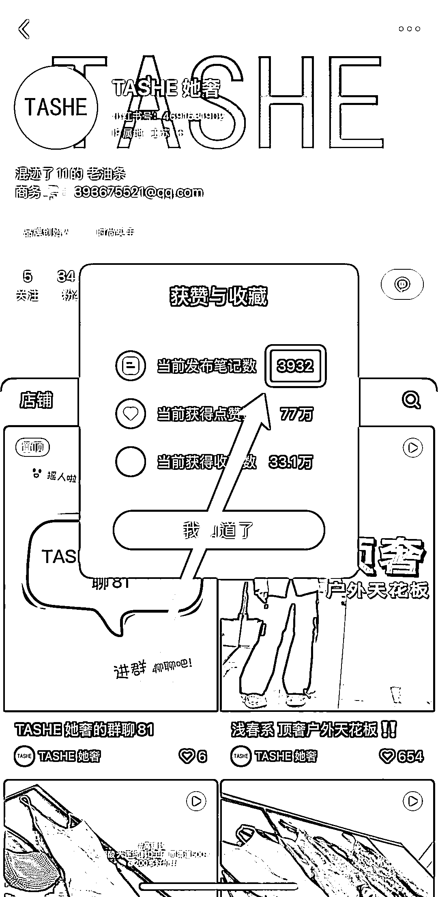
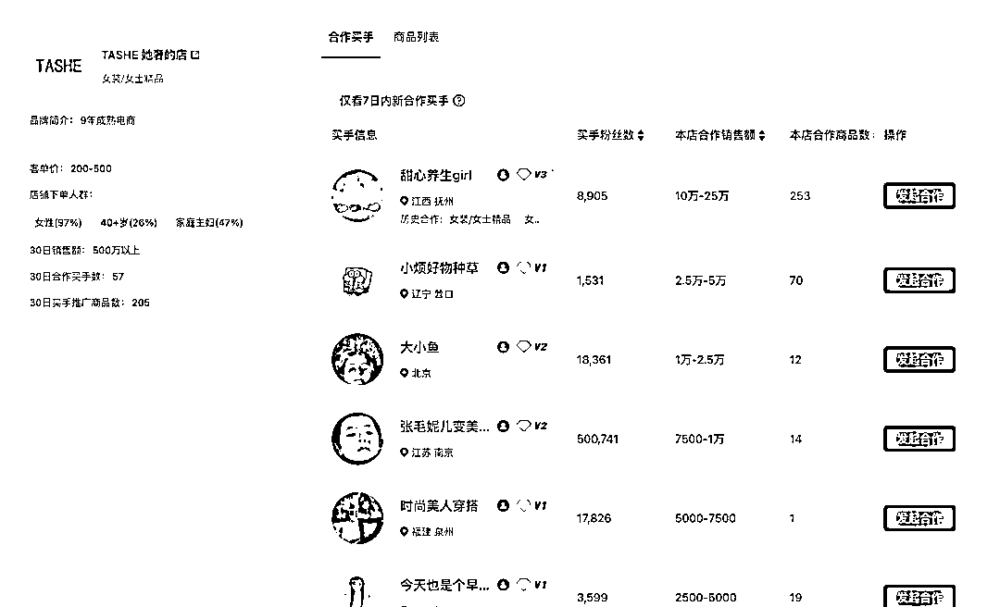
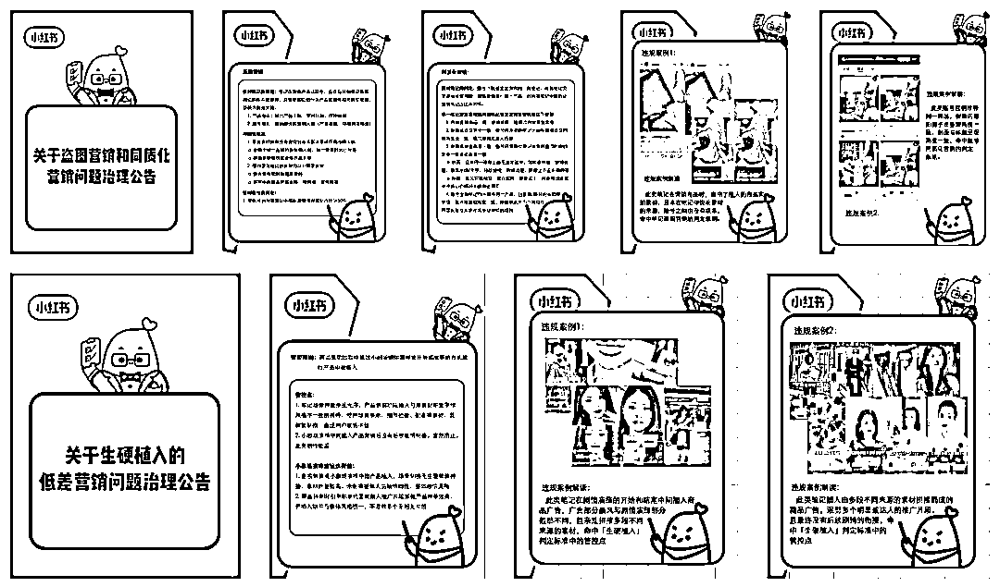

# 别再等爆款啦！先发 100 篇商品笔记再谈小红书电商

> 原文：[`www.yuque.com/for_lazy/zhoubao/stq3ii26i8zg3gwd`](https://www.yuque.com/for_lazy/zhoubao/stq3ii26i8zg3gwd)

## (38 赞)别再等爆款啦！先发 100 篇商品笔记再谈小红书电商

作者： 林卿 LinQ

日期：2025-03-13

最近重新去研究了一遍小红书上闭环电商做得好的商家，研究完发现那些纯粹通过商品笔记卖货的商家压根就没有太多花里胡哨的东西，就是保障 60-80 分的有效卖货内容，持续测试迭代内容、持续怼量有效卖货内容，没了……

案例🌰：TASHE 她奢

链接🔗[[`www.xiaohongshu.com/user/profile/659dfd910000000022015614?xsec_token=ABGWbJWFxXyr43B4AI-`](https://www.xiaohongshu.com/user/profile/659dfd910000000022015614?xsec_token=ABGWbJWFxXyr43B4AI-) KXE1DXCM43U96No0sr1zonyA0k=&xsec_source=pc_note]([`www.xiaohongshu.com/user/profile/659dfd910000000022015614?xsec_source=pc_note&xsec_token=ABGWbJWFxXyr43B4AI-`](https://www.xiaohongshu.com/user/profile/659dfd910000000022015614?xsec_source=pc_note&xsec_token=ABGWbJWFxXyr43B4AI-) KXE1DXCM43U96No0sr1zonyA0k=)

纯粹通过商品笔记月 GMV 近 900 万

1.  单篇商品笔记最高 GMV30 万+

2.  每天商品笔记 GMV20-50 万

3.  1 个月商品笔记 GMV 近 900 万

*数据来源于小红书官方

有且仅有 1 个小红书账号

1.  近 30 天更新 672 篇笔记

2.  平均每天更新 22 篇笔记

3.  图文笔记 11 篇

4.  视频笔记 661 篇

5.  商品笔记 456 篇

6.  常规笔记 216 篇

*数据来源于灰豚数据红薯版

虽然也有买手直播带货，但是 GMV 不高。

因此对于纯粹通过商品笔记卖货的商家来说，

1.  **GMV = 商品笔记数量 * 商品笔记质量 * 精细化运营**

2.  **核心不是爆文概率，而是有效卖货内容的基础覆盖（有效铺量）**

如果想在小红书上纯粹通过商品笔记卖货的话，那就先 1 个月发它个 100 篇笔记再说吧，在产出内容、在发布内容的过程里持续测试迭代内容，而不是磨磨叽叽…3 天也憋不出 1 篇笔记…这样猴年马月才可以看到某个内容模型的测试效果，才可以跑通最小 MVP 模型？！

虽然我经常说要“小步快跑”，但是小步快跑的前提是“步频快”，这样才可以跑得远！

不然 1 个月时间连 100 篇笔记也发不到，哪来的数据判断内容模型是否有效，哪来的实操手感呢？！

当然，也需要平衡一下内容质量，但是在没有内容能力、在没有找到有效爆款卖货内容模型之前，那就优先级像素级模仿同品类、类似品类的有效爆款卖货内容，猛猛怼量测试、边测试边迭代，这样才是小步快跑！

毕竟爆款是有概率的，所以**狼性更新、佛系爆款才是正解** ，**用“铺量”逻辑对抗算法的不确定性** ；

毕竟爆款是有概率的，且爆款所带来的大概率是爆发式增长，但是对于不少品牌商家来说，爆发式增长并不一定是一件好事儿，可能还会费力不讨好，比如产能跟不上，导致发不出去货，进而赔付；比如用户冲动性消费导致售后问题，甚至品质负反馈……所以**我们需要的是持续稳定地增长，需要持续稳定的产出内容带来持续稳定的流量得到持续稳定的动销，而非其他** 。

最后，针对纯粹通过商品笔记卖货的品牌商家提供一套实操路径，以供参考。

01.在卖货之前，优先级**做好功课** ，即

1.1.**洞察**

1.  人群

2.  用户画像

3.  消费决策链路

4.  消费决策周期

5.  用户痛点：功能价值

6.  用户痒点：附加价值

7.  用户爽点：情绪价值

8.  产品

9.  产品卖点

10.  产品 VS 竞品

11.  场景

12.  使用场景

13.  生活方式

1.2.**分析同品类及类似品类的爆款内容，建立爆款内容素材库**

02.创作卖货内容

一般推荐**721 的内容配比逻辑** ，即

1.  **70%像素级模仿同品类及类似品类的爆款内容**

2.  **20%基于洞察进行微创新，比如调整人货场的组合等等**

3.  **10%基于洞察尝试全新内容**

03.**构建正反馈循环**

说白了，就是**内容赛马** ，即**监测不同内容模型的数据反馈，针对性迭代内容及放大有效卖货内容模型** 。

04.**建立内容工业化生产流程**

跑通 MVP 模型之后，就需要沉淀 SOP 流程，尽可能工业化生产内容。

一般推荐用“**创意中台+复制分发** ”的逻辑来落地会比较好，即

1.  创意中台：1 位小红书策划+1 位摄影师

2.  复制分发：N 位小红书运营/实习生

创意中台负责持续不断测试迭代全新的有效卖货内容模型；复制分发负责持续不断复制及分发跑通的有效卖货内容模型。

在这个环节里，文字内容版块基本上可以交给 AI 来完成，甚至某些创意版块也可以让 AI 来辅助，比如分析爆款内容、挖掘内容选题等等。

05.**实操 TIPS**

5.1.**在猛猛怼量的时候，还是需要注意内容同质化问题** ，小红书现阶段在不断管控这些，不过也约等于明牌啦，可以根据公告里的标准来擦边。

5.2.推荐运营矩阵账号，尤其是比较敏感的品类，推荐优先级用非店铺账号去猛猛怼量激进测试，在测试出有效卖货内容模型之后，再提高店铺账号的更新频率，避免店铺账号因为内容测试直接挂掉。

说白了就是**核心账号精耕细作，其他账号猛猛造** 。

5.3.阅读数据不重要、互动数据也不重要，重要的是卖货转化，所以在内容赛马的时候，优先级关注的不是其他数据，而是交易数据！

5.4.与其花 3 天时间打磨 1 篇笔记，不如用 3 天时间快速测试 10 篇不同内容模型的笔记，用数据去判断哪个内容模型是有效，然后再去进一步打磨，提高转化率。

像那些小红书上闭环电商做得好的商家在初期 70%以上的内容都是像素级模仿地爆款内容，在跑通 MVP 模型、在完成冷启动、在有一定实操手感之后，才慢慢形成自己的内容模型/风格。

5.5.**在内容同质化严重的情况下，内容密度和创作效率可能就是卖货出路** 。

5.6.对于大多品牌商家来说，缺的不是策略，而是执行力，是老老实实地洞察、老老实实地分析爆款内容、老老实实地怼量测试！

* * *

评论区：

李智 : 老哥，怎么快速铺 100 篇笔记呢

Yhx : 1 个月 100 篇已经不叫快速了，而且文章也说了，你不知道发什么内容，先去像素级的模仿对标。