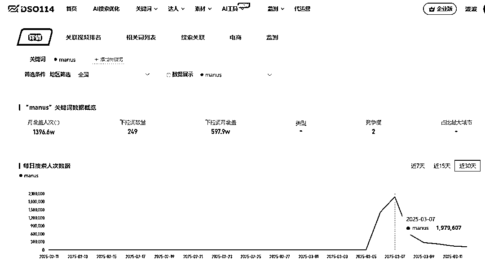

# 这波流量蹭的恐怖，Manus 热度被多家爆蹭单日十几万 App 下载，收入起飞！

> 原文：[`www.yuque.com/for_lazy/zhoubao/smg11o4419sbbtde`](https://www.yuque.com/for_lazy/zhoubao/smg11o4419sbbtde)

## (45 赞)这波流量蹭的恐怖，Manus 热度被多家爆蹭单日十几万 App 下载，收入起飞！

作者： 波波@抖查查@爱盈利

日期：2025-03-13

**  **

**Manus 大火，一波马甲 App 无敌蹭量！**

Manus 是由中国大模型团队 Monica 于 2025 年 3 月 6 日凌晨发布的全球首款通用型 AI 智能体产品。Manus
发布后引发了科技行业的广泛关注，由于采用邀请内测限制，其邀请码在二手交易平台一度被炒到高价。

根据 DSO114 显示的抖音搜索指数，manus 关键词 3 月 6 日搜索量级破百万，3 月 7 日达到接近 200 万。

数据来自[www.dso114.com](http://www.dso114.com)

同时我们看到多个产品（已经有 4 款），在 AppStore 中蹭量 Manus。将产品名称直接改成 Manus 或者加上 Manus。这种操作在之前的热点事件发生时也经常出现。说明这些开发者都是老手了。

**  **

**其中第一款产品，** 使用的是公司开发者账号：（福建的公司，果然福建的流量打法是最猛的！^_）

在 3 月 6 日果断将 App 名称改为加上 Manus 关键字。反应速度，可谓非常之快。^_ 我们来看下短短几天这个产品拿到了什么效果。

从未上过榜单的产品，在当天冲到 AppStore 总榜 Top16，根据点点数据显示，当日下载量从平时的小几十个直接跃升到恐怖的 11 万多。

收入数据分析，从点点数据上看到最高当天收入是 2096 美金，因为这个数值来自数据平台的预估。根据实际经验判断，真实收入应该在这个数值的 3 倍以上。也就是有 6000+美金的进账。真让人羡慕^_

**  **

**我们再来看排名第二的产品** ，是一个个人开发者上传的。这个产品反应速度也算比较快。从 3 月 7 日首次上传。也拿到了不错成绩。3 月 12 日逐渐升到工具榜的 54 名，同时也进入了畅销榜，拿到了不少收入。根据七麦数据显示一天的下载量也有大几千。

ASO 技巧当中，有温和增长 App 权重的方式，当然也有这种蹭量流派，以及暴力机刷的流派。波波做 ASO 这么多年，拆解过的蹭量案例也不计其数了。从早期的 2048 到后面的愤怒小鸟。从 BOSS 直聘和拉钩的马甲包大战，到各种冲榜第一的经典案例。

今天这波 AI 时代的蹭量案例，可能预示着应用商店将会随之出现一波新的高潮。随着大趋势的带动，将会有越来越多的产品，划破天际，带动强大的势能。届时，还将会继续上演无数次的，流量攻防战。产品新秀一定要做好营销策略，抢夺破天的低成本流量。同时也要做好品牌词防守，防止被其他竞争对手偷家大本营。

当然，专业的 ASO 策略也将持续为你拿到更多高质量用户，同时夯实 App 的权重，在众多产品中更快的脱颖而出^_ 欢迎找波波探讨交流！

本文完！

* * *

评论区：

暂无评论