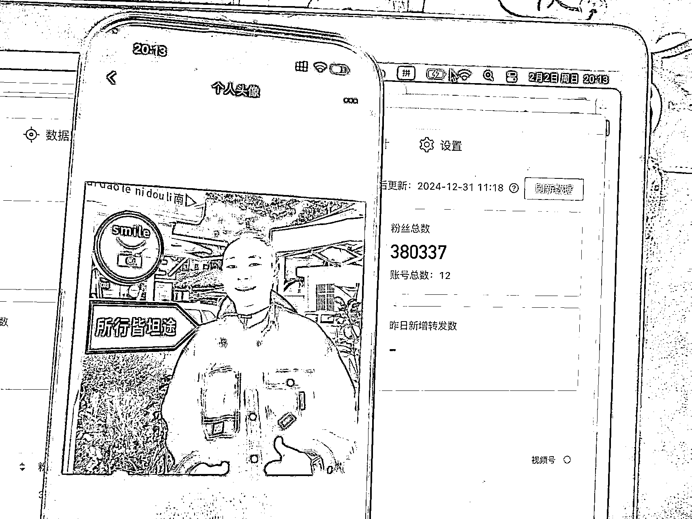
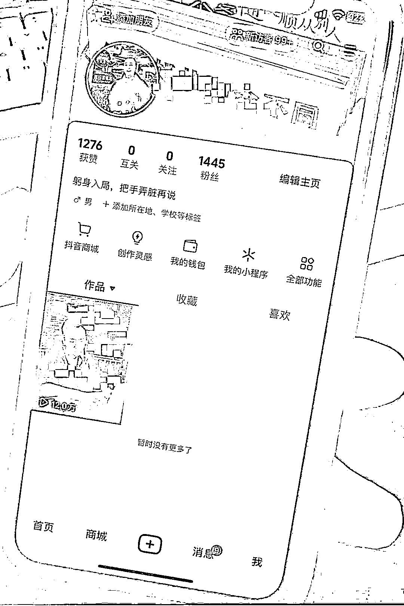
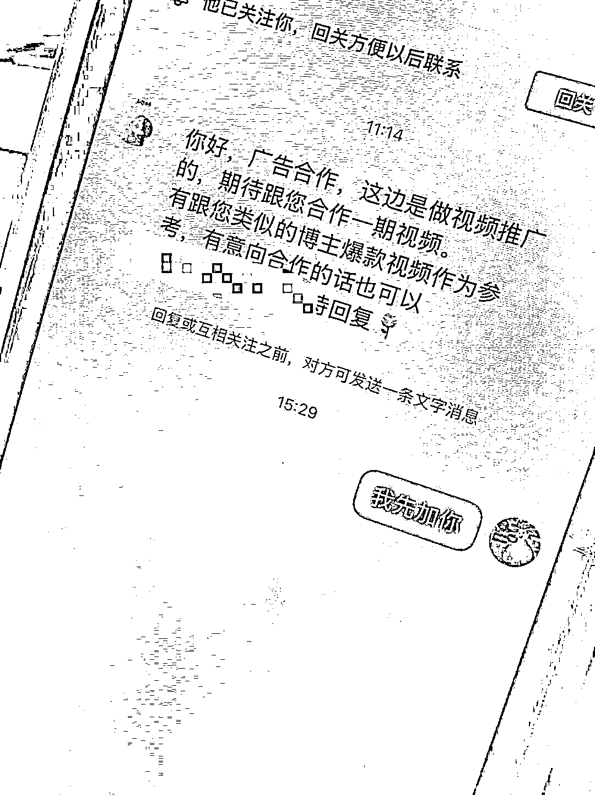
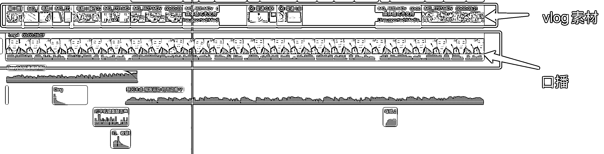
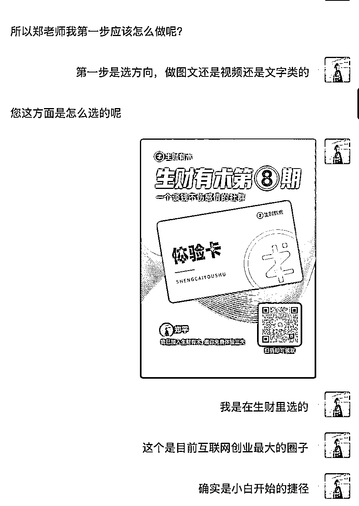

# 抖音 ip 新号，1 条视频 10 万播涨粉 2K 广告主上门

> 原文：[`www.yuque.com/for_lazy/zhoubao/gbzlioo1ft6ooumr`](https://www.yuque.com/for_lazy/zhoubao/gbzlioo1ft6ooumr)

## (35 赞)抖音 ip 新号，1 条视频 10 万播涨粉 2K 广告主上门

作者： 郑平

日期：2025-03-14

这个项目适合：

“**所有在生财里，正在做项目的小伙伴来做** 。”

不用是大佬，不用做出啥成绩，小白都行只要你愿意花时间来做哈哈哈哈。

哈喽呀，各位生财的同学们。

我是郑平，潜水生财一年的新人同学。

24 年跟着生财的航海，在视频号上做了 38 万的粉丝。

也通过生财的聚会，找到了线下同频的小伙伴们。

**  **

**爱死生财了！**

去年做了一年的流量，发现始终会处在焦虑的过程当中。

都说一直做流量会有反噬，因为太急有结果了。

就是那种今天流量好就沾沾自喜，明天流量差又慌得一批。

于是今年想做点长久的事儿，让自己不用每天焦虑于流量。

在生财里翻了几天的帖子，发现做 ip 可以是一件长久的事儿。

内容就是“**真实的记录自己从 0 到 1 做项目的过程** ”。

运气不错，第一条视频下去就是十几万播放

和吸引了不少想创业的人，也来了广告主

所以发篇帖子，看能不能给大家一点启发。

**第一账号的定位**

我的定位是**陪伴者** ，不是一个**教导者** 。

我是记录自己做项目的过程，不是教他怎么去做一个项目。

这种 ip 的好处是**粉丝愿意和我沟通** ，因为没啥攻击性。

就像学生时代，大家愿意和同学交流而不是和老师交流。

但是坏处就是后期如果想做知识付费难度就高了。

毕竟你也不会像你的同学买课不是。

**第二内容形式**

因为去年做视频号带货拍了 1000 多条口播，剪了 5000 多条视频。

于是现在自己的口播能力和剪辑视频的能力还有网感都不错的。

** *首先是选题：***

我这次起号用了一个讨巧的选题。

**挑战 100 天赚多少钱。**

这个选题优点是涨粉很快，粉丝粘性高。**大家会想看你到底能赚多少钱。**

缺点是不是每个粉丝都是第一条视频跟过来的。

所以挑战系列中途刷到的人会感觉莫名其妙不知道在说啥会导致后期的播放量会差。

** *其次是内容：***

因为内容都是自己真实做互联网项目过程，

所以文案生产基本上也没啥卡点，

都是自己写了，然后用 gpt 优化一下就行。

** *最后是形式：***

因为是晒的自己的工作和思考过程。

所以要么是口播要么是 vlog 的形式。

我选择了**口播加 vlog** 。

这样每条视频不会有纯 vlog 这么麻烦要去找很多素材，

也没有纯口播这么干，顶着一张大脸在那里巴拉巴拉的。

**第三变现途径**

我这次完全没设计转化链路和变现链路，

主要是也真的没想到第一条视频出去流量这么好，来咨询的小伙伴这么多。

因为没设计链路，也担心新号脆皮，于是只有让对方留联系方式哈哈哈哈哈。

因为没产品，所以粉丝加到微信后我也没啥准备，就瞎聊。

发现可能是因为我的内容是记录做项目的过程，而不是项目怎么做我教你。

所以吸引来的粉丝会好奇**我是在哪里学的** ，ta 也想学

我特么，这** *变现途径不就来了嘛！***

**分销生财啊！**

**第一真实：** 我确实是在生财学的。

**第二靠谱：** 生财确实值得推荐，而不是会有种割韭菜的罪恶感。

**第三案例：** 自己深度参与了生财一年的线下聚会，素材那是嘎嘎多啊。

**第四轻松：** 给生财当个中介就行，不用自己做交付，自己搞团队。

所以如果把它当成一个项目的话也能闭环了。

感觉生财里的每个在做项目的小伙伴其实都可以做。

动线大概是这样的：

建立陪伴型 ip 人设→记录做项目的过程→拿到什么结果或者思考过程都发出去→粉丝加到微信→问你怎么学的他也想学→卖生财赚钱。

今年准备在生财里长期记录，后面做出啥结果了再来和大家汇报。

* * *

评论区：

楠楠 : 厉害，我的哥👍🏻[鼓掌]

知味青年舒哥 : 亦仁和生财团队给你打工[旺柴][666]

郑平 : 哈哈哈哈，借势了

郑平 : 一起加油哇

🍔 : 第一条视频怎么做到那么高的播放量啊？创建号的时候是不是有专门养过号？涨到 1000 有效粉以后再发。

郑平 : 没养号动作，没养粉丝。只是注册了半个月，发之前把实名做了。高播应该是选题和节奏，30 天挑战赚多少钱自带话题，画面和内容节奏拉快就容易留人。

Godlike : 细心的圈友已经点了关注啦！加油老哥！