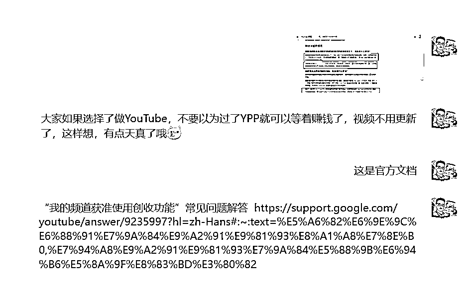
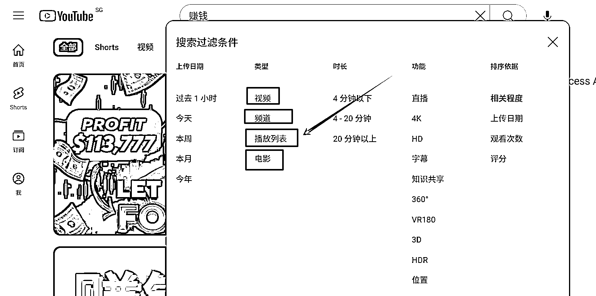
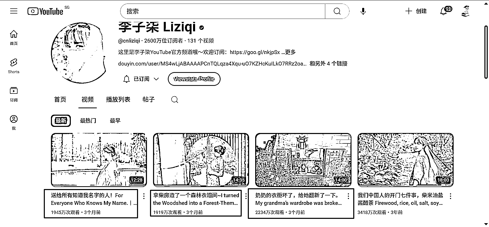

# 开通 YPP 后，别大意，没注意这个细节，YouTube 官方将取消你频道的获利资格

> 原文：[`www.yuque.com/for_lazy/zhoubao/cqv4typdlf084s9d`](https://www.yuque.com/for_lazy/zhoubao/cqv4typdlf084s9d)

## (19 赞)开通 YPP 后，别大意，没注意这个细节，YouTube 官方将取消你频道的获利资格

作者： 书情小跟班

日期：2025-03-12

更好的阅读体验，直接访问飞书文档

开通 YPP 后，别大意，没注意这个细节，YouTube 官方将取消你频道的获利资格 [`rlwxa0zgke.feishu.cn/docx/Do5cd3IuCoENewxsWmgcr3rknif?from=from_copylink`](https://rlwxa0zgke.feishu.cn/docx/Do5cd3IuCoENewxsWmgcr3rknif?from=from_copylink)

这是官方文档 “我的频道获准使用创收功能”常见问题解答
 Hans&ref_topic=9240177&sjid=5586724574235274072-NC)

这里截图出关键的地方

### 如果我的频道表现降至创收功能要求的最低标准以下，会出现什么情况？

如果您的频道表现降至**最低标准** 以下，YouTube 不会自动停用频道的创收功能。但是，**如果您持续 6
个月或更长时间没有上传内容或发布帖子（即，频道处于不活跃状态）** ，则 YouTube 有权自行决定停用频道的创收功能。

如果频道违反了[《YouTube
频道创收政策》](https://support.google.com/youtube/answer/1311392)中的任意一项规定，那么无论频道的订阅人数、公开视频观看时长或公开
Shorts 观看次数如何，都会失去创收资格。

这里的 **最低标准即** 在官方文档中 YouTube
合作伙伴计划概览与资格要求 Hans&ref_topic=9153642&sjid=13288510886146383114-NC)

## 如何满足资格要求

在了解加入条件后，您就可以发布 Shorts 短视频或长视频，让您的频道获得加入 YouTube
合作伙伴计划的资格。如果您希望我们在您符合条件时通知您，请在 YouTube
工作室的“创收”部分点击当我符合条件时通知我。一旦您满足以下任一资格要求，您就会收到一封电子邮件。

1.  **在过去 12 个月内获得 1,000 名订阅者，并且有效公开视频观看时长达到 4,000 小时；** ***或者***

2.  **在过去 90 天内获得 1,000 名订阅者，并且有效公开 Shorts 短视频观看次数达到 1,000 万次。**

**请注意，在评定是否达到 4,000 小时的公开视频观看时长要求时，不会考虑观看 Shorts 动态中的 Shorts
短视频带来的所有公开视频观看时长。**

**如果您持续 6 个月或更长时间没有上传内容或发布帖子（即，频道处于不活跃状态）**

解释：上传视频、发布帖子
、创建播放列表，这里有点疑问的是创建播放列表，我们在搜索的时候，这里过滤条件是有一个类型，这里能看到播放列表，在我之前的文章也有提过这个通过播放列表蹭流量

像李七柒这种顶流其实不受影响的，虽然说三年断更，但是其实还是有不断的人来看他的视频，这个要求**在过去 12 个月内获得 1,000
名订阅者，并且有效公开视频观看时长达到 4,000 小时**

粉丝数显然超 1000，观看时长 4000 小时也自然是达到的

补充额外的知识点：

1、频道刚刚达标，提交了申请，但是粉丝掉了，不满足 1000 了，又或是隐藏了一个视频删除了一个视频，不足 4000 小时，会不会被拒绝？

答案是不会。

你一旦达到标准，已经在排除申请批准的时候流程就已经开始了，你多一点少一点影响不大，YouTube 官方不会因为你这个播放时长不够而拒绝你。

如果真的要拒绝你大概率是因为你的内容违规，违反 YouTube 的政策，因此在猛干的时候，也别忽略 YouTube 的官方文档。在别人平台赚钱的前提是要遵守别人定的规则。

2、YPP 刚刚过审，觉得原来的赛道流量不行了，要换赛道，或是从别人那里买了一个获利的频道做与原来频道不同赛道的内容。

这里的一个操作，那就是把原来的视频全删了，这样的做法往往是非常危险的，我就还真的认识一个朋友，他说他有一个一 W 的粉丝朋友送的，他要换赛道，把原来的视频全删了，但是这里有一个区别，那就是他的那个一 W 粉丝的账号没过 YPP。

为什么不能删？答案显而易见，你申请的时候，在后台显示时长、粉丝数都是达到标准的，你一下子把视频全部隐藏或是删除会导致你的播放时长从原来达标的 4000 小时变成 0。在这种情况下，是有可能导致原来被批准 YPP 被取消 YPP 资格。

这里的表述是可能，不是绝对，只是说这种事情发生过，因此也就没必要冒险，如果要做，那么如何做呢？

先做一段时间新赛道的内容，持续发新赛道的视频，老的视频看你自己选择，主要是有以下几个选择，如果你能接受观众对你的反差，那么你就不管原来的视频。

如果你在意，认为你的观众不专业，内容不垂直，你可以在发新的视频的同时逐步的把老的视频要么进行隐藏这里（你可以设置为私享），要么逐步删除。

这样做就能确保你在更新新视频的这个阶段中不会使得整个播放次数或是播放时长显著低于 YouTube 官方的 YPP 标准，从而导致这个 YPP 被取消从而无法获利。

啰嗦一句：YouTube 是一个长期项目，有非常多的玩法，同时 YouTube 是一个非常值得深耕的平台，如果你本身就在国内发视频，发 YouTube 也是顺手的事，视频长期不更新是说不过去的。

* * *

评论区：

暂无评论