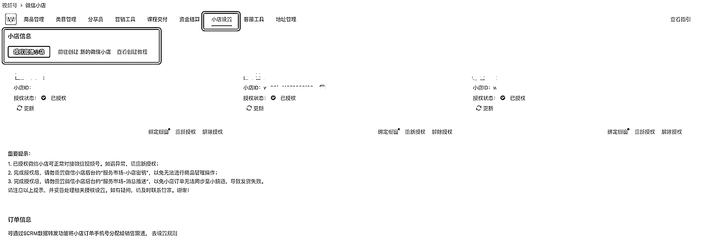
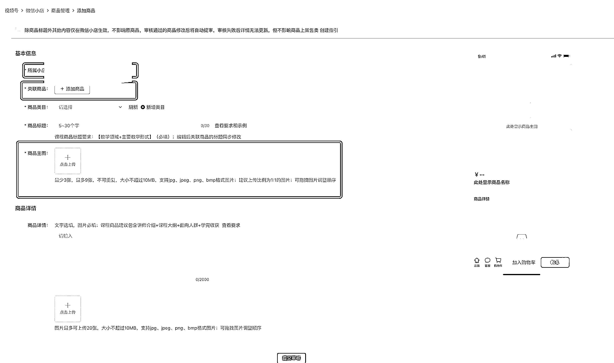
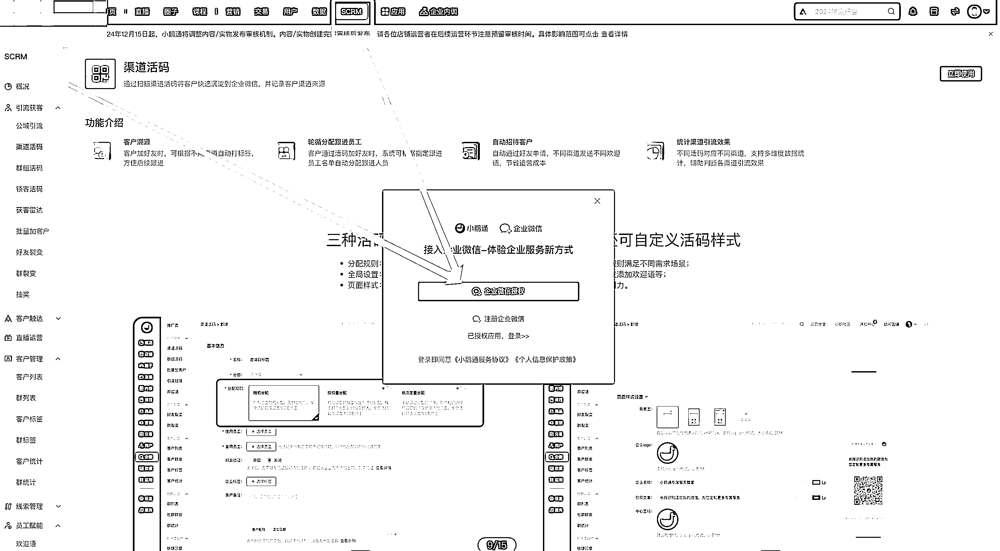

# 视频号知识付费运营的一个小方法（微信小店下单，自动开课）

> 原文：[`www.yuque.com/for_lazy/zhoubao/ntaoobbg05mt31na`](https://www.yuque.com/for_lazy/zhoubao/ntaoobbg05mt31na)

## (16 赞)视频号知识付费运营的一个小方法（微信小店下单，自动开课）

作者： 神奇的桑桑😄😄😄

日期：2025-03-14

生财有术的朋友们大家好，我是神奇桑桑，专注于视频号 IP 项目（教育培训赛道），过往我们做了很多 IP
这中间我们踩了些坑，也有一些收获。加入生财有术之后，参与涛哥 @杨涛 上海线下会，我深受启发，做网红不如做圈红。随后我就开始了疯狂的破圈之旅，也在 10
月份顺利成为了小鹅通的线上联盟教练。感谢涛哥真传一句话。

做视频号项目我们做了这么久，专注于知识付费赛道，所以很多时候，我们总能对外赋能一些打法。

视频号势必是 2025 年最好的布局，最近这两个月，通过破圈，线下找我咨询的对象，已经由 IP
方向转向了线下产业赛道方向，并且大家对视频号的商业价值已经形成了共识，不需要像 22 年的时候，我还需要摇旗呐喊邀请 IP 入场，现在他们会主动入场。

今天给大家分享我在给线上卖课老师解决他们一个小痛点的方案：视频号下单课程，小鹅通自动开课。这个功能的好处是可以让学员在直播间下单后，第一时间就能看到课程，无需等待，可以极大程度上降低学员的退费率。希望本文小贴士可以帮助到咱们做知识付费或者线上卖课的老师一些启发。
说明：此功能需要小鹅通版本为专业版本

小鹅通课程上架，具体步骤也可参照官方

第一步：首页——》资源管理——》素材中心——》视频 上架课程原视频

第二步：课程——》新建——》课程复制视频上架

第三步：设置课程价格和展示（为自动开课做准备）

设计参数：小鹅通课程封面：建议比例 16:9，支持 jpg、png 格式，大小不超过 5MB，最佳分辨率 750px*422px

视频号小店授权绑定小鹅通

说明：小鹅通主体和视频号小店主体不需要是同一个主体也可以关联，关联后所有上架小鹅通的课程均可使用购课手机号登录小鹅通小程序学习，小鹅通
App 学习，无需手动激活。

只要在这里授权的小店，用户购买虚拟商品后，再使用购课手机号登陆 小鹅通小程序 ，即可查看其权益

小鹅通商品关联视频号小店商品

 images.zsxq.com/Fp2g6Et6h0Nzn5dMDvUhDTIjE92P) images.zsxq.com/FoPmYvlGj-pj9ST2kFUvqonQQkUV)

小鹅通关联企微【可以和小鹅通主体不是同一个，使用上有额外费用】这个功能绝大部分运营团队是够用的。

微信小店上架

类目管理：目前知识付费课程只需要有 icp 备案证书 + 产品说明书即可，icp 备案如有关联主体可相互授权。

发货流程

虚拟发货（自动发货）

看课方式①：点短信链接=》使用购课手机号=》登录小鹅通学员端 =》看课学习

看课方式②：添加企微 =》发送 H5 链接绑定手机号 =》看课学习（有账号合并冲突需要提示解决）

看课方式③：使用购课手机号登录小鹅通 App 学习

导入开课

1、学员 uid 导入开课（需要结合企微助手使用）

2、手机号导入开课（看课方式同虚拟发货）

微信开发平台配置

微信数据流通必配：[`open.weixin.qq.com`](https://open.weixin.qq.com)

需要授权：企业微信 / 微信小店

 images.zsxq.com/FttW4o3D9G2FzWgKM0ky4L-PQLWa) images.zsxq.com/FjHTOg8bvEJipIwvteqY1SgGPFk8)

* * *

评论区：

旋子 : 小鹅通有点贵吧

神奇的桑桑😄😄😄 : 嗯，其他线上卖课平台应该都有类似功能。[好的]

橘子脑袋 : 很有用

神奇的桑桑😄😄😄 : 谢谢，小鹅通用好其实能提效运营