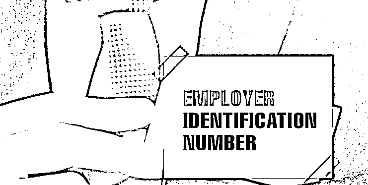
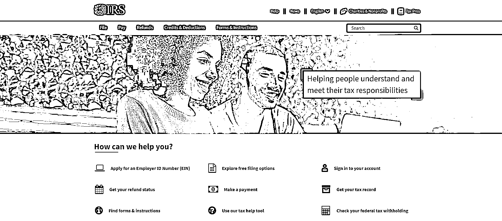

# 美国公司合规报税指南

> 原文：[`www.yuque.com/for_lazy/zhoubao/vx51agz75ee1zsef`](https://www.yuque.com/for_lazy/zhoubao/vx51agz75ee1zsef)

## (6 赞)美国公司合规报税指南

作者： 国民弟弟的跨境十年

日期：2025-03-12

作为深耕跨境电商行业 10 年的创业者，你一定深知美国税务合规的重要性。无论是亚马逊、eBay 还是独立站，美国公司税号（EIN）的维护和年度报税都是业务合法运营的关键。然而，许多卖家对续签税号、报税流程及免费渠道存在误区。本文将结合实战经验，为你拆解免费续签 EIN 和低成本报税的核心方法，助你规避风险、降低成本。

今天给大家分享如何免费续签美国公司税号（EIN）并完成报税，特别是针对 NRA（非居民外籍人士）如何向美国国税局（IRS）报税的实操流程。

#### 美国公司税号（EIN）需要“续签”吗？

误区纠正：美国联邦税号（Employer Identification Number,
EIN）由 IRS（美国国税局）签发，一经申请永久有效，无需定期“续签”。

### EIN 有效性

*   EIN（Employer Identification Number）终身有效，不需要续签。

*   但如果三年内没有报一次税，IRS 可能会视为你的 EIN 已无效。

*   你必须至少每三年申报一次联邦税，否则 EIN 可能会被作废。

但出现以下两种情况需重新申请或更新：

公司主体变更：如从个人独资（Sole Proprietorship）转为 LLC 或 Corporation；

所有权变更：如公司 50%以上股权转让或受益人变更。

免费更新方式：

*   在线更新：登录 IRS 官网（[www.irs.gov），通过 EIN](http://www.irs.xn--gov),ein-5q3yyx/) Assistant 提交 SS-4 表格的修正信息。

*   邮件/传真：填写新版 SS-4 表格，标注“CORRECTED”后发送至 IRS（无需费用）。

#### 0 成本维护美国公司税号的 3 个关键动作

即使 EIN 无需续费，但需通过合规动作维持其有效性：

1.按时提交年度申报：

*   若公司为美国实体（如 LLC 或 Corp），需每年提交 Form 1120（公司税表）或 Form 1065（合伙企业）；

*   若为海外实体（如中国公司持有 EIN），需在产生美国收入时申报 Form 5472。

免费申报工具：IRS 的 Free File Program（年收入低于特定门槛可使用）。

2.地址信息及时更新：  若公司注册地址或负责人地址变更，需通过 IRS Form 8822-B 通知，避免因收不到税务信件导致 EIN 失效。

3.避免税务违规：  IRS 会对长期未申报或欠税的 EIN 进行“休眠标记”，严重者可能注销税号。建议每年至少提交一次零申报（若未产生收入）。

#### 跨境电商如何免费完成美国税务申报？

第一步：联邦税申报免费渠道

1.访问 IRS Free File 官网

[`www.irs.gov/tin/itin/individual-taxpayer-identification-number-itin`](https://www.irs.gov/tin/itin/individual-taxpayer-identification-number-itin)

2.选择适合自己的免费报税软件，大多数情况下，年收入低于一定额度的纳税人可免费使用。

3.注册或登录 IRS 账户，如果没有 IRS 账户，需要创建一个。

4.填写对应的税表提交。

5.提交申报。

*   电子提交（E-File）或者打印后邮寄至 IRS。

6.查看申报状态。

*   登录 IRS 账户，进入“Tax Records”查看申报进度。

*   如果状态显示“Accepted”，说明申报成功。

提示：如果有税款需要支付

*   进入 IRS 官网（[`www.irs.gov/payments）。`](https://www.irs.gov/payments）。)

*   选择“Make a Payment”。

*   输入缴税金额，选择付款方式（银行账户或信用卡）。

*   确认信息后提交缴税申请。

*   登录 IRS 账户，进入“Payment Activity”查看缴税状态。

*   收到 IRS 缴税确认邮件。

第二步：州税申报免费方式

*   各州税务局官网：如加州（FTB）、纽约州（NYS Tax）提供免费在线申报入口。

*   跨州销售税（Sales Tax）：通过 Avalara CertCapture 等工具免费注册销售税许可证，并直接对接平台代缴。

温馨提示：零申报（No Activity Filing）  若年度内无美国业务收入，可通过 IRS Form 1120 或州税表格提交零申报（部分州免费）。

我只是个人分享非专业的税务指导及意见，这个报税的本身是一个这个专业领域的事情，建议大家还是找个会计师去咨询操作。给大家推这家华人代理~[`acompanyinus.com`](https://acompanyinus.com)

靠谱的美国华人会计，他们都能搞定；需要推荐代理会计师的话找我获取。

#### 总结：

税务合规是跨境电商长远发展的基石。通过合理利用 IRS 及州政府的免费工具，跨境卖家完全可以在不增加成本的前提下完成税号维护和申报。建议每年初制定税务日历，并咨询专业会计师优化税务结构（如成本分摊、税率选择）。

以上！

**国民弟弟相关创业的故事文章推荐：**

**跨境电商认知分享，个人创业者从 0 到 1000w+**

[`articles.zsxq.com/id_8n2o7gax71fr.html`](https://articles.zsxq.com/id_8n2o7gax71fr.html)

**3 分钟搞定美国公司，150 美金，超简单**

[`articles.zsxq.com/id_exggkcb30j69.html`](https://articles.zsxq.com/id_exggkcb30j69.html)

**3 分钟，如何远程开美国实体银行,送 2340 入金奖励。**

[`articles.zsxq.com/id_ubk2osmj6wzb.html`](https://articles.zsxq.com/id_ubk2osmj6wzb.html)

**美国收款工具：**

美版支付宝 Venmo:[`articles.zsxq.com/id_x73bbkhkkzau.html`](https://articles.zsxq.com/id_x73bbkhkkzau.html)

* * *

评论区：

暂无评论