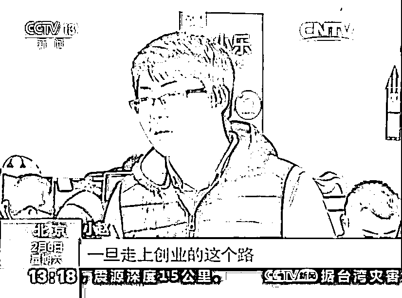
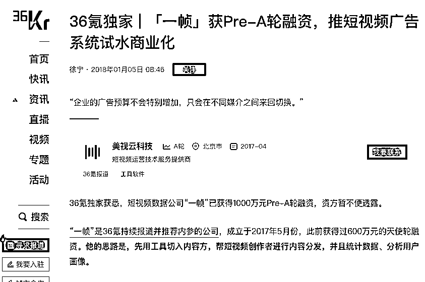

# 三次创业、三次归零，交了 3000 万学费我才真正悟透的道理

> 原文：[`www.yuque.com/for_lazy/zhoubao/gr3p30msfdlownlb`](https://www.yuque.com/for_lazy/zhoubao/gr3p30msfdlownlb)

## (精华帖)(128 赞)三次创业、三次归零，交了 3000 万学费我才真正悟透的道理

作者： 赵朋来

日期：2025-03-06

这并不是标题党，我想先给大家讲一讲我的创业故事。我今年大学毕业整十年，过去十年我有三次创业经历：

**第一次创业：拿到 500 万融资，结果还是卖掉了公司。**

我大学刚毕业，凭借一腔热血拿到了姚劲波 500 万投资，创办了伯小乐，做校园招聘产品。

我当时觉得自己前途无量，疯狂拓展市场，吸引了 30 万大学生用户，甚至被央视报道，拿了 36 氪 WISE 大会的“最年轻新锐 CEO”奖。

但后来，我觉得招聘业务很传统，而且越做越觉得招聘是个 B 端生意，但是那会我认为自己天然不擅长大客户销售，于是选择了“卖掉公司”，进入 58 同城，成了最年轻的总监。

现在回头看，这是我第一次“提前下牌桌”。当时如果能再坚持几年，或许能走出更好的路，而不是选择快速变现。

**第二次创业：短视频数据产品，融资 1600 万，最后又卖掉了。**

在 58 工作了一年，负责校园招聘的产品和运营部门。那会心气还很高，认为还是应该继续创业，做自己的事。所以待了一年就找老姚提了离职。

17 年初正是短视频大爆发的时候，所以这次选择做了短视频数据产品，叫一帧。拿到了蔡文胜 600 万的天使投资，半年之后又拿了美图的 1000 万 pre-a，总共 1600 万。

开局挺顺的，但是很快又碰到了在上一次创业遇到的问题，就是销售。

我们很快把数据产品做出来了，从产品本身的反馈上还是很不错，当时腾讯、爱奇艺、快手也都是我们的客户，但我没有真正把“销售”这件事做好，更没有花心思去搭销售团队。17 年直播电商还没有爆发，
达人的变现都很困难，数据产品只能卖给广告公司和 KA 品牌客户。

我们团队又都是产研出身，没有预判到直播电商的机会。所以基于当时的判断，觉得数据服务天花板低，想着“趁估值还行，赶紧卖掉公司”。

所以我又一次提前下牌桌，把公司卖掉了，只是赚了一点小钱。

**第三次创业：做抖音达人电商，结果亏损百万直接失败。**

我当时觉得，我在快手做过创作者生态的总监，对达人变现很熟悉，于是开始做达人电商，拿到了 500 万融资。

这次，我原本的计划是“深度赋能 100 个达人，开 100 家店”，结果遇到三大问题：

达人成本远超我的想象，签约达人比我预计的难得多；孵化达人更是灾难，我们没有做内容的基因，带不起来；团队铺得太快、太急功近利，迅速扩张后发现业务根本跑不通，导致严重亏损。

这一次没上两次那么好的运气能把公司卖掉赚点小钱了，这次直接清算关门了。

**三次创业，每次都是完全不同的赛道，但每次都犯了同样的错误：**

低估行业难度，高估自己的跨界能力。

没有在一个领域深耕，每次都是推倒重来。

当遇到挑战时，想着换方向，而不是在原方向上死磕。

如果五年前，我选择深耕一个行业，而不是不断换赛道，今天可能已经在行业里扎稳了脚跟。

**那为什么积累比重新开始重要？**

1.  顶级高手，都是“时间的复利”产物。我之前也以为那些牛人靠的是天赋，但现在才明白他们赢在“时间的复利”。

就拿最近很火的几个人来说，哪吒的导演饺子、宇树的王兴兴还有 deepseek 的梁文锋，有哪个不是坚持了 10

年以上。他们的共同点都是，每一步都是下一步的铺垫，而不是不断推倒重来。

最典型的可能就是饺子了，跨界转行之后把自己关在家里三年零 8 个月，死磕自己的动画短片《打，打个大西

瓜》，再到后面的《哪吒》系列，真称的上是十年磨一剑。

2. “从 0 到 1”远比“从 1 到 10”难太多。

每次换赛道、每次重新开始都意味着你要一次次经历“从 0 到 1”的痛苦。

但如果你一直深耕一个方向，你的 1 会不断变成 10，10 变成 100，100 变成 1000。

这就是为什么行业里的老炮，哪怕能力平平，也能碾压聪明但频繁换行业的年轻人。

**积累很重要，但要避免错误积累**

积累不是简单地做时间的囤积，而是有意识、有策略的成长。如果没有方法论，长期积累也可能变成低效甚至无用的循环。

1.  假积累：看似努力，实际没有增量

例子：不断学习，但没有输出和应用，知识只是停留在理论层面。

解决方案：建立输入-实践-反馈闭环，每学一项新技能，设定应用场景。

2. 低效积累：时间花了，但增长缓慢

例子：不断切换方向，尝试多个赛道，但始终停留在入门阶段。

解决方案：找到行业壁垒+个人优势结合点，深耕一个细分领域。

3. 过度积累：信息过载，行动力被压制

例子：囤书、囤课程、囤资源，但因为信息太多，反而陷入拖延。

解决方案：减少输入，增加执行，专注在最关键的 20%知识上，快速落地执行。

大部分普通人都输给了时间，看不到长期的积累价值，所以不断从零开始。但高手懂得把时间当作朋友，他们愿意耐住性子，专注在一个赛道里死磕十年。

**如何判断“换赛道”是聪明的转型，还是逃避挑战？**

在我们做事的过程中，可能都会遇到“要不要换赛道”的选择，当然也并不是所有的死死坚持都是对的、都是值得的。

换赛道本身没有错，但如果只是逃避挑战，反而可能让你陷入长期的失败循环。

1.  什么时候应该换赛道？

市场消失或行业走向衰落 —— 如果你所在的行业未来 5-10 年已经看不到机会，比如功能机时代的手机厂商就

必须转型。

你的核心能力和市场需求不匹配 —— 如果你擅长产品创新，但身处一个依赖渠道销售的行业，可能需要调整

方向。

你的成长被完全封锁 —— 如果你在行业内已经卡住 5 年以上，没有任何突破，可能需要考虑更适合自己的领

域。

2. 什么时候换赛道是逃避挑战？

遇到困难就想放弃 —— 每个行业都有周期性的挑战，频繁换行业只会让你永远处于“新手期”。

觉得“新赛道更容易” —— 任何行业都有高手，换一个赛道，不会让竞争变得更简单。

因为短期利益诱惑 —— 很多人看到“某个行业最近火爆”，就想去做，但往往这些行业早已被占领。

**具体行动指南：如何高效积累？**

**  **

知道积累的重要性后，如何执行？这里有四个核心方法，帮助你建立真正长期有效的积累体系。

1.  构建长期赛道：选对积累方向

问自己三个问题：这个行业 5 年后还存在吗？你是否愿意每天花时间去深耕？你是否具备长期优势？

可以有一个简单的选择标准：行业天花板高 + 个人兴趣强 + 可持续投入。

2. 系统学习，形成知识闭环

不要碎片化学习，而是构建知识框架，围绕主题系统性的学习。

每学一个新概念，立刻找机会讲解给别人，倒逼自己真正理解。 比如用费曼学习法：用简单的方式讲解知

识，确保自己真正掌握。

定期复盘，写作输出，让学习转化为积累。

3. 打造个人品牌，让积累变现

社交资产累积：每次分享输出，都能为你带来更多机会。

用内容建立认知锚点：公众号、短视频、社群，任何形式都可以。

这一点也是受纳瓦尔的影响，他通过社交媒体输出他的投资哲学，形成长期影响力。

聪明人往往输给积累，我以前也一直觉得自己还有点小聪明，大学没毕业就能拿到融资等等。

但是时间真是最公平的，回头看，一直是在一个层级打转。

所以，想把这些年走的弯路分享给大家，正确的长期积累才是王道。

* * *

评论区：

戴巍 : 非常好的复盘文章，对其他创业者非常有价值的对标参考

赵朋来 : 都是血泪教训

小花 : 拜读完找到了自己问题的关键，总在追求热点，换了一个个项目，没在任何一个项目上深耕，逐渐积累，形成基本盘。感谢[抱拳]

赵朋来 : 东山的老虎吃人，西山的老虎也吃人。只靠换项目解决不了问题，我也是这两年才明白，哈哈

木棉 : 虽然没创业，但也学到啦，谢谢分享

一鱼两吃 : 总结的很到位。没有积累。

小吉玛丽亚 : 点赞！我在盲目的自大上栽过跟头！

浩辰 : 感谢老师分享，很有启发，“从 0 到 1”远比“从 1 到 10”难太多[抱拳]