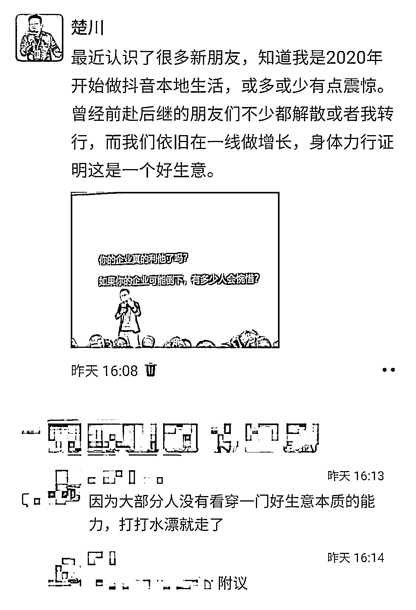

# 风口退潮后，谁在裸泳？2025 年，我仍在抖音本地生活赛道一线捞金的真相

> 原文：[`www.yuque.com/for_lazy/zhoubao/gm6g7augacm7dgme`](https://www.yuque.com/for_lazy/zhoubao/gm6g7augacm7dgme)

## (36 赞)风口退潮后，谁在裸泳？2025 年，我仍在抖音本地生活赛道一线捞金的真相

作者： 楚川

日期：2025-03-08

2020 年，我的解酒品牌产品因为口罩停摆，下半年带着 7 人的团队扎进抖音本地生活赛道，从爆店码开始打市场。

那时，满大街都是“**本地生活是下一个万亿风口** ”的口号，朋友圈里刷屏的不是探店达人，就是服务商招商会。有人喊“三个月回本”，有人吹“躺着赚钱”，一夜之间，所有人都觉得自己能成为风口上的那只猪。

将近 5 年过去，当年一起入局的朋友们，有的解散团队转行卖课，有的干脆消失在人海。

**而我，还在。** 2024 年的营收依旧增长 35%，在互联网低渗透的行业越走越深，能力杠杆上持续加码 SEO、AI 等。

总有人问我：“楚川，你团队凭什么能活下来？”

我的答案很简单——“**因为太多人，连‘做生意** ’三个字都没看懂。”

**Part1 99%的人，死在了“伪需求”里**

**  **

抖音本地生活火的时候，所有人都在喊“流量为王”。

于是，有人砸钱买 DOU+，后来怼本地推，有人批量注册矩阵号，有人连夜开发“一键剪辑发布系统”。

结果呢？

流量来了，商家懵了——核销率不到 10%，用户领完券就走，门店服务跟不上投诉满天飞。

**这不是生意，这是“数据自嗨”。**

**  **

去年，我见过一个建材老板，被服务商忽悠着上翻 1000 万营业额，投 20 万达人直播和本地推，一共花 50 万（包含平台佣金）做“爆单活动”，后期就能做到“用户跟风购买”。

一周内，直播间上翻了几千张套餐券，真正跟风用户核销时却不到 30 人。

老板哭着问我：“楚老师，我是不是被割韭菜了？”

我说：“不是被割，是你自己跳进了镰刀堆。”毕竟流量不是万能，产品和服务**没有打到用户需求点，再迅猛的流量也带不来转化** 。

我的好朋友刘思伊说得好：**“大部分人根本没看穿生意的本质。”**

**什么是本质？**

首先用户要的不是“占便宜”，而是“占完便宜还想再来”。你帮商家拉新 1000 人，不如帮他留住 100 个回头客。

**流量是水，转化是桶。桶漏了，接再多水也是徒劳。**

**  **

我们团队有个“铁律”：不接核销率低于 50%的单子。

为什么？因为核销率背后是商家的服务能力、品控水平、用户体验、客户跟踪能力。

**如果商家连基础都做不好，给他流量就是害他** ——用户薅完羊毛转身差评，品牌口碑直接崩盘。

**Part2 别把“利己”包装成“利他”**

**  **

我常问团队一个问题：“如果明天公司倒闭，会有多少客户主动帮我们说话？为我们感到惋惜？”

**答案，决定了你能活多久。**

**  **

过去 5 年至少有 200 个同行找我合作，张口的话就是“我有 1000 个商家资源，咱们联手割一波”。

我问他：“割完之后呢？”

他愣了：“什么之后？换个赛道继续割啊！”

这种我会直接无视，再也不见、不聊。

**太多人把“利他”挂在嘴边，却偷偷挖坑** ：给商家承诺“保底 GMV、包生男孩”，实际刷单造假；教达人“快速起号”，结果全是搬运抄袭；吹嘘“私域沉淀”，最后把客户当韭菜反复割。

**生意场最怕什么？**

不是竞争，而是失信。

当你把客户当成数字和提款机时，崩塌只是时间问题。

2023 年，我们服务过一家连锁烘焙店。

老板说：“之前找的服务商，逼我每周开三场直播，结果员工累到罢工，用户投诉蛋糕不新鲜。”

我们接手后，第一件事是关停所有直播，带老板做三件事：

**重构货盘** ：砍掉 15 款低毛利单品，聚焦“爆款+季节限定”；

**培训店员** ：教店员用手机拍短视频，记录每日现烤过程，积累素材；

**沉淀私域** ：在包装盒印上店长微信，用户复购送定制周边。

三个月后，72%的店单月复购率从 12%涨到 35%，老板说：“这才叫做生意，之前纯属瞎折腾。”

**Part3 长期主义，是反人性的“笨功夫”**

**  **

有人说：“抖音算法变了，本地生活红利早没了。”

我说：“红利从来不是算法给的，是你自己长出来的。”

**这五年，我们只做三件事：**

**死磕人效** ：团队人人都是六边形战士，把复杂运营拆解成极致 SOP，6 个月培养出一个项目操盘手，人均运营项目 3-5 个，企业营收人均贡献价值在 2023 年就超过千万。

**教品牌算账** ：不忽悠“爆单神话”，只算清人效、坪效、复购率、营销体系化、品牌占有率的提升，而不是只关注简单的 ROI 和 GMV。

**养“慢流量”** ：放弃短平快投流，重仓全员营销矩阵，深度打短视频 SEO，用内容帮商家攒口碑资产，做私域吃长期用户价值，这种给到客户都是可持续增长。

**3.1 死磕交付：服务不是成本，是资产**

**  **

2024 年，我们的大客户突发舆情：同行和用户投诉，在直播间的弹幕差评连续不断。

我们团队 1 小时拉通门店、供应链、客服、短视频侧投放，短视频做好声明，直播间从小场直播转大场：放福利货盘和扩大更多品牌人群。

第二天，大老板打电话给我：“你们这响应速度，比我自己的运营团队还快。”

很多人觉得“重服务”不划算，但我想说：**信任是商业的复利。**

你帮客户扛一次雷，他能记你三年。

**3.2 教商家算账：算不清账的生意都是泡沫**

**  **

我自己也被“GMV 虚荣心”绑架过。2021 年，曾炫耀我投资的餐饮店：“我上个月抖音卖了 120 万！”

实际上，扣除平台抽成、达人分佣、投流成本，净利不到 5%...完全在给平台和达人打工。

现在我们给商家做的**第一份方案，永远是“利润拆解表”** ：

流量成本占总营收多少？单客户生命周期价值是多少？复购率提升 1%，利润能涨多少？

**算账，是逼商家直面真相。**

只有看清钱从哪里来、到哪里去，才能不做冤大头。

**3.3 养“慢流量”：内容才是最低成本的复利**

**  **

2022 年，我们帮一家洗衣咖啡店做从 0 到 1 起盘。

老板问：“能不能一周涨粉 1 万？”

我说：“不能，但我能让周边 3 公里的人一想喝咖啡、或者洗衣服就想到你。”

我们做了三件事：

占领长沙用户心智，把喝咖啡与干洗店的松弛深度种草，短视频 3 年后，依然具备引流效果；

哪怕是充卡送的冰美式，也依旧是突出“豆子现磨”、好产品的服务；

让熟客开始自发记录在店里的时光，比如程序员每天来写代码、闺蜜的闲时聚会，后来引发大量“自来水”的自发种草。

到现在，这家店没上过一次热门，也不会投入更多流量费，但门店经历最难的口罩时期，数量依旧还有 16 家，低调地经营。

老板说：“现在来的全是老客，下雨天都有人排队。”

**Part4 2025 年，活下来的必须是“新物种”**

**  **

年初见一位投资人，他问我：“你觉得抖音本地生活还能火几年？”

我反问：“餐饮店会消失吗？理发店会消失吗？人总要吃饭、要生活。”

**但未来的赢家，一定是“新物种”：**

**左手抓效率：** 用 AI 工具优化投放 ROI、写文案、做策划、优化管理，但绝不让算法替代人情；

**右手抓温度** ：把用户当人，而不是流量标签。

比如，我们持续验证“社区化运营模型”，以我做的 200 平餐饮店做示范：在抖音为商家搭建“粉丝共创群”，让用户参与新品研发；用微信自动推送个性化福利，但每条消息必须带店员手写备注；每天在朋友圈和社群发“门店经营日记”，甚至曝光食材采购价。

**越透明，越赚钱。**

现在依旧是很多同行或者是品牌问我：**“现在入局抖音本地生活晚不晚？”**

我的答案是：**“如果你只想捞快钱，现在别说抖音，火星都嫌晚；但如果你想踏实做生意，任何时候都是最好的时机。”**

**  **

2025 年，如果你还在这个赛道——

记住：**淘汰你的不是抖音，而是那些愿意比你多扛一天的人** ，**毕竟他们比你更有耐心去验证一门生意是不是好生意** 。

我是楚川，一线实战派，只讲真话的生意人，做实体行业的增长保姆。

* * *

评论区：

楚川 : 怎么可以周六发文章[666]

胖大魔（AI 提效版） : [旺柴]时代在召唤

兴化 top : 看了您的文章直接种草