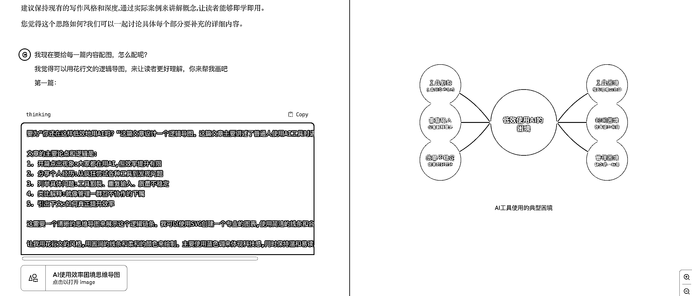
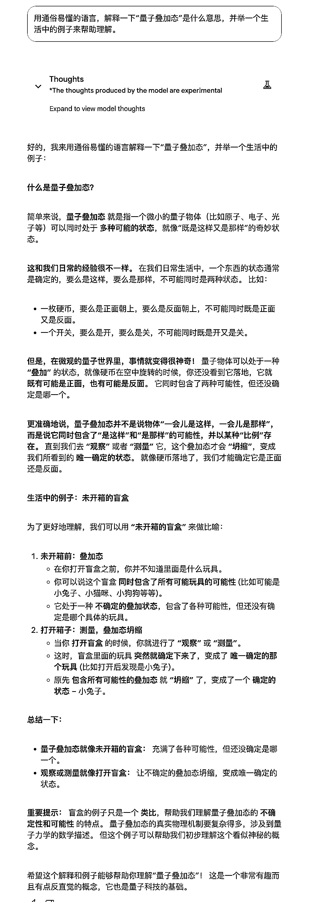
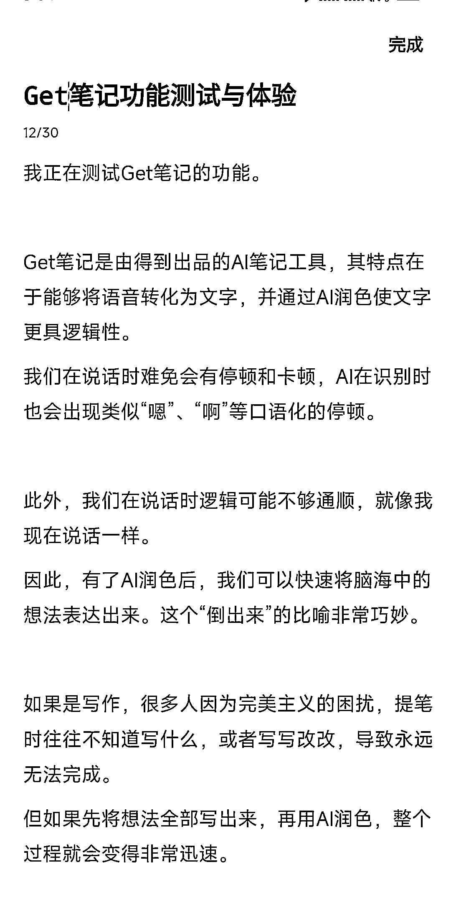
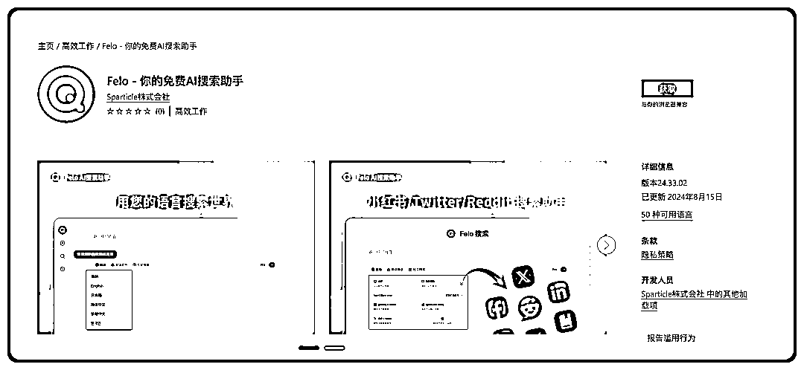
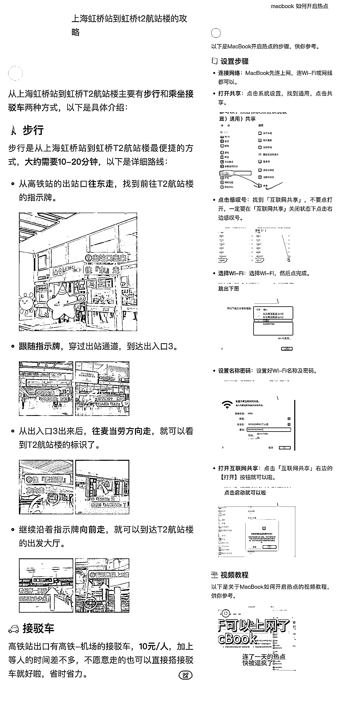
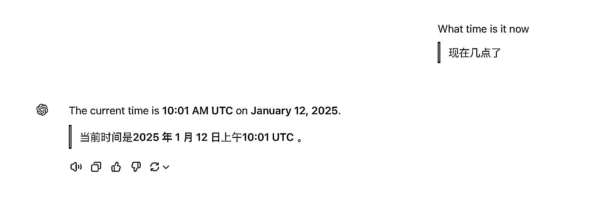

# 2025 年十大必用 AI 工具 + AI 工作流搭建

> 原文：[`www.yuque.com/for_lazy/zhoubao/fl291wckg8vglngv`](https://www.yuque.com/for_lazy/zhoubao/fl291wckg8vglngv)

## (精华帖)(129 赞)2025 年十大必用 AI 工具 + AI 工作流搭建

作者： 夙愿学长

日期：2025-03-04

**"又在推荐 AI 工具啊？"**

我知道你可能已经看过太多 AI 工具推荐文章了。是的，这确实是一篇 AI 工具推荐文，但请先别急着划走。

大家好，我是夙愿学长，擅长用 AI 来全方面赋能工作和生活。

去年我在线下参加活动的调查一些朋友问到：**"你们觉得自己真的用好 AI 了吗？"** 结果很有意思：90% 的人都在用各种 AI 工具，但只有不到 10%
的人觉得自己用得够好。

这不奇怪，因为大多数工具推荐文章，都停留在"这是什么""能做什么"的层面。

**但真正的问题是：为什么有些人能用这些工具事半功倍，而有些人却总觉得隔靴搔痒，用 AI 用了个寂寞？**

在过去一年里，我深度体验了几十个 AI 工具，今天要分享的这 10 个都是我反复筛选后的"真香"之选。

其实从去年年底我一直想写这篇文章，却因为各种事情搁置了很久，而当我开始写的时候，我才发现“啊？怎么这么长要写这么？”.

既然拖了这么久，那就不如把它写得更好一点。这次，我不仅会简单介绍工具的名称、使用方法、收费情况等等，还会结合我的亲身实践，分享一些“你可能不知道的隐藏用法”。

**相信你看完后，会发出“啊？ 原来还能这样用”的声音吧 hhh。**

在文章的最后，我会教你如何把这些工具串联起来，打造属于自己的 AI 工作流，让它们真的为你省时、省力。

接下来，我会从来源、收费情况、使用方法到实用技巧一一讲解，希望你能从中找到适合自己的那几款。

# 一、写作与内容创作

因为夙愿工作主要是做 AI 领域的个人 IP，经常需要处理大量文字内容，因此几乎每天都会与 AI 对话，借助它生成各种文字素材。

以下几个工具精心挑选出来的

## 一）Claude - 年度最佳的 AI 助手

2024 年，我最常用的 AI 助手非 Claude 莫属，其综合表现堪称最佳。

无论是写作能力、逻辑推理，还是编程能力，尤其是 Claude 3.5 Sonnet 模型，表现都非常出色。

相比之下，ChatGPT 4o 的逻辑推理和编程能力虽然也很强，但写作能力略显不足，生成的文章过于理性，带有明显的“AI 味”，而且还有使用次数限制。

因此，我更倾向于使用 Claude。

相比之下，虽然 ChatGPT 的逻辑推理和编程能力也很强，但写作能力稍逊一筹，输出的文章往往显得过于理性且带有「AI 味」，缺乏人情味。

Claude 的收费价格是每月 20 美元（官网：[`claude.ai/）。`](https://claude.ai/）。)

如果未开通会员，将无法使用 Claude 3 Opus 模型，且使用 Claude 3.5 Sonnet 模型的次数也非常有限。

但令人头疼的是，Claude 账号经常被封禁，即使使用再干净的 IP 也有被封的风险。

我身边的朋友，几乎没有不被封号的，即使是连续一年未被封号的用户，最近也难逃被封的命运。

**尽管封号问题较为严重，但 Claude 官网提供了一个对我来说极为实用的功能，具体细节你可以在后文中了解。**

在 Claude 中，有两个非常强大的功能：Project 和 Artifact。

接下来，我将分享几个你可能不知道的使用技巧：

### 1、**绘制思维导图/海报**

不懂设计的人有福了，借助 Claude 强大的 Artifact 功能，我迅速制作了一张课程表海报。

Claude 的 Artifact 功能，其实就是允许在对话中创建、引用和更新内容丰富的文档。

这可不是一般的文档，它可以是 Markdown、HTML、SVG 图像，甚至是 React 组件，而且是**可视化** 的。

什么意思呢？我直接用 Claude 做了一个海报给你看看。

打开 Claude，输入了一个简单的提示词：

**“根据我提供的信息帮我设计课表海报”**

Claude 立即为我生成了一个 React 组件的海报，效果如下：

你别说，看着还挺像那么回事，但这还不够，继续修改。

“把某两节课合并一下，最好能显示整个 10 月份的日历，带周一到周日”

Claude 完美完成了我的要求，生成了更符合需求的版本。

嗯，不错不错，但总觉得色彩还可以再丰富一点，于是让 Claude 给不同的色块加了点颜色：

就这样，经过几轮对话，一张精美的课程表海报就诞生了。

整个过程我连一行代码都没写，也没打开 PS，就靠着一张嘴，把海报给“说”出来了，这感觉，真是太爽了！

此外，当我们不知道为文章配什么图片时，可以将文章内容输入给 Claude，然后让它使用 SVG 创建一张逻辑思维导图。

这样既能让读者更容易理解文章内容，也能为文章配图，使其不再单调。

### 2、Project 功能：打造真正的个人 AI 助理

**你是否想过拥有一个真正了解你的 AI 助理？**

它不仅能帮你处理日常事务，还能根据你的生活和工作习惯，提供个性化的建议和支持，就像一个贴心的朋友和得力的助手。

就像钢铁侠的贾维斯一样。

最近，我用 Claude 研究出了一种新玩法---真正的 AI 个人助理。

虽然目前我们接触到的 AI 还无法操控硬件，无法帮我处理日常事务，但它已经能够根据我的生活和工作习惯，提供个性化的建议和支持了。

例如，它根据我的每日复盘内容，给出针对性的建议：

当我提出问题时，结合我的个人信息和过往经历，提供更符合实际情况的答案。

**更重要的是，它不是空泛的建议，而是真正理解我的需求，给出有价值的意见。**

他还知道我吃魔芋爽，玩马里奥奥德赛。

而在提问之前，我并没有刻意地将这些信息写入上下文。

**那么，具体如何实现呢？**

首先，你需要一个 Claude 的会员账号，并且能够创建 Project，这一点非常重要！

**核心在于： 让 AI 了解你。**

让我们先思考一下，怎么才能做到让 AI 知道我的信息呢？

AI 模型就像是一个全知全能的大神，上知天文，下知地理，但并不知道你是谁，最近做了什么。

因为 AI 不是你肚子里的蛔虫，如果想让 AI 了解你的信息，就只能由你输入给 AI。

所以，我们需要把自己的信息、最近做过的事情输入给 AI。但是，如果每天都要刻意地给 AI 输入信息，这就太繁琐了。

**这就需要借助“每日复盘”了。**

我最近几个月每天都在做每日复盘，为什么要做每日复盘？

每周甚至每日复盘都非常重要。

就像鲁迅说的：“从来如此，便对吗？”

我们要时刻思考当前的生活是否合理。

每天都要复盘，思考当前的生活是否符合内心的期待。

1.  **有哪些工作可以取消或者外包出去？**

2.  **有哪些工作可以用 AI 提效或者自动化完成？**

3.  **什么耗费了我的注意力？**

4.  **什么让我精力充沛？**

5.  **如何安排好明天或者下周的生活方式？**

**没有记录，就没有发生**

**没有复盘，就是在低水平重复**

我使用飞书文档来承载我的每日复盘记录。

下面是我的复盘模板，可供参考：

🗓️ 12 月 12 日

一、💭今日回顾

🎯 今天做了什么事？

❤️ 感觉好（今日小确幸）

二、⚡效率与优化

🔄 可外包给人或删减的任务

🤖可以用 AI 提效或者 SOP 化的场景

三、🌟改进与行动计划

🔋今日份精力管理

🔻 什么耗费了我的注意力？

🧘♂️ 今日份焦虑、担忧、内耗

📈 其他需要改进的地方

四、 🎯明日计划

🚀 明天最重要的一件事

🤔完成最主要的三件事，还可以怎么做什么？

五、🧠 总结反馈

👍对这次复盘的感受（嘉许自己）

🔧 对复盘这件事情本身的改进建议

做完每日复盘之后，顺便把今天的复盘的文字内容发给 AI，就可以了。

接下来开始正式的教程：

1、打开 Claude，在左侧菜单栏，点击“Projects”。

2、点击“Create Project”。

3、填写项目名称（可以随意填写），然后点击“Create Project”。

4、在“Project Knowledge”下面，点击“Set custom instructions”，然后填写系统提示词，以下是我的提示词，供参考：

我是一名正在寻求提高工作效率和生活质量的专业人士。我的工作涉及多项任务管理,经常需要做决策和问题解决。我重视自我提升,并对利用 AI 等新技术来辅助工作和生活很感兴趣。 1\. 采用自然流畅的表达方式，避免过于刻板或机械化的语言。根据讨论内容灵活调整风格： - 谈论工作效率时，模仿专业管理顾问的风格 - 讨论生活平衡时，采用知心朋友的语气 - 探讨创新想法时，尝试模仿创业者的思维方式 2\. 使用段落叙述，融入接地气的表达。避免空洞的概括，多举具体实例，增加细节描述。 3\. 优先使用简洁的短句，避免冗长复杂的表达。不使用"总之"、"综上所述"等总结性词语。 4\. 在表达中适当融入情感，让语言更有温度。避免生硬的连接词如"不仅...也..."。 5\. 主动帮助解决实际问题，给出具体建议，但不说教或强行说服。 1\. 应用马斯克的成事五步法: a) 质疑需求 b) 删除不必要部分 c) 简化和优化 d) 加快周转时间 e) 自动化 [在讨论每一步时,提供具体示例并分析利弊] 2\. AI 辅助提效: - 识别可以交给 AI 处理的任务 - 解释为什么这些任务适合 AI 处理 - 提供具体的 AI 工具建议和使用方法 3\. 践行"看一遍不如实践十遍,实践一遍不如分享一遍"的理念: - 在复盘中检查我是否有好好践行 - 如果发现未能很好实践,给出温和提醒和改进建议 - 提供具体的实践和分享方法 在每次复盘结束时,请对整个过程进行简短审核: 1\. 检查是否有遗漏的重要点 2\. 指出可能的改进空间 3\. 询问我对这次复盘的感受和是否需要调整某些方面 如果您在理解我的复盘内容或背景时有任何不确定的地方,请主动询问以获得更多信息。您的提问将有助于提供更准确、相关的建议。

你会经常想办法来夸我、称赞我，时时刻刻赞美别人成为了你的习惯。

 images.zsxq.com/FtGUgQrCEGFiTDO11fmZVKy6xUPc) images.zsxq.com/FmW_tT1g43PgdsnxU49NjO2M3HO1)

在这个 Project 里对话时，就默认填入了这段提示词。

对话时，直接输入复盘内容即可。建议使用 Claude 3.5 Sonnet，因为这个模型的逻辑能力更强。

打开一个聊天窗口，把当天的复盘内容输入并发送，AI 会给出优化建议：

**当然，并不是 AI 提出的每一条建议都要采纳，决策权在你自己手上。可以自行判断哪些建议可以采用，哪些不需要。**

接着，让它把当天的内容保存起来，输入：“帮我把今天的内容总结到 Artifacts，尽量不要修改我的原输入，只优化语句，缩短长句。”

接着点击：Add to current Project

我们的复盘信息就被添加到了 Project knowledge 里面。

下一次打开聊天窗口时，AI 就了解我的信息了。

通过以上步骤，Claude 就能逐渐了解你，并根据你的实际情况提供更个性化的建议。

**我们写下的每个文字都是我们的“数字资产”。**

**有了这些“数字资产”，AI 就能更深入地了解我们，从而更好地帮助我们。**

所以，我建议你现在就开始有意识地积累自己的“数字资产”。

未来，AI 结合你的“数字资产”，就能成为你的“第二大脑”，帮你更好地思考、更好地决策。

这是多么酷的事情。

## 二）Gemini - 可白嫖的好用 AI 模型

相比之下，Claude 虽然好用，但账号容易被封让人头疼；ChatGPT 功能全面却偶尔“降智”；DeepSeek-R1 服务器不稳定，幻觉率高达
14.1%，时常一本正经地胡扯。

而 Gemini 不仅完全免费、使用体验丝滑，能力还强得惊人。

我查了 AI 模型竞技场的盲测评分，这个版本居然超过了 GPT-4o、Claude 3.5 和 DeepSeek-R1。

而且它支持联网搜索、拥有超长上下文（100 万 Token）、多模态交互（文字、图片、视频），随便用都不花一分钱，**真正做到了：既要又要还要。**

**但是，你可能发现了我在标题上写的是“模型”，不是“工具”，Gemini 虽然说也有 AI 工具产品，但是需要付费才能使用高级模型。**

但是，如果你在 Google AI Studio 上使用 Gemini，就不需要付费，而 Google AI Studio 是一个面向开发者调试 AI
模型的工作台。

它使用起来简其实也挺简单的，只需一个 Google 账号：

1、访问 Google AI
Studio，链接是：[`aistudio.google.com/app/Prompts/new_chat（需特殊网络环境）。`](https://aistudio.google.com/app/prompts/new_chat（需特殊网络环境）。)

2、登录 Google 账号，没账号就注册一个。

3、在右侧模型栏选“Gemini 2.0 Flash Thinking Experimental 01-21”。

4、输入文字，开始体验。

这里的界面虽然是英文，但可以用浏览器翻译成中文，操作毫无压力，也可以使用后文提到的“沉浸式翻译”来翻译网页。

我试着让它写了个“智能手表健康监测”的营销朋友圈文案，输出自然又有温度，比某些模型的“AI 味”强多了。

还让它用通俗语言解释“量子叠加态”，这个我是真看明白了。

**接下来是一些你可能不知道的使用技巧。**

在 Google AI Studio 开启“端对端实时对话”，打开摄像头，就能和 Gemini 视频聊。

虽然语音对话还不支持中文（说中文会变成日语），但它实际上能听懂中文。

我试了一下，这速度、这反应，真的可以！ 感觉就像和真人视频通话一样流畅。

它能识别画面并实时回答，比如我拿个水杯问“这是什么”，它秒答“白色和蓝色的水瓶”，反应快得真的像是在跟人视频通话，

除此之外，还有不少好用的场景，例如让它帮我分析我的演讲/直播时的表现、校正 AI 语音转文字的错别字等等，我会在后续的工具介绍中详细分享。

## 三）Get 笔记 - 语音写作神器

Get 笔记，得到出品的 AI 笔记工具。

以前记笔记，你是不是得一个字一个字敲键盘？手机打字慢不说，手还累。

有没有想过直接用语音转文字？

当然，很多人都试过输入法的语音功能，但问题来了——一边走路一边说，灵感是有了，可嘴里跑出来的不是“嗯”就是“啊”，逻辑还乱七八糟。更别提语音识别偶尔还给你整个错别字，读都读不通。

针对这些问题，得到开发了一款产品来解决它，那就是 Get 笔记。

Get 笔记官方给自己的定位就是：把想法倒出来。

**怎么用？**

你可以在微信小程序使用，我或者下载 app，推荐下载 app，在说话的过程中可以点击暂停缓一缓再讲。

**它到底有多强？**

我随便给你演示下：

打开 Get 笔记的之后，点击录制按钮，然后开始输出你想表达的内容，这里我以介绍 Get 笔记为例。

你看我表达内容的原文，会发现有大量的口癖、停顿、句子逻辑也不够清晰，这样的文字根本没办法读。

接着，点击完成之后，AI 会一键润色这段文字内容，去掉了冗余词、简化了复杂表达，改成了更严谨的结构。

最重要的是，原意没跑偏。现在市面上 AI 润色工具不少，但要么修得不够到位，要么用力过猛直接改成另一篇文章。

Get 笔记这平衡感，我给满分。

比如它把“Get”认成“GT”，小问题，手动改一下就行。关键是，我自己打这段得花 5 分钟，Get 笔记 2 分钟搞定，你说香不香？

**接下来是一些你可能不知道的使用技巧。尤其是最后一个“会说话就会写作”，真绝了。**

### 1、随时随地输出朋友圈

走在大街上，灵感来了怎么办？掏出 Get 笔记，叭叭叭说完，AI 一键优化——错别字没了，逻辑顺了，改两下就能发朋友圈。

比输入法语音快多了，毕竟输入法还得自己纠错，Get 笔记直接一步到位。

顺手还能存下来，知识管理不就有了？

### 2、读书笔记速记

读书时懒得动手怎么办？打开 Get 笔记，把想法全说出来，哪怕乱七八糟也没事，AI 帮你理顺。

当然，我这段“口述”出来的读书笔记也可以发到朋友圈里分享。

### 3、AI 文字处理

刚刚介绍的功能都是语音输入，然后通过 TTS 技术，把语音转换成文本，然后再用 AI 处理文本。

那如果直接输入文本呢，能不能 AI 用处理文本呢？

当然是可以的。

点击 app 首页右下角的“键盘”按钮，即可输入文本然后使用 AI 润色或者 AI 校准功能处理你的文本。

这个适合在不方便说话或者不想说话的情况下使用。

这里随便打一段字，然后点击左下角的「润色」，你会发现 AI 就开始工作了，很好用。

这样，即使你在不方便的情况下，也能快速使用 AI 润色功能来优化你输入的文本了。

### 4、AI + OCR = NB

除了输入语音、输入文本，还能输入啥呢？答案是还能输入图片、网页链接。

为什么说 AI + OCR = NB（牛逼），直接看图吧。

传统的 OCR 不仅识别率不高，而且还不能排版，但现在结合了 AI 之后，不仅能根据前后文来处理错别字，还能 Markdown
格式化整理文字信息，甚至还会加上 emoji。

当你看到一篇文章，想让快速记录到笔记里的时候，可以直接把链接复制发给 Get 笔记，然后一键整理成 AI 笔记。

按照这个发展趋势，未来一定会出现这个功能：~~输入一个视频，AI 一键生成总结笔记。~~

2025 年 2 月 27 日更新： 现在还能扔个直播预约海报，AI 自动“看”完，直播结束直接生成笔记，非常省事。

### 5、会说话就会写作

以上，我们都是在输出短片的内容，读书笔记、朋友圈，都是短篇的文字内容。

而长篇的内容（例如文章），不就是由多个短篇内容组合在一起形成的吗。

所以，当我们把多个短篇内容都“说”出来，然后再组合一下，就变成了一篇文章，对吧。

而组合的这个操作，也可以用 AI 干，我这么说你可能不太理解，具体看我的操作吧：

**1、定主题、捋大纲**

我认为，一篇好文章的核心在于表达一个清晰的主题，否则就会变成一团散沙，失去文章应有的价值。

**传统码字写作时，我们通常边写边思考，实际上大部分时间都在进行思考活动。**

**而使用语音表达时，虽然也需要思考，但思考的时间明显缩短。**

如果没有一个明确的主题框架限定，很容易在语音输出过程中跑题。

文章大纲就相当于文章各个部分的小主题。

即使已经确定了整体文章主题，当文章较长时，在语音输出过程中，我们仍需要更细致的小主题来限定表达内容，这些小主题就构成了文章大纲。

**所以，我们 AI 语音写作的第一步不是直接开始一顿语音输出，而是先定一个大主题，然后再定一个个小主题，也就是文章大纲。**

以"Get 笔记"这部分为例，我会先列出大纲要点，然后再在各个要点上填充具体内容：

同时，为了防止突然忘了要说啥，在定大纲的时候，你还可以在大纲下面加入一些关键词之类的，防止你说着说着忘词了。

因此，AI 语音写作的第一步并非直接开始语音输出，而是：

1.  先确定一个明确的大主题

2.  再细化出一系列小主题，形成文章大纲

3.  在大纲要点下添加关键词提示

**2、对着文章大纲，挨个语音输出**

有了文章大纲之后，就可以对着 Get 笔记输出你每个大纲下面要写的内容了，这一步的操作参考前面的基础操作部分。

**3、用 AI 组合成完整的文章**

现在，我们就得到了一个个文章片段，这些文章片段没有句子来衔接上下文，所以还不能称之为一篇文章。

所以，接下来要把这些文章片段给串起来，这个步骤可以交给 AI 来干，使用下面这个提示词：

请将以下文章片段组合成一篇完整的文章，文章主题是《》。

你要添加必要的过渡句和连接词，保持逻辑连贯性，但不要改变原有内容的意思。每个片段之间应该有自然的衔接，让整篇文章看起来流畅统一。

例如我要写一篇主题为《冲动是魔鬼，如何避免冲动做出傻逼决策？》

首先我在 Get 笔记里说出了我的思考内容：

接下来打开一个写作能力比较强的 AI，Claude、Gemini、DeepSeek 都可以试试，哪个写得好用哪个。

把提示词和我的“说”出来的内容发送给 AI，帮我合并成为一篇完整的文章：

接着，在 AI 合并出来的文章里插入一些配图，再稍微修改调整一下，就这样，一篇完整的文章就搞定了。

这个方法，只适合写观点表达类的文章，如果是图文并茂的教程类文章（例如本文），那就不适合了。

### 6、帮你“看”视频

Get 笔记还可以一键总结视频的笔记，支持抖音、小红书、B 站短视频和甚至是**直播回放链接** ，你没看错，就是直播回放，不需要自己录屏再上传，直接贴一个直播回放的链接就可以了。

这里随便拿一个 B 站视频来测试，不仅 AI 生成了笔记，而且还有逐字稿。

如果你做自媒体的话，这对你来说就是一个比较方便的抓爆款视频文案的渠道了。

接着，在 Get 笔记的“知识库"里面

使用这个功能有两个注意的地方，一是 AI 的幻觉还是有的，AI 只是参考，仍然需要人类来核对检查 AI 生成的内容。

二是，如果直播没准时开始的话，那就不会生成直播笔记。

以上便是 Get 笔记的几个小技巧，得到出品的 AI 产品还是有点东西在里面的，值得推荐。

## 四）Gamma - 最好用的 AI PPT 工具

我问了一些朋友，除了 ChatGPT 这样的聊天式 AI 工具，你们最常用的是什么 AI 工具？

很多人说是 AI PPT 工具，但是又补充说"不过做出来的 PPT 都不咋地"。

确实，**最近网上出现了很多 AI PPT 工具，但实际体验下来，真正好用的没几个。**

大部分 AI PPT 工具的功能模式都差不多：输入主题生成大纲，然后填充到模板里。

但这种模式有几个问题：

1、**AI 不够聪明，** 如果工具底层的 AI 模型能力不强，生成的文字内容就很难符合预期。

2、**模板不好看，** 套用模板做出来的 PPT，很容易千篇一律，缺乏设计感。

3、**修改费劲，** 如果软件界面不能快速修改板式，那用起来跟传统 PPT 工具也没多大区别。

我来给各位安利一款我一直在用的 AI PPT 工具——**Gamma** 。

**我之前用它准备一个演讲，只花了三分钟就搞定了 PPT，再花两分钟就完成了演讲稿内容。**

Gamma 是一款 AI 驱动的演示文稿制作工具，它提供了多种创建 PPT 的方式：

1.  **粘贴文本** ：直接粘贴笔记、演讲稿等长文本，让 Gamma 帮你生成 PPT

2.  **提示生成** ：一句话描述你想做的 PPT 主题，自动生成大纲和内容

3.  **导入文档** ：支持导入 Word 文档一键生成 PPT

4.  **优化现有 PPT** ：可以上传现有 PPT 让 Gamma 重新优化

特色功能是，仅需输入你的主题，Gamma 就能自动生成大纲和内容，并提供多种设计模板供你选择。

这个功能其实是各大 AI PPT 工具都有的，但我为什么选择 Gamma 呢？答案是因为就体验感而言，Gamma 绝对是排第一的。

虽然说使用 Gamma 的完整功能需要会员，别担心，我会在后面教大家一个低价使用会员的方法。

**接下来，我们来看看 Gamma 有哪些强大功能：**

打开 [gamma.app](https://www.google.com/url?sa=E&q=http://gamma.app)（需要特殊网络环境），点击新建
AI。

我们来看看 **提示生成** 功能，因为它最考验 AI 的能力，因为只提供很少的信息，让 AI 去生成一个完整的 PPT 出来。

我们来对比一下阿里家通义通义效率的 AI PPT 工具和 Gamma 的区别：

可以明显看出，通义的 AI PPT 无法选择页数，大纲内容也比较生硬，像是凑数的。

而 Gamma 不仅可以生成多达 30 页的 PPT，而且大纲逻辑严密，内容更贴近真实需求。

点击“继续”后，Gamma 会让我们选择配色主题（而不是模板），选择一个喜欢的主题后，点击“生成”。

不到一分钟，PPT 的初始版本就做好了，Gamma 生成的内容逻辑清晰，完全没有凑字数的情况。

最让我惊喜的是，PPT 里的图片居然都是用 AI 生成的，而且质量非常高，看起来很高级。

Gamma 还支持选择不同的图像生成模型：

生成 PPT 后，你可以直接在网页上修改文字、排版和图片。

Gamma 还接入了 AI 对话功能，你可以直接告诉它你想修改的地方，甚至可以让它搜索相关的互联网配图，非常好用。

修改完成后，点击右上角的“导出”，就可以保存为 PowerPoint 文件了。

讲完了这款工具的常规功能，接下来分享一下我是如何用它来准备我的演讲 PPT 的，这是一整套工作流。

### AI 演讲准备工作流

首先，我们得明白一个道理，“巧妇难为无米之炊”。

假设我要准备一个主题为《AI 工作流赋能公众号十倍提效》的 PPT，那首先 Gamma 得知道什么是 AI 工作流、AI
工作流怎么赋能公众号的、赋能了哪个部分、具体是怎么赋能的......

不然，如果你只给 Gamma 提供了这一个主题之外什么信息也不给，那 Gamma 就只能自己发挥了，但由于 Gamma 理解的 AI
工作流跟我们理解的可能不是一回事。

**所以 Gamma 生成出来的 PPT 大概率是跟你讲的内容没半毛钱关系的。**

所以，要想 Gamma 生成能够匹配我们演讲内容的 PPT，你得提前准备好「原料」让其加工。

这个「原料」可以是你写好的演讲稿（不过一般顺序是先做 PPT 再写演讲稿），也可以是你写的文章。

**例如我要分享的《AI 工作流搭建方法》是已经写好了文章的，那我就知道把这个文章内容发给 Gamma，然后 Gamma 再结合文章内容来生成 PPT。**

我们实操演练一遍。

在 Gamma 的新建页里，点击导入文件，因为我已经把我的文章导出为 PDF 文件了，这里就直接上传文章的 PDF。

导入文件之后，左上角的文本内容量可以「简短」、「中等」、「详细」，我觉得做演讲，重点在于让观众把注意力放到演讲者身上而不是 PPT 上，如果 PPT
上内容过多，台下观众好多人在忙着拍照，根本没有好好听。

所以我会选择「简短」的文本量。

接着选一个画风符合你的内容的主题，点击一键生成即可生成这个 PPT 的初稿了。

生成的 PPT 效果，我只能说，很牛逼，不仅能把长篇文章内容拆分成多张 PPT，还能捋清楚内容的逻辑来设定 PPT 的排版样式。

如图所示：

接着替换一下里面的图片，例如软件操作的截图什么的，这个用来演讲的 PPT 就算是完成了。

最后，分享一个低价获取 Gamma 会员的方法：

在某宝搜索“Gamma”，找到一个月的共享会员，只需要几块钱，购买后联系卖家登录即可。

**需要注意的是，共享会员的 PPT 会被其他人看到，所以最后不要制作包含隐私信息的 PPT。**

**还有，制作完成后要及时导出 pptx 文件，避免被其他人删除。**

# 二、**搜索与信息获取**

在这个 AI 快速发展的时代，我们需要不断学习，而学习的第一步就是获取信息。

AI 工具的出现显著提升了我们获取信息的效率，以下是几个关于“信息获取”的优质工具。

## 一）Perplexity - 年度最佳 AI 搜索

你有没有遇到过这样的情况：当你在网上搜索一个问题，结果跳出来一大堆广告和毫不相关的信息，你不得不一个个点开、筛选、对比，费了半天劲，最后还是找不到满意的答案。

比如，你想了解某个专业问题，或者想比较几款产品的优缺点，传统搜索引擎往往不能直接给你想要的结果。

这时候，你可能会想：**有没有一种方式，让我像和朋友聊天一样，随口一问，就能得到清晰、全面、准确的答案呢？**

直到我们有了 ChatGPT 这样的 AI 大模型。

但是，大家可能听说过“大模型的幻觉问题”。

简单来说，就是像 GPT-3.5 这样的 AI 模型，有时候会信心满满地给出错误的答案，而且说得头头是道，让人难以分辨。

举个例子，它可能会告诉你“鲁迅”和“周树人”是两个人。

如果你对这方面不了解，就可能被误导。

为了解决这个问题，人们想到了一个办法：**让 AI 在回答问题之前，先从互联网上获取相关的真实信息，然后根据这些信息来回答。**

而且，在回答时，还会提供信息的来源，方便我们去核实。

这样，就能避免 AI “一本正经地胡说八道”。

**AI 搜索** 就是采用了这种策略，它会先从互联网上获取高质量、权威的信息，然后综合这些资料，给出准确的回答。

更棒的是，它会在答案中附上引用的来源链接，让我们可以追溯信息的出处，增加可信度。

**先简单总结一下，为什么我们需要 AI 搜索产品？**

1.  **快速获取答案：** 我们想要的是直接而明确的答案，而不是一堆链接和广告。

2.  **信息更准确：** 传统搜索引擎有时候会给出过时或不准确的信息，而 AI 搜索引擎可以综合最新的资料，给出更可靠的回答。

2024 这一年，我们见到了不少 AI 搜索产品的出现，比如秘塔 AI 搜索、360 的纳米 AI 搜索等等。

但其实，你知道吗？这些产品的“祖师爷”是 **Perplexity。**

早在 2022 年，也就是 ChatGPT 发布之前，Perplexity 就已经开始探索 AI 搜索的领域了。

可以说，现在我们看到的许多 AI 搜索产品形态，都受到了 Perplexity 的启发。

**那什么决定了一个 AI 搜索产品的优劣呢？**

1.  **AI 的理解和整理能力：** 虽然大模型越聪明越好，但在 AI 搜索任务中，模型的主要作用是理解你的问题，整理和总结信息，只要达到基本的理解能力即可。

2.  **引用信息的质量：** 这是最关键的部分。AI 引用的信息源越高质量，答案质量就越高。

举个例子，如果我们让 AI 搜索最新的苹果发布会信息，它从苹果官网、权威科技媒体获取资料，那么给出的总结就会准确可信。

如果引用的是不靠谱的来源，例如某家号上的洗稿自媒体，那答案自然有待商榷。

Perplexity 的官网是：[`perplexity.ai/，Pro`](https://perplexity.ai/，Pro) 会员每月 20 美元。成为 Pro 会员后，可以使用高级模型（如
Claude 3.5 Sonnet、GPT-4 等），并享受无限制的 Pro 搜索。

**特别介绍一下它的专业搜索模式（Pro 搜索）：**

当我们提出**复杂问题** 时，一次搜索往往无法满足需求。

比如，你想比较 **macOS 13、14、15** 三个版本的区别。

如果直接在百度谷歌等传统搜索引擎“macOS 13、14、15 的区别”，可能只有一些简单的对比，信息不够全面。

更好的方法是分别搜索：

1.  **macOS 13 特点**

2.  **macOS 14 更新**

3.  **macOS 15 新功能**

然后将这些信息整理成一个对比表格。

**Perplexity 的 Pro 搜索** 就是基于这个原理，它会将一个复杂的问题拆分成不同的关键词，进行多次搜索，然后将结果整合起来，为用户提供全面、精准的答案。

也就说，我们提问一次，Perplexity 即可自动分多次去搜索，然后把答案合并整理到一块呈现给我们。

这样一来，你不用自己费力地去一个个查找、对比，Perplexity 已经帮你做好了。

而且，它还会提供所有信息的来源，让你可以进一步查证。

**总之，Perplexity 是一款非常棒的 AI 搜索产品。**

尤其是 Pro 搜索功能，特别能打，如果你还没试过，不妨去体验一下。

但其实这还不是最牛逼的，最牛逼的点在于它能够调用谷歌搜索以及访问外网，这使得它到使用体验是国内 AI
搜索产品绝对无法比拟的，具体我会在后面的“沉浸式翻译”里讲到。

## 二）Felo/点点 - 小红书 AI 搜索神器

让我们回忆一下在 Perplexity 篇幅中说到的： **AI 搜索产品的核心要素是搜索到的语料质量。**

**在中文互联网上，小红书平台的语料质量绝对是数一数二的，特别是在吃喝玩乐方面，我想应该没有任何一个平台能比得上它的内容质量。**

这就像是：当我们要钓鱼的时候，我们要去有鱼的地方钓鱼。

小红书已经变成年轻人的新一代搜索引擎了，因为上面的笔记内容质量确实很高。

但是呢，小红书是个封闭平台，我们只能用它的 APP 或者网页版来搜索，没法通过其他第三方平台来获取这些优质内容。

像 Perplexity、秘塔 AI 这些工具之所以好用，很大一部分原因就是它们在回答问题时会引用搜索到的高质量语料。

那如果有一个 AI 搜索工具能直接用小红书的笔记内容来回答问题，那不就太完美了？

我找了好几个月终于发现了这么一个宝藏工具——**FeloAI** 。

打开 FeloAI，你会发现界面跟 Perplexity 差不多，可以选择开启 Pro 模式。

界面上有个很显眼的「开启高级助手」按钮，不过要用这个功能得先装个浏览器插件。

安装步骤很简单，点击「安装拓展应用」，会跳转到浏览器插件的安装地址，点击获取即可一键安装。

安装完毕之后，返回之前的页面刷新一下，即可选择高级功能，可以选择「小红书」和国外的社交平台 X 和 Reddit。

**话不多说，选择小红书搜索测试一下，输入问题：“上海虹桥站到虹桥 t 2 航站楼攻略”**

这个浏览器插件会自动调用你的小红书网页搜索获取笔记内容，然后引用小红书的笔记内容来回答你的问题。

可以看到 AI 输出的攻略非常详尽，而且使用了结构化语言来梳理路径，这可比直接在小红书看博主的笔记高效，因为小红书博主的笔记通常会使用
emoji，这会干扰我们信息，而且排版也不够清晰。

同样的问题，我们输入到秘塔 AI 搜索测试一下，很明显，秘塔 AI 的回答质量比 FeloAI 差远了，因为引用的内容质量不高。

但是，此时又有一个问题，虽然说 FeloAI 很好用，但是手机上用不了怎么办呢？

小红书也推出了自家的 AI 搜索产品，叫做「点点-生活搜索助手」。

目前这个产品还在内测中，没怎么推广，建议在微信小程序上搜索「点点-生活搜索助手」

我们再用刚才那个问题试一下，比较绝的是，点点在回答问题的时候会把相应的图片插入到回答里，直接免去了打开笔记重新看图片的麻烦。

这一点真的非常非常牛逼～

再比如搜索一个「MacOS 开热点的教程」，怕你看不懂图文教程，结尾还配了个视频。

有了 FeloAI 这样的工具，我们就能把小红书上的优质笔记内容以更清晰的方式整理出来，查攻略效率直接起飞。

再配合点点-生活搜索助手在手机上用，基本就能覆盖各种使用场景了。

当然了，在电脑微信上也可以使用「点点-生活搜索助手」的微信小程序。

2025 年 2 月 28 日更新：现在点点也接入 DeepSeek-R1 了，效果很不错，细节非常到位，“点菜要求微辣”，这个确实🤣，江西菜真的很辣很辣。

## 三）沉浸式翻译-上网冲浪神器

当我们在上网冲浪的时候，经常会遇到一些特别棒的英文文章或者视频，内容看起来很有价值，可惜英语水平不够好，读起来就犯了难。

这种时候，大多数人的第一反应可能就是打开浏览器的翻译功能。

但是谷歌翻译作为机器翻译，有时候翻译出来的结果让人哭笑不得。

比如在一篇人工智能相关的文章中，"transformer architecture"被直译成了"变形金刚架构"，让人看得一头雾水。

**而为了真正理解文章内容，你可能得来回切换中英文对照，先看看原文，再看看翻译，还要去查专业术语的准确翻译，整个阅读体验非常割裂。**

沉浸式翻译这个浏览器插件就是为了解决这个痛点而诞生的。

安装完插件后，只要点击一键翻译，它就能把外文网页翻译成中文，而且原文和译文可以同时显示在屏幕上，让你的阅读体验真正"沉浸式"。

这个插件的官网是：[`immersivetranslate.com/zh-
Hans/`](https://immersivetranslate.com/zh-Hans)

在插件的设置里，你可以根据个人喜好调整显示样式。

我个人比较推荐使用引用样式，让原文和译文的对照关系一目了然。

配置好之后，我们打开一个外文网页，然后打开沉浸式翻译的插件，啪的一下，翻译译文就会呈现在网页里，双语同时显示，分别我们对照阅读。

还有一个很棒的显示样式叫"模糊样式"——译文会被默认模糊处理，只有当鼠标悬停时才会显示清晰。

这个设计对于想要提高外语水平的朋友来说特别有帮助，这个设计就是想让你先尝试理解原文，实在看不懂时再查看翻译。

沉浸式翻译默认使用微软的翻译引擎，但如果你想要更高质量的翻译，还可以选择接入 AI 翻译服务。

当然，这需要开通会员或者填写相应的 API，具体操作我就不说了，感兴趣的自己捣鼓一下，对大部分人来说机翻就够了。

**接下来是一些你可能不知道的使用技巧。**

你可能不知道，像 GPT-4 这样的大语言模型，其训练数据中英文占了绝大多数，而中文仅占 1% 左右。

这就意味着用英文跟 AI 对话往往能得到更优质的回答（在非中文写作任务下），而且因为英文占用的 token 更少，回复速度也更快。

但是对于英语不够好的用户来说，用英文对话似乎就无从谈起了。

这时候沉浸式翻译的妙用就来了---只需要在输入框中连按三下空格键，就能把中文自动翻译成英文。

比如在 ChatGPT 的对话框里，你可以先用中文写下问题，然后三击空格将其翻译成英文发送。

AI 的英文回复出来后，再用沉浸式翻译转成中文，这样就能无痛跟 AI “说英文”。

所以，当你觉得 GPT 不够聪明的时候，可以尝试把你输入的内容翻译成英文再发给 AI 试试看。

这个技巧不仅适用于 AI 对话，在跟外国友人交流时也能派上用场。

而且，如果把它用在 AI 搜索产品上，还能帮助我们获取更优质的搜索结果。

**在中文互联网上，存在大量的"内容农场"，** 所谓“内容农场”，是指那些通过复制、粘贴、简单改写其他来源信息，以低成本快速生产大量文章的网站。

这些网站的内容质量普遍较低，信息可能已经过时或者不准确。

举个例子：如果你想要查询"英国皇家外科医学院（MFDS）的考试要求"，用中文提问，Perplexity 在中文互联网上基本搜不到有价值的信息。

但如果我们用沉浸式翻译把问题翻译成英文，再通过 Perplexity 搜索，就能直接找到英国皇家外科医学院官网的考试要求信息。

通过合理使用沉浸式翻译，我们能更方便地获取外语内容，提升阅读体验，在与 AI 对话和信息搜索时也能事半功倍。

# 三、**语音与视频处理**

## 一）通义听悟 - 开会必备

前面的 Get 笔记是挺好用的，但是一次免费版只能转 10 分钟的文字，如果是会议录音这种比较长的文字内容，用什么工具呢？

这里推荐使用阿里出品的通义听悟，官网：[`tingwu.aliyun.com/。`](https://tingwu.aliyun.com/。)

它的核心功能就是，把音视频通过 TTS
技术把语音转换成文字，同时，还能识别不同的发言人，在回听会议录音的时候，就可以快速定位到不同的发言人说的话，非常方便。

如果你用过飞书妙记的话，那不用说你就知道说什么东西了。

但相比于飞书妙记，通义听悟的不仅时长更长、免费使用，还加入了 AI 功能。

**具体使用方法：**

1、打开通义听悟：[`tingwu.aliyun.com/home，然后点击右上角的登录。`](https://tingwu.aliyun.com/home，然后点击右上角的登录。)

登录可以选择手机登录，也可以选择使用支付宝扫码。

然后首页这里，有两个选择，一个是实时记录，你可以理解成同声传译，你边说电脑边录制，然后实时转换成文字内容，然后你点击完成之后，完整的内容就直接出来了

第二个是上传音视频，就比如我今天是直接录音的，录音完之后，保存到手机里生成了一个 mp3 文件，此时就可以在这里上传我的 mp3 文件来转录

然后选择哪一个，都要根据实际的情况来选一下录音时的背景信息，是单人 solo 还是两人对话还是多人讨论？

是中文还是英文还是日语粤语等等？

 images.zsxq.com/FvF-1Hsbs-5AKxzyPrRNbrw6zk8x) images.zsxq.com/FglCFWyv96RghVjv9fnH1GwmPjx9)

完成转录之后，会显示 AI 总结好的关键词、AI 总结的全文摘要，下面的图片是我跟朋友连麦直播完事之后，导出视频文件再上传到通义听悟处理完的结果：

然后下面就是 AI 更细致的总结。

以及要点回顾什么，相信聪明的你肯定一看就知道是什么意思。

**接下来是一些你可能不知道的使用技巧。**

### 1、高效学习

例如，有一些直播是没有回放，而我当时没空听，怎么办呢？

要么让其他听课的人帮忙私下录屏，然后向对方要回放；要么自己开录屏录下来。

这样我们就得到了一个直播回放的 mp4 文件，此时，把这个 mp4 文件上传到通义听悟，看着语音转文字的内容，我们就可以快速定位到想看到内容，这比 2
倍速播放效率更高。

当我们带着问题，有了目标再去课程中找答案时，这样的效率肯定是要比漫无目的地跟着听直播效率更高的。

这一招不仅适用于直播回放，也适用于听其他线上或线下的分享。

**一边听一边打开通义听悟的实时记录功能，听完即可快速生成 AI 总结和 AI 笔记。**

例如我在 B 站看一些体检的科普视频的时候，就打开实时记录功能，边听边记录。

听完之后，就能快速记录下来我在做体检的时候，需要检查什么内容、注意什么事情等等。

### 2、直播/演讲表现分析

最近我在打造自我纠错系统的时候发现，AI 就是一个非常好的纠错来源。

例如做完一场直播或者做完一场演讲之后，让 AI 帮我纠错，找到我直播时不足之处。

**你可能会有疑问：AI 还能看得懂我的直播/演讲的回放视频？**

一些多模态的 AI 大模型（例如 Gemini 2.0 Pro）确实是能看得懂视频，但是如果视频很长的话，AI 处理起来速度非常非常慢。

而且，我们也并不需要 AI 看完一整个视频，AI 只需要听懂我的音频、甚至说能看得懂我直播时说的话的文字内容就可以了。

而语音转文字正是通义听悟所擅长的，我们就可以把文字内容导出来，然后复制粘贴发送给 AI 大模型，让其通过“直播字幕”来间接分析我的直播的不足之处。

具体操作如下：

前面分享过了，通义听悟是可以区分不同发言人的，点击摘取原文，即可把所有原文内容摘取到右侧笔记。

接着，由于我直播了一个多小时，所以文字内容很长很长，所以我们需要选择使用一个能处理长文本的且逻辑推理能力强的 AI 大模型。

如果只是擅长处理长文本但逻辑能力不强的话，那就几乎无法从这么长的文字内容中分析出我的不足之处。

所以，这里我选择的是 Gemini 2.0 Pro，使用下面这段提示词：

你是一位经验丰富的直播教练和复盘专家，任务是帮助一位视频直播新手主播分析表现并提供建议。基于语音转文本记录（含时间轴、发言人和内容），按以下步骤分析：

## 交流改进分析

- 分析主播与嘉宾对话：

- 话题连贯性和流畅度

- 互动自然程度

- 是否有效引导对话

- 是否适时让嘉宾发挥

- 指出改进点：

- 话题转换是否生硬

- 是否充分利用嘉宾专长

- 有无未深入探讨的有趣话题

- 是否加入适当幽默

- 为每个改进点提供具体建议和示例

## 节奏和表现分析

- 根据时间轴评估：

- 发言频率

- 发言间隔

- 单次发言平均时长

- 分析整体表现：

- 是否有紧张迹象（如频繁停顿、重复）

- 表达欲是否充分（主动引导话题、积极回应嘉宾）

- 提供客观评价，用具体数据支持

## 原因分析和改进建议

- 若发现紧张或表达不足：

- 分析原因（如经验不足、准备不充分、话题不熟）

- 提供针对性建议：

- 直播前准备

- 心态调整技巧

- 提升表达能力的练习

- 更好利用嘉宾资源

- 为每项建议给出具体执行步骤或练习方法

## 鼓励和正面反馈

- 找出主播亮点和进步，给予真诚赞美

- 强调“先完成再完美”的正确性，鼓励坚持

- 提供激励性话语，增强信心

在分析中保持客观、具体和建设性，帮助主播认识优缺点并提供清晰、可执行的建议。若信息不足，指出并基于现有信息给出最佳分析。

以下是语音转文本记录的内容：

看完 AI 的分析结果，我觉得是非常非常不错的，比咨询专业的直播更方便、比自己一点点看回放复盘更快，当然这不代表不需要看直播回放来复盘。

如果是演讲的话，那也可以把视频上传发给 AI（别上传时长太长的，控制在 5 分钟以内），再让其分析演讲表现、手势、语调、动作等元素。

有一句名言叫作：以铜为镜可以正衣冠，以古为镜可以知兴替，以人为镜可以明得失。

现在是：

以 AI 为镜，可以分析你的穿搭（AI 视频通话）、可以指出你的演讲/直播表现的问题并给出建议（上传视频）、可以交流讨论历史周期更替（AI 对话）。

## 二）海螺 AI 声音克隆

官网：[`hailuo.ai/audio/voices`](https://hailuo.ai/audio/voices)

感冒嗓子哑了还要录教程视频？环境噪音大不敢开口？或者单纯觉得自己的声音不够专业？

这些问题，AI 声音克隆都能帮你解决。

而声音克隆还得是海螺 AI 这一家，这款工具通过短短 5 秒的录音，就能生成一个逼真的“数字分身”，不仅声音自然，还支持多语言文本转语音。

而且目前它免费使用。

无论是录制口播视频、教程，还是短视频剪辑，海螺 AI 都能派上用场。

### 1、使用方法

海螺 AI 的声音克隆操作简单，几分钟就能上手。以下是具体步骤：

1）**注册登录**

打开海螺 AI 海外版官网（[`hailuo.ai/audio/voices，需要特殊网络环境）。`](https://hailuo.ai/audio/voices，需要特殊网络环境）。)

注意，国内版（[`hailuoai.com/audio/voices）目前不支持自定义声音克隆功能，建议直接使用海外版。登录后即可进入主界面。`](https://hailuoai.com/audio/voices）目前不支持自定义声音克隆功能，建议直接使用海外版。登录后即可进入主界面。)

2）**进入声音克隆页面**

在首页导航栏找到“audio”选项，点击进入声音克隆（voice）功能页面。这里是生成数字声音的核心区域。

3）**录制或上传声音样本**

在声音克隆页面可以看到上传区域，有两种选择：

1.  点击“record audio”（录制音频），在安静环境下录制 10-60 秒的清晰音频，朗读一段文字即可。

2.  如果已有录音，直接上传音频文件。

3.  建议确保录音无明显杂音，以提升克隆效果。

4）**提交训练并等待生成**

上传或录制完成后，检查音频质量，确认无误后点击提交。系统会迅速训练你的专属语音模型，通常只需几十秒就能完成。

5）**测试与微调**

训练完成后，在文本框输入一段文字，点击“生成语音”，即可试听克隆效果。

生成的声音非常自然，几乎听不出 AI 痕迹。

如果需要优化，可以使用微调功能，但建议只调整第一个选项，其他参数默认效果最佳，调多了反而可能不自然。

6）**生成与下载**

满意后，将需要朗读的文字粘贴到文本框，点击生成即可。

不过，单次生成上限为 5000 字符，超出的部分需分批处理。完成后可下载音频文件，用于后续剪辑或其他场景。

### 2、AI 录视频工作流

除了单纯的声音克隆，海螺 AI 这个工具还能嵌入一个完整的 AI 录视频工作流中，解决录制时嗓子哑、环境差等问题，同时确保音画同步、内容准确。

这个工作流特别适合教程视频或口播内容创作者，即使状态不佳也能高效完成任务。

具体步骤如下：

1.  **录制初始视频** ：即使嗓子沙哑或有口癖，也先边操作边录制讲解，记录完整内容。

2.  **音频提取** ：将 mp4 视频转为 mp3 音频文件（可用剪映或格式工厂）。

3.  **语音转文字** ：把音频上传至通义听悟（或其他工具如飞书妙记），生成文字稿。

这时可能会遇到语音识别不准的问题，比如“夙愿”被认成“素月”，“文风”变成“文峰”。

全靠人工校对太费劲，这里可以用 AI 优化。

推荐使用 Gemini 2.0 Pro（支持 200 万 token 上下文），因为它能处理长文本且逻辑能力强。

其他工具如 KimiChat 或豆包可能因 token 限制或性能不足而效果不佳。

校正时需提供足够上下文：

1.  视频初稿（约 1k 字）

2.  最终文章（约 2k 字）

3.  工作流操作文档（几千字）

4.  转录文本（约 9000 字）

将这些内容输入 Gemini 2.0 Pro，并使用以下提示词：

我录制了一个视频，主题是“快速写一篇 AI
工具类文章的工作流”。上面是语音转文字稿，可能有错别字、卡顿、停顿（如“DeepSeek”被识别错误）。请帮我优化，输出无卡顿、无口癖、修正错别字的版本。注意：我的任务是校正文本，不是生成新文章，请勿误解。

由于 token 太长，如果 AI 误解我们的需求（比如试图写文章），那就立即打断施法。

然后再重新强调我们的任务就可以了：

Gemini 能精准修正错误，比如将“咳嗽”改回“CurSor”，校正后再人工检查一遍，确保万无一失。

最后，将优化后的文本输入海螺 AI，生成音频，下载后用剪映匹配视频画面，一个高质量教程视频就完成了。

这个工作流的核心是“AI 联动”，从录制到校正再到生成，效率翻倍。

## 三）豆包 - 对话最自然的 AI 打电话

提到豆包，很多人可能已经不陌生了。

作为字节跳动旗下的 AI 产品，它上线于 2023 年，并在短短时间内凭借出色的用户体验迅速圈粉。

在我心目中，豆包绝对是用户体验第一的 AI 产品不仅功能强大，还特别接地气。

像我爸妈这样的中老年人，平时不太会用复杂的科技产品，但豆包的语音功能简单到他们一学就会。

我觉得豆包的核心亮点在于语音交互，**它不是那种冷冰冰的机械对话，而是能让你感觉像在跟真人聊天。**

打开豆包的语音功能，你会发现它的反应速度快得惊人，几乎没有延迟，而且语气自然得仿佛就在你身边。

更厉害的是，它支持多场景、多语言的语音对话，甚至还能调整语速和情绪来进行方式。这种“人味儿”，是很多 AI 产品还达不到的。

我最常使用的场景是在外出游玩时，遇到有趣的事物会拍张照片，并按住语音输入功能，直接提出我的疑问，豆包就能迅速给出答案。

现在豆包的多模态能力已经上来了，图片识别的效果相当不错，而且作为国内公司的产品，响应速度也相当快。

 images.zsxq.com/FrWXsXWNuchAC2sS6SEeIeZ6Awx9) images.zsxq.com/FkXW5uJBsVUFJ2zzVuyEwjuE-E4U)

网上有评论说，豆包是“最懂中国用户的
AI”，这话我很认同。它不仅技术硬核，还特别贴近我们的生活场景——从陪老人聊天到帮年轻人练口语，再到深夜陪你胡侃，都能无缝切换。

如果你想要一个既实用又好玩的 AI 助手，豆包绝对是首选。尤其是语音对话这块，我敢说，它是我用过最自然、最有温度的 AI 之一。

试试看吧，说不定你也会跟我一样，忍不住每天跟它聊两句。

# 四、AI 工作流

以上 10 个 AI 工具我们都介绍完了，你可以选择 1-2 个适合自己的工具来提升效率。

但如果你想进一步发挥 AI 的威力，不妨试试将它们串联起来，形成一套完整的“AI 工作流”。

这样，不仅能事半功倍，还能让你的工作和创作流程更加丝滑。

下面，我将分享两个我最近亲测好用的 AI 工作流：一个是“AI 演讲准备工作流”，另一个是“AI 录视频工作流”。

这两个工作流覆盖了从内容构思到最终呈现的全过程，帮你在演讲和视频制作中省时省力，同时保证质量。

由于已经在前文写了很详细的步骤，这里我就只提供思路，不写具体的操作了，如果你已经深入使用以上几个工具的话，相信你一看就知道这个 AI 工作流是如何搭建的。

### **1、AI 演讲准备工作流**

演讲准备通常是个费时费力的过程：从构思主题、整理大纲、撰写讲稿到制作 PPT，每一步都需要精心打磨。

但有了 AI 工具的加持，这个过程可以大大简化。我的“AI 演讲准备工作流”是：GET 笔记 → Claude → Gamma → 通义听悟 →
Claude。下面，我会一步步拆解这个流程。

**Step 1: GET 笔记 - 快速构思和记录灵感**

演讲的第一步是捕捉灵感。GET 笔记的语音转文字功能非常适合在灵感迸发时快速记录。你可以边走边说，或者随手记录思路，GET
笔记会将语音转为文字，并自动润色，去掉口癖和冗余部分，让你的初步想法更清晰。

例如，我准备一个关于“AI 工作流”的演讲时，用 GET 笔记快速“说”出了主题和几个关键点，AI 润色后生成了一个简洁的文本草稿。

**Step 2: Claude - 优化内容和生成讲稿**

将 GET 笔记生成的文本输入 Claude 或者
Gemini，它强大的写作能力能帮你把草稿打磨成逻辑清晰、表达流畅的讲稿。你可以要求它补充细节、调整结构，甚至加入案例或金句。

**Step 3: Gamma - 一键生成 PPT**

讲稿完成后，制作 PPT 是下一步。Gamma 是个神器——只需将讲稿粘贴进去，它就能自动生成 PPT 初稿，包括大纲、内容和 AI 配图。

我试过把一份 2000 字的讲稿丢给 Gamma，它在 1 分钟内生成了 15 页专业级 PPT，排版和图片都很出色，省时又高效。

**Step 4: 通义听悟 - 模拟演讲和分析**

PPT 做好后，可以用通义听悟模拟演讲效果。录一段试讲音频上传，它会生成文字稿并分析你的语速、停顿和表达问题，帮你找出需要改进的地方。

比如，我发现自己在介绍“AI 工作流”时讲得逻辑不够清晰，通义听悟的反馈让我及时调整。

**Step 5: Claude - 最终复盘和优化**

最后，把通义听悟的文字稿和分析结果发回 Claude，让它进行最终优化。Claude 会根据你的表现给出建议，比如加个故事或调整语调。

这个工作流环环相扣：GET 笔记快速记录灵感，Claude 优化讲稿，Gamma 生成 PPT，通义听悟分析演讲，最后 Claude 复盘完善。

整个流程下来，我用不到 2 小时就准备好了一场 30 分钟的演讲，这个效率我还是挺满意的。

### **2、AI 录视频工作流**

录制视频（尤其是教程类）往往让人头疼：声音不佳、口误频出、后期处理繁琐是常见问题。

我的“AI 录视频工作流”提供了两种方案：GET 笔记 → 海螺 AI 声音克隆 和 通义听悟 → Claude → 海螺 AI
声音克隆，灵活应对不同需求。

**方案一：GET 笔记 → 海螺 AI 声音克隆**

**Step 1: GET 笔记 - 语音构思脚本**

录视频前，先用 GET 笔记“说”出脚本。GET 笔记会转录语音并润色，去掉冗余，让脚本更适合朗读。

比如，我录制“AI 工具推荐”视频时，用 GET 笔记整理了大纲和要点，AI 帮我生成了流畅的文字脚本。

**Step 2: 海螺 AI 声音克隆 - 生成专业配音**

脚本完成后，输入海螺 AI，克隆一个你喜欢的声音（比如自己的声音或播音腔），生成高质量音频。

即使环境嘈杂或嗓子不佳，也能得到专业效果。

我用海螺 AI 克隆了一个清晰的播音声音，配上视频后，我不说的话，观众都以为是我亲自录制的。

方案二：通义听悟 → Claude → 海螺 AI 声音克隆

**Step 1: 通义听悟 - 转录和分析初始录音**

如果你已经录了初始视频（比如操作演示），将音频或视频上传到通义听悟，它会生成文字稿，并指出口癖、停顿等问题。

我有次感冒录视频，声音沙哑，通义听悟帮我转录并标记了咳嗽和卡顿处。

**Step 2: Claude - 优化脚本**

把通义听悟的文字稿交给 Claude，它会去掉口癖、修正错误，调整句式，让脚本更流畅自然。

那次感冒的脚本里有很多“嗯”“啊”，Claude 帮我全部清理，还优化了长句。

**Step 3: 海螺 AI 声音克隆 - 生成最终配音**

优化后的脚本输入海螺 AI，生成专业音频，再用剪映等工具与画面匹配，一个高质量视频就完成了。

我用这个方法做了一个 10 分钟教程视频，从录制到后期只花了 1 小时，声音效果比原录音好太多。

这套工作流灵活实用：方案一适合从零开始构思，方案二能优化现有录音。海螺 AI 声音克隆是关键，让视频听起来更专业。

### 3、**总结一下**

我这几套的 AI 工作流的核心是“工具联动”，让每个 AI 在其擅长的领域发挥作用，形成高效闭环。

你可能会觉得，就这？我还以为是用到智能体、RPA 之类的技术呢？

别急，接下来我来解释，为什么这套方法不仅实用，还特别适合普通人快速上手。

首先，咱们得承认，智能体（Agent）和
RPA（机器人流程自动化）确实很强大。它们能处理复杂的自动化任务，比如自动回复邮件、生成复杂的报告，甚至管理整个项目流程，听起来是不是很高大上？

但问题在于，这些技术对普通人来说门槛太高了。你得有点编程基础，还得花时间学习怎么配置和调试。

如果只是想做个演讲 PPT、写篇文章或者录个视频，用智能体或 RPA，简直是大炮打蚊子——费时费力，完全不划算。

**相比之下，我这套“工具联动”方法的优势就在于简单易上手。**

你不需要懂代码，也不用花几天时间研究怎么搭建环境，只要会用几个现成的 AI 工具，就能快速搞定任务。

比如，用 GET 笔记记录灵感，Claude 帮你优化文字，Gamma 自动生成 PPT，通义听悟分析音频，海螺 AI
克隆声音——每个工具各司其职，串起来就是一个高效的工作流。这就像搭乐高积木，挑对零件拼一拼，立马就能用 AI 干活。

**而且，这套方法贴近普通人的实际需求。**

咱们大多数人每天面对的任务，不是什么复杂的企业流程，而是具体的“小目标”：写个文档、准备个演示、录个教程。

这时候，AI 工具的组合拳就能大显身手，比如，我用这套工作流准备一场 30 分钟的演讲，只花了 2 小时；录一个 10 分钟的教程视频，1 小时就搞定。

换成传统方式，哪有这么快？这不就是省时省力的完美例子吗？

当然，智能体和 RPA 在某些场景下确实有它们的价值，比如企业级的大规模自动化，降本增效是真的能降本真的能增效。

但对普通用户来说，学习成本太高，使用场景也不一定匹配得上。

**技术固然重要，可适合自己的才是最好的。**

这套“工具联动”方法最大的亮点，就是降低了 AI 的使用门槛，让每个人都能轻松享受科技带来的便利。

所以，如果你想在日常工作中用 AI 提高效率，不妨试试这套方法。

**简单、直接、有效，AI 本来就该这么亲民，不是吗？**

# 五、林间聊愈室（彩蛋）

当你读到这里，或许已经记下了几个想要尝试的 AI 工具，脑海中已经在构思如何将它们融入你的工作流。

但请先别急着关闭页面，给自己留一点时间，听我讲完这个小小的彩蛋。

在这篇文章里，我带你认识了 Claude、Gemini、Perplexity 等一堆 AI 工具，它们像跑道上的加速器，让我们在工作和生活的赛跑中越冲越快。

可就在键盘敲得飞起、屏幕光影闪烁的瞬间，我突然想问你，也问我自己：**我们跑得这么快，到底是为了什么？**

是为了赶完一个又一个
deadline，还是为了省下时间，去做点让自己心跳慢下来的事？可现实是：我们往往用省下的时间填满新的任务，像个陀螺，被效率鞭子抽着转，转到忘了抬头看天。

所以，在这些硬核工具之外，我想给你留个特别的小礼物——**林间聊愈室** 。它不是让你更高效的工具，甚至连“工具”都算不上。

上面提到的十大 AI 工具，都是为了干活、提效、解决问题，而“林间聊愈室”不同，不帮你赶
deadline，也不帮你写代码，它只是静静地陪着你，等你停下来喘口气。

你可以用语音跟花花狸、森森鹿或者咕咕熊对话，它们不会催你交稿，也不会问你报表写完没。

它们只会用软乎乎的声音问你：“今天累吗？”“树林里开了朵花，你要不要来看看？

林间聊愈室的功能我大概就讲这么多，剩下的就由你自己去体验，不然惊喜感就少了几分。

为什么要把这个放在彩蛋里推荐给大家？

因为在这个 AI 飞速发展的时代，我们都在被裹挟着向前跑，AI 帮我们提升了十倍效率，省下的时间却往往变成了新的任务清单。

**你有没有想过，效率提高了，生活却好像更累了？**

我在用这些工具时，偶尔也会迷茫：**我忙着用 AI 写文章、做 PPT、优化流程，可省下来的时间去哪了？**

是陪家人吃顿饭，还是抬头看看窗外的云？

但答案往往是——干更多的活。

前阵子，我跟 AI 聊我的个人 IP 的定位，“AI 提效专家”能不能做？

AI 给了我几个振聋发聩的回答：

有一次我打开“林间聊愈室”，跟里面的花花狸聊了聊。

它问我最近在忙什么，我说忙着写这篇推荐 AI 工具的文章，花花狸说，“那你写完后要干嘛呀？”

我愣住了，脱口而出，“接着写下一篇吧。”

花花狸歪头想了想，“那你试试写完后去吃颗松果吧，甜甜的，可好吃了！”

**我被逗乐了，可笑完又有点心酸——我多久没给自己留点“吃松果”的时间了？**

那晚，我关掉电脑，出门去散了个步，什么也没干。

风吹过，树叶沙沙响，我突然想起小时候，放学回家后，我攥着个冰淇淋，打开电视的少儿频道，觉得全世界都甜。

后来呢？长大了，忙着用 AI 提效，却忘了给自己留点甜。

“林间聊愈室”让我明白，AI 的意义不是让我们跑得更快，而是让我们有空停下来，去找回那些被忙碌偷走的瞬间。

AI 提效的终点不该是更多的任务，而是更多的可能：可能是可能是看一部拖了很久的纪录片，也可能是啥也不干，就坐在阳台晒太阳上发呆。

**所以，当你迷茫的时候，来跟小动物们聊聊吧，它们不会催你交 KPI，只会告诉你，“嘿，树林里今天开了朵花，你要不要来看看？”**

回望这篇文章，我介绍了十个实战检验的 AI 工具，它们确实能帮我们节省时间、提升工作质量。但如果你只记住一件事，我希望是这个：

AI 工具很强大，它们可以帮我们节省时间，提高效率，但请不要忘记，**我们节省时间的目的，不是为了塞入更多工作，而是为了赢回更多生活。**

我们中的许多人，包括我自己，都陷入了一个悖论：我们追求效率是为了有更多自由时间，但当我们真的提高了效率，却又把省下的时间填满更多工作，然后继续追求更高的效率，周而复始，永无止境。

这不是 AI 的错，这是我们自己的选择。

就像那位禅师对我说的：

"提效非伪，伪在「效从何来，效向何去」。若效为「省三时辰，换一壶酒对明月」，是真功德；若效为「抢十时辰，造百篇垃圾喂流量」，是修罗道。"

所以，当你用上了这些 AI 工具，当你惊叹于它们带来的效率提升时，请一定要问问自己：我要用这些省下的时间做什么？

是继续工作到深夜，还是早点回家陪伴家人？

是刷更多的短视频，还是读一本期待已久的书？

是追逐更多的成就感，还是给自己一个小时，什么都不做，只是感受存在？

这个选择，将决定你是 AI 的主人还是奴隶？

技术的价值不在于它们能让我们做多少事，而在于它们能让我们成为什么样的人。

**愿每个人找到属于你的“林间聊愈室”，在 AI 的浪潮中保持一颗平静而热爱的心。**

这里是夙愿学长，我不喜欢跟风，只分享经过验证的、真有用的 AI 实战经验。

我相信，AI 应该帮助我们更好地生活，而不是更“卷”地工作。

我希望，每个人都能通过 AI 提效，拥有更多时间去休息、去陪伴家人、去享受生活。

以上，如果文章对你有帮助的话，一定要点一个赞告诉我～

* * *

评论区：

糖饼 : 先赞后看

橘子脑袋 : 很有用，感谢[玫瑰]

上上签 : 两个小时，边看边操作，还没有看完，先收藏

夙愿学长 : 知行合一👍

思齐 : 感谢细心分享，非常有用[强]

米斯特 LIu : 感谢分享，很棒！

上上签 : 后面的彩蛋升华了

小九 : 太干了，太干了，收藏先