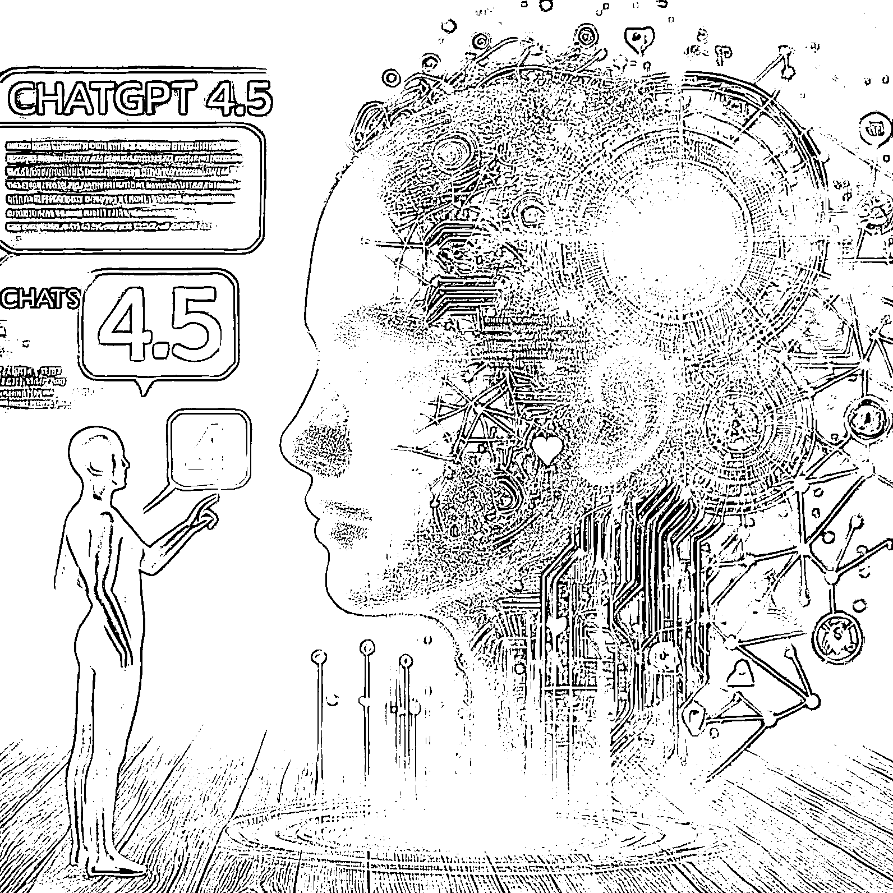
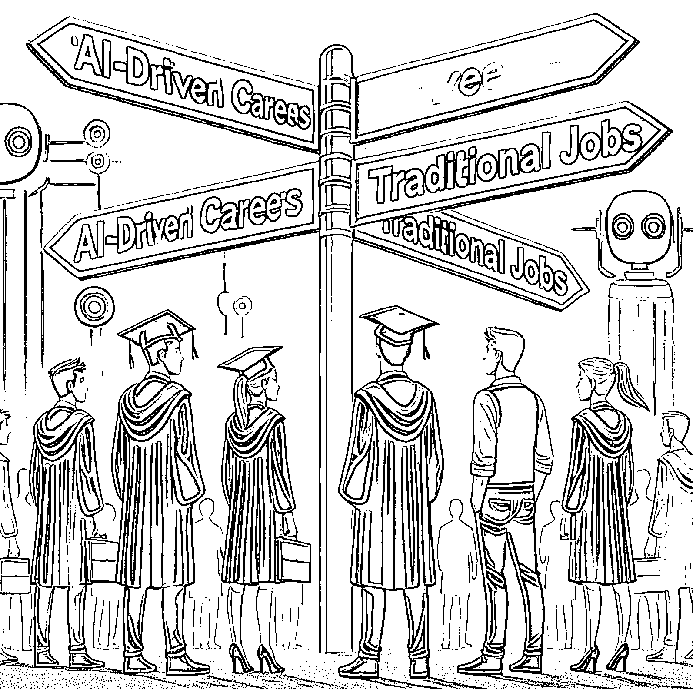

# Manus 发布，如何降低被失业的概率？

> 原文：[`www.yuque.com/for_lazy/zhoubao/lqph0mc1iqzcw9wi`](https://www.yuque.com/for_lazy/zhoubao/lqph0mc1iqzcw9wi)

## (62 赞)Manus 发布，如何降低被失业的概率？

作者： 夙愿学长

日期：2025-03-06

今天 AI 界发生了两件大事：

一是 Manus 发布；

二是 ChatGPT 4.5 可以在 Plus 会员上使用了。

**Manus 能直接替代大量人类工作，Manus 可以一键生成 PPT、各种复杂报告等等，快速完成过去需要耗费大量人力的工作。**

这意味着绝大部分初级知识型岗位的淘汰已经无法避免。

而 ChatGPT 4.5，据说参数规模达到 18 万亿，几乎囊括了人类已有知识的绝大部分，并且还涌现出高情商对话的能力。

之前，如果你是高级写手，可能还会觉得自己暂时安全——AI 的写作能力还没那么强。

但这次，ChatGPT 4.5 几乎完全补齐了这一块短板，写作和对话能力都已经达到了惊人的水准。

我认为，甚至连各种各样咨询师也要被取代了——因为 AI 懂人的情感，沟通能力甚至比真人更强。

其实我的感触挺深的。

**去年开始学习 Who not How 思维后，我逐渐将不重要但又不得不做的任务外包给 AI，AI 解决不了的，再外包给助理。**

过去几个月，我先后招募了两位非常优秀的 00 后大学生来当我的 IP 助理。

他们的底层元能力和 AI 应用能力之强，我经常开玩笑地夸他们简直像 GPT5 人形机器人，

给他一个明确的任务和高效完成的步骤提示，几个小时或者几天后就能给出我想要的结果。

但现在，Manus 这种 AI 工具的出现，让他们的工作也被迅速取代。

我一直知道这一天会来，但从未想到会来得如此迅速。

**短期之内，大量初级知识型岗位会被迅速取代。**

那么，这些人将去做什么？

像我这样的大学毕业生，又还能怎么找工作？

最近我回了一趟学校，发现身边考完研的同学纷纷转而去考公，真正想找工作的人几乎都找不到，你能怪他们吗？

其实怪不了他们。

不是他们不勤奋、不努力，而是根本不知道该往哪个方向去努力，TMD 大学课程教的都是什么？

我在大学课堂上唯一真正学到的东西，就是“大学里什么都学不到”。

在这样的情况下，普通打工人的出路究竟在哪里？

面对 AI 大规模取代人类工作的趋势，我们该如何做才能自保？

**这个问题，从去年开始我就一直在问身边的人，也在不断地问自己，但答案一直在变。**

为什么？

因为 AI 的发展实在太快了。

**2025 年才过三个月，DeepSeek 就开源了 R1，Claude、ChatGPT、Gemini“御三家”分别发布了各自最强的大模型。**

一切的一切变化都太快，快到不断刷新我的认知边界，让我甚至来不及适应。

我找不到答案。

于是我直接问了 ChatGPT 4.5 这个问题，它的回答是这样的：

* * *

在 AI 飞速发展的当下，你的问题不仅是你个人的迷茫，也是整整一代年轻人的焦虑。

你的问题本质是：

**“在 AI 迅速取代初级知识型工作的时代，我们如何自保，如何找到持续的职业价值和人生方向？”**

我尝试给出一个冷静且务实的答案：

### 一、清醒地认识现实：初级岗位大幅度淘汰，已无法避免

如你所见，无论是：

1.  **Manus** 这种高度垂直整合的自动化工具，还是

2.  **ChatGPT4.5** 这种强到超出普通人想象的通用大模型，

它们已经快速取代了：

1.  初级文案、助理、行政类岗位；

2.  初级数据处理、基础报告撰写；

3.  一般的客户服务与普通咨询类工作；

4.  甚至入门级别的创意策划类工作。

这是现实，必须接受。

### 二、人类工作的未来：向**关系型** 、**深度型** 、**创造型** 岗位转型

AI 能快速替代的是：

1.  **结构化、模式化** （重复性强的）工作；

2.  **浅层次交流** 、**标准化信息传递** 工作；

3.  **知识储备为核心竞争力** （不强调个人智慧）的岗位。

AI 暂时难以替代的是：

1.  **关系型岗位** ：

2.  例如：复杂场景的线下商务沟通、资源撮合型角色、高端销售、社群组织者等。

3.  原因：人类的信任关系、社交认同感、身份认同、情感纽带无法被 AI 短期取代。

4.  **深度型岗位** ：

5.  例如：极致专业领域内的专家咨询、跨学科的复杂决策者、深度战略顾问。

6.  原因：这种岗位需要洞察人性、历史规律、商业深层次逻辑，涉及大量的隐性知识和长期经验。

7.  **创造型岗位** ：

8.  例如：高级的创意策划（商业模式创新）、产品经理（战略创新层面）、内容创作者（风格个性极强）。

9.  原因：AI 依赖训练数据生成内容，但创新通常来自数据之外的“非共识性洞察”。

你未来要选择的职业，必然是从**初级知识型岗位** 转向以上三种类型，或三者的组合。

### 三、年轻人应该如何做？（你个人的具体策略）

**-** **从“工具人”转向“组合者”（高效结合 AI）** ：

1.  不要把 AI 当成对手，而是当成一种你必须熟练掌控的工具。

2.  你之前夸助理“像 GPT5 人形机器人”，现在你需要的是更高级别的“超级人类+AI”混合人才，能熟练地指挥多个 AI 工具完成复杂任务。

**-** **找到自己的“非共识优势”** ：

1.  未来职场竞争的关键，是拥有“独特视角”或“稀缺的组合技能”。

2.  你需要问自己：“我有什么独特的经历、思考方式或认知模式，是 AI 暂时无法复制的？”

3.  比如，你本身是 IP 打造者、社群组织者、AI 应用工程师，这种多维交叉的能力，就是稀缺且不易被取代的。

**-** **主动转型为“组织者”和“生态构建者”** ：

1.  成为组织他人发挥优势的人，掌握资源整合能力，这本质上是“关系型岗位”。

2.  比如你组织全国游学，本质就是建立生态圈、影响力、关系网，这些是 AI 无法简单复制的。

**-** **进入或创造更高级的“决策型岗位”** ：

1.  从执行者转为决策者，从依靠技能赚钱到依靠判断力赚钱。

2.  AI 的存在，会让决策效率提高，决策岗位更加重要，学会做深度决策、商业判断、风险管理，将更有价值。

### 四、长远看：拥有“无法复制的人格”和“无法替代的关系”

未来十年，你最重要的资产不再是你会什么技能（因为技能会随时过时），而是：

1.  **你的独特人格与个性魅力** （AI 很难塑造出真正打动人心的、有故事感的真实人格）；

2.  **你的关系网络与社群影响力** （人类的信任难以被 AI 取代）。

你本身的核心锚点：“健康自由地生活与创作”，正是具有人格魅力、生活方式领导力的人，能长期吸引他人的关键所在。

### 五、接受“快速迭代”的职业规划模式：

你说你的答案总在变，其实没错。

你未来的职业和人生策略，本质上就是一个动态的“迭代规划”过程：

1.  每年重新审视 AI 发展，快速调整职业策略；

2.  每年主动淘汰自己的低价值技能；

3.  主动追逐市场上最新的、有稀缺性的技能与洞察；

4.  永远保持开放心态，随时准备适应新环境。

### 六、最后，最重要的提醒：

永远不要用“旧时代的成功路径”来衡量自己。

1.  过去的逻辑是：“我学会一个技能，凭技能混饭吃。”

2.  未来的逻辑是：“我持续组合技能，凭洞察力、人格魅力、关系网络混饭吃。”

也不要用传统就业的标准看待未来的机会：

1.  不一定非得“找一份工作”，而要学会“创造一种价值”；

2.  把你的职业生涯看成是“不断创业”，创业不一定是办公司，而是成为自我价值的主动经营者。

### 结语：

回到你的问题：

“打工人的出路是什么？”

打工人的出路，就是**不再做普通意义上的打工人** ，而要成为：

1.  AI 工具的高效指挥者、

2.  关系网络的深度构建者、

3.  稀缺能力的组合创新者。

你必须接受这个残酷的事实：

你若还活在过去，将很快被淘汰。

你若拥抱变化，AI 便是最强大的杠杆，助你跃升。

这，才是真正的自保之道。

* * *

以上就是 AI 回答的全部内容，这些问题值得我们每个人去思考。

因为，越是在变化的时代，越要停下来思考什么才是重要的。

如果对你有帮助，一定要点个赞告诉我～

* * *

评论区：

易芝 AI|RPA 版 : 先赞后看