# AI 做出来的应用，如何利用蓝海关键词，在 AppStore 免费获取流量？

> 原文：[`www.yuque.com/for_lazy/zhoubao/kvrg3ket6hfzkyhc`](https://www.yuque.com/for_lazy/zhoubao/kvrg3ket6hfzkyhc)

## (精华帖)(54 赞)AI 做出来的应用，如何利用蓝海关键词，在 AppStore 免费获取流量？

作者： 刺猬🐬

日期：2025-03-05

哈喽各位圈友，我是刺猬，做了十几年游戏，比较熟悉的领域是手游的开发运营等，做过大流水的项目，投过大金额的广告；近两年一直在做 ai
和游戏的融合等，看看如何做一些创新的东西。

最近出海和 AI 编程很火，小排老师也正在做一个用 AI 做应用的课程。这对于我们来说一个非常好的机会。

如果你过段时间会参加这个课程，那你也大概率会开发出属于自己的 APP。

作为生财圈友，大家对 AI 编程的威力，肯定已经非常熟悉了。比如花生老师的小猫补光灯。

所以，在 AI 时代，对很多人来说，开发一个应用（比如 iOS APP）产品是分分钟的事。

但创造产品的同时，也会被另一个现实情况困扰：**用户从哪里来？没有用户，就没有反馈，就不知道自己的产品，导致能不能变现？有没有价值？很容易陷入挫败、或者自嗨的方向。**

小排老师说过，我们开发产品的顺序应该是**先找到用户场景，再进行 mvp 试错** ，这的确是正道，也是做一款成功产品的关键；不过对于很多新手来说把握好这点其实还挺难，特别是需要不断试错打怪升级，总是比较磨人心智。

获取流量的方式其实有很多种，比如投放、自建媒体、裂变、邀请分享等。

今天我分享一个算是骚操作的小方法，对于 i 人来说特别有趣，但是可能给你带来一些相对比较“**划算** ”的流量

*找有流量的词，以进第一页为目标* 。

如何进第一页？

找搜索结果不足一页的词，加到产品介绍里，就一定能进第一页。

比如，搜索结果里只有 1 个产品的搜索词。

这个方法，用一句话总结就是：**“** ***排到第一页*** **”**。

话不多说咱们来开整，看这个 appstore 搜索界面 ——

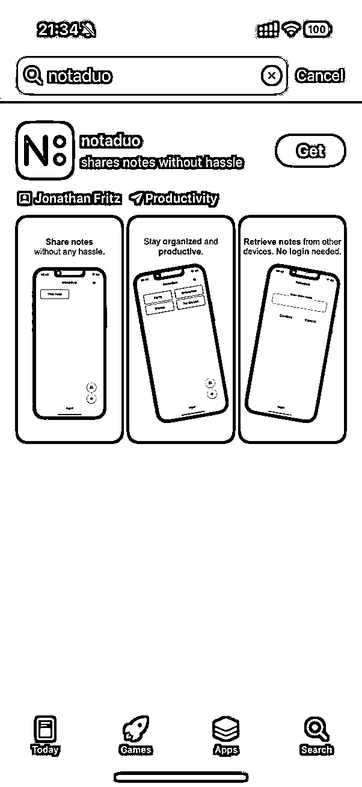

搜索结果里，**一整页就只有一个产品！**

那，如果我们的 APP 排第二个，是不是就白捡了曝光的机会？

所以我们需要考虑的是如何

**从各种数据源中找到，那些有人搜，且竞争度不大的词排到第一页去** ，

思路有了，我们开始实践：

## 1. 工具搜索

之前生财有很多帖子都提过 diandian 数据 七麦 sensortower 等网站去看 app 的情况，
毕竟几乎所有做移动互联网的朋友都会去看市场情况，除了看 top 的榜单，我们切入最合适的是，**一些相对蓝海的市场** ，竞争压力小的好处就是反馈会来的更及时一些，我们今天就从点点数据 [`www.diandian.com/`](https://www.diandian.com) 开始，免费版的就够我们做这些调研工作了

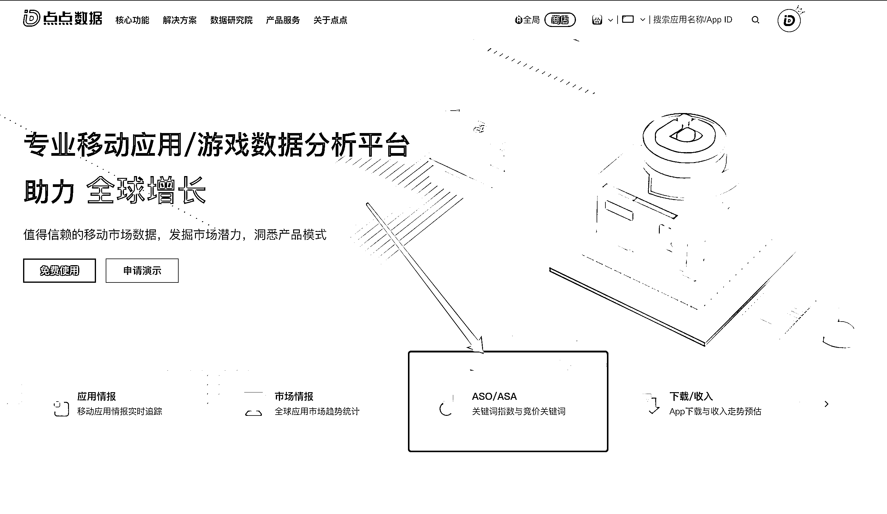

我们在 ASA/ASO 菜单中找到搜索指数榜单：

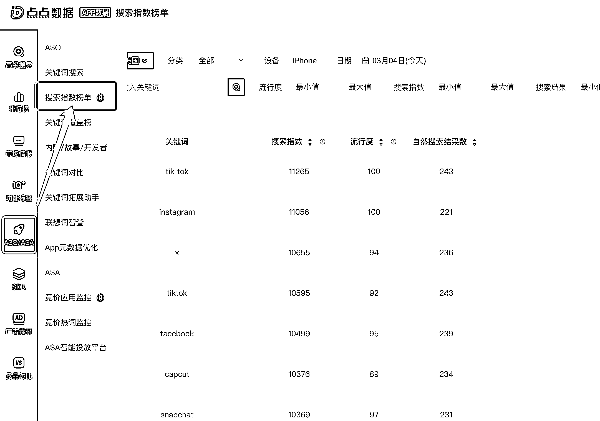

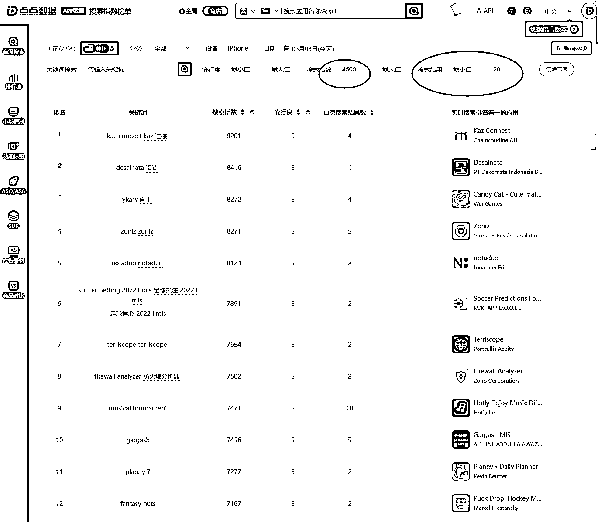

1.  找到对应国家市场（海外平台是区分国家的，大部分情况下通用 app 会在全球上架，但是因为每个国家政策和用户不同，可能会存在差别），比如我们这里选择了美国

2.  然后按照搜索指数 大于 4500（4605），搜索结果小于 20 来筛选（结果数可以自己调整）

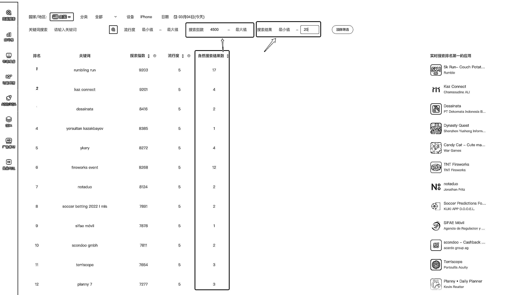

这里的逻辑就是，我们要找到 当前热搜（一定热度），但是列出来的产品数据不多的情况

2. 分析判断

使用翻译软件辅助，开始整理每个词，做判断，

这一步是重中之重，实际上每个人的判断和自己的产品会比较相关，也有很多的套路，比如一些通用词 play、 xx game、 notes、 等等比较泛的品类词
不建议看，因为这些词大体上搜索都会很宽泛不具体，我们也不会有优势，难把握意图，更多的我们会关注一些
翻译都翻不出来的词，极有可能就是别人的品牌词，如果和我们有关，那就更棒了，所以建议安装一个沉浸式翻译，鼠标指向某个词不懂， 按住 ctrl
他就出现翻译了，如果翻译都没有，那就可以考虑看看细节。例如下面框里这些：

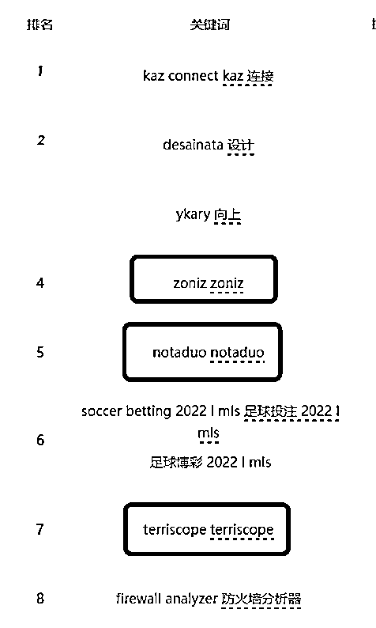

OK，我们就拿第五个 notaduo 这个词来看，

看不懂，不认识，但是指数有 8124，很高了（注：自 2020 年 2 月 6 日起，App
Store 不再返回关键词的搜索指数。2020 年 2 月 6 日之前的搜索指数是由 App
Store 官方接口提供，2020 年 2 月 6 日之后的搜索指数为「点点数据」通过网络流量、下载量、联想词等多维度计算得出，仅供参考。_），而且结果只有
2 个，我在国内的 appstore 只看到 1 个，**如果用户搜索意图和我们的产品有关，是不是可以薅到这波流量？**

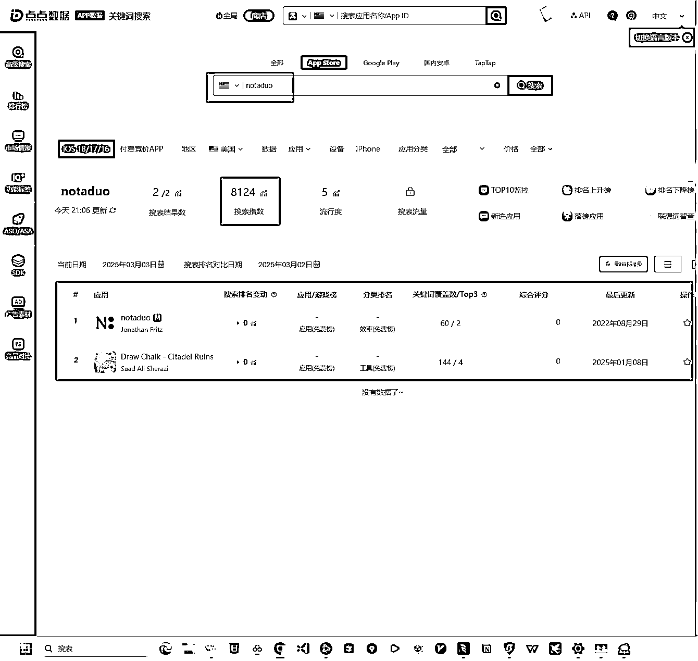

在美区的榜单中，这个产品的确是只有 2 个结果，另一个不像是和他有关系的，但是这个产品最后更新是 2022 年 8 月 29，这波搜索像是忽然间起来的

我们再深入查一下这个产品是干嘛的：

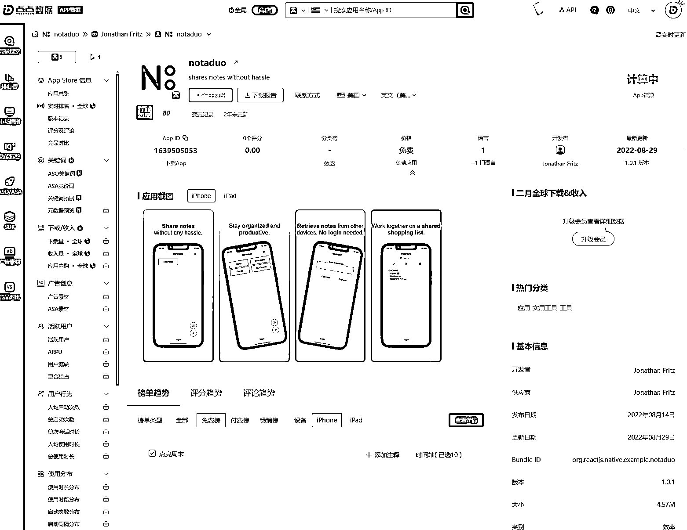

看应用截图，这就是个通过 pin
码分享笔记内容的产品，主打的是不需要注册登录，那如果是咱们自己的 ai 产品正好和这个相关，妥妥的就可以用这个词，让搜索的用户看到我们的产品

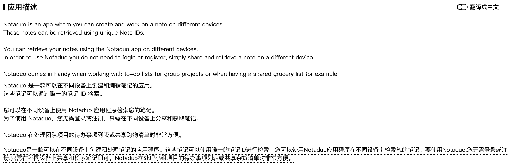

## 3.与我有关

那么接下去就是最基础的 aso 操作了，改自己的关键词：

在 appstore 的审核界面，我们在提交产品时，就一定会需要填写一些“元数据”（meta data），就是帮助系统理解你的产品和归类的，在
keyword 这一栏就是你的产品关键词，正常的我们产品会些一些相关的词汇，例如 notes、tools 等等，但是现在我们是要蹭词，就会需要将你需要关联的
有一定热度的词，放在你的 keywords 位置：

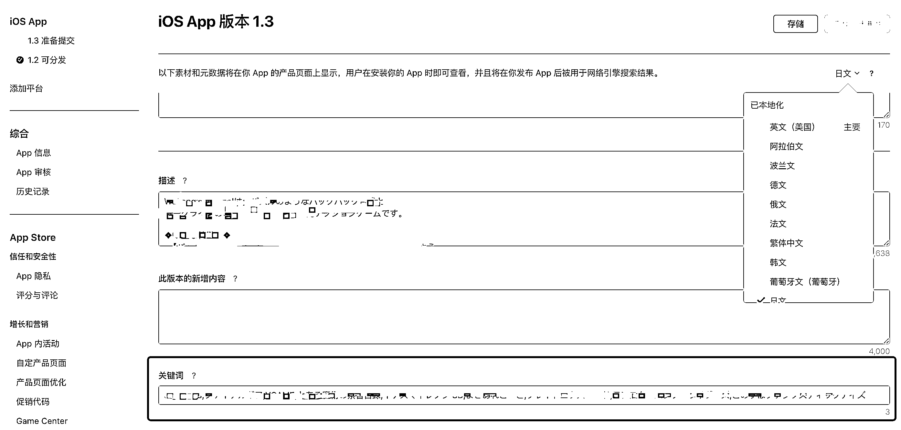

版本信息中都有关键词的栏位，最多 100
个字符，所以我们需要干的是，把自己的产品元数据里（例如名称、副标题、描述、推广文本等），加上这些热词，这样用户搜索关键词的时候，我们的产品就能排在前面；

## 4.扩展覆盖面

*等一下，是不是发现了一个小细节* ：** *日文***

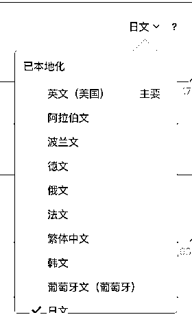

对，没错，注意到这一点的朋友敏锐度就很高了，现在有了 ai，让我们做产品做应用的可能性大了很多，而更直接的收益就是“说人话的翻译”，再也不需要木讷地用谷歌机器翻译，语言不通地去服务海外不同地区的用户了，而且对于利基市场，投产比才是我们最关注的点，给不同地区的用户不同语言的定制化内容，价值更高，人家选择你的可能性也更大。

例如我的休闲游戏，就会发现 从法国和澳大利亚去切入，相对来说可以避开一些大厂的火力覆盖，获客成本完全不一样；那么从这个角度去看我们的“aso
蹭词占坑大法”，也是有同样的逻辑，于是除了产品内的设计、显示，我们在市场端也需要有这样的思路，去对应每个不同的市场，做不同的覆盖策略

然后就有了类似这样的表格：

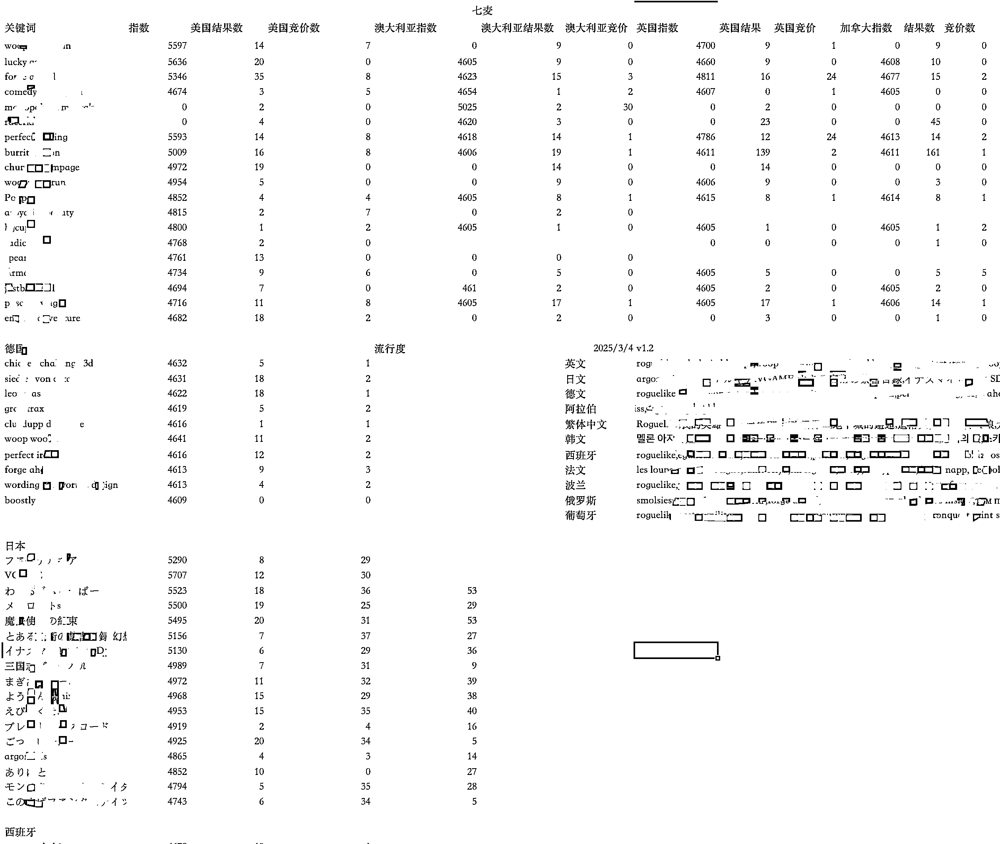

表格是我在用七麦数据实操游戏关键词过程中的一个版本，也没有标准化大家可以自行理解和调整，思路来自@子木
，做了一些定定向的筛选逻辑和方法论，也的确收到一些效果；在做调研的过程中，尽量先不要脚本化去批量抓取，也不要用 ai 直接生成相应的内容，主要在于积累体感，例如每个地区的用户体量、搜索习惯，投放的数量
都会呈现一些非常不同的情况。

通过多个国家、多个这类“热搜蓝海词”的覆盖，就理论上就可以覆盖更多的搜索量，

==============================

以上就是基础的操作步骤了，希望能帮到即将到来 ai appstore 产品航海的圈友，多多爆款。

## **延伸的问题：**

1.  Meta data 元数据的标题、描述、推广文本是否有同样的 seo 效应，权重如何？目前我的体验感受是：标题＞副标题＞关键词栏＞描述，不过我们蹭词也需要讲究行文通畅合理，不能硬凑

2.  评论权重 aso 的操作便捷度如何？成本如何？我知道有人在做且成本不高，以前也搞过，不过一直以投放 fb 和 google 为主没有太清楚实际的收益

3.  编辑 keywords 的操作，实际是需要提交版本才可以修改， 需要每个版本的内容都重新提交，也就是有一个提交审核的过程，这个操作存在一定的延迟，更新版本可能半天就过，也可能 2 天以上，就会需要考虑这些词的时效性

4.  可以参考一些词的覆盖开发者（特别是个人），这些开发者往往都具有不错的洞察，会有一定的内卷

5.  是不是可以从这样的热搜词中直接撸一个产品（需求洞察）

6.  在横向对比的过程中，尽可能地多参考几个工具，例如七麦、diandian 数据、sensortower、google trends；每个工具有不同的推导方式，数据一定不会是精准的，所以所谓的指数、热度、流行度，都是一个参考值，没有人能真正给精确值，我们是蹭词的逻辑下，更需要有些日积月累的敏感，因为这些是突然起来的，所以可能统计数据会有延迟，例如网站常用的 similarweb 就不会有近期的词汇，但我们可以去社交媒体搜索相关最近的内容，看看关注点是什么，更能增加蹭词转化的成功率；

## ** *附上 Deepseek 对于 Aso 的解释***

ASO（应用商店优化）是提升应用在应用商店可见性、下载量和用户留存的关键策略。以下是结合最新行业趋势和最佳实践的全面总结：

### **一、关键词优化：精准触达目标用户**

1.  **目标市场研究**

2.  深入分析目标市场的语言、文化及用户搜索习惯，确保关键词符合当地语义。例如，不同地区的同一词汇可能含义不同，需避免歧义。

3.  通过工具（如 SensorTower、AppAnnie）挖掘高流量且相关性强的关键词，优先选择搜索量大但竞争度适中的长尾词，以平衡曝光与转化率。

4.  **竞品分析与差异化策略**

5.  研究竞品关键词布局，识别未被充分利用的“蓝海词”，避免与头部应用直接竞争。例如，通过分析竞品评论提炼用户需求关键词。

6.  结合应用的独特卖点（USP），选择差异化关键词，如突出特定功能（如“AI 照片编辑”）。

7.  **动态调整与组合优化**

8.  定期监测关键词表现，替换低效词汇，并通过组合形成高相关性的词组（如“健身计划+饮食跟踪”）。

9.  标题中优先放置核心关键词（App Store 仅显示前 26 个字符），副标题和描述自然融入次要关键词。

### **二、元数据与视觉优化：提升转化率**

1.  **元数据设计原则**

2.  **标题与描述** ：标题需简洁（30 字符内），突出功能与品牌；描述前两行需包含核心卖点，并采用项目符号提高可读性。

3.  **3C 规则** ：视觉元素（图标、截图、视频）需具备吸引力（Catchy）、一致性（Consistent）和合规性（Compliant）。例如，截图应展示核心功能流程，并添加行动号召（CTA）。

4.  **A/B 测试与本地化适配**

5.  对图标、截图进行多版本测试，选择转化率最高的方案。例如，游戏类应用可通过视频预览展示玩法亮点。

6.  本地化视觉内容，如使用当地地标、节日元素或调整配色（如红色在亚洲代表喜庆，在中东可能关联危险）。

### **三、本地化策略：突破文化壁垒**

1.  **深度本地化而非简单翻译**

2.  避免依赖机器翻译，需人工校对确保语义准确。例如，阿拉伯语需从右到左排版，数字格式需适配本地习惯（如小数点分隔符）。

3.  为不同语言版本单独研究关键词，如英语分美国、英国等地区，西班牙语分西班牙和拉丁美洲版本。

4.  **文化敏感性调整**

5.  避免使用可能冒犯当地文化的元素（如特定手势或表情符号），并适配节日营销（如春节促销截图）。

6.  调整应用名称长度及关键词，如日语用户偏好短名称，而德语用户可能接受较长词汇。

### **四、数据驱动与长期维护**

1.  **持续监控与算法适应**

2.  使用 ASO 工具追踪关键词排名、下载量及用户留存，关注应用商店算法变化（如 Apple Search 新增权重因素）。

3.  结合付费广告（如 Apple Search Ads）提升高竞争关键词的曝光，形成自然流量与付费流量的协同效应。

4.  **用户反馈与评分管理**

5.  鼓励用户留下好评，及时回复负面评论以提升信任度。例如，在应用内设置评分提示弹窗，并提供问题解决渠道。

6.  通过用户行为数据优化功能，如高频使用功能可截图展示，增强页面说服力。

### **五、合规与长期价值**

1.  **避免过度优化** ：关键词堆砌或虚假描述可能导致应用下架，需平衡 SEO 与用户体验。

2.  **长期策略** ：ASO 是持续过程，需定期迭代（如季度调整关键词库），结合市场趋势（如 AI 工具辅助生成内容）保持竞争力。

通过上述实践，开发者可系统提升应用在商店的可见性与转化率。需注意的是，ASO 效果通常需数周至数月显现，需保持耐心并持续优化。

* * *

评论区：

三林 : 延展的问题，再去卷一下 deepseek 的大脑🧠

刺猬🐬 : 嗯呐[呲牙]

Jason Yu : 刺猬老师，很好的思路，总的来说就是蹭词，找蓝海词，不过会不会因此而错过那些大词？我们应该去做长尾词的头部还是高热度词比较靠后的排名？哪种效果更好？

刺猬🐬 : 我觉得看阶段吧，对新手或刚上线的产品来说，借助竞争度低的蓝海词能快速拿到曝光和用户反馈，获得第一批用户的真实数据，也有利于产品迭代，例如刚才的笔记类，如果自己有这个功能能替代，在进来用户的转化上花点小心思直接建立用户的洞察和反馈机制，更容易让我们发现产品的问题，蓝海词往往转化率更高，因为搜索这些词的用户目的更明确，竞争也更小，适合我们先‘稳住基本盘’，看看是不是能先拿到种子用户的反馈。
大词虽然搜索量高，但竞争也极其激烈。如果产品还没打磨到足够成熟或投放预算不多，直接去抢大词的排名可能投入产出比不理想。抢大词需要更完整的 ASO 布局、持续的买量或投放支持，以及较高的产品认知度（品牌、口碑、下载量都需要积累）。对于新应用，这些要素还没完全具备时，可能只能排到很后面，导致转化率低、花费反而更高。如果有大的投入成本不如直接做投放，我的理解来说大词是适合验证过的产品你确信产品方向和收益没问题，在长期品牌建设的时候作为投放流量之外 seo 辅助用的

Jason Yu : 昨天尝试了这个蓝海词的方法，发现了几个问题，刺猬老师不知道发现没：
1、无论是点点还是七麦，按关键词搜索这里给的搜索指数都很不准，而且差异巨大，我猜测这些词是某些词的搜索错了之后的词，苹果没有校正，指数贴近那个词，但是并没有实际的量，就算排在第一，也没用
2、如果结合流行度来看，有作用，但是出来的几乎全都是品牌词，蹭品牌词会有一定的风险，这个得酌情考虑~

刺猬🐬 : 是的，这个问题我也发现了，准确度是和问题，所以有些是要看技巧，例如出现在评论区。至于你说品牌词，需要看使用方式，会有被清词的风险，只是对比等方式而不是
copycat 这个是没有问题的，对用户诚信是第一位，也比较复杂，所以你会看到很多词都有 ASA 竞价，直接被投品牌词都很正常 relation not
fake.

根源 : 这篇文章的思路真好！

刺猬🐬 : 每天增加几千曝光不是问题，需要看后台的分析数据，