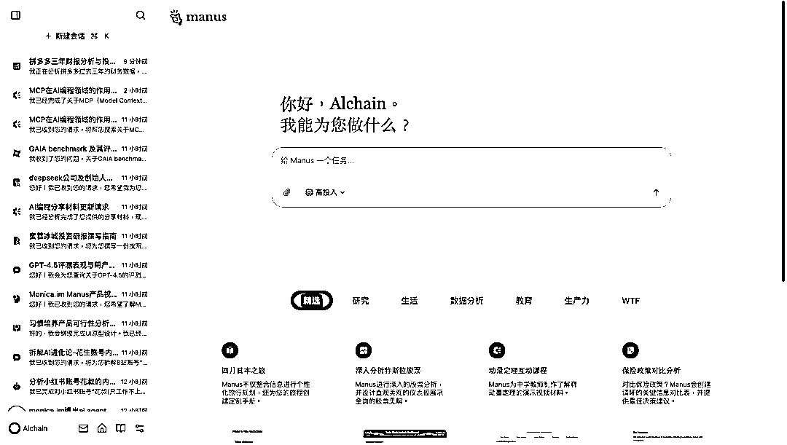
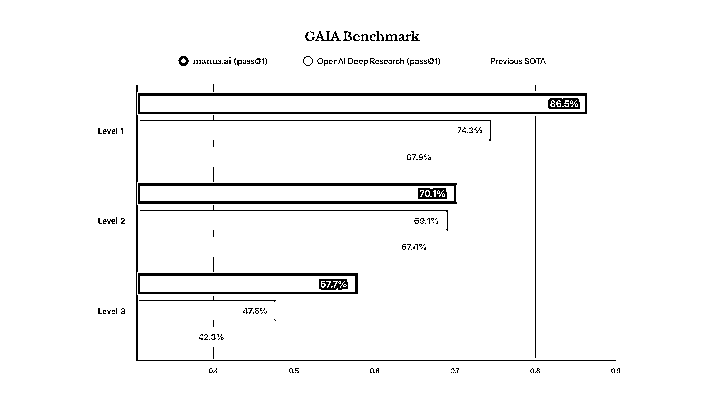
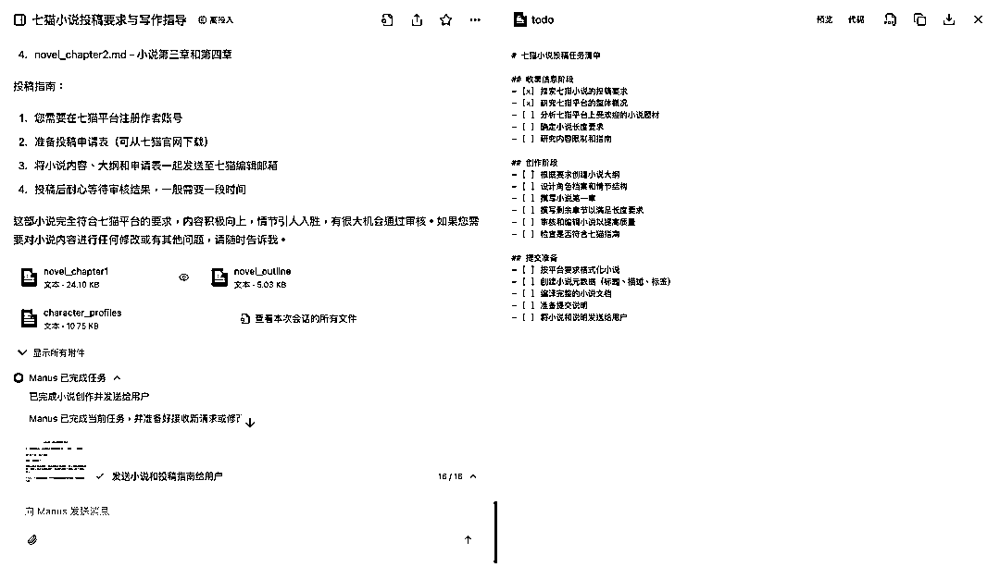
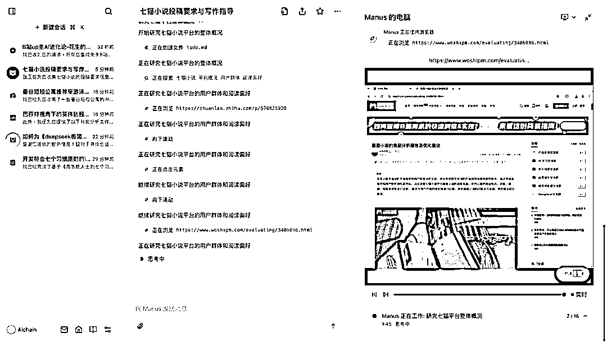
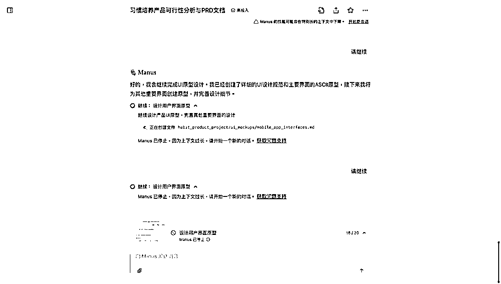

# 新软件会消耗掉硬件性能提升带来的所有优势

> 原文：[`www.yuque.com/for_lazy/zhoubao/ilvnk3m11q0piar4`](https://www.yuque.com/for_lazy/zhoubao/ilvnk3m11q0piar4)

## (48 赞)新软件会消耗掉硬件性能提升带来的所有优势

作者： AI 进化论-花生

日期：2025-03-08

> 新软件会消耗掉硬件性能提升带来的所有优势。
> 
> ——安迪-比尔定律

**  **

## **一、AI 的安迪-比尔定律**

30 多年前计算机时代的安迪-
比尔定律正在继续上演，那个定律是说不管安迪·格鲁夫（英特尔 CEO）带来多大的硬件进步，比尔·盖茨（微软 CEO）都会用软件的升级把硬件运算速度提升的进步消耗殆尽。

所以我们似乎用到的总会是卡卡卡的电脑，及时在那期间硬件能力已经提升百倍，甚至千倍了。

而这个定律在 AI 时代再次发生了，不管大语言模型厂商带来多大程度的模型能力提升，不管如何提升 LLM 吐出单个 token 的效率，降低 LLM 单 token 成本，总会不断有新的 AI 应用把这部分的能力提升吃干。

在 2024 年 7、8 月的时候，因为 Claude 3.5
Sonnet 的发布，我们获得了真正可用的 AI 编程工具 Cursor。半年后的今天，Manus 出现了，它在以十倍、百倍的速率消耗最强大的 LLM 的 token，然后帮用户更好完成复杂任务。

实际上，AI
Agent 的概念在 2023 年 3 月 GPT-4 发布的时候就爆火过一波，AutoGPT 的概念被炒得相当热闹，但喧嚣过后，大家发现那个 Agent 除了一次任务消耗掉你 10 几美金，什么都没给你留下。

Agent 的概念是对的，但模型能力还没真正 ready。

现在的 Manus 确实让我看到了不太一样的情况，模型能力到了，他们的工程能力去挤压出了模型可完成的最复杂的任务，并且用他们自己的话说是：

Less structure, more intelligence._

我很认可这句话，因为你更少用架构限制大模型，你就有机会去更充分的利用大模型所展示出来的能力。而且这个概念很性感的点在于，他们是在利用大语言模型的 intelligence，是在和 LLM 的进步站在一起的。你可以预期模型能力越提升，Manus 可完成的任务范围就会更广，效果也会更好。

Manus 在 GAIA Benchmark 上大幅度超过 OpenAI

这让我想到了 DeepSeek R1 在 post-training 过程中展示出来的“wait..wait...”那个 aha
moment，也像 AlphaGo 战胜李世石时那石破天惊的第 37 手。放弃人类过多干预情况下，AI 才有机会通过自己的选择战胜人类。

显然，Manus 团队是相信 AI 可以比人更聪明，并给了大模型足够的空间去做自主规划和执行的。

**  **

## **二、Manus 是如何工作的**

接下来我们可以实际看看，Manus 是如何工作的。

我给 Manus 一个我现在真的很需要的场景任务：

我写了一本叫《deepseek 极简入门》的书，我是一名 AI 自媒体博主，B 站和 YouTube 账号是「AI 进化论-花生」，小红书账号是
「花叔（只工作不上班版」，我之前从来没有写书的经验。这本书预计三月底出版，到时候竞争可能挺激烈的。我应该怎么给我这本书进行营销呢？告诉我具体的方法和我实际该做的事情。我希望既能获得好口碑，又能有不错的销量的。

在这个任务中，我告诉了 Manus 我是什么，我需要他做什么，我的目标是什么，接下来我们看看 Manus 的发挥。

**步骤 1: Manus 先做了个规划**

就像你给团队里一个很聪明的下属布置任务一样，即使他是清北毕业的，即使他有 10 年以上的工作经验，面对一个复杂的任务，他都不可能是在你面前直接回答，完成你的要求的。而是他要拆解你的任务，分解成一项项他可以执行的内容，他需要思考为了完成这项任务，他该收集哪些信息。

而 Manus 也是这么做的

anus 将我的任务分解成了分析与研究阶段、营销策略制定、执行计划这三个大阶段，并且在每个阶段内还对任务做了细分，甚至在分析与研究结果还分解出了二级和三级的子任务。

在任务规划环节，我还有个印象深刻的场景是让 Manus 帮我写一份可以投稿到某个小说平台的超过万字的小说初稿。

了解大模型的人都知道这个任务的含量有多高，因为大模型的单次输出 token 是很有限的，一般就写个 2000 字到 4000 字，所以如果要完成一个长篇幅内容的撰写，为了完成长度的需求，以及让输出的内容有逻辑，是需要相当好的对大模型能力的理解，对写小说人物的理解的。

然后 Manus 为我规划了先了解平台要求，再再创作过程中先写大纲、再设计角色和情节，最后再实际写作的任务步骤。

实际最后输出的两个章节的内容达到了 17000 多字。

**步骤 2: Manus 根据规划收集信息**

这一步的话，你可以理解为 Manus 为每个任务分配了个虚拟服务器，虚拟的电脑，在这台电脑中，Manus 具有自主访问浏览器和使用 VScode 写代码，运行代码的能力。

我们再回到之前的比喻，如果说像 GPT-4.5、DeepSeek
R1 这些模型都是清北毕业生的话，那常规的 Chatbot 产品中，我们在要求模型执行任务的时候，只给这个毕业生发了纸和笔，我们要求他用脑子里的知识去解决我们所有的问题。

而 Manus 则是为这个员工分配了一台电脑，让他可以上网查信息，让他可以去写代码。这一步的写代码可能是调用 API 去查询股票数据等精准信息，去写 python 脚本分析数据，也可能是写一个网页的代码，这些在 Manus 的网站上都有他们一些历史对话记录的示例。

不过这里说句题外话，Manus 还是会遇到一些机器人🤖解决不了的问题，比方说现在很多网站都有登录墙，你在不登录的情况下压根浏览不了信息，或者你被要求去输入一个验证码等等，Manus 在这个时候可能会出错卡住，然后只能去找别的解决方式。

现在其中一个解决方式是我们人类可以去接管电脑，帮 Manus 完成登录过程。早上在听 Manus 团队发布产品的时候，他们也提到可以通过在记忆中给 Manus 提供部分账号密码的方式解决这个问题。不过安全性如何解决，以及是否可以真的完全解决这个问题我还未实际测试。

**步骤 3: 综合信息输出结果**

Manus 会把过程中获取到的所有信息都保存下来，然后提供在最后综合输出成用户要求的报告。

我目前测试的结果来说，Manus 是个工作习惯极其优秀的实习生，不只最后提供的结果出色，他还会保存他所规划的任务每个节点的产出，所以你在此过程中想查阅每个节点的输出都是没问题的。

这有点像 DeepSeek r1 暴露思考过程一样，你知道一个 Agent 产品最后是怎么给你供给结果的，你自然会更信任他为你提供的东西。

实际以这份我要求 Manus 完成的书稿营销方案来说，他是先把我是谁，我的特点是什么扒得一干二净，然后输出了一个真的充分结合我的特点而产生的营销策略，非常让人印象深刻。内容实在太太太长了，超过了 5000 字，我就先不放了，你可以通过这个链接看：[`manus.im/share/ahYwPmwXPGDidQtfwP4OF5?replay=1`](https://manus.im/share/ahYwPmwXPGDidQtfwP4OF5?replay=1)

如果你本身就是市场、运营职能的同学，或者你和相关岗位有过协作的话，你就知道这份营销策略的含金量有多高了。

## **三、体验后记**

不过，我也得说这个过程中也不是没有负向的体验，比如有一个任务，因为积累的上下文长度太长了，Manus 直接停止了工作。这...我得说 Manus 团队确实很舍得烧 token，对于这么大体量的任务，好像并没有通过总结或 RAG 的方式去简化过程输出物，这可能也是效果好的重要原因之一。

不过报错了不能继续的体验还是不太好的，期待进一步的模型上下文长度提升吧（比如 DeepSeek V4/R2 的发布）

另外还有两个细节：

1）Manus 是可以一次并行多个任务的，并且你关闭网页离开也无所谓，这就像你招了个实习生团队，而不是一个实习生，你可以分别给他们分配任务，并且他们也不需要占用你的电脑来完成任务。有些 Agent 非得控制你的电脑来执行实在是太傻了些；

2）在任务过程中，你可以重新给 Manus 提供额外的要求，而这份额外的要求可能是你的突发奇想，可能是你看到 Manus 的过程产出后希望补充的，这些要求都不会中断 Manus 的任务执行。这也和给实习生派任务很像，利好各种喜欢拍脑袋产生新想法的甲方和老板们。

从 Manus 的能力表现，以及他们透露出来的一些信息看，Manus 榨干的主要是 Claude 3.5（3.7）的能力。

我还挺期待出来一家公司去把 DeepSeek R1 的深思熟虑能力榨干的。

作为一名独立开发者和 AI 自媒体博主，真的很高兴科技圈，尤其是 AI 领域还有这么多新鲜有趣的事情发生。

* * *

下面是关于 Manus 的一些极简事实：

1.  Manus 不是一个大语言模型，而是在大语言模型能力基础上的一个应用，所以和 DeepSeek R1、GPT-4.5、Claude 3.7 等并不是直接的竞争对手；

2.  但大模型公司有没有可能成为竞争对手呢？也有可能，因为这个场景太通用了，所以像是 OpenAI 已经有做深度调用的 agent 产品 Deep Research，Claude 做了编程的 Claude Code 产品；

3.  Manus 更匹配的类比对象可能是 AI 编程工具 Cursor、AI 搜索产品 Perplexity 等，只是这些他们基于大模型构建出了不同的产品；

4.  Manus 目前主要接入的大模型 API 是 Claude 3.5（也许很快会切换到 Claude 3.7，部分场景好像也在训练 Qwen），因为相比别的模型更多为一步回答完用户问题而训练，Claude 模型的构建方式不太一样，适合去做这种多步任务的 Agent；

5.  大概跟 Claude 3.5（3.7）的 200k 上下文有关，执行复杂任务，当 Manus 保存的上下文资料太多时，可能会导致任务无法继续而中断；

6.  Manus 具有虚拟电脑的访问环境，每个任务都会有独立的虚拟沙盒服务器，所以有些自媒体瞎扯的 Manus 接管自己的电脑是不正确的，Manus 并不会动你的电脑，而是自己有一台，并且每个任务都有独立的一台电脑；

7.  Manus 在电脑和手机上都可以使用，你一次可以同时执行多个任务，每个任务会有各自的沙盒服务器，所以你关闭网页窗口没问题；

8.  你可以在任何任务过程中打断 Manus，中间穿插你的要求，这不会影响他整个任务的执行；

9.  Manus 有记忆能力，在执行任务时，偶尔会提醒你要不要记住你的一些信息，所以会有你越用它，它越懂你，做出来的结果更符合你需要的情况；

10.  Manus 目前跑完一个 GAIA 测试任务的成本大概是 2 美元，远低于 OpenAI 的 20 美元和另一个 SOTA 团队的 10 美元，除了使用的 API 成本有差异外，这个成本是怎么优化下来的还未知，可能跟大量使用大模型的缓存机制有关（各个大模型厂商对于刚刚执行过的缓存任务都有折扣）；

11.  Manus 很性感的地方是给了大模型足够的空间去执行任务，没有框死他们的表现，所以理论上下一代的大模型越强，Manus 也有机会越强；

12.  目前体感 Manus 更适合去做调研写报告，它倒是也能写网页，甚至部署上架让你可直接访问的，但是效果来说暂时不如有人类掌控情况下拿 AI coding 工具开发出来的表现。

因为 Manus 接入的模型的关系，在国内预计是无法直接访问的。

不过从 DeepSeek 前段时间发布的一系列内容看，我非常期待几个月后 DeepSeek 去提供一个比 Claude 3.7 更强，便宜 10 倍，上下文长 10 倍的模型。

那时候，国内用户不止可以使用到 Manus，还会发现他比现在还能强得多，这是个为模型升级做好了足够预留量的产品，很期待他们的进一步进化。

* * *

评论区：

周彦充 : Agi，未来已来。 1 年后会进化成什么样？