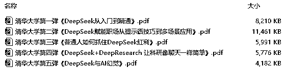
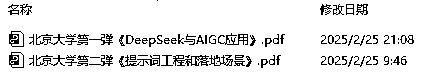

# AI 评测：清华 VS 北大 DeepSeek 干货，谁更硬核？（附资料下载）

> 原文：[`www.yuque.com/for_lazy/zhoubao/zlg3cqlbz65c852m`](https://www.yuque.com/for_lazy/zhoubao/zlg3cqlbz65c852m)

## (35 赞)AI 评测：清华 VS 北大 DeepSeek 干货，谁更硬核？（附资料下载）

作者： 乔帮主

日期：2025-03-05

大家好，我是乔帮主。随着 DeepSeek 大火，清华大学推出了 5 个关于 DeepSeek 主题的实践干货，这可是市面上 90%的人都不知道的宝藏级干货。内容价值，甩一些所谓 DeepSeek 付费课程几条街。

（文末可自行下载此资料包）

有意思的是，然后北京大学也不甘落后，最近也推出了 2 个关于 DeepSeek 主题的实践干货（每个干货都有 100 页 PPT），也不知道北大是不是跟清华杠上了。

（文末可自行下载此资料包）

不管清华和北大，干货量都给的很足。不过这几百页的内容，看起来实在眼睛疼 +
头疼。我想着能不能用 AI 来帮忙读读，以及帮忙评测下干货内容，到底是清华给的实践干货更硬，还是北大的更硬！

不过这 7 个文件，合计 515 页 PPT。目测文字有个一二十万字，图片也有个一两百张。让 AI 来阅读总结这里面的内容，并且还评测打分，这对 AI 的能力要求很高。

接下来我们分别用 DeepSeek、ChatGPT、Claude、Kimi、豆包、海螺、跃问、智谱清言、文心一言来评测，看看有哪几款 AI 工具能胜任这个高难度工作！

评测结果绝对有意外小惊喜！猜猜以下这个评测结果，是哪家 AI 工具汇总的？先提前透露下，不是 DeepSeek、也不是 ChatGPT。

> 清华大学和北京大学的 DeepSeek 实践内容各有所长。清华大学聚焦于 DeepSeek 的多领域应用探索、提示词策略以及 AI
> 幻觉等复杂议题，在内容质量上更胜一筹。其对技术原理的深度剖析，以及在工作、学习、生活等场景的广泛应用探讨，为读者提供了极具深度和实用价值的内容，能切实助力读者解决实际问题。
> 
> 北京大学的优势则体现在对 DeepSeek
> 的系统性讲解与创新性应用上。在结构逻辑方面，从基础概念到应用技巧，层层递进、条理清晰，使读者能够轻松理解和掌握。在创新性上，提出的新颖提示词方法以及对不同行业应用的前瞻性探索，为
> DeepSeek 的应用拓展了思路。
> 
> 二者相辅相成，清华大学的深度内容搭配北京大学的清晰逻辑与创新视角，共同为用户构建了一个全面、深入且实用的 DeepSeek
> 学习与应用体系，无论是想深入钻研技术原理，还是寻求实际应用的指导，都能从两校的实践内容中获得宝贵的经验和启发。

**正文移步飞书：**

[`w91h2gmtrn.feishu.cn/docx/KzqedUUa5o7y70xreJscKN3OnqY`](https://w91h2gmtrn.feishu.cn/docx/KzqedUUa5o7y70xreJscKN3OnqY)

* * *

评论区：

Fly : 很棒的测评, 不过少了通义千问啊