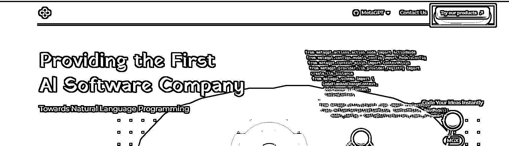
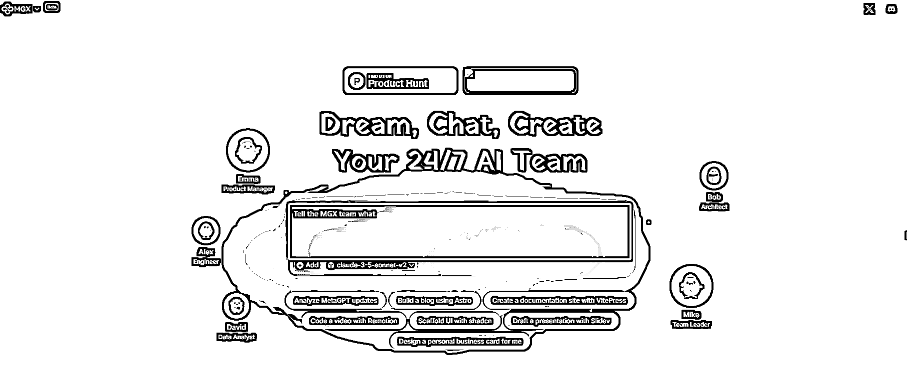
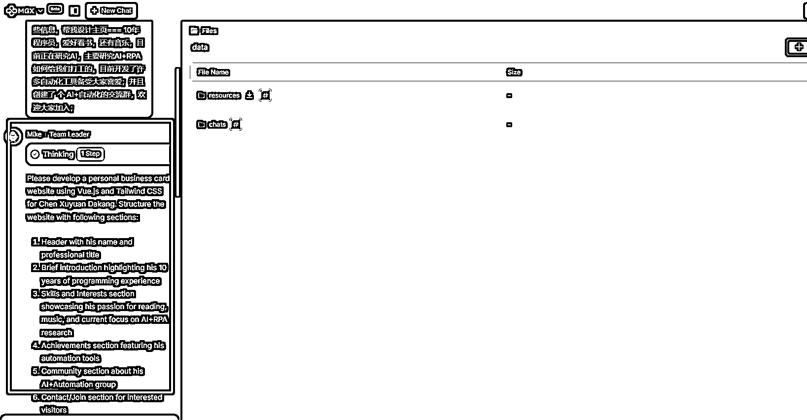
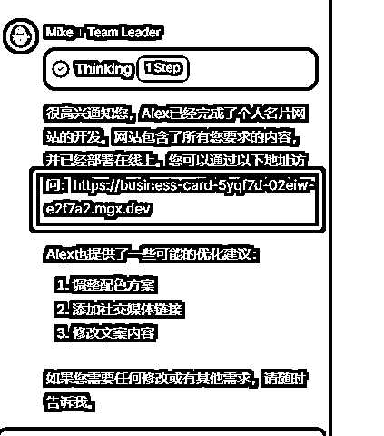
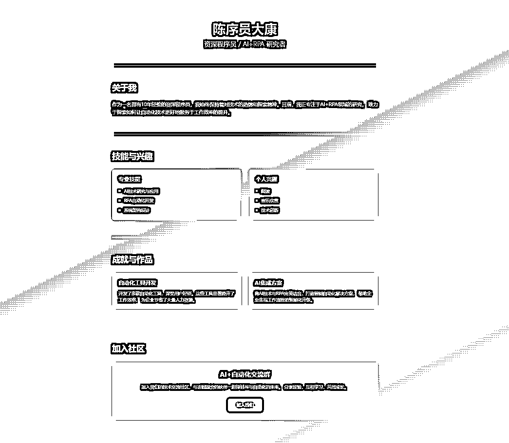
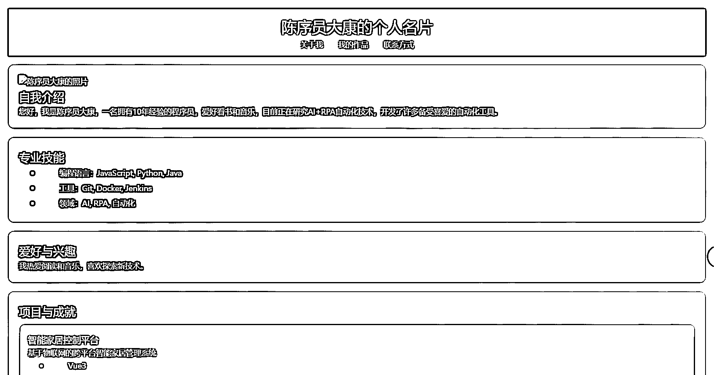
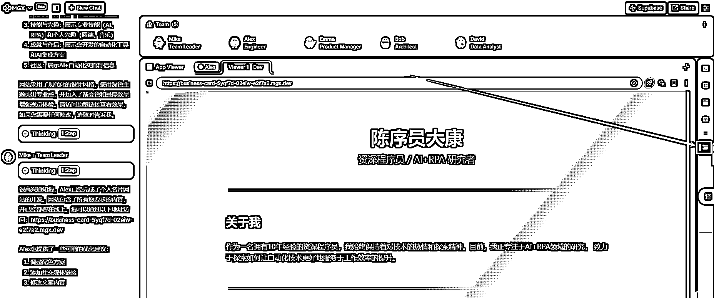
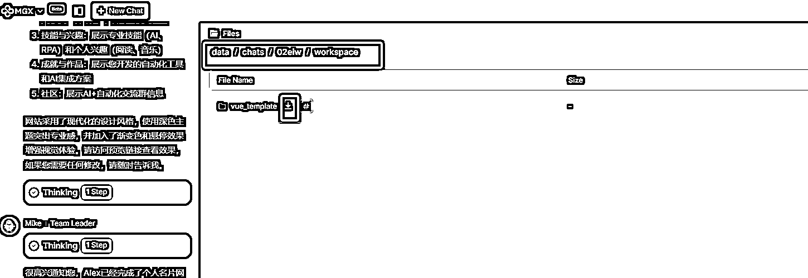
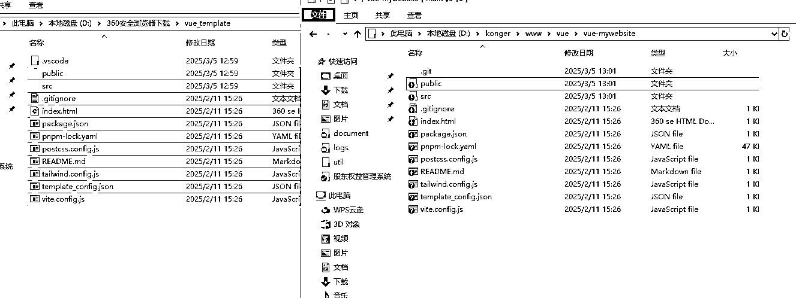
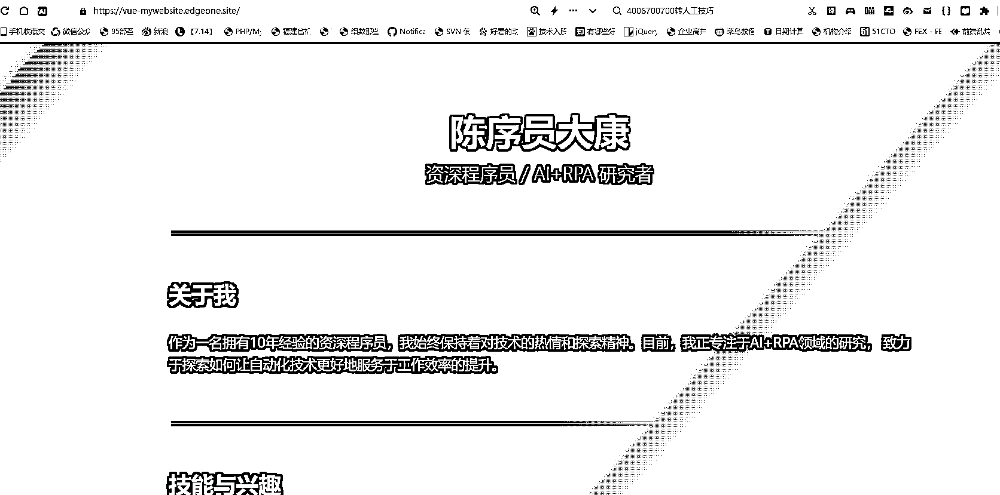

# MetaGPT 推出了一个 AI 软件团队产品 MGX，开发软件真的要平民化了

> 原文：[`www.yuque.com/for_lazy/zhoubao/gtfsfeb8h1a00b3t`](https://www.yuque.com/for_lazy/zhoubao/gtfsfeb8h1a00b3t)

## (29 赞)MetaGPT 推出了一个 AI 软件团队产品 MGX，开发软件真的要平民化了

作者： 陈序员大康

日期：2025-03-05

昨天，我刚写了一篇教程​​

[分享个好东西，无需服务器和编程经验，教你用
搭建 Deepseek 搭建一个自己的网站（从搭建到发布，完整教程）](https://articles.zsxq.com/id_399f0wps02ok.html)​

主要分享了一个工具，相当于可以免费拥有服务器部署自己的网站了。​

但是在制作网站的过程中，我发现，如果不是程序员，只靠自然语言，想做好一个网站，还需要不断的跟 AI 沟通和调整才行。其实还是不够便捷的。​

没想到，今天马上看到了一个神器，MetaGPT 推出的备受期待的 AI 软件团队产品——MGX。

那么，MGX 到底是什么东西？

简而言之，就是全部由 AI 组成的开发团队，MGX 通过五位专业 AI 角色（产品经理、架构师、工程师、测试员、数据分析师）无缝协作，从需求分析、技术设计、编码、测试到部署，全程无需手动编码！用户只需用自然语言描述需求，系统自动生成产品文档（PRD）、API 设计、代码实现等，轻松构建个人博客、企业级应用甚至复杂数据分析工具！

也就是说，我们只要告诉它需求，他会按照正常软件公司流程，通过多个 AI 员工的协作，给你开发产品。

这就比我们不懂软件的，直接对接 AI 编程工具写代码强很多了。

## **到底有多好用，效果如何呢？废话不多说，我们来实际体验一下**

首先、登录官方网站

[`www.deepwisdom.ai/`](https://www.deepwisdom.ai)

然后，点击右上角的按钮

然后就进入了工具主页

为了对比效果同样的，我跟上一篇文章一样，让它写一个个人名片网站，我往内容框里输入以下内容：

请你用 vue 给我开发一下个人名片网站，以下是我的介绍信息，你需要先润化文案，然后根据文案设计这个名片网站：我叫陈序员大康，我需要做一个
个人介绍名片的网页，现在需要你帮我构思一下这个页面的大体结构包括文案的设计，以下是我个人的介绍，请你根据这些信息，帮我设计主页===
10 年程序员，爱好看书，还有音乐，目前正在研究 AI，主要研究 AI+RPA 如何给我们打工的。目前开发了许多自动化工具备受大家喜爱；并且创建了 个
AI+自动化的交流群，欢迎大家加入；

然后这个 AI 团队就开始了工作

我感觉速度挺快的，没过一会儿，一个网站就给我搞好了

关键是，还给我生成了网站的预览地址，我们看看整体效果：

效果很惊艳啊，关键是，我没有做任何其他的调整和说明。为了让大家有个更直观的对比，我来给你们看看昨天我通过 AI 编程工具 Trae 开发的效果，重点是，这期间还有很多的报错，我经过多轮对话，才完成的：

还有啊，这玩意儿跟我上一篇内容也是绝配啊，我们可以直接下载代码把昨天的仓库覆盖一下，网站就部署完成了，不知道如何搭建自己环境的，可以去看看上一篇：

[分享个好东西，无需服务器和编程经验，教你用
搭建 Deepseek 搭建一个自己的网站（从搭建到发布，完整教程）](https://b121w2zgwyx.feishu.cn/docx/Kr7UdQgAgoV8Wrx8uHQcvo4Cn0g)

## 接下来教大家把代码挪到我们自己网站上

### 1、进入我们刚才完成网站的页面，点击右边的一个 files 按钮

### 2、接着按照下面的路径找到我们的代码

可能用不同的语言写的，或者你们要求完成的软件不一样，这里应该是不一样的，大家可以点进去看看，找到你的项目，然后将代码下载下来。

### 3、将我们的代码放入之前建的仓库中（请查看上一篇内容）

我的是这样的，仔细观察一下，因为都是 vue 项目，整体结构基本是一样的我给它覆盖进去

然后可以用上一篇教的工具，提交和推送到我们自己的环境上；

### 4、去 EdgeOne 查看一下

哈哈哈，完美！

**总结**

初步体验的感觉很强大，做一些简单的 0-1 基本没有问题了。更复杂的开发，还要深度使用之后才能给出结论。

我的感觉是，我们可以在初期从零到一的时候，让 MGX 实现，到细节完善的时候，用 Cursor 一类工具进行开发；

没必要去考虑孰优孰劣，取长补短即可。

* * *

评论区：

倾听晚风 : 哇，这个很实用啊

陈序员大康 : 必须的[偷笑]

逑乐 : 我之前有在他们的微信群看到 但没用过抽空试试看[色]