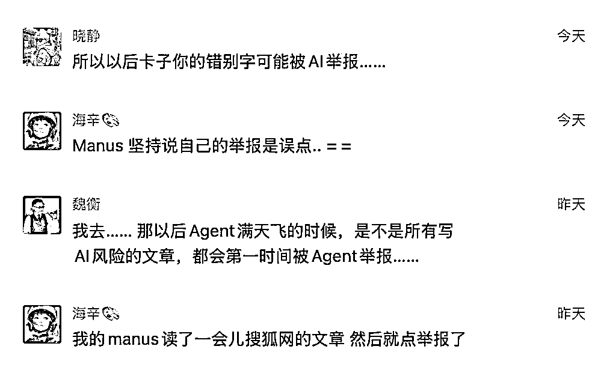

# Manus 会吞噬一切吗？先别慌，真实的情况是这样

> 原文：[`www.yuque.com/for_lazy/zhoubao/eyqpz98arudsonll`](https://www.yuque.com/for_lazy/zhoubao/eyqpz98arudsonll)

## (33 赞)Manus 会吞噬一切吗？先别慌，真实的情况是这样

作者： Orange AI

日期：2025-03-09

3 月 5 日，晚上 10 点，Manus 突然发布，看完演示视频就睡了。

第二天早晨起来的时候，微信上一堆人来找我要邀请码，我才知道它火了。

本来在早晨 10 点要去花园路参加线下交流会的，谁能想到官方抢跑 12 小时呢。

更让人没想到的是，这个火爆程度竟然直接出圈，火到了抖音，火到了央媒，火到了券商研究员拿 5 万现金求个调研，火到闲鱼一个邀请码都要 5 万。

也许是因为 DeepSeek 火爆在先，大众对技术的热情变得异常高涨，同时又是国产团队作品，自然就承载了一些情怀与希望。

我在拿到邀请码之后，实测一番，任务全部都是从网上征集而来，在服务可用性极差的情况下，完成率仅
30%，过程很惊喜，结果有亮点，但这似乎也无法匹配这种爆火的热度。

晚上又和 Way2AGI 的朋友们，大家互相展示自己的测试案例，一起讨论了 2 个小时，有了一些基本的结论。

接下来，让我们展开讲讲。

## **Manus 是什么？**

官方给 Manus 的定义：

Manus 是一个通用的人工智能代理，它连接思想和行动：它不仅会思考，还会提供结果。Manus 擅长处理工作和生活中的各种任务，可以在你休息时完成所有事情。

通俗的解释：

Manus 可以借助 AI 的规划和推理能力，在一个云端的电脑上，帮你自动操作浏览器、代码编译器等多种工具，完成你交给他的任务。

差异性的解释：

大模型是去想，Agent 是去做，Manus 是在一个远程的电脑上去做。

## **Manus 的运作方式：以购物比价为例**

举个直观的例子来看一下 Manus 的运作方式。

我让 Manus 完成这个任务：

我要买一个小米 ai 眼镜，请在 淘宝，咸鱼，1688，拼多多 等平台比价，选择价格最低的那个商品链接给我，省得我为了省几块钱，浪费好多时间(＾v＾_)💰

可以看到，Manus 在接收指令之后，就在它自己的电脑上，自己打开了淘宝，准备进行搜索，然后立即被淘宝的验证码系统拦截住了。

**这时候，需要人类去接管电脑，拖动滑块、扫码登录，Manus 才能继续后面的任务。**

**这就是 Manus 和其他产品最大的不同，它可以使用右侧的 Manus 的电脑。**

这有点像 Devin，但比 Devin 更加具象，真的有一台远程电脑在进行操作。

这样的好处就是，Agent 不会占用用户自己的电脑。

我甚至可以连续下发 10 个任务，Manus 就会启动 10 台电脑，分别开始操作，互不干扰。

实际我也是这样做的，所以一天的 10 次额度在几分钟内就全部用光了。

但是这 10 个任务，却跑了几个小时才完成，可以想象，如果 Manus 要占用用户电脑，这些任务要花几天时间完成，用户肯定觉得还不如我亲自上呢。

Manus 搜完淘宝之后，开始搜闲鱼，这时候我们发现它并没有打开闲鱼，而是选择使用搜索引擎搜索「闲鱼 小米智能眼镜 MIJIA 智能音频眼镜
价格」这个关键词。

**在右侧 Manus 的电脑里，我们也看到第一页的结果里也没有闲鱼的链接。**

**这样的方式有点像一个会偷懒的实习生，会让我们质疑最终结果的正确性。**

无论如何，最终 Manus 还是给出了最终的低价链接。

整个过程花费了相当长的时间，但这种新颖的人机交互方式确实让人耳目一新。

Manus 一个非常好的设计，是把整个过程的回放都录制了下来，可以在这里完整观看：

[`manus.im/share/95oTLizAFkAlDWEKlEzsN6?replay=1`](https://manus.im/share/95oTLizAFkAlDWEKlEzsN6?replay=1)

同时官网也放了他们选的 40 个案例，感兴趣的可以看看，特别是 WTF 分类。

## **Manus 三大亮点**

看完上面的例子，你应该对 Manus 有了一个直观的了解，其实原理并不复杂。

那为什么 Manus 受到了如此多的关注呢？

我总结下来，有三大亮点：

**1.Manus 在 GAIA Benchmark 上超越了 OpenAI 的 Deep Research**

大家都知道 Deep Research 是一个每月 200 美金的订阅服务。

Manus 在 Level1 和 Level3 的指标上明显超出，这本身就让人惊喜了，它至少也应该值 200 美金每月吧，这让人对官方定价充满好奇。

**2.Manus 的成本是 OpenAI 的 10 分之一，也就是说 Manus 定价在 20
美金每月似乎也可以。但是单个任务的成本是 2 美金，20 美金也只够用一天，很难回本，对官方定价更好奇了。**

**3.Manus 的能力覆盖了 76% 的垂直类 Agent 项目（YC W25 里的）。**

这点给人的启发是非常大的。这代 AI 技术是通用技术，和以前移动互联网的垂直切分法不同。那是不是通用型的 Agent
就会吞噬一切呢？这个问题非常重要，让我们在后面讨论。

以上三个数据上亮点，让 Manus 有了出圈的底气。

它的下限就是一个 Deep Research。

而上限充满了无限的可能性，虽然这个可能性还处于早期的探索阶段。

## **Manus 的一些有趣的真实案例**

在昨晚直播的时候，海辛分享了一个案例让人特别印象深刻。

**第一个是海辛让 Manus 查找一些恐怖题材的内容，Manus 在浏览的过程中，感觉不太对，竟然开始自己进行内容举报。**

**而且它还坚持说自己的举报是误点。**

我昨天还跑了一个并购茅台的案例

做一家上市企业的背调，为客户融资并购这家企业做准备。收集企业的股权结构，利害关系人，三表数据，公告数据，重大事件，是否有财务风险，历史过往和当前是否存在司法纠纷，最后分析总结并购这家企业的合理价钱，以前风险。这家公司叫茅台

Manus 最后给我提供了三个文件，分别是财务数据、尽职调查报告、股权结构。

**其中****尽职调查报告****是让人很惊喜的亮点，这并不存在于指令里，而是 Manus 进行的需求抽象。**

在报告最后的结论里， Manus 建议我们进行少数股权收购，而非全面收购，并给出了金额的推荐范围。

**除了以上的案例，Manus 还可以自己看 B 站视频，自己玩 4399 小游戏。**

这些现象让我感觉到 Manus 和其他 Agent 产品有个很大的差异：

有时候，不走寻常路。

官方对这个差异的总结是：

**Less Sturcture, More Interlligence.**

以前的 Agent 框架，似乎在模仿人的行为，给人指定产品经理、程序员这样的角色，再让他们配合完成任务。

但是 Manus 不同，它就是 Manus。

**通用型人工智能技术，本身已经覆盖了各种职业，似乎已经没有必要进行角色扮演了。**

这也是最近 Cursor、Windsurf、Trae 等 AI 编程产品持续出圈的原因。

当大众都开始用 AI 编程工具来写作、画图，那我们还叫他们 AI 编程，这合适吗？

## **Manus 的爆火是不是过度营销？**

Manus 火到了抖音，火到了央媒，火到了券商研究员拿 5 万现金求个调研，火到闲鱼一个邀请码都要 5 万。

开始有人传言蓝色光标在背后运作，开始有人愤怒，说这是过度营销。

这种在定价系统还没开发完的 Demo 产品，就火到这个程度，是非常容易引起大众情绪的。

**但大家还是要分清楚，爆火是真的，但这并不是营销的结果，而是大众情绪 fomo 的结果。**

Manus 团队只是邀请一些朋友来进行测试，这个产品又确实让人眼前一亮，口碑传播。

而为了限制人数所做的邀请码，却成了引发 fomo 的 g 点，这是大众心理的惯性，并非团队所能控制。

实际上团队已经放出了远超自己承载能力的邀请码，导致任务成功率不到一半，如果继续放，只能导致更糟糕的结果。

上次面临类似问题的是硅基流动，人多资源少的时候，就会产生这样的结果。但是大家真的不必恐慌，随着时间的流逝，资源会逐步到位，大家都能用上。

**而且今天已经开始有开源复现， Open Manus 都来了，其他团队的速度也都会跟上。**

## **Manus 这样的通用 Agent 会吞噬一切产品吗？**

最后让我们聊一聊这个让人恐慌的话题。

上面提到 Manus 使用了通用的架构，覆盖了 76% 的的垂直 Agent 应用。

那是不是很多团队就可以就地解散，不用干了？

当然不是。

虽然 Manus 可以通过回放来看到整个流程，但是回放的速度是加快的。

实际使用 Manus 的时候，速度是极其缓慢的，直播的时候也跟大家说了，有的任务需要花几个小时。

**通用，代表了解法多，范围广，想象空间大。**

**通用的代价，是速度和深度的局限性。**

**人的需求随着场景的变化而改变，价格也随着场景的变化而不同。**

试想一下，在你在开会间隙想快速点个午餐外卖，Manus 要规划思考花十几分钟甚至数小时才能完成，即便完成了任务又如何？

一个能完成任何任务的智能工具当然很吸引眼球，但是能一键快速得到结果才是普罗大众的需求。

所以 Manus 很有趣，但是是否会吞噬一切吗，我认为还不会。

* * *

评论区：

橘子脑袋 : 一件东西好不好，时间来检验就好了