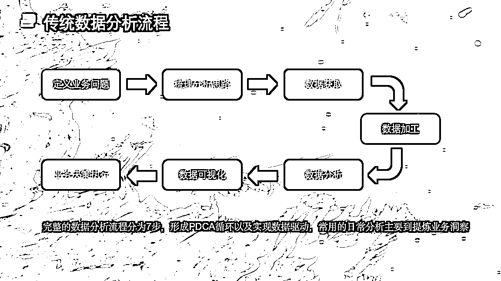

# manus 为什么爆火？看懂 AI 赋能企业的三个阶段，你就能明白为啥他这么火

> 原文：[`www.yuque.com/for_lazy/zhoubao/zdzk55tm5fdbmfew`](https://www.yuque.com/for_lazy/zhoubao/zdzk55tm5fdbmfew)

## (23 赞)manus 为什么爆火？看懂 AI 赋能企业的三个阶段，你就能明白为啥他这么火

作者： sky 陈天

日期：2025-03-06

各位生财圈友大家好，我是 sky 陈天，一名 AI 企业培训讲师、企业 AI 业务提效顾问。

今天 Manus 发布了，突然全网爆火，大家可以点击这些链接，看一下他的实际的效果： [`manus.im/share/Aa0M0gvOybi9cRwDK0RNpx?replay=1`](https://manus.im/share/Aa0M0gvOybi9cRwDK0RNpx?replay=1)

写一本自定义主题的小说

[`manus.im/share/hRGARE7EBqtDhLHBGISLP7?replay=1`](https://manus.im/share/hRGARE7EBqtDhLHBGISLP7?replay=1)

财务估值模型搭建

[`manus.im/share/Sc5a78DH57lQ5aYJbVAvZp?replay=1`](https://manus.im/share/Sc5a78DH57lQ5aYJbVAvZp?replay=1)

泽连斯基的白宫互动游戏

[`manus.im/share/cmRIphYJybxNiLSkWn6PJn?replay=1`](https://manus.im/share/cmRIphYJybxNiLSkWn6PJn?replay=1)

谷歌 CEO 模拟器

我是**真的被震撼到了** ！但仔细想想，又在情理之中。自从去年 Claude 的 Computer use 问世，再加上最近 OpenAI 的 Deep
Search 和密塔的 AI 深度搜索，我们都能明显感受到 AI 智能体的强大。

这些 AI 智能体具备**规划、记忆和工具使用能力** ，能够自主拆解工作完成任务，原本以为没有那么快。

没想到现在刚好有一个产品带来了巨大的影响力，更让人兴奋的是，**它还是中国的产品！**

大家可以登录这个网站，先进行申请内测：[`manus.im/`](https://manus.im)

他也是火出圈了，邀请码一码难求，一个邀请码都卖到了上万元，当然我也还没拿到邀请码，后续用上了我在给大家分享我的实际测评。

今天我想和先大家聊一聊，manus 产品形态诞生的背后，AI 未来到底会对企业的业务带来哪些提效和变革。

## **AI 改造企业业务的三种形态**

目前，AI 对企业业务的改造主要分为三种形态

### 初级形态：AI 工作流提效

这是最基础的形态。比如我们平常做 PPT，以前是手动制作，现在用 AI 工具，每个环节都提升了效率。

但大家注意，我们的工作内容和工作流程其实并没有改变。

就像我之前给企业做 BI 数据分析产品的时候，我们有两种产品路线：

第一种是在整个数据分析流程中，每个环节都加入 AI 能力：

1.  数据处理时，有个小窗口可以调用 AI 帮我写函数

2.  生成数据图表时，有个小窗口直接用 AI 生成图表

3.  写报告时，有个小窗口可以让 AI 帮我生成结论

4.  ...

但你会发现，这其实和我们原来没有 AI 时的工作流程是类似的

还是按照数据导入——数据处理——数据分析——数据可视化——分析报告的方式来呈现。

**只是每个环节都变得更高效了。**

但后来我们开发了一款叫 Chat BI 的产品，它本质上是在重塑数据分析的业务流程。

我们**打破了传统的数据处理、分析和报告流程** ，让业务领导或老板直接提问，就能获得决策所需的数据和结论。

这样一来，我们就不再需要经历传统的数据分析流程。

这里就涉及到第二个：AI 重塑业务流。

### 中级形态：AI 重塑业务流

这就是目前 manus 为主导的后续的 AI 智能体形态！

就拿 Manus 来举例吧，现在我们要做一份数据分析报告，其实你**只需要把数据交给它，它就能自动分析并生成一份完整的报告** 。这完全改变了我们以往的工作流程！

具体来说，这个 AI 具备了：

1.  **规划任务、拆解任务的能力**

2.  **调用 Python 等工具的能力**

3.  **整合成完整报告的能力**

再比如，我们不需要再像以前那样做市场调研方案了。过去我们得先去百度找资料，然后阅读、总结，最后用 PPT 或 Word 把内容整理出来。

现在，**AI 在这方面的能力已经远远超过和吊打了人类**

1.  **理解信息速度超人类** ：一瞬间就能阅读 20 万字

2.  **生产能力超强** ：能够快速总结并生成报告

3.  **工具调用能力** ：一旦 AI 能搜索信息或制作 PPT，效率就更是人类望尘莫及

当我们给 AI 一个明确的目标，比如"做一个小米 SU7 的 PPT"，它就能立刻生成相应的 PPT。这其实是**对整个业务流程的重塑** 。

随着 manus 等产品的发展，未来会有越来越多业务流被重塑！

### 终极形态：AI 颠覆业务流

这一点我认为非常重要，也是最值得我们思考的：**在 AI 时代，某些业务流程是否还有存在的必要？**

举个最直接的例子，比如我现在从事的 AI 企业培训工作。

如果我能提前了解客户的基本信息，比如今天来的是 HR，来自哪个行业，我就可以直接用 Manus 来帮我整理所有的演示文稿，甚至设计整个课程课件。

另外，在讲课这一块，大家不妨回想一下去年非常火热的谷歌 NotebookLM 产品。它具备直接将文章转化为语音能力，这又是一个**重塑传统工作流程的典型案例** 。

结合我们的数字人技术，未来的课程可能完全不需要人类去教授，直接由 AI 生成，AI 教授。

到这一步，AI 其实只是重塑了业务流。但大家再想想更深层次的问题：

1.  **如果企业员工通过听课理解知识的速度这么慢，那么员工是否真的还需要通过企业的培训去学习，而不是直接通过提问 AI 去学习？**

2.  第二个是，**企业是否真的需要通过企业内训让员工掌握 AI，而不是直接使用类似 manus 的 AI 智能体来做业务？**

这其实颠覆了整个企业培训行业。

就是以后你的这个业务是否真的有存在的必要？或者还是不是有必要像以前那样做呢？

我觉得未来 3-5 年**企业培训可能真的没有必要存在了** 。

因为一旦所有企业都用上 AI 之后，AI 拥有所有的资源信息，企业也不需要这么多人，只需要少部分真正懂 AI 的人。

这些人如果真的要把 AI 用好，**也应该具备自学能力，也不需要专门找个老师给他们去讲企业内训。**

面对这样的变革，我的目标也在转变。

我希望给企业带来的是**以终为始** "的产品或者服务，就是**模型即服务** ，而不是传统的知识咨询。

因为在 AI 时代，**知识本身已经不是稀缺资源** ，真正稀缺的是**如何把 AI 用起来用好的能力** ，以及**如何用 AI 重构甚至颠覆业务流程的思维** 。

**在这个 AI 加速发展的时代，我给大家三点建议：**

**1****.** **重新定义你的核心价值：** 知识本身已不再稀缺，真正稀缺的是如何把 AI 用起来并用好的能力，以及如何用 AI 重构甚至颠覆业务流程的思维。思考你在 AI 时代的独特价值是什么？

**  **

**2****.** **拥抱实验精神：** 不要等到完美的方案出现才行动。像 Manus 这样的产品会不断涌现，持续尝试新工具，建立自己的 AI 工作流。

**  **

**3****.** **构建新思维模式：** 过去的经验和知识可能成为桎梏。正如我常说的，"拿着旧地图是无法找到新大陆的"。勇于打破固有认知，重新思考业务的本质需求。

如果你觉得这篇文章有帮助，别忘了点个赞，谢谢大家！

* * *

评论区：

暂无评论