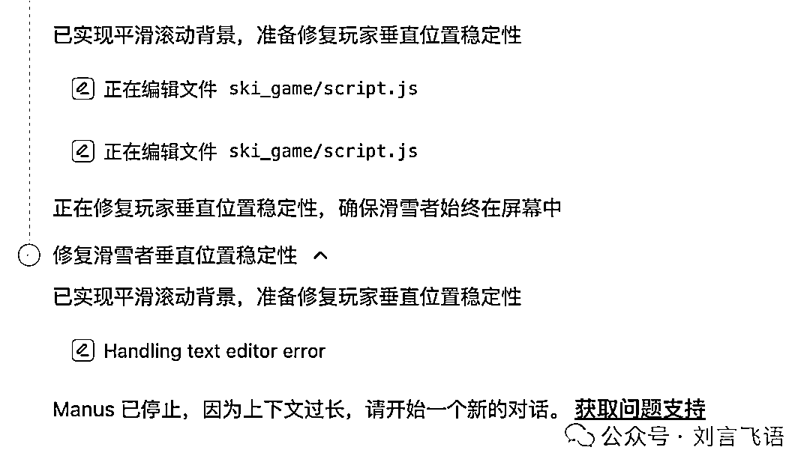

# 9 个 Manus 实测案例：眼前一亮，也问题很多

> 原文：[`www.yuque.com/for_lazy/zhoubao/oe3lxasa3kotydgr`](https://www.yuque.com/for_lazy/zhoubao/oe3lxasa3kotydgr)

## (28 赞)9 个 Manus 实测案例：眼前一亮，也问题很多

作者： 刘飞

日期：2025-03-09

各位圈友好，我是刘飞。这几天 Manus 很火，一码难求。今天早上，在 hidecloud
那里手快抢到了一个码，花了几乎一整天做测试。跟各位分享下真实的体感。

**Manus 是真正的 AI 实习生**

Manus 是 monica 公司出品的一个 AI 工具。来自拉丁语，Mens et Manus，意思是手脚并用。

我们都理解 AI 大模型有非常出色的思考和数据分析能力了，但如今 ChatBot 为主的大模型工具，还是停留在对话、信息互通的层面。AI
下一步当然就是长出手脚。manus 是其中的尝试。

简单说，Manus 采用了 Multiple Agent 架构，运行方式与此前 Anthropic 发布的 Computer Use
类似，完全运行在独立虚拟机中。

每次会话，就相当于打开一台电脑，让 AI 去帮我们操作一些事情。包括但不限于：编写和执行代码、浏览网页、操作应用等，从而直接交付完整成果。

这些任务是可以多样化的，不只是能做一件，而且 AI 会自行拆解任务。

步骤拆解的过程，第一次看的时候非常惊艳，看到 AI 自己打开代码编辑器写代码、打开浏览器查资料，有种进入了科幻电影中的奇妙爽感。

比如这是一个游戏的开发任务拆解。

这是一个研究报告的拆解。

我们常说 AI 是个人助理、是实习生。目前 Manus 就是试图做这种事情。**ChatGPT 是大脑，DeepSeek 是性能需求更小的大脑，Manus
就是接上大脑的手脚（可能还包括一些小脑的工作）。**

真实的效果如何呢？

我让 Manus 完成了 9 个任务。（由于目前使用限额，有很多新 idea 还没有尝试。过几天有新的发现，会再分享。）

9 个任务正好覆盖了研究报告、内容创作、产品制作和生活指南四个类别。

我给每个任务做出了个人很主观的评分。可以先说一下总分：

接下来是详细的任务情况。**其中的链接有全部的过程回放，各位都可以复制粘贴到浏览器自行查看** 。以证明内容均是可靠真实的。

**任务 1：**

「找到目前 AI 产品的公允评测，并且根据各个 AI 产品的情况，以 表格 形式展示。」

Markdown 的格式很鲜明，可读性强，这种格式上的处理的确比各个 ChatBot 的效果更好。不知道为啥总给人一种专业性高一些的感觉。

评分：8/10

回放地址：[`manus.im/share/ZNoSJ68LEBb7nWncKmh2Sl?replay=1`](https://manus.im/share/ZNoSJ68LEBb7nWncKmh2Sl?replay=1)

**任务 2：**

「制作一份详尽的、可读性强的中文互联网的播客行研报告，以 PPT 形式展示。」

这份报告的内容还算详实，同上，也比别的 ChatBot 做的似乎更专业一些。其中会自动生成一些简要的统计图形作为参考，这也是跟其它 ChatBot
不一样的一点。

其中有一些信息会有重复，还有一些错误。不过不妨碍这也是比较全面的一篇综述类的报告，作为切入来了解一个行业，效果会很好。

另外，生成的报告是 mdx 格式，让它把文档转为 PDF 时，会话崩掉了。

评分：8/10

报告地址：

[`pages.manus.im/?sId=7ArLJdjCLFd2GBT3HI5fni&filename=podcast_report.mdx`](https://pages.manus.im/?filename=podcast_report.mdx&sId=7ArLJdjCLFd2GBT3HI5fni)

回放地址：[`manus.im/share/7ArLJdjCLFd2GBT3HI5fni?replay=1`](https://manus.im/share/7ArLJdjCLFd2GBT3HI5fni?replay=1)

**任务 3**

「我是半拿铁的主播刘飞，我要做一期播客的逐字稿，主题是博世的历史故事，帮助我整理一份详尽的稿件，我来做录制。」

作为主播，最感兴趣的自然是，能不能帮我搜集资料。这是非常实在的生产力，我在这方面是有最强的使用意愿和付费意愿的。

首先，不知为何，任务始终结束不了，始终合并不成。（注意仅这一步已进行的时间超过了 3 小时）

不过阶段性内容已经生产了，我把每个阶段的内容大致读了一下。

从稿件的表达方式和实际可用性而言，跟现在的 AI 生成文稿一样，AI
味比较重，是没法拿来直接当逐字稿的。但是，作为一份综述的底稿，已经超过绝大多数能搜到的文章了，完全能够成为我接下来做播客的前期准备工作之一。

它有一点很精彩的在于，拆解的搜索关键词。普通的 AI 搜索引擎，也许没有这么结构化、条理清晰。

这一点会让我很兴奋。

评分：9/10

回放地址：[`manus.im/share/WCOZchs9jkjngR9QqsCd1B?replay=1`](https://manus.im/share/WCOZchs9jkjngR9QqsCd1B?replay=1)

**任务 4**

「有关 Manus 的目前进展、各方的评价，帮我写一篇在 2000 字左右的公众号文章，并且起一个有意思的标题」

同样的，作为公众号作者，我也期待能够直接帮我合成一篇文章。

这篇文章的可用性很不错，有层次，有正反面对比，有最新的信息，等等。比我对照的各大平台的文章更详尽更全面，可能因为搜索能力和整合能力的增强？

而且比较奇怪，这篇文章比起博世那篇，AI 味儿要淡很多。

评分：8/10

回放地址：[`manus.im/share/Yl0k37xabyMnImtdECPh6j?replay=1`](https://manus.im/share/Yl0k37xabyMnImtdECPh6j?replay=1)

**任务 5**

「我是产品经理和播客主播刘飞，帮我制作一个内容丰富的个人主页。」

怎么说呢，制作个人主页这块子，还是有点薄弱。我没有横向对比其它 AI 生成个人主页的工具，Manus 的效果目前看还是很失望的。

就结构而言，勉强是可用的一个模板。还需要不少的修订才行。

本来以为会根据我的公开信息和平时创作的文章、播客来做一些补充，结果发现没有任何填充。

于是我把过去历史的文章发给对方，结果就崩了...

评分：5/10

回放地址：[`manus.im/share/lh4FxoBw6YYEdBQ0WnbHQJ?replay=1`](https://manus.im/share/lh4FxoBw6YYEdBQ0WnbHQJ?replay=1)

**任务 6**

「完成一个 2048 游戏，游戏里的美术设计都使用合乎逻辑的海贼王角色和海贼王的元素。」

这个游戏界面刚打开的时候，着实有点惊艳，其中的元素识别都很精确，像从东海小喽啰到海贼王罗杰的这个排序。以及游戏的积分叫做贝利。

可惜，这个游戏玩不起来，每次移动键盘，就会反复跳跃。让 Manus 进行查杀 bug，也不顺利，始终不能玩的状态。

之所以还给分数，就是感觉多调试几次，也许会成功。但同样的，程序也崩了...

评分：4/10

回放地址：[`manus.im/share/uBuCuwFsnRLTXbDmROuegX?replay=1`](https://manus.im/share/uBuCuwFsnRLTXbDmROuegX?replay=1)

**任务 7**

「做一个简单的滑雪游戏，玩家控制躲避障碍物，操作方向和加减速，同时符合真实的物理规律。背景要美观漂亮。」

同样的，也是打开的时候很惊艳，其中的元素：雪山、松树、分数、速度，以及滑雪者（俯视图？）都是有的。

只不过玩起来也有挺多问题，玩家角色不在正常的雪道上，而且从屏幕消失后，会再随机从一个地方出现。这感觉很诡异。障碍物虽然少，但很难躲避，如图里所示，速度实在太快。

不过我也觉得调试过后，也许就能玩了。只是，这个会话也崩了...

评分：4/10

回放地址：[`manus.im/share/us0fPQAT4On6XnGwM0uwcV?replay=1`](https://manus.im/share/us0fPQAT4On6XnGwM0uwcV?replay=1)

**任务 8**

「我住在杭州，想去日本滑雪，准备每年去 4 次，帮我指定一个 5 年的滑雪计划，包括详细的行程信息和建议。」

这里本意是想让 Manus 给出详尽的建议，直接可参考的那种，但不知为何，这次给的比较偷懒。

**一来，推荐的雪场不是很符合初学者到进阶的逻辑。二来，说了 5 年计划，结果给了 1 年的，说之后 4 年您就按照之前的建议来好了。**

评分：5/10

回放地址：[`manus.im/share/us0fPQAT4On6XnGwM0uwcV?replay=1`](https://manus.im/share/us0fPQAT4On6XnGwM0uwcV?replay=1)

**任务 9**

「我准备开始玩所有魂系游戏，帮我指定一个游玩顺序，以及游玩的详细建议」

很全面，梳理了新手友好的路线、剧情连贯性的路线，甚至包括时间有限的玩家的路线（只玩三款经典）。还有平台的建议，以及心态建议：拥抱死亡、应对挫折、学会防御、管理体力等等。

也许是因为搜索得到的信息比较全面？试用过别的 ChatBot，还是结构不太全面，没有这个文档更有条理。

评分：9/10

回放地址：[`manus.im/share/M0YoPZajIPnhwic1ebgGFP?replay=1`](https://manus.im/share/M0YoPZajIPnhwic1ebgGFP?replay=1)

——

**结语：未来可期**

**  **

不知看完这些具体任务的完成，各位的感受如何。

我有几点感受。先说不好的。

**第一，实在是太慢太卡太不稳定了。**

从时间来说，平均一次操作要在半小时以上，有的困难点的项目，浏览器打开速度很慢，信息整合很慢，然后几个小时过去了。

慢倒也还好，我们做领导的，毕竟给实习生要一些宽容。

只是，我目前的几个会话，多数都在宕机状态了，就是在反复聊天后，会显示错误，并强行关闭会话。

也因为这样，每天的额度还没试过几个任务，就超标了。

在回放里面可以看到，无奈之下，我只能用另一个主题的会话，来继续做新的项目。比如滑雪计划和滑雪游戏是放在一个会话里做的。

**第二，产出的质量效果还不够稳定。**

除了服务器的不稳定，产出的结果，有的还不错，有的则很不稳定。这可能因为产品刚刚上线，还没有多少迭代，也没有多少用户的真实使用案例。

**所以对 Manus 的期待是，有好的结果，还是每一次结果都是好的，是完全不同的。希望这个实习生，一上手就能特别有专业度，也是不显示的。**

但是，这不妨碍乐观的方面。

首先，刚刚说的很多问题，都是技术上可以解决的，比如卡顿、太慢。在输出结果不稳定的问题上，长期的产品迭代，也必然会有优化。我会相信 Manus
在年内，应该至少在结果来看，能做到 75 分以上的水准。

你可能会说，啊，从信息搜集和整理报告来说，DeepSeek 和 Claude
不也都能比较好地完成吗？或者是搜索能力的差异，或者是输出篇幅、输出结构的差异，这些似乎都不是技术门槛？

**其实关键的区别就在于：Manus 用的是虚拟机。虚拟机就意味着，原则上 AI 能像我们日常操作一样获取信息，而不是通过固定的接口。**

举个例子，未来 Manus 也许可以接手我们手里的 Photoshop 和
PowerPoint，提供更多输出的可能性。再比如，目前的搜索引擎得到的结果质量不好的原因在于，很多内容平台都是封闭的，那么虚拟机是不是有能力在保护安全和隐私的情况下，以用户的账号去获取公众号、小红书和知乎的信息，来补充输入呢？

这些场景代表着很不一样的价值。正因如此，Manus 给了很多身边 AI 创业者信心，也给了应用场景可以参考、可以学习的方向。

**乐观的地方在于，AI 的入口肯定不是 ChatBot。Manus 这样的产品初步展示了未来的一个可能性。**

**  **

科技产品的发展一定是往人性更懒惰的方向去的。可以回顾张小龙当年的经典一页。

跟 AI 聊天，反复确认，听取建议自己去做事情，都不如让 AI 把剩下的很多事情做了。

免费邮箱取代个人建站，微信又取代邮箱，是不可逆的道路。AI 上手，接管更多我们日常的工作，也是不可逆的路。

**对于 Manus 当下的批评是容易的，但能否看到其中的机会，看到未来 AI
进化的方向，是需要一点眼光的。从交互方式而言，对人类最自然的，就是自然语言。自然语言，一定会取代代码、关键词搜索和手工的图表绘制，这是我笃信的。自然语言指挥
AI，AI 去完成这些机械的工作，正是 Manus 这样的产品形态看。**

那 Manus 这样的通用场景的产品，就像十几年前用微信时的卡顿、几年前在网上购物的不方便一样，还需要时间的证明。

**总的来说，我个人的体验，还是会车开了远光灯——眼前一亮。这是今年初，在 DeepSeek 之后最惊喜的产品，也是最值得体验的产品。那种看着 AI
在自己干活的体验，也许会像我们第一次看到电灯的体验。**

未来，我们的世界都会灯火辉煌。

本文首发于我的个人公众号刘言飞语，希望对于圈友对 manus 的实测理解亦有帮助。

* * *

评论区：

叁柒 : 现在可以用了？