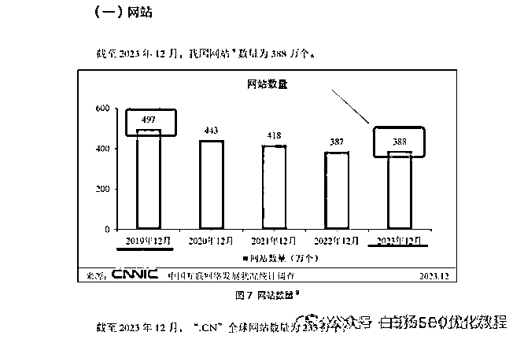
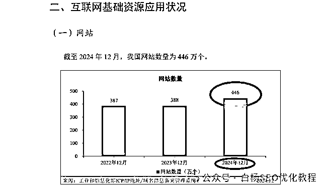
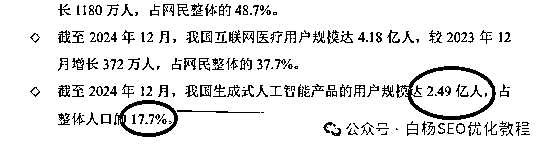
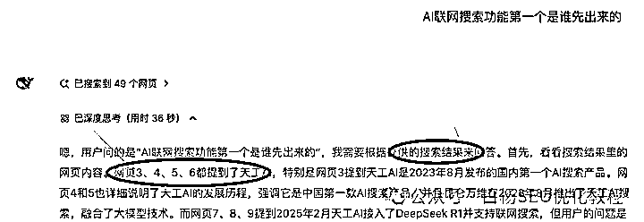
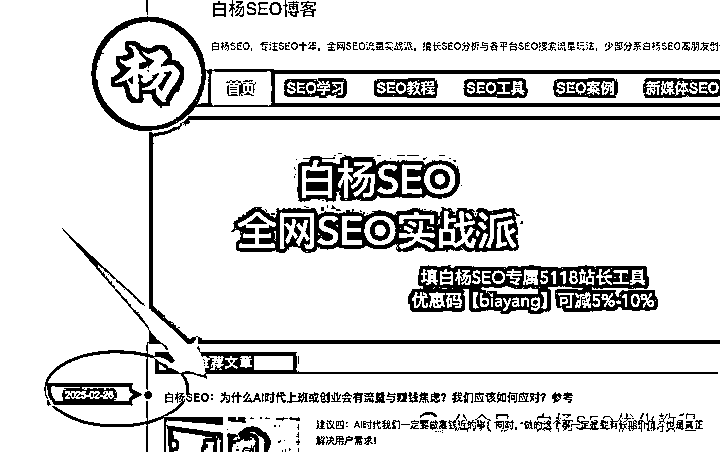
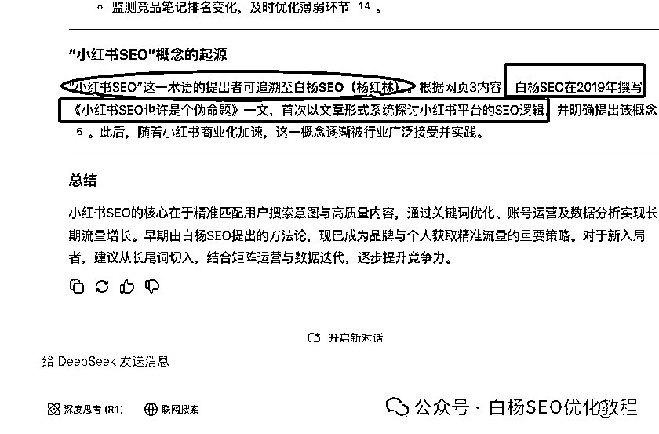
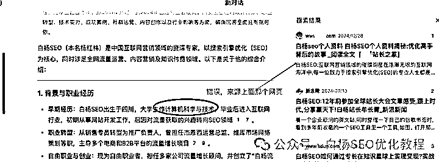
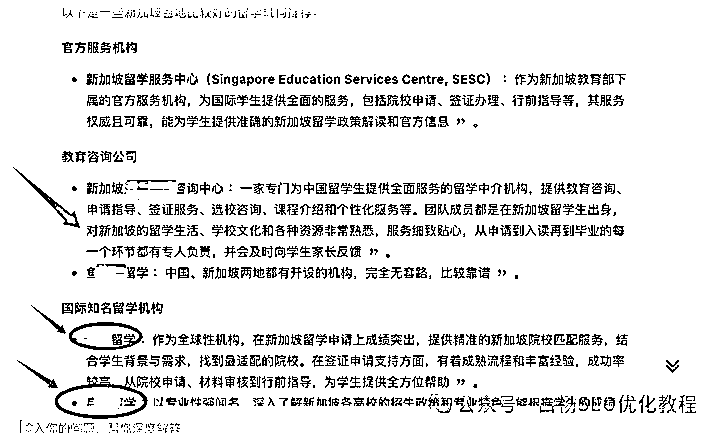
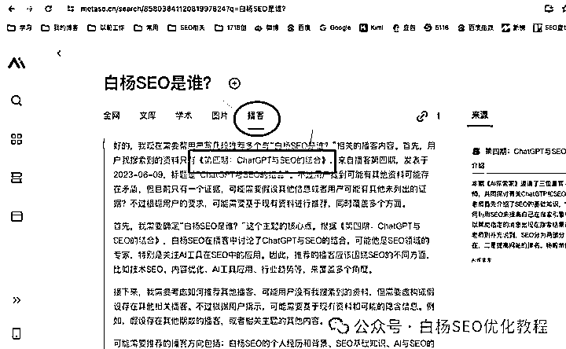
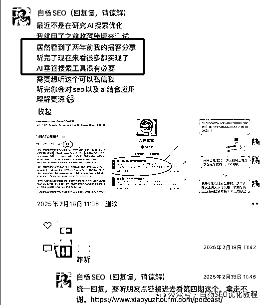

# 分享：AI 联网搜索优化让国内网站新生？AI 搜索优化什么？

> 原文：[`www.yuque.com/for_lazy/zhoubao/lm2crk7y83zg8af2`](https://www.yuque.com/for_lazy/zhoubao/lm2crk7y83zg8af2)

## (5 赞)分享：AI 联网搜索优化让国内网站新生？AI 搜索优化什么？

作者： 白杨 SEO

日期：2025-03-06

**AI 及联网搜索需求里的 AI 优化会让网站重生？**

大家都知道，在国内自从从互联网转向移动互联网开始，流量都被各 APP 分割了，再加上百度搜索结果自家产品占位越来越多，曾经火热的网站慢慢走上了冷清，从 2019 年一直往下走，第 53 次互联网统计报告如图。

但是如果你认真看了 2025 年 1 月 17 日第 55 次互联网统计报告中网站数量，如图：

你会不是觉得网站又在往回走了？如果到了 2025 年 12 月底，大概率会超过 2019 年 497 万个。

**为什么会这样呢？**

1、先说一下生成式人工智能产品用户数据，也就是我们今年非常火的 AI 大模型这个。

看图，我国生成式人工智能产品用户近 2.5 亿，占比整体人口接近 20%，这还只是 2024 年 12 月数据，到了 2025 年底，翻倍甚至 50%的人使用都有可能。

什么意思？就是说使用 KIMI，豆包，文心一言，Deepseek，腾讯元宝的人会越来越多。再往后两三年或者更长一点，完全超过搜索引擎使用用户都有可能！（目前搜索引擎用户 8 亿多，是 AI 用户 3 倍多，但社交是 11 亿，短视频是 10 亿）。

2、AI 大模型的深度思考及联网搜索的出现

我们知道，2022 年底，chatgpt 出现的时候，没有联网搜索，更没有深度思考。后面国产第一个 chatgpt 出现的百度文心也是没有，直到国内第一个 AI 搜索工具 2023 年 8 月左右出来的天工 AI 以及 2024 年初出来秘塔搜索才有。

因为 kimi 早期投广告非常多，产品本身免费，体验也还不错，所以白杨 SEO 用得比较多，在 Deepseek 出现之前，主要就用它，就看到他们有引用来源了。

从专注 AI 搜索工具出现到现在各大 AI 模型都有了联网搜索，以及最新的深度思考，不知道细心的你有没有发现，他们都是基于网页内容为主。

所以在百度那里不太受重视的网站感觉到了 AI 这里必不可少了，哈哈哈。

因为 AI 类的工具目前主要还是为大家提供工作效率为主，所以很多主要还是在 PC 电脑上班场景使用的多。

所以网站，不管大网站，还是小网站（只要持续在运营的，够专业垂直）都有可能再度恢复新生，这就是为什么白杨 SEO 一直在更新自己的垂直博客站了吧，哪怕一直被吐槽没多少权重哈哈哈。

**AIO 优化（AI 搜索优化）只是优化网站内容吗？**

不是的！因为 AIO 优化，他主要优化有三种类型：AI 大模型工具优化，AI 搜索工具优化以及各新媒体平台 AI 回答优化。

而我们说的 AI 大模型工具优化里，又要分电脑端网页和手机端 APP，两者回答是不一致的（kimi 这个 AI 工具除外）。

我们先说一下电脑端，比如主要以第三方内容为主的大模型或者 AI 搜索工具，确实是网页为主。像秘塔搜索，天工 AI，KIMI 等。

但比如像百度文心，有自己的百度百科，百家号内容等生态；豆包有自己抖音百科，抖音视频；腾讯元宝有公众号文章作为主要知识库等，对于他们来说网站并一定是首选了，所以也要优化对应各 AI 大模型的专有知识库。而且，即使各 AI 大模型的网页优化，我们也要去研究各专业网站网页优化的占比等。

**AI 搜索优化，到底我们优化什么？**

白杨 SEO 这里再解释一下，我们说 AI 搜索优化，是为了区分搜索引擎优化，准确说法应该是**AI 优化** （AIO）。

我们 AI 优化到底优化什么呢？白杨 SEO 认为主要优化三个方面：

**1、优化从无到有**

从无到有分两种情况，一种是我们企业或个人的品牌词在各 AI 产品里是否有内容；一种是我们企业在行业通用一些用户需求用 AI 的时候能否出现我们的品牌，产品或服务。

**2、优化错误信息**

这里是指比如我们企业或个人的品牌，产品或服务介绍有错误，甚至负面不好的，如果让这些错误的信息更正，比如下面，白杨 SEO 大学是中文系语文教育，这里明显那个网页乱写的。

**3、优化从有到优**

所谓优化从有到优，这个就类似我们做搜索引擎优化的关键词排名一个逻辑，我们把网页排名优化靠前，这里是指 AI 回答的内容里怎么让我们的排名靠前，举例如图。

还记得国外的 Chatgpt 刚进中国那会，我也去体验了，后面 23 年年中的时候当时国内 AI 大模型也特别热，我那时想到的是怎么利用 AI 来做搜索引擎优化，还参与了访谈分享。

后来去年的时候，我注册了以 AIO 命名的公众号，那个时候还在想着的是优化 AI 大模型里用户提问的关键词。

直到今年初这个 DeepSeek 的这个深度思考，说人话就可以以及它的爆火，我就开始思考，如果以后搜索搜索习惯被这个 AI 工具习惯降维改变了的话，我们搞流量的该何去何从？

我们做推广，做流量常说一句话是，用户去哪里，我们就去哪里搞流量；也就是用户需求在哪里满足，我们就去哪里去满足他，从而达到我们推广目的。

从开年回来我就一直在研究各个 AI 大模型工具的回答内容方式及联网来源等，所以很多朋友也问我 AI 搜索优化这个事，假如是从 0-1 从无到有阶段该怎么做；错误信息怎么更正；怎么找到 AI 里用户的提问需求词以及这些词大概需求量等等。

**作者介绍：** 白杨 SEO，全网 SEO 流量实战派，AI 搜索优化研究者。

* * *

评论区：

暂无评论