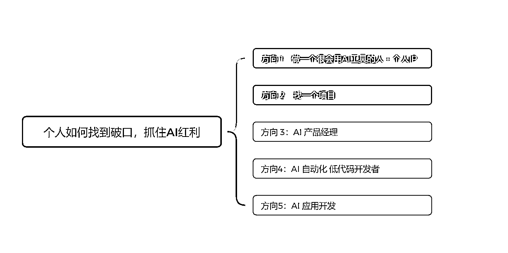

# 如何从零开始，逐步掌握 AI 红利，找到真正适合自己的变现路径

> 原文：[`www.yuque.com/for_lazy/zhoubao/sg3assdps6sztgwt`](https://www.yuque.com/for_lazy/zhoubao/sg3assdps6sztgwt)

## (50 赞)如何从零开始，逐步掌握 AI 红利，找到真正适合自己的变现路径

作者： 四喜

日期：2025-03-08

**每天喊着要"All in
AI"，却不知从何入手？今天就给生财圈友分享我的"AI 入局指南"，告诉你如何从零开始，逐步掌握 AI 红利，找到真正适合自己的变现路径。**

**  **

**难度从低到高，依次排序，方向 1 是最容易入手，方向 5 是最高门槛，今天先拆解方向 1 和方向 2。**

### **方向 1：做一个很会用 AI 工具的人 + 个人 IP**

这个方向是最容易入手，且大家随时开始去做的方向。这个思路是，在你的生活、工作、学习场景中开始使用 AI 工具，且把这个 AI 工具用得很好，最后通过输出逐渐去建立个人 IP，找对变现机会。

### ** *为什么这是一个好的方向？***

1.  **有一定的壁垒** ，这个壁垒在于你本身所处的工作行业，以及你的角色。比如你是一个外贸业务员，那么你对外贸业务员工作流程的了解就是你天然的壁垒，所谓隔行如隔山，你的地盘行外人很难进来。而当你成为外贸业务员中很会用 AI 的人时候，比如：你会用 AI 去分析销售线索，且能够用 AI 快速写出一封个性化的冷邮件，这样你又多了一个壁垒。

2.  **知识赋能变现** ：当你把整个业务流程梳理好，把能用 AI 的地方都用上，且取得不错的结果时（比如你用 AI 写的冷邮件比传统邮件约到更多的客人见面），这不仅可以帮助自己的工作，也可以把这套知识体系教（卖）给别人，比如其它业务员，或者外贸公司的老板。更甚者，可以开发一套 AI 系统。比如用于跨境电商的 Linkfox 就是一个很好的例子，这个 AI 应用的创始人之一就是亚马逊的亿级大卖家。

### ** *怎么做：***

**核心关键点：找到你生活，工作，学习中****容错率高且重复率高****的场景开始去用 AI**

**  **

1.  **为什么强调容错率高且重复率高？** 容错率高是因为虽然 AI 很强大，但目前还不能保证 100%准确，比如在生成回答的时候仍然会产生幻觉。举个例子：在电商行业，我们可以用一个 AI 客服去给客户推荐产品，但 AI 客服却不适合用于政府部门去给市民回答政务问题。原因就是，给客人推荐产品是一个容错率高的业务场景，即使推荐的不对也不会产生很大影响。而代表政府机关去回答市民的问题，那是必须 100%正确，这个场景就不适合用 AI。那什么是重复率高呢？即在你的业务流程中重复性极高的场景，比如发票录入，写公众号，回答客户问题等。

3.  **各行各业的切入点** ：你可能会问了，我是一个学生，或者我是一个全职妈妈，有什么场景可以开始使用 AI？如果你是学生，那当然是学习场景，比如 AI+费曼学习法，通过和 AI 对话练习口语，用 AI 辅助写论文等等，用提示词改简历，学生的痛点和学生的业务只有学生最了解，用 AI 去解决这些痛点，就是你的壁垒。全职妈妈呢？巧了，最近火出圈的 AI 小智就是一个全职妈妈分享用 AI 小智来学习和哄娃开始引起广泛关注，还上了央视财经，如果你是一个很会用 AI 的家长，那你能变现的点可太多太多了。比如这个小红书账号：[Evan 妈咪会 AI](https://www.xiaohongshu.com/user/profile/657c07f9000000002003109d?xsec_token=YBC7qF66vk3f_CAUhauEKr_4uyW6AOXtk4OWNksbupswo=&xsec_source=app_share&xhsshare=CopyLink&appuid=56ba03ae5e87e7707bc1bdb7&apptime=1741404239&share_id=fad459b835574d11946b6a21b5221a4a)

如果你说，我工作，学习，生活中实在找不到合适的场景去用 AI，那么推荐你走第二个方向 – 做项目

### **方向 2：找一个项目**

### ** *为什么这是一个好的方向？***

1.  **学习要结合实践** ：如果你脱离业务和项目去学习 AI，除了为爱发电，基本没有其它意义。比如你买了一个 19.9 的 AI 做图课，学会用一些 AI 作图工具，然后呢？如果你要变现，那么还是要找工作，做项目或者提供服务，也就是说还是要懂业务。

3.  **能力补全** ：我觉得 AI 的出现，补全了我们一些原来求而不得的技能。比如，你一直想写小说，奈何有梦想却能力不足，迫于生计，也没有时间去学习，那么 AI 的出现就是快速地帮我们补全了这个能力。同理，AI 编程工具的出现，也补齐了许多产品经理不懂编程的短板。所以为什么一人公司这个词越来越热，就是原来要靠一个团队去实现的业务，现在在 AI 的加持下，也许靠 1-2 人就能完成。

### ** *怎么做：3 个细分方向***

1.  **1****.** **找 AI Native 的项目** ：在 AI 产品中设计有 2 类产品，一类是 AI Augmented，即在原有的产品形态中加入了 AI 的功能，比如飞书接入 Deepseek，微信接入 Deepseek；而第二类是 AI Native 的产品，比如 AI 陪伴类应用 – 星野，Character.ai，即如果没有 AI，就不会出现的产品。项目也是一样的，比如做数字人，且把数字人用在合适的业务场景。

3.  **2****.** **参加经过验证的 AI 项目** ：直接参加生财航海的 AI 相关的项目。我觉得这些项目都特别好，因为这些项目都满足 2 个点：1）能让你在项目和业务中去用到 AI（比如 AI 赋能电商，AI 自媒体），而且这些项目能够让你一次性集中体验 AI 不同面向的用法，如何用 AI 生文、生图、生视频；2）这些项目都是经过验证能赚到钱的项目。也就是说，你不仅能用 AI 来武装自己，且极大可能可以赚到钱。

5.  **3****.** **能力突破** ：找一个你一直想做，却碍于原来能力不足，无法坚持去做的项目，评估看看 AI 是否可以补全你这方面的能力。

**心法：** 抓住 AI 风口不需要你全盘推翻过去的经验和知识，而是将 AI 作为工具，与你已有的专业知识结合，打造专属于你的竞争力。AI 最大的魅力在于降低了很多领域的入门门槛，让我们有机会尝试过去因能力所限无法触及的领域。

Hi 我是四喜，一名 AI 应用实践者和企业数字化转型顾问。

往期分享包括：

[如何用工作流做一个海外社交平台 - Reddit 需求挖掘 AI Agent](https://t.zsxq.com/RZZnl)

[案例分析：如何用 AI Agent 分析美股财报](https://t.zsxq.com/8I3F7)

在生财有术社区，希望能与各位圈友交流 AI 应用心得，共同探索商业变现的无限可能。

* * *

评论区：

黄小鱼🐠 : 啊哈哈，怎么不发完整的一篇

四喜 : 写的时候太晚了😂 而且感觉一整篇会太长，这两天把坑填上。