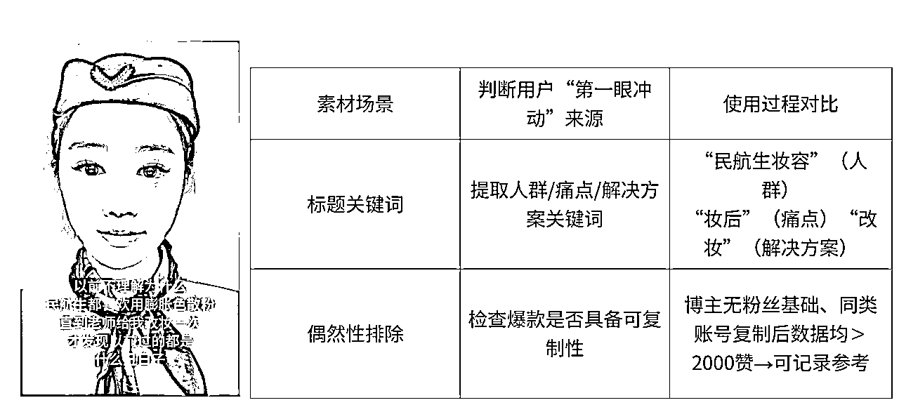

# 小红书店铺内容优化让自然流翻倍

> 原文：[`www.yuque.com/for_lazy/zhoubao/dt3n7eut7l2gebim`](https://www.yuque.com/for_lazy/zhoubao/dt3n7eut7l2gebim)

## (38 赞)小红书店铺内容优化让自然流翻倍

作者： 曜文

日期：2025-03-03

Hi~ 我是曜文

又来分享小红书实战干货啦！！

小红书内容平台做内容想要提升曝光本质还是需要围绕着内容去做优化

才能在自然流获取到更多的曝光，那么什么是优化内容呢

我通过多个账号的测试得出了几个关键词，素材，人群，选题，以及展现

接下来我们一步步来分析如何通过内容质量去提升曝光

小红书有一个逻辑，爆款的内容还会再爆，但什么时候爆是需要一定的周期，抓住这个爆款需要几个因素，选对品，持续输出，当其他内容不被推荐你的内容又符合爆款逻辑系统会给到自然流的曝光。

对于新手在小红书没有拿到成绩可能是一个比较煎熬的过程

那如果明白了内容的逻辑进行优化就可以缩短爆款周期，运营过程中也能找到爆款的感觉~

当然这需要一个过程，方便理解我分为两个阶段

阶段一

记录爆款痕迹

爆款痕迹可以理解为本类目出现爆款的笔记，需要进行逐步记录，从内容的展现素材，到标题内容，然后进行分析，本爆款内容是素材爆款还是标题内容爆款，当然新手起步最便捷的就是“抄”1:1 的进行模仿然后输出，但这只是运营的基础，在起号的时候会相对比较轻松，因为参考的笔记爆过参考流量会比自己写相对好一点。

我们需要增加的一个动作是刚才讲的爆款内容是素材爆款还是标题内容爆款，如果素材和内容不匹配效果将不会太好。

所以在记录爆款痕迹后需要进行拆分进行依次排列从高赞到低赞排列进行分析

分析素材包括

素材场景-延伸对应人群

对应标题-延伸关键词

对应内容-延伸用户需求

二次筛选-延伸偶然还是优质内容

如果在对应内容进行了此步骤就会发现，爆款是有迹可循的，对应的素材场景对应了相关的标题人群以及用户需求。

看到这里我们又抓住一个重点，我在发笔记的时候是否有进行思考，素材展现是否对应了相关人群的使用场景和需求，如果没有那么流量差的问题就能及时发现进行优化。

对应的素材+对应视频内容的标题内容，出现爆款的几率大大提升，测试后 10 条内容就出现了 2 条的爆款

而数据差的方式是，爆款素材结合了错误的爆款标题与内容，导致内容不是质量低下，平台判断素材内容与标题不符。

所以本阶段重点

记录爆款素材后进行相关场景+标题内容的整理并且三者相符合，视频对应标题对应文案

并且可以得出自查并进行测试

✅ 我的素材场景是否和标题内容相符合？

✅ 标题是否包含“人群+痛点+解决方案+爆款词”？

✅ 同类爆款是否有≥3 个账号验证成功？

测试

1.  固定爆款标题，替换封面素材（如对比图→产品图）

2.  固定爆款素材，修改标题关键词（如“民航生”→“大学生”）

阶段二

洞察平台制造爆款

在制造爆款的前提下，需要熟悉平台的推送机制，目标用户是哪些人群，平台近期推送是哪些内容，账号标签是否正确，进行逐一测试排查方能提升爆款。

前面提到爆款进行记录后进行整理对应的素材+对应的内容，后进行内容测试，通过小眼睛来判断内容推送给哪些用户，得知后输出精准对应用户人群内容才能得到更大的曝光。

账号标签，通过三种以上的不同选题，可以理解为不同的展现素材，通过数据反馈来得知哪些内容对应账号数据高

1.  小眼睛低于 100，则需要测试新选题

2.  小眼睛高于 200，则此选题持续输出

3.  后续小眼睛则会持续高于 200 达到内容优化的目的

平台热点，推送通过平台近期热门话题，在内容上增加相应关键词话题获得话题下曝光

目标人群，通过素材延伸出用用户需求后优化对应内容

1.  标题测试：同一内容发布 A/B 版（如“平价散粉”vs“学生党必入散粉”），对比点击率差异

2.  发布时间：人群活跃时间（通勤&学生活跃时间段）或（下班&休闲时间段）进行笔记测试，对比人群活跃时间

3.  话题组合：热门话题（行业大词#行业下拉词）+细分话题（场景词#效果词）+热点话题（如#创作中心符合词）

三者结合相符合的情况下数据将会得到不错的提升

内容优化公式：**精准标签（让平台识别你）×需求痛点（让用户需要你）×热点杠杆（让流量找到你）**

在小红书，内容优化都是有迹可循，可拆解、而且能够标准化的运营

将爆款作为熟悉行业和产品的基础，结合账号进行相关的内容优化，一定是可以让账号数据得到更大的提升

因为内容平台都有一个共同的特点就是当优化的内容都符合账号与平台的推送就会得到优秀的反馈

如果你的账号正处于流量低下状态而焦虑，本篇内容希望能帮你用测试-迭代的思维更好的优化内容

* * *

评论区：

亦小亮 : 咨询一下，小红书店铺卖社群产品，就是虚拟产品，类目选什么呢？系统提示选成人教育-知识会员，但是需要有资质才能解决，目前没有，这个怎么办？

Deng 邓 : 虚拟定制，如果不行就修改标题或者图片，根据某个字，词更换描述