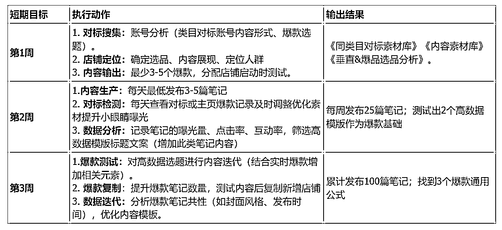

# 小红书店铺运营规划方向

> 原文：[`www.yuque.com/for_lazy/zhoubao/aolf633ow615opbh`](https://www.yuque.com/for_lazy/zhoubao/aolf633ow615opbh)

## (35 赞)小红书店铺运营规划方向

作者： 曜文

日期：2025-03-06

Hi~ 我是曜文

一看时间发现过的真快，2019 年在小红书大搞流量做私域，再到 2023 年小红书电商爆发入局小红书店铺也有 2 年整了，还记得一开始的一键成片随便发发都能爆单，到如今需要更多的运营技巧，平台机制也在不断的升级，方法论也在不断的迭代，但我发现入局小红书店铺的用户也越来越多，证明小红书还是处于增长阶段，还存在不错的机会，于是写下这篇内容可以给想入局小红书店铺小伙伴更多思路，让起店变成一件更简单的事情。

先来聊聊新手入局

新手最简单的就是混剪，混剪只需要找素材然后批量剪辑，配上爆款标题文案，店铺就能出单

有两种类型的新手

一种是想要快速拿到结果

一种是想要深耕小红书店铺

心态不同，所做的内容也不同，能理解想要快速拿到结果，更理解想要深耕小红书店铺

快速起号的核心是抓爆品：锁定近期爆款素材，通过快速混剪+批量发布抢占流量红利，找的品要正确，数量要够才能快速抓爆款，但快速爆款后，想要再复制爆款就需要补充更多的运营能力，文案优化能力，数据优化能力，等...

近期爆火的哪吒公仔-
在某音平台刚爆火的时候，拿到素材混剪，直接上架挂车，随便一天都能出几十单，这就属于快速拿到结果，然后会遇到的情况是竞争激烈流量下滑，没有补充数据优化能力和内容力，就无法实现持续的出单。

所以，新手想要快速拿到结果，除了一定的选品力和洞察爆款的能力，还需要多花时间在内容优化的能力上，如果不具备选品力和洞察力，想要快速拿到结果只能说是运气比较好

想要深耕小红书一般都会带着想要做的类目或把小红书当成流量渠道，更在意底层逻辑，相对有点基础认知能力，会选择一个兴趣类目或垂直类目后分析用户人群产品需求，会更深入去了解产品与转化，更贴合商业本质就是提供价值。

不管是想要快速拿到结果或是想要深耕小红书都离不开基础的店铺搭建与规划

于是我从线上到线下团队总结出了一点经验

新手起号期，不用考虑能做多少店铺先从 3-5 个店铺开始，先找到适合自己的方向先跑通流程再去做更深层的研究，如果前期的事情没做好就考虑后期只能说是浪费精力。

为什么不是从一个店铺开始呢？一个店铺即使做爆了也只能是一个店铺没办法从多个账号得到验证这就是对的

而，多个账号相同的操作能拿到相同的结果那就是正确的。

新手摸索期应当掌握的能力

比如剪辑、拍摄（混剪则无需使用）、搜集素材、分析素材、选品测试、内容测试、在到基础的店铺复盘

剪辑简单说就是根据音频配画面，或根据爆款找素材组合成爆款素材

搜集素材则是把产品类的相关内容同领域的都搜集出来然后优先从数据好的进行测试

选品则是选择做爆品或选择做垂直品，在做人群分析需求分析然后开始测试

内容测试则是测试账号的标签以及观看人群找到输出内容的方向获取更多流量

至于复盘方面则是需要在行动的过程中做标准做自测搭建自己的一套基础操作心法

有了这些基础操作新手就能比较容易在起店的时候找到比较好的方向

1.  技能方向不会就学抓住上面说的重点

2.  选品纠结选择热门细分赛道不会错

3.  内容搜找素材还不会？那就全搜集从高到底排列

4.  开测！

可参考以下运营方向

店铺上品在一个周期 15 天内上架 2-3 款产品（选择跟爆款或&垂直品）

周期内做好内容数据测试准备 A,B,C 三种内容运营素材内容模版

数据高-做好评互动&数据低-优化内容调整素材方向

笔记数量一周前做测试，一周后批量放大流量

日常在本类目筛选出高赞内容找到剪辑风格和输出方式，结合笔记测试

具体到日常操作可以从上述所讲定制每日操作计划，只要发现每天有进步那么店铺就能越做越好。

在我看来，小红书店铺有两种方向适合成本较低的放大复制方式

一个是矩阵复制店铺，一个是做垂直赛道店铺

矩阵复制店在新手期后最低标准也需要知道店铺的基础操作和操作逻辑标准是什么，才能去做店铺复制

找到一种什么感觉呢？是起号能把账号的数据慢慢拉上去，账号呈现上涨的一个状态，如不能店铺复制也就是碰运气。

成长期在自然流不投流的情况下复制店铺就是为了获取到更多的流量，毕竟小红书平台下电商流量分配还是很精准的无非就是在剪辑上面需要更多素材，但是剪辑也可以用 AI 来解决自动化的剪辑，提升效率，一天 800 条视频直接挂电脑上完成就可以了，还有分发也让电脑 AI 来完成，实现机械性的事情交给机器来做。

这个时期需要注重的是小红书异常值的内容，什么是异常值，可以拆分为一个模版一个通用的标题一个类目的热点，能够及时的捕捉到并且应用到店铺笔记上面能够拿到平台推荐的更多流量，需要更加注重于观测平台数据，然后结合到笔记。

在基础运营上增加做数据分析做笔记复盘，并且打造垂直的长期店铺，挖掘 1-2 个持续消耗并且有复购的品持续输出，并观测小红书热门话题关键词增加在笔记中，获取长期的长尾流量，稳定店铺出单基础，便于后期更好的放大。

成长期应多尝试类目从低客单慢慢升单做高质量人群生意，从爆品思维带入到细分人群思维，从单一类目增加相关热门类目，然后会在测试中沉淀成长找到一套适合更加适合自己的运营方式。

于是在成长期需要打造能够持续创造收益的店铺稳定基本盘，跑通流程之后多做尝试，找到与自身更加契合的赛道并且观测平台风向进行迭代。

运营目标

ok，在理解了小红书起号到放大阶段后需要为运营设立阶段性目标

分为**短期目标，中期目标，长期目标，** 便于更好的阶段性完成内容得到提升

 images.zsxq.com/FvZJp5JNQ0ePR872IwC6c-ddUn__) images.zsxq.com/FsL3CgFi6u_eZWW98Kb51NdbSWLM)

本篇内容希望能够帮助你了解到小红书运营自然流玩法的底层逻辑，明确方向，少走弯路，建立起适合自己的店铺壁垒模型放大 10 倍。

* * *

评论区：

暂无评论