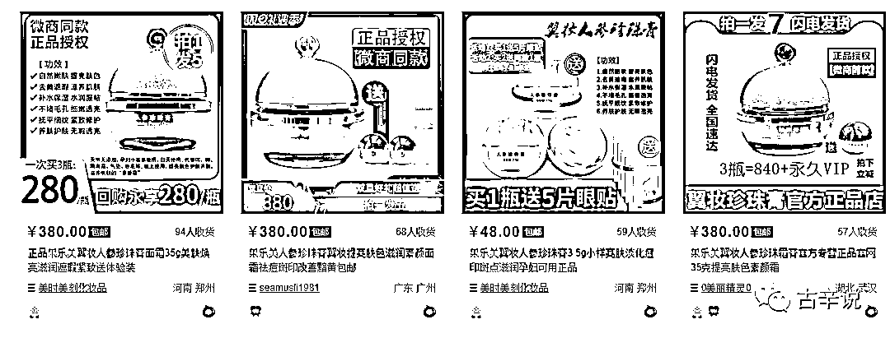

# 如何判断一款产品在小红书会不会侵权？

> 原文：[`www.yuque.com/for_lazy/zhoubao/zk0n4fntt31nww2y`](https://www.yuque.com/for_lazy/zhoubao/zk0n4fntt31nww2y)

## (20 赞)如何判断一款产品在小红书会不会侵权？

作者： 古辛

日期：2025-03-03

选品，除了是为了选出竞争更小，利润更高，更容易拿到结果的赛道，还有避坑的作用，比如产品侵权就是一个大坑，那么我们在做小红书蓝海的时候，如何在选品阶段，就能发现一个产品会不会侵权，从而避坑呢？

方法是有的，下面古辛就以多年的电商经验，给圈友们介绍四种我们常用的，用来判断一款产品，会不会侵权，会不会被品牌方投诉，甚至起诉的方法。

小红书平台里面，不好判断产品是否容易被品牌方投诉，古辛一般是去淘宝，看这款品有没有被投诉的风险，如果一款产品在淘宝会被投诉，那么在其他平台卖，大概率也会被投诉。

如果一款产品在淘宝不会被投诉，那么在其他平台卖，大概率也不会被投诉。

**1****.** **标题里品牌名有别称**

 images.zsxq.com/FuQhuDuMTrG0qyN_VJHD_XnC5SXX)因为出现了品牌名，会被品牌方投诉，所以很多淘宝卖家，就为该产品取了别称。上图中的产品，除了叫马栗乐之外，还有马栗露，马膏等别称。这个品的品牌被国内一家公司抢注了，它们会在淘宝上，投诉售卖该产品的卖家。

这个品我们之前做淘宝蓝海的时候选到过，因为会被投诉，所以就放弃了。

既然会投诉，那为啥其他卖家可以卖呢？其他卖家现在能卖，不代表他能持续卖。如果他可以持续卖，那肯定有我们所没有的资源。

**2.产品主图刻意隐藏品牌 Logo**

 images.zsxq.com/FsV7aFe98AyUA1N0kJtXBSSyBSbk)像上图里的这个产品，很多卖家的产品主图，都是刻意把 Logo 隐藏掉的。正常的商品，哪个商家不愿意把 Logo 露出来，显示自己产品的真实性呢？

像这个刻意隐藏 Logo，很少见，事出反常必有妖。商家这样做，就说明这个品会因为品牌名被投诉。

**3.淘宝卖家数量极少**

 images.zsxq.com/FiPltwVurMwAcRJ4lqVrw2Vd6f2A)上图中的第一个品，搜索“蕾特恩祛痘精华液”这个关键词后，在淘宝上只出现了一个搜索结果。一个正常的产品，怎么可能只有一个卖家在销售呢。再小众的产品，至少都会有几十个淘宝卖家。

像这种只有一个卖家在卖的产品，不是只有一个卖家愿意卖。而是其他卖家都被干掉了。

**4.所有卖家价格一致**

 在淘宝上，只要客观条件允许，那肯定是会出现价格战的。同一个产品，不同卖家的卖价，基本都会不同。像上图这种，所有卖家的卖价都一致，这是不正常的。

卖家逐利，价格降低，销量上升，这么简单的经济常识，所有卖家都懂。既然懂，还能忍住不降价，只能说明，是他们不敢降价，而不是他们不想降价。不敢降价，必定是因为，降价就会被投诉，所以卖家才不敢降价。

这种投诉，比较好应对，只要和大家保持一样的卖价，就能相安无事。

通过以上四种方法，不能让大家 100%避开侵权的坑，但也能够让圈友们避开 80%的坑，从而大大提升做小红书蓝海电商的成功率。

* * *

评论区：

昊东 : 熟悉法规真的很重要，不懂的是大坑，懂得就是与同行竞争的有效方法。