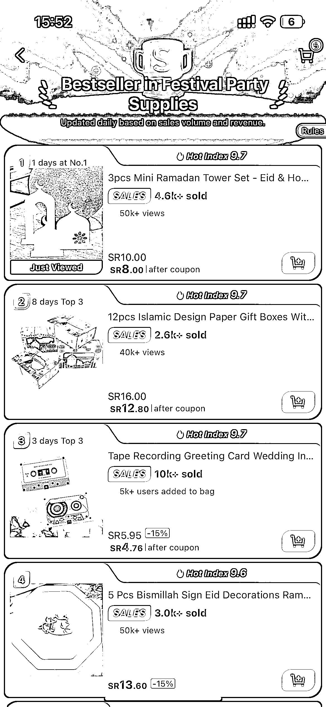
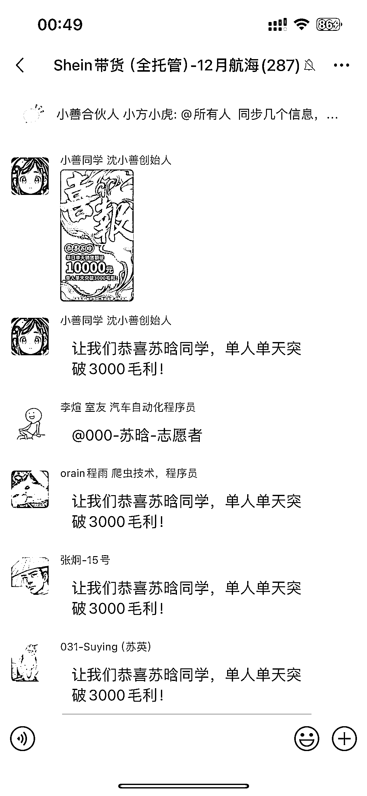
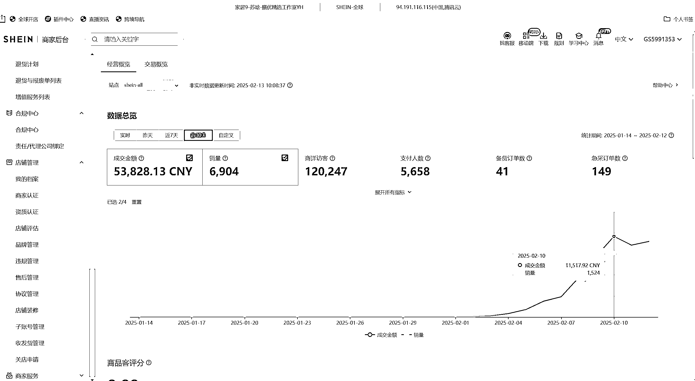

# 实体老板第一次做 SHEIN，单人单店日销售额破万，保姆级起店复盘分享

> 原文：[`www.yuque.com/for_lazy/zhoubao/vcxxdbb977gict36`](https://www.yuque.com/for_lazy/zhoubao/vcxxdbb977gict36)

## (精华帖)(87 赞)实体老板第一次做 SHEIN，单人单店日销售额破万，保姆级起店复盘分享

作者： 苏晗

日期：2025-03-06

大家好，我是苏晗，加入生财之前做了 5 年的实体酒水供应链，去年 11 月末和刀姐去海南 NCC 社区玩，刚好认识了小善，被她的那股子研究精神所打动，从那刻开始，跨境的齿轮开始转动。

因没抢到名额，从志愿者做起，从 25 年 1 月份接手 SHEIN 店铺，通过虹姐教的精品上架，持续优化链接运营了 20 多天的时间，终于在 2 月初上架开卖，在 1 周之后，做到**单人单店单日营业额破万元** ，**日销 1500 单+** ，并且**成功登顶 SHEIN 节庆热卖榜的第一名** 。

那天看到这个销售数据，不得不感叹互联网真好，一想到自己之前做实体店真的又花钱又心累，除了人情世故，就是利益算计，每个市区店要入库 30 多万的货款和房租水电费，再找当地人来管理分润，13 个店做到最后，**至今赊账没付清的还有大几十万** 。

互联网就这么轻资产的没啥投资，一天的毛利就有 3000+！

虽然我是 i 人，但我有点话痨，就按时间线给大家讲一下

时间回到 3 个月前，24 年 11 月 25 号，我和刀姐去三亚的 NNC 社区，第一次见到了这个一贴成名的女人，一开始，**我没有从小善身上看出什么特别之处** ，只是见她每天都抱着《真需求》

在后花园和我上铺的室友李煊讨论着什么，我很好奇，就去听了一阵子。原来在研究 SHEIN 店铺，新链接能做起来的原因和规律，还挺有意思的。

这时候的选品研究还在 1.0 阶段，在程雨也来了之后，除了制作 SHEIN 航海的海报以及整理学员的作业分数，**我们每天做的就是从海量的产品数据中，提取前 500 个销量最高的，再反推他的店铺，找出重合度最高的，然后再分析这些优质店铺的规律** ，这其实和我以往的舒适区是相反的，在 24 年 1 月加入生财后，通过精华帖和朋友圈偶然看到的异常值，直接拆解或跟随已经拿到结果的对标，变现了 30W+，而要从海量的数据里去找到异常值在分析和学习，是我从来没想过的。

我也发现了我一直焦虑迷茫无法 10-100 的原因，就是做的事情太简单了，**爬 500 米的山，和 5000 米的山，上限不一样** ，我也希望我的研究能力 up
up，**我要登上更高的山，看更远的好景色** 。

真正让我下定决心要做 SHEIN 的原因，是有一天，小善在研究店铺数据，我们 3 个人也在研究，但是从早上 9 点到晚上 9 点，小善都坐在那里研究，而我们 3 个大汉，已经累的不行，各回寝室休息了一次再回来，她依然坐在那里盯着电脑一动不动，只是旁边多了两堆洽洽五香瓜子。我想，和这样的伙伴做事，想不成都难。

说实话，当时看了那个 SHEIN 航海的帖子，也被触动了，也想报名，但是我看到只做选品，全托管，我心里想：这事会不会太简单了，毕竟我现在已经在生财学习拿到 30w+的小结果了，想做一些更难更值得研究的事情。

结果第二天打开高阶航海报名入口，发现早就一抢而空了，后来没办法就做了志愿者，从此上了船。

在生财收获了很多很多，爱出者爱返，我也想借这个机会勇敢分享一次。

在上个月 20 号就写了第一版的分享帖，不太好。于是重新花了 2 周的时间，1 周用来思考和记录灵感，1 周认真打磨内容，将我这 3 个月来的 SHEIN 运营经验和踩过的坑复盘在这篇帖子里，希望可以给大家带来一些帮助。

本篇帖子会从

1、SHEIN 选品篇

2、SHEIN70 分精品上架篇

3、SHEIN 产品上架的 5 个阶段及常见问题

4、SHEIN 店铺运营

5、SHEIN 产品货源

6、SHEIN 提效工具

深入的分享 SHEIN 起店的重点和常见问题

本贴内含图片、视频及文字，为了更好的观看体验，请客官移步飞书链接观看：

[实体老板第一次做 SHEIN，单人单店日销售额破万，保姆级起店复盘分享](https://eqr5180l7jb.feishu.cn/docx/KvjCdOwjioOjQsxdEbRci6NGneg?from=from_copylink)

* * *

评论区：

明潮 : 写的太干了，非常真诚！！！

忆 : 良心分享，感动中

李楠熙 : 厉害👍

小歪 : 太干了，优秀[强][强]

小勇哥 : 真厉害

Simon : [强][强]

你说什么就是什么 : 老哥，不知道可不可以链接一下，当时报航海没报的上，看手册一个人跑，跑的比较慢，看了你写的文章，感觉团队各方面走的太强了。[让我看看]