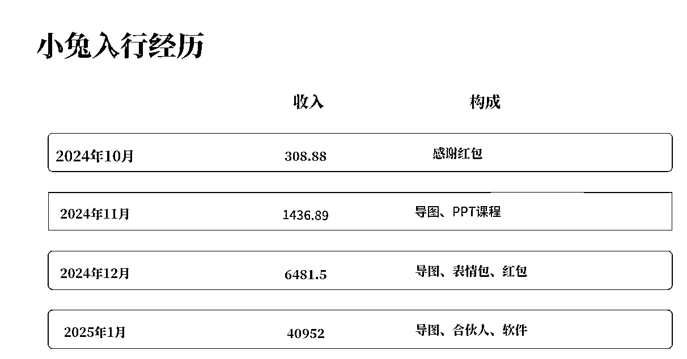
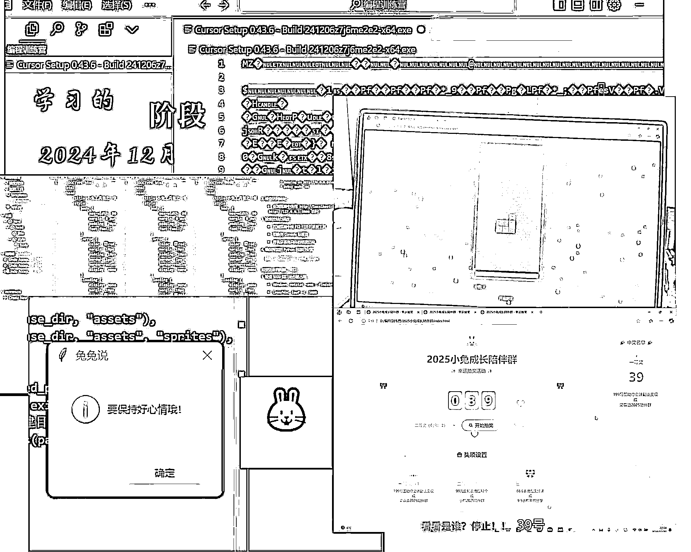
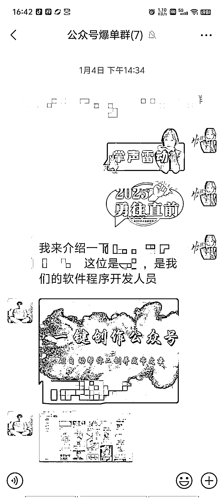

# #航海好事：女生看 Cursor 航海手册自学编程，25 年 1 月开发 AI 写作软件，目前 GMV2 万+

> 原文：[`www.yuque.com/for_lazy/zhoubao/lgbqp4k9dg66ae3d`](https://www.yuque.com/for_lazy/zhoubao/lgbqp4k9dg66ae3d)

## (77 赞)#航海好事：女生看 Cursor 航海手册自学编程，25 年 1 月开发 AI 写作软件，目前 GMV2 万+

作者： 小兔

日期：2025-03-09

你好呀~我是小兔，这是我在生财的第二个帖子。

前几天亦仁老师第一次直播，我发了一条评论说自己参加航海做编程赚钱了，得到了生财团队中一位老师的关注，让我在星球上分享一下航海的经历和心得~ #航海好事
很荣幸接受生财的邀约，在此分享一下我下海经历、学习 Cursor 编程，以及自己在 2025 年开年两个多月赚了 5 万+
的全过程，可能有点啰嗦，不好意思年纪大了，就会比较爱唠叨

## **报名【生财有术】**

首先绍一下自己的基本情况，38 岁，体制内上班，主业在公立医院担任挂号收款的工作。

我是 2023 年 9 月 28 日加入的生财，当时刚考完中级会计职称，在小红书刷帖子，刷到了【搞钱女孩】，随意听了两三期，其中有两个女生都提到【生财有术】，但是我完全不知道生财是做什么的，只知道她们通过生财赚到钱。

21-23 年我一直处于大龄备考的状态，小红书、抖音、连朋友圈都关了，我虽然知道 GPT 是个风口，但为了考试，不得不放弃追这个风口！让我产生付费冲动的那一期搞钱女孩的是【黄小刀】那一期，我还没听完博客，就在网上搜了相关的话题，下载知识星球，直接报名生财！

我在自己真正搞副业后才发现，原来真的有很多人会对生财高达 3000+的报名费犹豫许久，我当时也是花呗分期买的，相比较高昂的船票，我更怕我和这个时代脱节，生财里有 GPT、有那么多人通过生财赚到钱，所以我一定要进来看看，这里有什么！

# **【探索迷茫期】**

来到生财，我有点像刘姥姥进了大观园，什么都想尝试，23 年 10 月就报名了【小红书店铺】，当时什么都不懂，说实话我当时不大大聪明，总找不到航海手册，一次航海都没打卡过，压根不知道打卡 12 次返钱这件事。但是好像开通了小红书店铺，里面说的好多内容我都不太明白！还不会魔法，问了好多人，都说不能讲，是的，新手的卡点可能只是因为**不会魔法！！！**

23 年就是天天浏览帖子，就看看，从来没有实操过！但因为工作中用到了思维导图，对竖版思维导图很感兴趣，所以 12 月的航海报了罗卜和小熊老师的竖版思维导图。自己是会计，感觉 RPA 对会计很有用又报了 RPA 提效！但我当时的学习都不是以赚钱为目的，就是以学习为目的参加航海！因此在我学会了基本的竖版思维导图之后就又放弃打卡，转功 RPA 提效，又因为太笨而放弃。

这里我想说一下自己不好的地方，参加生财说白了就是想赚钱，打着学习的旗号试水，其实就是怕失败？所以美名其曰来学习。

24 年 1 月参加完两次航海后，又跑去学习了，当会计的都有一个 CPA 的梦想！但可想而知，我一个中级会计职称都考了三年的人，跑去学 CPA 就是自找苦吃，没事找事儿！

## **【把手弄脏】**

24 年，我们家出了一点点小状况，以前是不为生计发愁，现在是紧衣缩食过苦日子！我和老公双职工，我每个月工资+绩效 4800 出头，他 5000+。我大龄备孕月月跑北京看中医花费 3000+自己还要在医院做检查工资都不够花！

这里有一个小小的契机，24 年 9 月 7 日，我开车不小心碰了一个闯红灯的大姐，她让我赔衣服和丝袜钱！我一看她的淘宝购买记录，整个人都不好了！她的丝袜都是 200+一双，而且买了三双！我穿的衣服是抖音 99 包邮，整个夏天只买了一件！我在想，我还在高贵什么呀！就这还不赚钱等什么呢？

于是 24 年 9 月生财航海我报了俩，因为太穷，航海都好好参加了！报了【小红书教育资料引流】和【AI 写作】，这次我真的很感激我的航海志愿者**【海滨】**
，他告诉了我如何使用魔法，也感谢**【Cheese 海盐】** 老师给我推荐了充值 GPT 的人，我才真正用上了魔法和 GPT！我的人生真正【开挂】了！

虽然我当时穷的都快吃土了，但生财的续费依然没含糊，直接续！花呗分期都要续上！

## **【开挂的副业】**

并没有一开始就一帆风顺，我的小红书教育资料引流做的并不好！没有孩子，我无法和孩子家长共情，我老公是小学老师，按理说我的资源很强大，但他一句那些卖资料的都是贩卖焦虑！死活不干!
好吧！“您清高，您伟大，您稳定的穷！”男人指不上，我就自己干！

24 年 9 月 29 日我报名了【全国会计副业圈】咱卖会计资料行了吧！10 月 20 日前我依然一毛钱都没赚到，10 月 23 日又付费学习了会计做课训练营，打算做课！死马当活马医！

10 月中旬我买了梁宁的**《真需求》** 通过那本书结合我目前的实际情况，我开了自己的第一门课【导图助你会计副业变现】，就是用**竖版思维导图** 快速的把资料转成 MD 格式并结合竖版思维导图做了一门课！那门课从 39.9 涨到 99 再到 199！我卖的很好，在一群会计中脱颖而出！而且还是出课达人！怎么说呢！表情包出课、PPT 出课！卖 39.9、16.8 各种小课卖到了训练营的第一名！我小兔终于支棱起来了！（这也算是#航海好事
）

所谓的课程谦虚点说，就是倒卖个信息差！这边学到了，转身就录制视频，做课卖掉！因为我在医院上班，天天和大爷大妈沟通，我比较能理解有些人真的啥也不会，需要你一步一步的教！我自己一开始也是啥也不会（毕竟一开始我也不会魔法上网）所以我的课很落地！

曾经有圈友说我是“不管有枣没枣，先打一杆子”，说我的课没海报、录制有杂音、不露脸！挑了一堆毛病，我嘿嘿一笑，没钱！管它的呢，我一个糙人，市场认可就行了！

## **【与编程结缘】**

12 月我除了继续卖我的课程之外，还报名了两个航海，一个是【公众号爆文写作】、一个是【小绿书带货】。为啥没报编程呢？因为在 24 年 1 月在 RPA 的学习中认识了带队的 BUFF 老师，他在 12 月也有 Cursor 编程课，时间是 7 天和 14 天！我利用他的课，看咱们航海的资料学习编程！这样我可以多学一点点！

说实话，兴趣很大！12 月即使再忙，我也会**每天抽出 1-2 小时，和 Cursor 对话，做了很多小软件** ！俄罗斯方块、抠图工具、群抽奖工具、桌面宠物……还尝试做医院的会计系统（整一半不会了），用 Cursor 做 AI 写文！不过，我一个外行，我只会网页版的，还是只能在我的电脑上弄，因为我电脑装了 Cursor，但你让我把它整到别人的电脑上！我的技术不到家！一个月的学习，我达不到!但这件事就像一个种子，早早的在我心中种下！

我认为，我学编程最大的改变是，什么事儿，我都想用 Cursor 试一试！能用 AI 工具的，绝不自己动手！因为自己是上班族，还备孕！我必须要节约时间，提高效率！所以我追求一切效率工具！

## **【我想做个软件】**

25 年 1 月 2 日晚上 8 点多，我发朋友圈想收合伙人，我一个新手，我给自己的定价是 4999/三年！我的第一个合伙人找到我劝我一个多小时，让我提到 5999/三年！我提价了，她报名！当天晚上我就收了俩合伙人！她们看上我的是我**脑子活，执行力强！** 我自己的特点是，**我发现一个需求，就能用最快的速度跑通变现！** 1 月 3 日我第三个合伙人找我报名，我拒绝了两次，最终还是在 1 月 5 日收了她！这是我做#小兔 AI 创作助手 里**四个会计女生的其她三人** ！

1 月 3 日
我想了一整天，梳理了我全部的资源，想到要做一个 AI 写作软件！1 月 4 日早上就和我的合伙人提了！大家一商量，这事儿可行！我当天就拉了一个技术人员，商量这件事！（12 月初这位技术人员就推荐过他的 AI 矩阵写作软件，说要免费给我用，因为我 12 月报了两个航海、还有编程，还要卖我自己的课程，太忙了！就拒绝了！主要还是免费的东西都很贵，我喜欢简单的金钱交易！脸皮薄，白给的不敢要！）

于是 1 月 4 日我们的软件正式处于开发期！5 号交定金！直接开干！

 hmGoy_8VJVlv)

## **【小兔 AI 工具 01】和小兔 AI 工具 02】心法**

【小兔 AI 工具 01】LuckyTwo 创作的过程，之前第一篇发文已经写了！技术的部分可以看第一篇帖子！[用 cursor 做出 AI 写作软件，接口是大热的 DeepSeek，目前 GMV2 万+

*   飞书云文档)
    这里不重复！这一次主要想讲点不一样的！

我是个行动派，我可以很快的带动别人一起行动！

基本上没什么卡点，遇到了问题，不处理情绪，只处理事情！事儿办好了，情绪也没有了！这个方法不行！好，咱们换下一个方法！试了很多回，总有瞎猫碰到死耗子蒙对的时候！偶尔 emo 的时候也有，但会用最快的速度调整过来，继续奔跑！

**AI 时代，遍地捡钱，哪有时间焦虑！** 我对抗焦虑的办法是尽快掌握 AI，学习新技术！发现“需求”，有需求就有市场！我真的觉得现在到处都是商机！我 38 岁刚刚下海折腾，都能拿到结果！不是很懂 AI 时代来临，为什么会有很多人只焦虑不干活？

【把手弄脏！】就是要下海去尝试，把手弄脏，不管黑猫白猫，能抓到耗子就是好猫（好兔）！

所以，你敢信？我这第一个报喜还没写完，就在 3 月 7 日那天晚上看坤汀和 SKY 那场直播里，看到批量制图的，就轰炸技术人员，参加航海之前我要一个批量生成小红书和小绿书图文的批量海报生成器的内测版本！（这个需求早就有，但我有可画 VIP，我对这种做图的需求不大，所以就没怎么在意这一点）但看直播发现这个需求还是很大，那不如喊技术人员直接搓一个！（自己搓太慢，能花钱解决的事情，就不拿我这一两个月的经验和人家 20 年的经验对拼了）

技术人员 3 月 8 日手搓出来了！我是 3 月 8 日晚上 10 点拿到的试用版，然后团队开会，马上市场调研，定价！定方案！我录视频讲解！

我 3 月 8 日半夜 11 点在我的陪伴群放了消息！视频还没来的及录，盲定！有 1 元定金，试用一天不满意退款！有今晚的价格，有人直接付款全价！因为相信我！当天晚上收了 9 个全款，15 个 1 元定金锁价格！有人是今天早上才看到，团队其中一个成员说截止 3 月 9 日早上 9 点，她收了 30 个 1 元定金！（现在是 3 月 9 日下午 2 点，刚刚那个合伙人收了 40 多个定金了，我自己的人还没空拉到群里）

所以不要小看需求，就这样一个小小的用 Cursor 搓出来的做图软件，也能赚一点点小钱不是么？（我又在搂枣！）

大 IP 有大 IP 的玩法，我这种小虾米有我的生存之道，市场下沉下沉再下沉！不超过 50 块钱，用一年，都出的起！我之前自己用 Cursor 做的群抽奖软件也有人找过要买，需求无处不在！只要你敢去做，敢去尝试，就没什么不可以！

## **【小兔 AI 创作助手】**

说回这个项目，给生财团队的人看了操作视频，被夸了！说我的软件同款国外有个插件，200 元/月，关键是我的软件用起来很简单！这一点很重要！

关于【操作简单】我很有发言权，因为自己的主业是医院挂号收费的，去年都在普及电子医保码，职业原因平均每天接触了 200+患者！我发现社会飞速发展，老年人和普通大众对太复杂的操作接受程度不高！一个简单的打开微信，扫一扫，调取电子医保码就难道大一片的患者，累死工作人员！

我做这样普及的工作整整 10 个月！我真的太懂复杂的操作对患者（顾客）来说，有多难！你敢信我们医院电子医保码使用率从 13%提升到 70%，靠的是我们一个一个教出来的！对话就是“**点这里，这里！然后再点这里，再对准你的脸，眨眼睛，张嘴，好啦~大爷/大娘，可以了** ”我真的懂简单就是最好的（深受其害）！

所以开发这个软件时目标客户的画像是**做副业的会计人群** ，解决会计人不会写作，不会写公众号的卡点！**（事实证明啥都能写，不是会计专用！会打字、会说话、有手就能用）**

那么我目标用户的画像是：有经验的会计=年龄较大的女性（电脑小白）+专业需求（禁止 AI 幻觉胡编乱造）+打造 IP（我自己的故事，多一些人物情感，真实性）

那么对应我的软件就是：

1、操作简单：我们几个会计都上班，主业太忙，没有时间答疑，太复杂我怕她们老问我！所以就化繁为简，傻瓜式点击，有手就会！一句话写公众号！（多亏 DS 能瞎白话）

2、拒绝 AI 幻觉：会计需要很强的专业性，你不可以给我随意发挥！我经常用 GTP 我发现它虽然生成的很好，但老给我乱改，我得和它沟通好几轮才能达到我想要的效果！我真的觉得我的时间都浪费掉了！（小兔 AI 的草稿箱限定发挥）

3、个人 IP：有 IP 才能赚钱，我都是以目标为导向的！主业本来就忙，拒绝廉价劳动力！会计很忙的，不做出 IP 来赚 300-500 的辛苦钱？能赚几个钱！所以我的目的是让每个会计发挥自己的优势，打造个人 IP！（不做矩阵，专注个人 IP，你想写什么内容草稿箱里打个大框就好了，你自己的个人故事和个人经历！我这是“原创”！）

4、提示词工程：这个是可以薅我兔毛的！任意一篇文章，公众号链接贴上直接抓提示词！一天生成无数次！（技术人员说一定要让用户占便宜）哪怕是个小红书内容，你复制粘贴也能贴，达到伪原创的程度！也就是说，你用我的提示词，提取出来任意一个 AI 随便生去吧，我不在乎！当过年期间各大 IP 拿着所谓的 DeepSeek 提示词卖 9.9 各种赚钱的时候，我这里在 1 月 15 日就已经是免费的！（问：兔子的眼睛为什么红？答：红眼病）

5、会说话就能用：因为我对 AI 的理解实在是个外行（24 年 9 月才会魔法），所以我真的不懂提示词工程，别难为老阿姨。我只会大白话，我称之为许愿式提示词！我的提示词就是在咱们航海手册里东抄一句，西抄一句加上的！我写的是“帮我按照写 XX 人风格的低粉爆文公众号，并排版，还要给我起 5 个吸引人点击的提示词，开头雷击，中间穿插金句，结尾下钩子，情绪化表达+下钩子。我的目标客户是 XXXX 人群！”
没有套路，因为我只会这样，我的水平决定了我产品走向！= =！太高端的我真不会，真别难为老阿姨！

6、我没有的功能：批量抓公众号，做表格，搞批量化那一套流程。我知道很多软件都有这个功能！我为啥没弄呢？明明微信搜一搜里就可以快速抓爆点，我又何必搞那么复杂呢？化繁为简，咱就搞定这一件事就好啦！（矩阵工具是另外的产品和价格）

实在夸不下去了……

我的技术人员，做完我这个项目自己总结的一句话很经典，**成功=70%场景理解+20%模型调校+10%运气** （虽然他是用我的软件写的，但我还是觉得很经典！贴出来分享一下）

> 二、破局之战：当「提示词工程师」败给「一键生成」
> 
> 如果说前几个项目是技术验证，那么 2025 年 1 月交付的第三代内容生成器，则彻底改写了客户对 AI 的认知。
> 
> 客户的需求很简单：”根据我们提供的资料，参考其他自媒体作者的文章，输出爆文“。
> 
> 这个看似简单的需求背后，藏着所有 AI 培训机构的集体焦虑：
> 
> 学员连压缩包都不会解压，却要教他们写提示词？
> 
> 花 3 小时调教出的文章，热度还不如奶茶凉得快
> 
> 爆文生产流程像玄学，根本无法标准化教学
> 
> 我们拆开项目黑箱时，发现了更残酷的真相：
> 
> 用通用 AI 生成的文章，查重率高达 25%（平台限流红线）
> 
> 每次生成需要经历 17 步操作（包括 5 次手动复制粘贴）
> 
> 学员平均流失率 68%("学完还是不会用 AI")
> 
> 解决方案：把「开飞机」变成「坐电梯」
> 
> 当传统方案还在教用户怎么当"AI 飞行员"时，我们直接给电梯装上了智能按钮：
> 
> 第一步：混沌吞噬者
> 
> 自动解析对标文章结构
> 
> 深度清洗"我妈说宝宝要捂汗"等非结构化数据
> 
> 构建专属知识图谱（连客户自己都惊呼"原来我有这么多干货"）
> 
> 第二步：爆文基因解码
> 
> 用行业黑话分析器拆解爆文
> 
> 建立情绪波动曲线模型
> 
> 预设多种「人性弱点触发器」
> 
> 第三步：奶奶都会用的操作界面
> 
> 添加/选择资料
> 
> 选择模板
> 
> 点击生成（三步到位）
> 
> 这个项目教会我的事
> 
> 很多客户需要的根本不是大模型，而是：
> 
> ✅ 把复杂技术封装成「开水龙头就有热水」
> 
> ✅ 把概率游戏变成「保证最低收益」的生产线
> 
> ✅ 把玄学般的 AI 魔法变成可复制的操作手册
> 
> 三、你该拥有的 AI 开发路线图
> 
> 经过 12 个项目的实战积累，我总结出企业级 AI 应用的黄金公式：
> 
> 成功=70%场景理解+20%模型调校+10%运气

## **【小兔 AI 变现】**

GMV：699/年*30 人=20970 元

互联网裂变的玩法，拉人头就给钱的打法，我有点搞不明白！基本上只有购买过才有分销权！但只给 30%！我知道这样的设置不那么人性化，不太合理！也不是主流的互联网打法！我们都知道，我检讨！

但我们这样的设置主要是因为团队这几个会计上班太忙了，没什么时间解答太基础的问题！我在医院上班，我上班时间拿不起手机！下班才答疑，要是拉一个顾客我就要一个一个的解答，我们几个女生会累死！我们几个女生都很久没有 12 点前睡觉了！

所以发展的很慢也认了，我们几个还要生活，陪陪家人，陪陪孩子，我也可以陪陪我老公，我要去锻炼，我要备孕，副业是改变生活的，不能占据生活的全部！太麻烦的顾客直接拜拜，没空=
=！

## **【困境与破局之法】**

我学艺不精，我的许愿式提示词不太会写！3 月 7 日听航海直播，SKY 老师说到“咪蒙”风格，我试了，嗯！真香！所以这个月我报了 IP 的两个航海！我这回真的要好好跟这一波航海！我还是个小 IP，生财团队喊我多多发文！嗯！我就乖乖的来了！

自媒体的很多规矩也不太懂！毕竟在自我觉醒之前我只是一个普普通通的看韩剧呜呜哭的家庭主妇！而且 21-23 年考会计中级职称还断网了三年！网感全无，这里只有真诚，毫无技巧！希望各位大神多带带我！

破局：生财团队的工作人员喊我多在生财发帖，提高声量！我真的很感谢生财！没有看我是个小虾米打击我，一直都是鼓励我，让我多发声！

我真的很喜欢生财这个平台！要知道，我真的就是随便发了一句评论上墙了！激动的我都没来得及截上墙图！我真的觉得是我的高光时刻！T-T 没有留念！

第二天生财团队官方就找到我！我很激动！虽然不知道这样写航海好事是否是正确的格式，但我想，真诚是必杀技！我也不会提炼什么高光的金句，嗯，可能是“头脑简单向前冲吧！”还好，我的团队还有三个会计！我一上头，就有会计给我算账，管的死死的！我也是个听劝的，会计劈里啪啦一顿按计算器，好好好！你说咋办就咋办！我听话！（三年才考过中级，我的会计水平不太行）

要说有什么可分享的：

1、好好跟生财的航海，不知道什么时候就会突然开花结果！把手弄脏，我这老阿姨都可以，你也可以！

2、听会计的话，准没错！

感谢大家看到这里！感谢你们！我们 3 月新航海见！

#航海好事@澄歌

* * *

评论区：

吴海晖 : 我只能说你绝对不笨，因为参加 cursor 航海的那么多，真正自己做软件出来并且賺钱了的。可能不到 10%（我瞎猜的[流泪]，因为我就是 cursor 航海的一员，只自己整出来些工作提效的软件）
你能抓到需求并迅速行动验证，这么很厉害。说明行动力，耐心等，都是你的闪光点。 今天的内容绝对的励志。[强]向你学习。

四喜 : 很感恩看到你的帖子！简直是给我这种眼高手低的人一个大大的刺激！我看完后，抱着我儿子大喊：妈妈要加油努力了！！！[偷笑] 儿子一脸懵圈

11 : 太厉害了，所以行动起来才是最重要的

铿然 : 请教一个最核心的问题，这些用户是如何找到的？ 软件好做，找到愿意付费的用户不容易。谢谢！

小兔 : 我是混会计副业圈子的，我一开始就是卖个思维导图，PPT、表情包，卖了个第一！ 然后有点小名气了！ 她们眼中的我很厉害（我有生财信息差！）有点小底子！
如果一定要说，怎么找客户！我的观点是：不是做了产品找客户！而是看看客户缺点啥？你缺啥我做啥！只要有人购买，一个最小的商业闭环完成！多人购买，说明这个需求量很大

小兔 : 整理出来，如果可以卖就卖呀！卖几十/年也好呀！ 要给自己一点点正反馈！ 就像弄个群抽奖的！我给你做个模板，客户自己群里可以随便搞活动，我收个 30-50 元/次
或者你要专门定制的，那我要贵一点[调皮]99/次 多简单的一个小软件！真的很好卖

小兔 : 加油呀！谢谢鼓励！ 先干了再说，跑通第一个小闭环，一直给自己加油打气！

小兔 : 对！而且目标明确！“我要赚钱” 一切都从这个目标进行思考和反推！