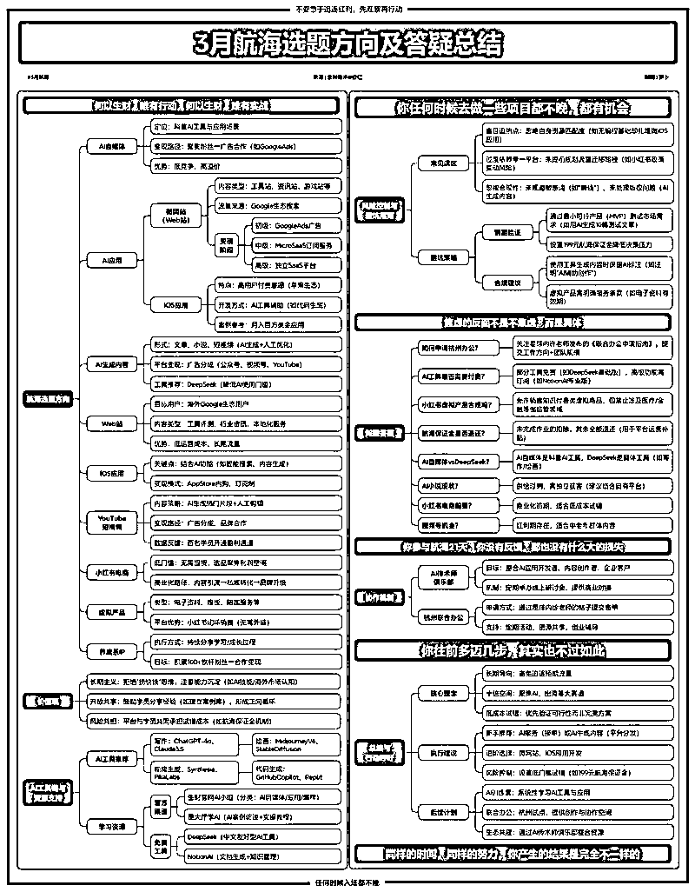
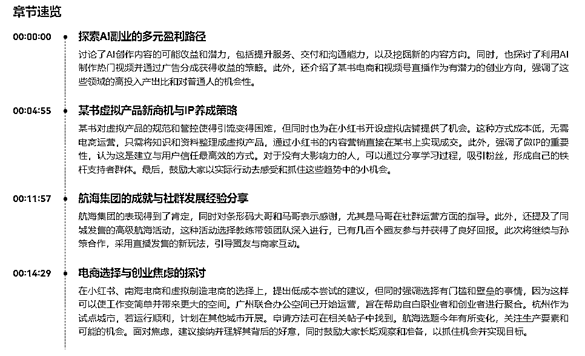
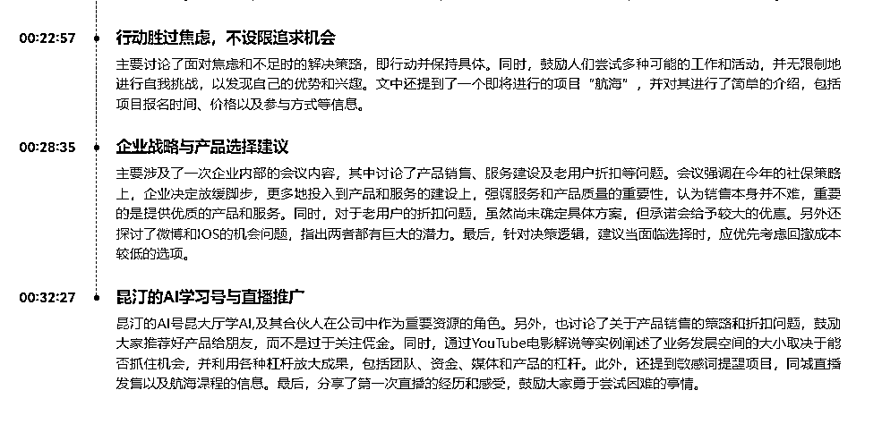
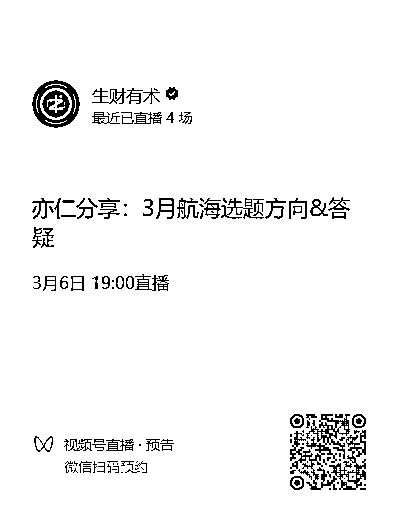
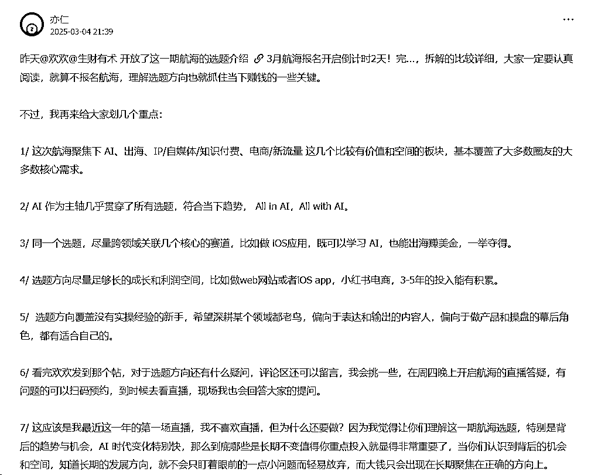
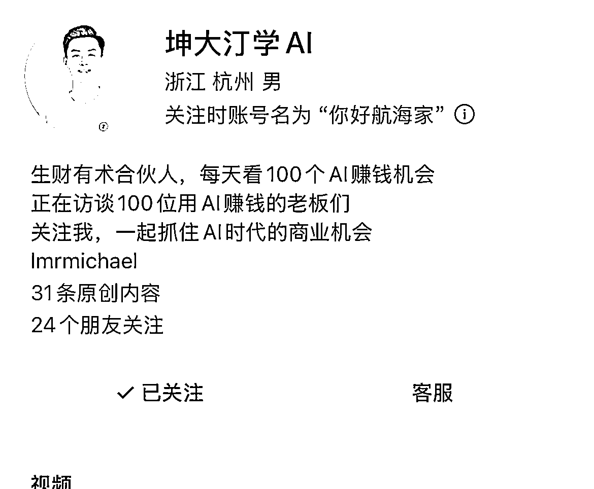

# 课代表：亦仁首播的精华—3 月航海，高手指方向（详略皆有）

> 原文：[`www.yuque.com/for_lazy/zhoubao/uxfd52avg4lkvid3`](https://www.yuque.com/for_lazy/zhoubao/uxfd52avg4lkvid3)

## (45 赞)课代表：亦仁首播的精华—3 月航海，高手指方向（详略皆有）

作者： 叶凌尘

日期：2025-03-06

2025 年的首场航海，听亦仁的前瞻预测

潜力和机会真的太大了！！！！

专注分享：全程 1 小时 46 分钟无尿点

每一个项目适合什么人？项目之间有什么区别，同时分享做项目的理念....

报 3 月份的航海，这篇笔记，你一定要看！

这是我先用 AI 实时概况，后面又人工一个个校对

希望大家给个点赞，也分享给参与你身边的这次航海的圈友们

帮助他们指点方向，让老大首播的余光照耀在每一个圈友身上

本文讨论了亦仁在直播中分享的 2025 年航海主题相关内容，包括航海选题方向的调整、生财航海的理念，以及重点介绍了 AI 和出海两大方向的选题，并对其他一些有潜力的方向进行了探讨。关键要点包括：

@萝卜老师：Xmind 制作

​

**1、航海选题调整：** 更长期导向，聚焦 AI、出海等有十倍空间的方向，有闭环和快速小反馈，且能低成本切入。​

**2、生财航海理念：** 是行动训练营，生财选方向并营造行动氛围，带领圈友下场行动以获结果，过程中的认知提升、技能掌握等也是收获。​

**3、AI 方向选题：** 涵盖 AI 自媒体、AI 应用、AI 生成内容等，如 AI 自媒体需求旺、供给少，AI 应用有做网站和 APP 的机会，AI 生成内容可通过多种平台变现。​

**4、出海方向选题：** 包括做 Web 网站、iOS 应用、YouTube 短视频和中长视频，Web 网站可分阶段发展，iOS 应用付费能力强，YouTube 项目已有部分圈友取得反馈。​

**5、其他潜力方向：** 小红书电商和视频号直播有红利，小红书虚拟产品可直接在平台闭环成交，养成系 IP 是多数个体建立信任的方式 。

**  **

**  **

当我在不断校对的时候，反复听直播回放，雪姐的逐字稿出来了！

雪姐的详细文字稿：[`t.zsxq.com/el7Fv`](https://t.zsxq.com/el7Fv)

视频回放：

结合老大之前的航海回复：

**  **

**  **

**标题：** 3 月 6 日录音 会议纪要

**全文概要：**

本次会议为航海集团的答疑会议。首先，参会者分享了 AI 在内容创作、虚拟产品销售、直播带货等方面的应用和建议，并介绍了某书电商和视频号直播的机会。对于想做 IP 赋能或角色下 IP 的人，建议尝试养成一些 IP。

鼓励大家以实际行动去感受趋势，抓住可能的小机会。

再次，他强调了在早期阶段无需为自己设限，应积极尝试不同领域和项目，并建议采取长期的、有激励的方向发展。

最后，讨论了公司的经营策略和新产品微博及 IOS 的情况，以及昆汀创建的名为“昆大厅学 AI”的视频号的目的和计划。

**主要内容：**

**1****.** **探索 AI 副业的多元盈利路径**

讨论了 AI 创作内容的可能收益和潜力，包括提升服务、交付和沟通能力，以及挖掘新的内容方向。

同时，也探讨了利用 AI 制作热门视频并通过广告分成获得收益的策略。

此外，还介绍了某书电商和视频号直播作为有潜力的创业方向，强调了这些领域的高投入产出比和对普通人的机会性。

**2025 年 AI 的元年！必须要做的事！**

小白完全可以参与进来，往往是那些边缘人，没有基本盘，跳进新的机会的时候，更能抓住

AI 现在是全民浪潮，资本趋向

真正的我们赚到钱啊，就是说很多时候都是资本的这个热钱。

你如果说你辛辛苦苦去抠一点点的这个生意，钱其实非常少的，

生财，未来会给**500 多张门票** ，答谢那些敢于在 AI 应用方面，做尝试的人

生财结合 AI，会推出**AI 小助手** ，用 AI 来辅助分析风向标帮你迅速了解每一个精华帖

**专门腾出一栋楼：给做 AI 的圈友联合办公**

有人做 AI 培训的，AI 产品的、Ai 应用的，项目合适，给他们资金、资源，帮他们招牌，流量的获取等等，快速帮助我们圈友抓住这个机会（给予陪伴：创业的人）风口不等人，抓紧啦！

**生财 MCN：** 给圈友做 AI 账号，自媒体，对接大的商单，让你专注把内容做好

内部会议：**AI 方向一定是对的** ，但哪一件事是对的，不知道，只能 AII AI

**AI 自媒体：科普 AI，做一个账号**

去年就在强调，这个是一个机会，大量的产品，需要推广，需求大于供给，现在还是蓝海，你有很强的溢价的机会

如果说你说你之前你做自媒体做的很擅长的，你不妨增加一个新的一个方向。

你要去表达就是围绕 AI 相关的一些内容，包括怎么去用工具啊，

或者说去看看这个 AI 的趋势呀，反正就是大多数用户对什么内容感兴趣，那你就围绕这个去做内容，

**老大：** 依靠广告分成是一个很好的机会，大家可以尝试。

**案例：** 第二点，我认为你可以将 AI 的整个内容传播到各个平台。例如我们曾经做了很多期公众号爆文，你可以引入 AI，然后进行文章创作。虽然竞争非常激烈，但是仍然有许多细分方向可以挖掘。你去做后每天可以获得几十元的反馈，这对你来讲非常不错。当然，还有视频化广告分成，你可以使用 AI 新视频制作短视频传播到视频号，当流量增加时也可以获得广告分成。

**AI 赋能 IP：帮你优化工作流**

借助 AI 工具，帮您做封面，你首先是 IP，非常想做，想深耕的。

**AI 应用：WEB 网站、IOSapp**

技术条件：编程的成熟，应用环境在改变：搜索引擎，都在用 AI

需求：老外还是更擅长用 WEB 网站，就像国外没有扫码支付系统，还是刷卡...

案例：老大去订餐厅，还是需要用网站

——没有技术背景的小白，可能会很难

基础阶段：做网站、搞流量、变现（做产品，理解）

第二个阶段 micro saas，小型的 Saas 站订阅网站去做（做的好的上千万美金）

参考圈友——阿彪

比如去看之前的排行榜，这里面我认为啊，大多数的这个应用都会有 AI 的重做一遍的机会。

**AIGC 生成内容：写作、小说、短剧、爆文、生成短视频——技能变现**

超级标：AI 服务，真正熟练和 AI 配合的人还是少的

写作：比如说生成这个 PPT、论文、演讲稿等

项目流量渠道：某鱼、某书去找人

AI 小说和 AI 写作本质上是一个事情

AI 电商：AI 形成模特图啊，去换装呀，换脸呀，其实都可以啊

Deep seek 入门

情怀：Deep seek 的出现，开启了一个新的 AI 时代

让很多中国人都可以连上到 AI。这样一个航海啊，里面会有各种场景，可能有十几种场景

**AI 小说：降低反馈的期待**

重在体验，除非你有网站、获客渠道

AI 小说是红利期吗？说实话，我认为其实不算是红利期啊。现在以我的视角来看，其实已经属于叫供给很大了啊。因为 AI 小说，AI 生能小说啊，就是想难度其实大，没有大家想象那么高啊。所以更多的，其实这里面的关键点是谁能把这些喜欢看小说的人聚集起来。

谁能把那些喜欢看不同类型的小说的人聚集起来？那毫无疑问，其实就是现在的各种小说平台。

小说平台属于强势方啊，所以他们能够分配到给这些去用 AI 去小做的人空间收益空间并不大，所以这个门槛又低，空间又没那么大，所以我建议大家去感受一下 AI，如果去写小说，但是对于这个回报的预期不用那么高啊，不用那么高。

除非你有这种 AI，除非你获客能力对吧，你自己做了一个 AI 小说网站，然后独立的去获客，那这个空间是大

**出海：天晴的去修屋顶——马云的话**

当你的业务很稳定，还在增长，建议你去探索出海

**2****.** **某书虚拟产品新商机与 IP 养成策略**

平台的商业化：

小红书在加快商业化进程，很重要的商业就是电商

大的平台最后，最稳妥的方式，就是电商（平台会重视）

同理，视频号也是，相反某音，商业化非常成熟了，不适合：生财圈友（低成本，想找一个副业，投入不多）

前两者，适合大部分圈友，机构有能力去做某音，非常大的市场。

如果说你是一个很强的一个品牌，那我仍然认为你应该去某音，对吧？因为那是最大的空间，最大的机会，那只是咱们作为个体散户，那确实没有那么多的这个能力去在最强的平台竞争。

小红书虚拟电商——低成本，竞争会激烈

低成本的去做一些尝试，我觉得你可以做虚拟电商。

但说实话，所有的能够低成本的去尝试的事情，同时等于叫空间低，同时等于叫空间不大。因为他们你可以低成本的进来，意味着所有人都可以低成本进来，所以它的门槛是非常低，你也意意味着它会竞争非常激烈，

**建议：** 我们希望选择有门槛、有壁垒的事情，让我们去做难的事情，会发现越做越简单。

如果你选择了低门槛的简单的事情，你会发现越做越难。

趋势判断：某书正在规范类目、品类、电子资料和虚拟产品。

某书对虚拟产品的规范和管控使得引流变得困难，但同时也为在小红书开设虚拟店铺提供了机会。

这种方式成本低，无需电商运营，只需将知识和资料整理成虚拟产品，通过小红书的内容营销直接在某书上实现成交。

建议:某书小组中有一个中标选项，可以把中标全部刷一遍，就能看到非常多的案例。

往期航海涉足电子资料、电子书和各种资料的引流等领域。当时我们并未将其与某书连接，因此大家需要完成很多工作，例如在某处发布内容引流至私域进行转化。它并非虚拟产品而是某书的虚拟产品。我认为我在这边将它们连接起来是有生意的。

我认为大多数人在认知：上仍停留在想在某书上做内容引流到私域来成交，

目前已经实现闭环，我认为它的空间可能比很多人想要的大得多。我已经看到了几个百万级的案例

**IP 养成：你没有太大的影响力——建议来**

此外，强调了做 IP 的重要性，认为这是建立与用户信任最高效的方式。

对于没有大影响力的人，可以通过分享学习过程，吸引粉丝，形成自己的铁杆支持者群体。

最后，鼓励大家以实际行动去感受和抓住这些趋势中的小机会。

案例：搭建自己的微信陪伴群

我们希望大家先将自己的朋友圈中认可你的人聚集起来，向他们汇报你的学习、思考和进步，这些人的未来。

你的合伙人就是你的超级朋友。因此我们洞察 IP 方向，最终将其培养成下一批并带领大家落实这件事情。

我所讲述的是养成 ip，虽然我有航海的想法，

但是我不认为其具有红利。我认为大多数个体和人都需要做的事情是 IP。

AI 赋能 IP：已经做 IP 或者对做 IP 有较强兴趣，想深入做的人

大家都意识到创作 IP 是成本最低、效率最高以及与用户建立信任的方式，我认为这是最高效的方式。如果你在品牌上推广很多东西，那么不如你自己作为真人与大家交流。我认为所有的交易本身就是信任。

**线下发售：与往期的区别？**

这次我们继续与孙策合作，带领大家进行发售，这里可能会有一些直播发售的玩法。以前的发售更多是他们带领圈友与商家合作，在整个朋友圈吸引你们。现在我们带领大家与商家交流，让商家在直播间发表意见。

**3****.** **航海集团的成就与社群发展经验分享**

航海集团的表现得到了肯定，同时对条形码大哥和马哥表示感谢，尤其是马哥在社群运营方面的指导。

马哥应该是我早期做社群，当时我们 17 年就是知识星球，然后条形码老师就做了一个叫社群。

对星球的星球。所以它那里面的用户都是做事情做得比较好的人。所以早期我也包括现在其实我也跟马哥经常交流，学到了很多，说做事情底层逻辑，马哥有一套课就是做这个怎么注册权，在咱们现在的美国航海？

我觉得如果说你要做社群或者你要做 IP，或者要做围绕人的这个聚合，我认为你那个行业手册你一定要看一下

**4****.** **电商选择与创业焦虑的探讨**

在小红书、蓝海电商和虚拟制造电商的选择上，提出低成本尝试的建议，但同时强调选择有门槛和壁垒的事情，因为这样可以使工作变简单并带来更大的空间。

蓝海电商：你可以不囤货，选择有利润空间的产品，然后到小公司销售。在这个过程中，你逐步建立体感，逐步扎实供应链、品牌和内容，并且跟随平台升级成具备能力的品牌商家。

广州联合办公空间已开始运营，

旨在帮助自由职业者和创业者进行聚合。

**杭州作为试点城市** ，若运行顺利，计划在其他城市开展（例如北京、上海、广州、深圳等地。）。

申请方法可在相关帖子中找到。

具体的时间暂不确定，但是如果快的话，我觉得今年应该是可以在很多城市去铺开的。

航海选题今年有所变化，关注生产要素和可能的机会。

面对焦虑，建议接纳并理解其背后的好意，同时鼓励大家长期观察和准备，以抓住机会并实现目标。

视频号：直播选择了一个中老年群体，

大多数群体仍然是中老年人，我们需要围绕这个群体制作内容和商品，我认为这样反馈会更快。

**5****.** **行动胜过焦虑，不设限追求机会**

**  **

**  **主要讨论了面对焦虑和不足时的解决策略，即行动并保持具体。

同时，鼓励人们尝试多种可能的工作和活动，并无限制地进行自我挑战，以发现自己的优势和兴趣。

文中还提到了一个即将进行的项目“航海”，并对其进行了简单的介绍，包括项目报名时间、价格以及参与方式等信息。

**焦虑：一分为二的思维看**

大家需要以平常心看待这件事情，焦虑并非坏事，它的另一面意味着你确实有变好的动力。

所以当你焦虑的时候，你要接纳自己的焦虑，不要影响自己的生活状态，不要影响自己做事状态，它背后其实是有一个更好的意图在那边。告诉你其实你知道自己想变得更好，对吧？只是现在还缺一点机会，缺一点能力，但是没关系。

如果你现在有精力和时间做，那么我认为非常好，但任何时候入场都不晚。

每一个时代都有红利，不要急，就像邓小平说的叫敢为天下后，敢为天下后。

**6****.** **企业战略与产品选择建议**

**航海的变化：用更长期的眼光看问题，朝有激励的方向前进，而非短期红利，总结发展规律**

我认为普通人也应该有敢为天下后的勇气，不急于争取，而是立刻抓住红利，全身心投入。

首先要观察，虽然入场的机会仍然存在。虽然外界很多人认为这里面有很多短平快的案例，但是我仍然强调大家可以长期看待一些事情。只有长期看待一些事情，才能抓住一些非常不错的机会，不焦虑，才能真正谋定而后动。

其次，我们希望这次航海调整的方向整体上能够实现，大家应该朝有激励的方向前进，而不是一波流，

而不是只做一次。这个过程中就是大家要理解事情的发展是有规律的，没有一个人可以一口吃一个胖子，也没有一个人可以跨越无数的这个阶段，一下子从一个是没有经验的一个年轻人能实现你理想中的、财务自由，这个都是非常难的。

主要涉及了一次企业内部的会议内容，其中讨论了产品销售、服务建设及老用户折扣等问题。

会议强调在今年的社保策略上，企业决定放缓脚步，更多地投入到产品和服务的建设上，

强调服务和产品质量的重要性，认为销售本身并不难，重要的是提供优质的产品和服务。

同时，对于老用户的折扣问题，虽然尚未确定具体方案，但承诺会给予较大的优惠。另外还探讨了微博和 IOS 的机会问题，指出两者都有巨大的潜力。最后，针对决策逻辑，建议当面临选择时，应优先考虑回撤成本较低的选项。

**7****.** **坤汀的 AI 学习号与直播**

推广坤汀的 AI 号：坤大汀学 AI,

坤哥，在合伙人在公司中作为重要资源的角色。

另外，也讨论了关于产品销售的策略和折扣问题，鼓励大家推荐好产品给朋友，而不是过于关注佣金。

同时，通过 YouTube 电影解说等实例阐述了业务发展空间的大小取决于能否抓住机会，并利用各种杠杆放大成果，包括团队、资金、媒体和产品的杠杆。

此外，还提到敏感词提醒项目，同城直播发售以及航海课程的信息。

最后，分享了第一次直播的经历和感受，鼓励大家勇于尝试困难的事情。

**彩蛋—系列选题：AI 和出海是两大最重要的方向。**

除此之外，我们还有一些认为不错的机会，即相对投入产出较高的方向，我们会将其作为选题推荐给大家。

**答疑解惑**

**问题：询问我有什么优势以及哪些项目适合我**

你的早期的你的优势还不突出，在你没有做过足够多的尝试之前，我觉得不用给自己设限。

在 AI 的辅助下，我认为我们可以做任何事情，除了制造火箭，其他的都可以尝试。

你可以多尝试生产领域的航海项目。如果你不参与，那么可以查看行业手册，这样也会有很多收获，因此不需要设限。当你尝试足够多之后，例如我在做生态有术之前，大约在 07 年上的大学，从 07 年到 17 年的十年间，我尝试了 100 个项目，其中有一半失败，有一小半成功，有一些赚到了不错的钱，有一些赚了小钱。

**问题：航海哪个机会大？**

哪个机会都很大，我希望在这次航海中找到适合自己的东西，

下周二我们的航海选题报名结束，还有足够多的时间，

你去查看所有选题和手册，再进行感受，不要报太多，两个足够了。

**待办事项：**

1. 学习并实践 AI 生成内容，通过 AI 生成视频或文章，并上传到各大平台获取广告分成。

2. 研究某书电商和视频号直播的红利机会，特别是中老年群体市场，进行商品选择和直播准备。

3. 探索虚拟产品（如电子书、资料等）在小红书开设虚拟店铺的机会，整理自己的知识或收集的资料，转化为虚拟产品销售。

4. 参与高级航海项目，与孙策合作，了解直播发售的具体玩法和策略。

5. 查看生财官网关于小红书小组的案例分享，学习如何通过小红书实现闭环成交。

6. 考虑申请杭州联合办公空间，填写相关表单，并关注其他城市可能的联合办公空间开设信息。

7. 对于感到焦虑时，采取实际行动，如写作、拍视频、编程、写朋友圈等，以转移注意力并减轻焦虑。

 images.zsxq.com/lqOkV7N5RBz6XNEGkvrvmZPLBSdt) images.zsxq.com/lluGXCRH7qlCeZqb0NBOapTer1QO)

* * *

评论区：

小吉玛丽亚 : 你们也太快了吧！

刘三刀 Shadow : 哇！请问圈友是用的飞书妙记转文字、然后丢给 Ai 总结的嘛

金喜悦 :

叶凌尘 : 类似这种，但不是飞书

春天里 : 通义听悟可以直接转出来吧。

叶凌尘 : 我是先概况，后手工去检查的

叶凌尘 : 哈哈哈哈，还可以