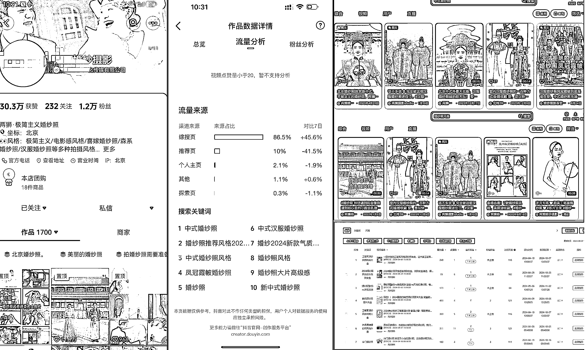
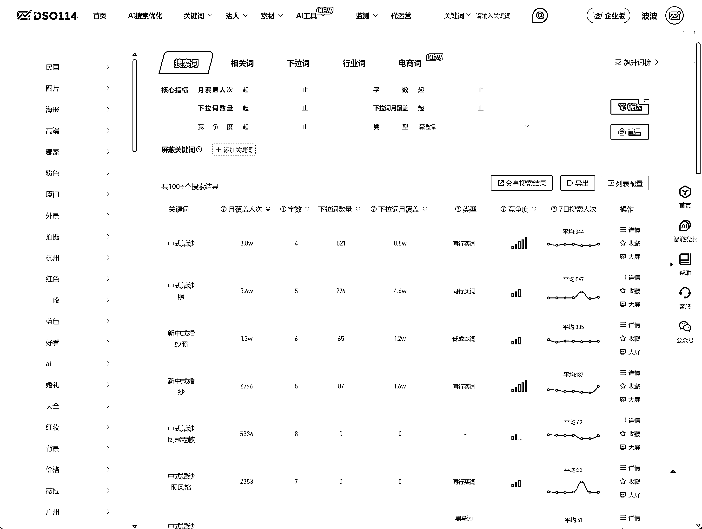
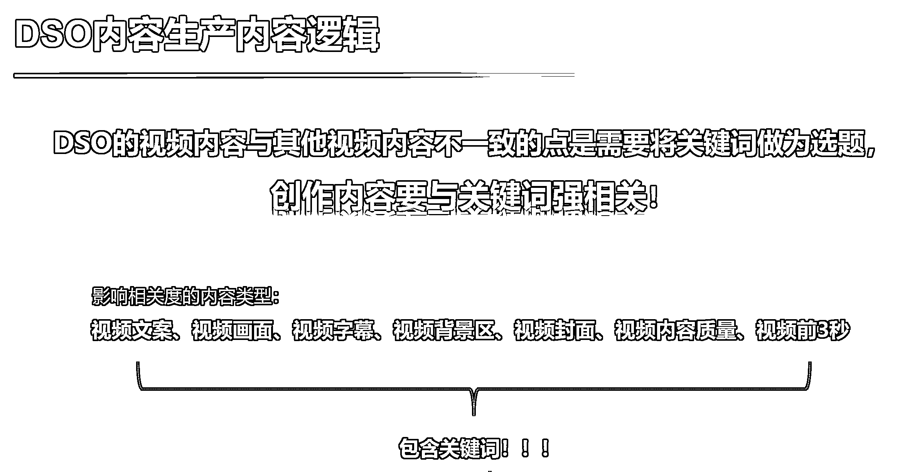
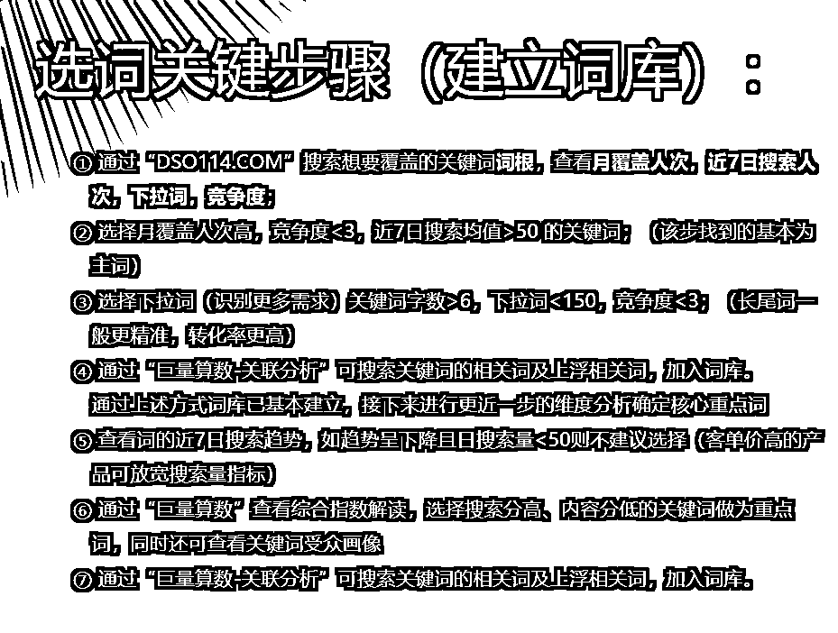
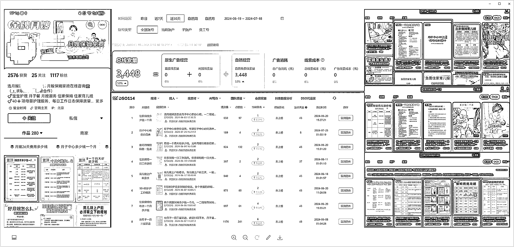
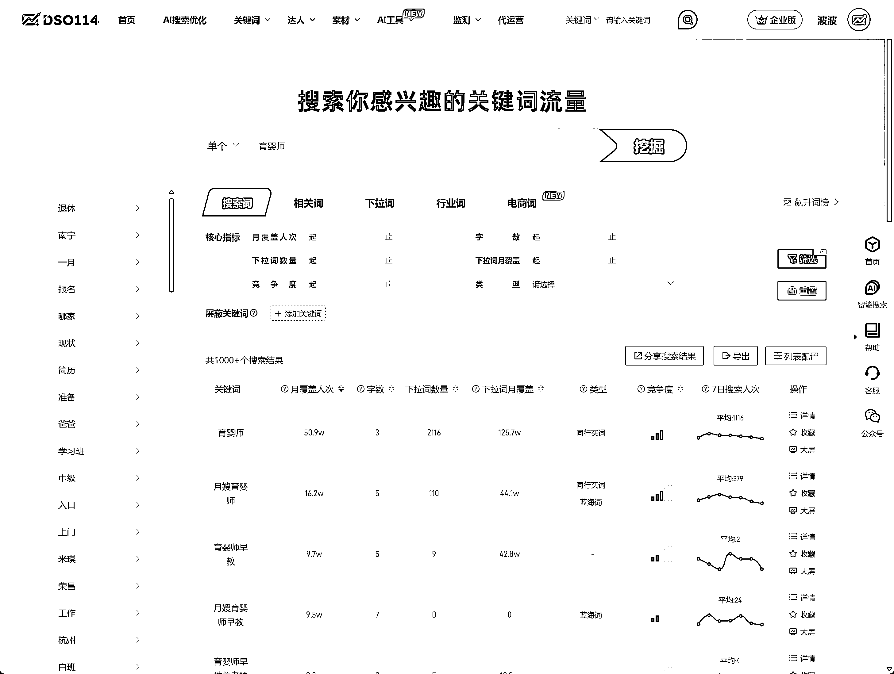
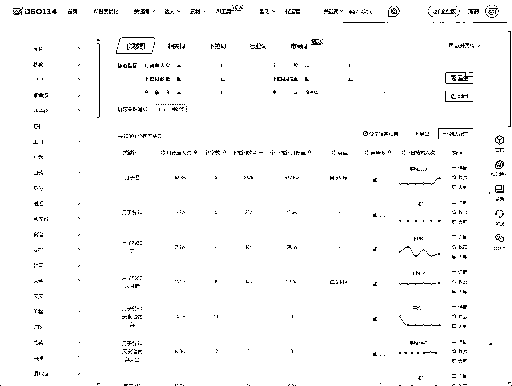

# 抖音本地业务（婚纱、保姆），蓝 v 账号（DSO）搜索优化实操案例

> 原文：[`www.yuque.com/for_lazy/zhoubao/xbulclpzaq3e9dwm`](https://www.yuque.com/for_lazy/zhoubao/xbulclpzaq3e9dwm)

## (34 赞)抖音本地业务（婚纱、保姆），蓝 v 账号（DSO）搜索优化实操案例

作者： 波波@抖查查@爱盈利

日期：2025-03-09

今天继续带来抖音搜索实战案例^_

每次给大家分享的，都是波波团队亲手实操的案例，放心参考！

**首先是一个婚纱摄影账号：**

经过一段时间的 DSO 优化，达到效果，**70%** 的发布**视频内容** 已经**获得目标关键词排名** ，综搜页流量来源占比**85%** 以上，0 投放的情况下，完成了高客单的高频转化，并且数据还在稳定增长。

下面是**账号主页+视频流量来源+作品封面标题+DSO 统计后台** 的 one page！

这里面核心的是选词，很好的一个词根是：“中式婚纱”。我们来看下相关词的搜索量：

数据来自：[www.dso114.com](http://www.dso114.com)

从上图可以看出，有不少长尾词的日均搜索量在几百上线浮动，如果拿到这些词，每天将会带来精准的线索转化。

如何让自己做的视频，覆盖想要做的关键词，最重要的就是在视频标题里面包含核心关键字，当然其他部分的内容也最好能够反复出现，这样如果视频的内容质量分达标，就会有非常大的概率覆盖关键词。

蓝 v 账号，保持持续的 DSO 内容生产，一个人就可以完成，选词、借助 AI 生成文案内容、按照 dso 的方式发布内容。一个人输出高质量 DSO 内容一天可以做 5 条。积累下来，搜索流量会很稳定。

**我们再来看第二个案例：保姆到家**

首先还是 one page：

该账号采用了图文内容去抢占关键词。月子菜谱、常见育儿问题、月嫂价目表...都是很好的内容方向。通过 DSO114 工具可以看到，类似育婴师这样的搜索词，在抖音有 1000+的长尾词可以选择，而且相关流量都是精准流量。

很多本地赛道都是可以通过抖音搜索进行引流的。无论你是到家业务还是到店业务，经营好蓝 v 账号，内容卡主关键词，就可以源源不断的获取精准主动搜的流量。

做好 DSO 第一步，然后就可以逐渐追求高阶搜索玩法：

1. 服务搜索需求拦截（最直接） ；

2. 信息搜索品牌植入（养品牌词/=行业词）；

3. 泛人群内容引导搜索（看后搜）；

4. 热门视频吸顶词和小蓝词截留（通过看后搜行为干预）；

搜索获客无疑是应对付费流量越来越贵的绝佳方式，无需老板亲自费心做个人 IP，线索获客，运营自己就可以全链路完成，如果流量稳定后，也可以通过出现几秒 IP 或者品牌的镜头来实现长期价值。

欢迎大家找我来交流 DSO 优化方法^_

历史 DSO 文章：

[轻度游戏 App，抖音搜索（DSO）引流实战案例](https://articles.zsxq.com/id_5355amrotlvr.html)

[财税线索获客：抖音搜索（DSO）案例拆解](https://articles.zsxq.com/id_xupwwrrpd0wz.html)

[留学行业在抖音一天免费搞几百条精准线索！](https://articles.zsxq.com/id_hwrs6kaqghs3.html)

[律师、法律行业利用抖音搜索（DSO）做号：自家实战案例](https://articles.zsxq.com/id_xhuiu54b43lt.html)

**1****.** **服务搜索需求拦截（最直接）**

**2****.** **信息搜索品牌植入（养品牌词/=行业词）**

**3****.** **泛人群内容引导搜索（看后搜）**

* * *

评论区：

暂无评论