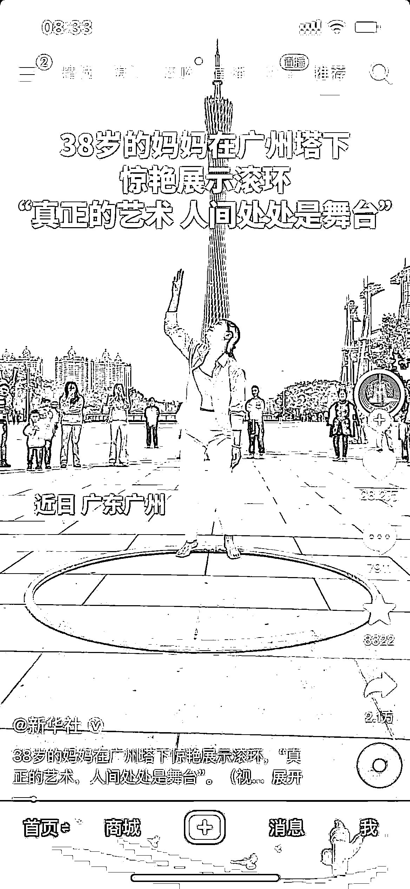
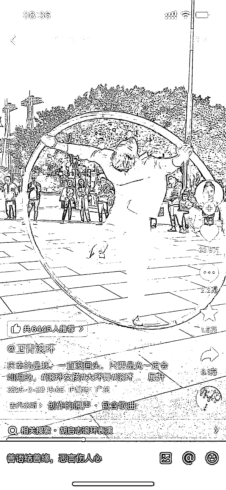
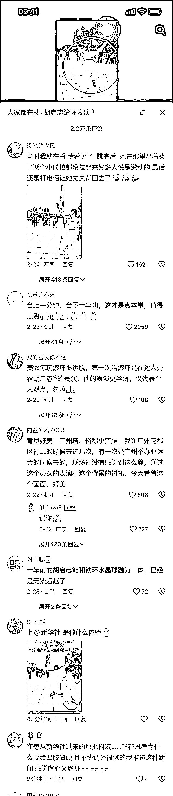

# 内容创作：用“人群垂直，内容不垂直“策略打造高黏性 IP 账号

> 原文：[`www.yuque.com/for_lazy/zhoubao/lnmu572nr5at9cpr`](https://www.yuque.com/for_lazy/zhoubao/lnmu572nr5at9cpr)

## (23 赞)内容创作：用“人群垂直，内容不垂直“策略打造高黏性 IP 账号

作者： 依琳

日期：2025-03-07

### **在做 IP 账号的内容创作中，你有没有遇到过：**

> 对标账号不更新了，不知道该发布什么样的内容了，自己失去了创作方向；

> 对内容方向感到迷茫，不知道该做什么样的内容

> 对用户需求把握不准确，不知道自己的用户群体到底想看什么

> 好像创意枯竭了，遇到创作瓶颈，没有灵感了

> 同样的内容模版已经发到想吐了，依然没有流量

> 内容发布后无人问津，缺乏曝光和互动。

> 自我怀疑，觉得内容不够好，创作过程中感到疲惫，缺乏动力。

这些问题背后，往往是因为我们走进了极窄的标签里，忽略了一个核心真理：**做 IP 账号，就是找准一类人，服务他的全部人生** 。

## 一、标题的筛选机制：

### **1.1 同一内容，两种标题，两种受众**

最近，我刷到新华社抖音号的一个视频，封面醒目的标注着：**38 岁的妈妈在广州塔下惊艳展示滚环-“真正的艺术 人间处处是舞台”** 。

> 我把封面的这个短内容理解为视频的标题，以下也会用“标题”来称呼它。

这简单几个字就立刻给我构建了一个故事框架：一个 38 岁，生了孩子的妈妈，依然在坚持一项高难度艺术表演。

没有过多的解释，但是这个标题就成功的吸引我停留——因为"38 岁"与"妈妈"这两个标签与我自身重叠，让我瞬间产生了共鸣。

带着好奇，我点进了表演者本人（卫青滚环）的账号。有趣的是，同样的内容在她那里呈现方式完全不同：**无封面标题，视频描述为"庆幸的是我，一直没回头，只要是光一定会灿烂的。#滚环女孩"** 。

对于我来说，如果第一个刷到的是这个视频，可能我只会感叹一下好厉害，就没有别的情感共鸣，直接刷过去了。

> 基于对网感的训练，请大家再思考一个点，这 2 个视频还能吸引什么样的人群呢？（请先思考，后面揭晓）

### **1.2 评论区的差异化生态**

"38 岁妈妈滚环艺术"与原创者"庆幸的是我，一直没回头"这两种表述方式展示，虽然是相同的内容，但是通过不同标题框架，吸引了截然不同的受众群体，也形成了两种评论区生态：

**官方账号的评论区里，视频的主要受众群体是：**

1.  中年女性：看到同龄人展示才艺，产生共鸣和激励

2.  艺术爱好者：欣赏民间艺术表演和技巧展示

3.  广州当地居民：熟悉地标，对本地发生的有趣事件感兴趣

4.  宝妈群体：被"38 岁妈妈"这一身份标签吸引，获得自我价值感启发

5.  年龄群体：对"38 岁、妈妈"标签本身的讨论

6.  短视频日常用户：喜欢正能量、轻松有趣的生活内容

 images.zsxq.com/FrnVHzlhSDzERMr0QtLgQn87a1ap) images.zsxq.com/FnNRNPCaF9yK0xavMROyrjVBsAe8)

**从滚环表演者本人的视频来看，她的视频核心受众是：**

**  **

1.  艺术杂技爱好者：对滚环这类传统杂技艺术感兴趣的人

2.  短视频平台浏览者：被优美、特殊的表演形式吸引

3.  积极心态追求者：视频配文"一直没回头，只要是光一定会灿烂的"传递积极人生态度

4.  过客 ：因为官网的视频被吸引过来评论的。

这种多元的反应恰恰验证了标题的引流效果——**它不仅是描述内容，更重要的是定向找寻目标观众。**

### **1.3 标题是筛选受众的第一道门**

官方媒体的"38 岁妈妈"标签并非凭空而来，而是从原创者置顶视频中提取的信息。

> .
> 官方媒体强调"38 岁"和"妈妈"这两个标签，是为了突出一名在传统观念中，通常被认为应该专注于家庭的年龄和角色下，依然能够展现个人才华和追求艺术的精神。这种强调有助于打破社会对特定年龄和身份的刻板印象，传递出积极的信息：即无论年龄多大，无论承担着什么样的社会角色，每个人都有追求自己梦想和展示自己才华的权利，同时也更容易引起目标观众的共鸣。

> .
> 表演者视频的描述是以“我”为主的，将自己定义为艺术的追寻者，聚焦于表达对艺术的热爱，而不是特意强调自己的年龄或母亲身份，她传递的是对艺术的真挚热爱和不断探索的精神。

**标题不仅仅是内容的简介，更是一种强大的受众筛选机制。标题是定义内容与筛选受众的第一道门。** 同一个内容，标题不一样，吸引的目标受众就不一样。

对内容创作者而言，在内容创作的过程中要一直提醒自己：**我们不是在向所有人说话，而是在通过标题选择与谁对话。**

## 二、标题的四重功能

**标题就像内容的"门面"，它有四重功能，以上面的视频内容举例** ：

### **2.1 设置观看预期** ：引导观众以特定角度理解内容

1.  "38 岁妈妈滚环表演"→吸引关注普通人非凡成就的观众，引导观众关注打破年龄与身份限制的励志故事

2.  "滚环艺术精湛演绎"→吸引专注于技艺本身的观众，引导观众聚焦技艺本身的美学价值

### **2.2 触发身份认同** ：激活特定群体的身份认同

1.  用"妈妈"标签→让家庭主妇更易产生"她能做到，我也可以"的共鸣

2.  用"艺术"标签→让专业群体更关注技巧细节，创新与传承

### **2.3 激活算法推荐机制** ：影响平台推送和用户画像

1.  含"妈妈"、"38 岁"等标签→更可能推送给中年女性用户

2.  含"艺术"、"滚环"等专业术语→更可能推送给文化艺术爱好者

### **2.4 构建情感预期** ：设定读者的情感体验预期

1.  "大龄挑战"类标题→激发鼓舞感，励志、突破自我

2.  "技艺传承"类标题→唤起文化自豪感，文化传承、艺术欣赏

内容虽然相同，但标题设定的"观看框架"会直接影响观众的关注点和情感反应，进而影响互动行为和传播路径。

## 三、如何战略性地设计标题

了解了标题的筛选机制和四重功能后，我们可以更战略性地设计标题，吸引目标受众：

### 3.1 **定位核心受众群体**

在我们创作前就要明确：**谁是你最想触达的人群？**

1.  特定年龄段（如"35+职场女性"）

2.  特定身份群体（如"二胎妈妈"）

3.  特定兴趣爱好者（如"传统艺术爱好者"）

4.  特定价值观人群（如"追求自我实现的中年人"）

### 3.2 **运用"标签组合"原理**

高效标题往往是精准标签的组合艺术：

1.  人群标签（妈妈、职场人、00 后）

2.  专业标签（滚环、艺术、技艺）

3.  情感标签（坚持、突破、蜕变）

4.  价值标签（成功、自由、认同）

如"38 岁妈妈"（人群）+"滚环艺术"（专业）+"惊艳"（情感）的组合。

### 3.3 **制造张力与反差**

最具吸引力的标题往往包含某种张力：

1.  身份与行为的反差（"宝妈"与"高难度表演"）

2.  年龄与成就的反差（"38 岁"与"精湛技艺"）

3.  期待与现实的反差（"被认为不可能"却"成功实现"）

### 3.4 **不同平台的标题策略差异**

1.  公众号：可用较长标题，适合设置悬念和问题

2.  短视频：简短直观，关键信息前置，视觉冲击为主

3.  小红书：强调情感共鸣和话题讨论性

内容创作不仅是表达自我，也是与特定受众建立连接。标题作为这一连接的第一环节，本质上是一种战略决策。

掌握标题的艺术，就是掌握了决定谁会看到你内容、如何理解你内容的主动权。每一个标题选择，都是在定义你想与之对话的世界。

而最高明的内容创作者，不仅知道如何吸引受众，还能通过精心设计的标题，找到那些最能与你内容产生共鸣的灵魂。

## 四、人群垂直，内容不要垂直

### **4.1 核心概念**

"人群垂直，内容不垂直"是内容创作的战略性思维，它包含两层关键含义：

1.  **人群垂直** ：明确定位特定人群画像，建立精准连接

2.  **内容不垂直** ：为这一固定人群提供多元化内容，满足其不同场景和多维需求

这种策略是基于一个基本事实：**一个人虽然有特定身份标签，但生活需求却是立体多元的。**

以"宝妈"这一垂直人群为例，她们的需求远不止育儿知识，还有：

1.  **母亲身份** 相关：育儿经验、早教方法、亲子活动

2.  **女性身份** 相关：形象管理、自我保养、情感需求

3.  **伴侣身份** 相关：夫妻关系、家庭沟通、共同规划

4.  **职业身份** 相关：工作平衡、职场复归、副业发展

5.  **个体身份** 相关：心理健康、兴趣培养、社交需求

6.  **家庭管理者** 相关：家庭理财、居家布置、高效采购

若只是提供单一的育儿内容，便会错失了与这一群体建立全方位连接的机会。

> 注意：对于内容创作新的不能再新的新手来说，这个策略并不适合你的起点选择，“人群垂直，内容不垂直"是一个值得追求的目标模式，但需要分阶段实现。
> 
> 最适合新手的路径是：先通过垂直内容积累特定人群，再基于用户反馈逐步扩展内容边界。

### **4.2 策略优势**

#### **4.2.1 用户黏性与留存优势**

**垂直内容的困境** ：

1.  单一主题容易导致内容疲劳：比如定位的家居和装修，一直是这样的内容，可能会让关注者觉得内容重复，缺乏新鲜感。

2.  用户需求满足后易流失：比如你刚好需要装修，关注了这类账号，但装修完了，你可能就觉得没必要再关注了。

3.  生命周期受限于特定阶段需求：家居和装修不是日常需求，很多人可能只在需要时才会关注这类信息。

**多元内容的优势** ：

1.  通过多维度满足建立长期关系：我想，有不少人和我一样是因为航海活动/生财航海家/线下聚会等活动更加喜欢生财的，而不是单一的刷帖子

2.  覆盖用户不同生活场景需求：生财里不仅仅是赚钱的信息，还可以聊聊日常、聊聊生活、聊聊感情

3.  随用户生命阶段变化持续提供价值：看帖→航海实战→线下聚会→航海家→生财赋能→发帖分享经验→继续看帖，这是我理解的生财有术在做的事情，持续为用户创造价值并增强用户粘性的闭环过程，最终是我们和生财有术共同成长。

**举个例子：束束的小红书账号**

拿小红书束束来说，她定位的是“家居/改造/装修干货”。如果她只聊这些，可能等大家装修完了，就不再关注她了。所以，束束开始尝试新的东西：

1.  **内容多样化** ：她开始做一些“沉浸式系列”，比如购物啊，清洁啊，这样她的内容就不再局限于装修了。

2.  **满足更多需求** ：通过增加这些新内容，束束能覆盖到大家生活中更多的方面，比如日常购物和家庭清洁，这样大家就会更愿意关注她。

3.  **让大家更愿意留下来** ：通过不断提供和生活紧密相关的内容，束束能让大家觉得她的内容一直都很有价值，这样大家就更愿意留下来，继续关注她。

 images.zsxq.com/FhrXPAp5Ae_5bSMRNWYYSvTl5xPw) images.zsxq.com/Fj7UPgS_ccj_9Ejy_rE4xNBoZtje)

#### **4.2.2 创作持续力与扩展性**

**垂直内容的局限** ：

1.  创作者易遇瓶颈期与内容枯竭

2.  话题深度挖掘后难以创新

3.  市场热点变化风险高

**多元内容的优势** ：

1.  降低创作者题材枯竭风险

2.  提供更多创意交叉点

3.  增强面对市场变化的适应性

#### **4.2.3 商业变现的多元可能**

**垂直内容的变现瓶颈** ：

1.  产品推荐局限于单一品类

2.  用户价值被单一需求限制

**多元内容的变现优势** ：

1.  创造多元商业合作机会

2.  提高用户生命周期总价值

3.  建立更全面的商业模式

### **4.3 实操方法论**

#### **4.3.1 人群定位要精准**

先通过清晰标签组合定位核心人群：

1.  人口统计标签（年龄、性别、收入）

2.  身份角色标签（职业、家庭角色）

3.  地理位置标签（城市级别、区域特点）

4.  价值观标签（生活态度、核心追求）

例如："一线城市、30-40 岁、追求品质生活的职场妈妈"

#### **4.3.2 内容矩阵要全面**

在定位人群基础上，建立多支柱内容系统。**以宝妈群体为例** ：

1.  **支柱一** ：育儿科学（专业知识分享）

2.  **支柱二** ：职场平衡（工作家庭兼顾技巧）

3.  **支柱三** ：自我成长（个人提升与修养）

4.  **支柱四** ：家庭管理（高效家务与规划）

5.  **支柱五** ：情感关系（与伴侣、长辈相处）

#### **4.3.3 内容连接要自然**

多元内容间需要建立内在关联，避免割裂感：

1.  统一的叙事视角（例如始终以"宝妈视角"切入不同话题）

2.  一致的价值观表达（例如"高效、科学、平衡"的生活理念）

3.  相似的表达风格（语言、美学、排版保持一致性）

4.  核心 IP 形象贯穿（创作者个人形象或品牌形象一致）

#### **4.3.4 通过数据验证调整**

及时查看后台数据，不断进行调整：

1.  监测不同内容支柱的受众反馈与互动

2.  识别最受欢迎的内容类型与主题

3.  根据用户生命周期变化调整内容比例

4.  通过评论反馈发现潜在内容机会

## 五、平衡标签："我"与"被定义的我"

虽然说了那么多关于标签的定义。但是实际上，作为一个思维跳脱、兴趣广泛、今天喜欢/明天可能厌倦的人，我本能地抗拒被简单标签定义。我相信人区别于动物的根本在于思考能力与情感流动性，我深信"每一个自己都会在下一秒新生"。

然而，人类社会运转的基础却是对他人的标签化理解，比如："3 岁看老"的断言、"20 多岁该结婚"的期待、"35+不能考公"的限制、"50 多岁应有的生活方式和穿着"等等……无处不在的标签束缚着我们对自我和他人的认知。

但是呢，**作为内容创作者，我们需要利用标签找到受众；作为个体，我们又抗拒被标签定义。**

**  **

在这种矛盾中，我选择的平衡方法是：接受标签作为内容分发的工具，但确保内容本身是传递积极、正能量的价值观。因为我不希望自己、家人或任何人在被人贴上标签后，给我们传达的信息是负面的、消极的、甚至危及生命健康和财产损失。

我们要学会在"标签"与"无限可能"之间自如行走，既不拒绝人们通过标签找到我们，又不让这些标签定义我们生命的全部意义。

正如那位 38 岁的滚环妈妈，她既是母亲，也是艺术家，更是追逐光明的个体。标签只是理解她的一扇窗，而非囚禁她的牢笼。

在这个时代，我们都是标题的创作者，也是被标签定义的个体。我希望和大家一起理解标签背后的多元可能性，保持对自我和他人定义的开放态度。

## 六、最后想说的话

"人群垂直，内容不垂直"的核心价值在于：**它充分尊重了人的复杂性与全面性** 。我们每个人都不是单一标签的集合，而是由无数需求、兴趣与身份构成的立体个体。

成功的内容创作者不是简单地对人群进行标签化处理，而是在理解特定人群基础上，洞察他们生活的全貌，并通过多元但有机连接的内容矩阵，建立长久而深入的关系。

真正的内容策略高手，是既能精准定位目标受众，又能全面满足这一受众多元需求的人。他们懂得：**找准一类人，服务他的全部人生** 。

**我是依琳，一个持续在路上的学生，正在探索内容创作的过程中。希望和大家一起探讨更多内容的可能性，碰撞出更多有趣的想法，一起在创作的道路上越走越远！**

* * *

评论区：

暂无评论