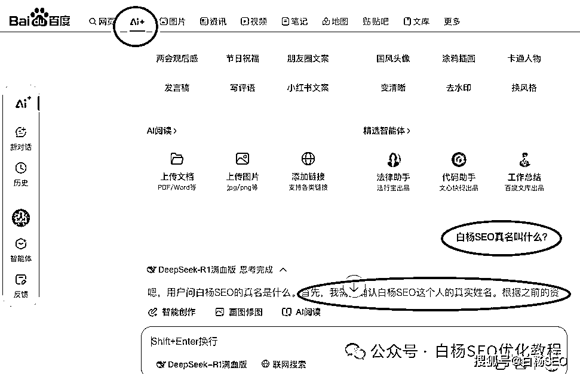

# 白杨 SEO：简单聊聊 GEO、AIO、AISEO、AI 搜索优化与 SEO 有什么相同和不同？

> 原文：[`www.yuque.com/for_lazy/zhoubao/mfqp8y8qummivtr2`](https://www.yuque.com/for_lazy/zhoubao/mfqp8y8qummivtr2)

## (13 赞)白杨 SEO：简单聊聊 GEO、AIO、AISEO、AI 搜索优化与 SEO 有什么相同和不同？

作者： 白杨 SEO

日期：2025-03-07

**一、GEO、AIO、AISEO、AI 搜索引擎是什么意思？**

GEO 是什么意思？

GEO 是 Generated Engine Optimization 三个英文单词简称，Generated 是产生或生成的意思，所以**GEO 是生成引擎优化** 的意思。

目前世界上生成引擎有哪些？生成引擎分文本，图片，声音，视频等生成引擎。

白杨 SEO 随机举例几个：比如文本生成引擎有 chatgpt、文心一言、kimi、deepseek 等；图片生成引擎有 Midjourney、智谱 AI 绘画等；音频生成有 suno、马克配音等；视频生成引擎有 sora、可灵、清影 2.0 等。

AIO 是什么意思？

AIO 是 AI+Optimization 组合，**AIO 是 AI 优化** 的意思，这里的 AI 优化主要指：生成引擎优化、AI 搜索引擎优化与新媒体平台 AI 搜索结果优化的总称。

AISEO 是什么意思？

简单理解**AISEO 是 AI 搜索引擎优化** 的意思，即 SEO 结合 AI 技术来优化内容，使其在传统搜索引擎和 AI 驱动的搜索引擎中都能获得良好的被看到。

AI 搜索引擎是什么意思？

所谓 AI 搜索引擎，不再是单纯问答 AI 大模型机器，它能理解用户意图，满足更多用户需求，不再局限于关键词等。目前有：秘塔搜索、纳米搜索、百度 AI 搜索、天工 AI 搜索、开搜 AI、博查 AI 搜索等。如图，

上面说完了 GEO、AIO、AISEO、AI 搜索引擎，我相信你现在明白了他们是什么意思了吧？以后别人再提到这个词你也能快速看懂，哈哈哈。

**GEO、AIO、AI 搜索优化与 SEO 有什么区别？**

生成引擎优化，AI 优化，AI 搜索优化与 SEO 搜索引擎优化有两个共同点：

一是都是需要用户**主动提出需求** ，不管是一大段文字还是一个关键词；

二是回答的内容都是需要与用户的需求具有**相关性** 。

生成引擎优化，AI 优化，AI 搜索优化与 SEO 搜索引擎优化区别不同点：

1、它们各自的优化对象不同。

SEO 主要是优化对象是网站，而生成引擎优化，AI 优化，AI 搜索优化优化的是我们要做推广的品牌词或者业务词，不一定是网站。

2、它们各自的呈现规则不同。

搜索引擎优化的规则是关键词相关和外链权重等，而生成引擎优化，AI 优化，AI 搜索优化他们则是这个内容在他们那里占比的权重。

3、它们优化的渠道难易程度各不相同。

搜索引擎优化规则相对容易，有相关文档。而目前各个 AI 大模型都没有完全开源自己的生成规则，以及每个 AI 工具回答不一样，同一个 AI 大模型提同样问题，答案也有不同，更别说 PC 和手机端也不同，所以 AI 优化相关搜索引擎优化更难。

**AISEO、AI 搜索引擎优化与 SEO 有什么区别？**

我们上面说到，AISEO 就是 AI 搜索引擎优化。

AISEO 与 SEO 相同点之一就是：都可以去做搜索引擎优化，也就是去在搜索引擎做关键词排名，不管是百度还是谷歌。比如之前用采集组合等方式生成网站内容，现在用 AI 批量生成内容来做流量。

还有比如，也有人用 AI 工具来做 SEO 网站诊断等，AI 结合新媒体来做，这就是我们说的 AI 工具结合 SEO 搞流量，我在之前写过如何用生成式 ai 工具结合 SEO 以知乎为例获取百度搜索流量等等。

AISEO 与 SEO 有什么区别呢？

最主要的区别的 AISEO 前面加了个 AI。正因为有了 AI 生成式工具的出现和加持，让做 SEO 更高效，快捷。

**作者介绍：**

白杨 SEO，专注 SEO 研究十年以上，全网 SEO 流量实战派，AI 搜索优化研究者。前某公司市场总监，现自由职业，企业营销顾问，宏远硕 CEO。全网同名个人品牌：白杨 SEO。

**相关推荐：**

[SEO 还有用吗？AI 或 AI 搜索会取代搜索引擎吗？](https://mp.weixin.qq.com/s?__biz=MzU2NTQzMzA4Nw==&mid=2247500286&idx=1&sn=d6c668b9e839d86b3d93aaf7a8e859e5&scene=21#wechat_redirect)

[微信搜索新变化，推出 AI 问答，那些搞长尾词流量还能做吗？](https://mp.weixin.qq.com/s?__biz=MzU2NTQzMzA4Nw==&mid=2247500620&idx=1&sn=ed6495269fde7f3a34b402cb268336e6&scene=21#wechat_redirect)

* * *

评论区：

暂无评论