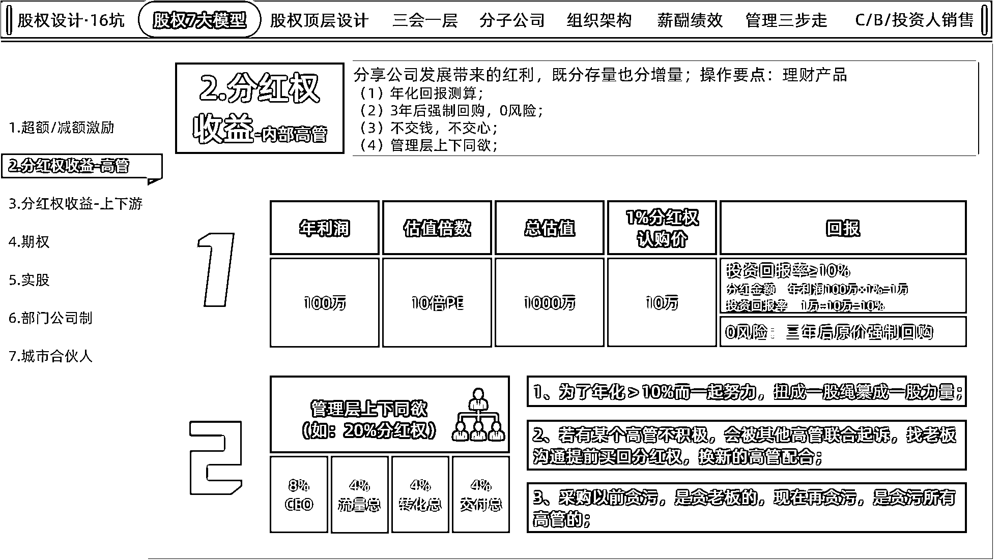

# 股权激励落地分享： 从雇佣到合伙，理发店实现净利润增长 19%

> 原文：[`www.yuque.com/for_lazy/zhoubao/zd4844cqlh8qv2ng`](https://www.yuque.com/for_lazy/zhoubao/zd4844cqlh8qv2ng)

## (34 赞)股权激励落地分享： 从雇佣到合伙，理发店实现净利润增长 19%

作者： 深圳刘宁培

日期：2025-03-07

**大家好，我叫刘宁培，生财第二期进入，续费至今的老圈友；**

**主业企业咨询：** 擅长股权、薪酬、管理体系；

**综合能力模型：** 项目 0-1 跑通，项目市场容量大的情况下，擅长做将项目的体量从 1 做到 10，能做利润/业绩翻倍；

**副业做点投资：** 开开知名品牌的加盟店（目标 5 个品牌开 50 家店），年底线下摆摊卖卖红包对联；

### **前言：**

我是一家连锁理发品牌优剪的加盟商，角色是纯财务投资人——出钱开店、选址、挂上品牌，之后完全交给总部派来的店长、店员运营。今天分享股权激励落地，从雇佣到合伙，理发店实现净利润增长 19%
。有详细的底层逻辑、落地流程，不管是实体店的、还是开公司的，都可以直接套用。

**该门店利润情况**

2021 年年利润：9754 元；

2022 年年利润：25251 元；

2023 年年利润：168928 元；（销售额 71 万）

2024 年年利润：200621 元；（销售额 76 万）

2025 年 1 月份利润：30486 元，今年年利润目标冲 25 万；

**（2024 年的销售额比 2023 年多 5 万，利润比 2023 年多 3 万，店长入股后也降低了门店的综合成本）**

这家理发店挺波折的，正式开业的时间是 2021 年 1 月，还处于疫情时不时封村封店的阶段。封村封店导致导致店长、店员收入不稳定，所以店长、店员频繁调动、离职，看着 2021 年-2022 年的利润时，实在闹心。

转机出现在 2023 年。

**转机 1：** 中国疫情全面放开的时间是 2022 年 12 月 13 日。2023 年慢慢放开了，小区入住率越来越高了，门店每月利润越来越高了。

**转机 2：** 店长（不知道是该店第几任的店长）主动找到我，提出：“老板，我想成为门店的合伙人，投钱入股，参与分红。这样我能赚更多，您也能更省心，包括在物料支出板块，每个月都可以省点钱。”

作为企业咨询顾问，我深知“分钱”才能“分责”+“不交钱不交心”。

店长只是“打工人”，店长收入和门店利润没有直接关系，所以店长的积极性始终有限。如果店长能从门店的利润中直接获益，他的积极性必然不同。

我快速敲定一个比较简单股权激励方案：**分红权收益/虚拟股权激励。**

通过这个方案的落地、推进，结果远超预期。在同样的地段、更激烈的竞争环境下，2024 年门店净利润增长 19%，店长通过分红多赚了 32000 元左右，我的投资回报率也更高，预计 2025 年的利润会更高。

因为 2025 年 1 月份的利润是 30486 元，历史最高单月利润。给店长月月分红的正反馈。

以下是本篇内容分享的主题：

一、分红权收益/虚拟股权激励的底层逻辑；

二、分红权收益/虚拟股权激励的落地步骤；

三、为什么要做股权激励？

### **一、分红权收益/虚拟股权激励的底层逻辑；**

核心：分红权收益，分享公司发展带来的红利，既分存量也分增量；操作要点：把分红权收益当做一个“理财产品”；

1、年化回报测算；

2、三年后强制回购，0 风险；

3、不交钱，不交心；

4、高管层上下同欲；

5、Q&A；

6、分红权收益的两大前提；

#### **1、年化回报测算；**

若项目 0-1 跑通，公司是朝阳行业且业绩连年增长，10 倍 PE 为总估值（年利润×10），是比较公允的价格；

**（1)若分****存量****利润分红：投资回报率是 10%。**

举例 1：

某公司年利润是 100 万，10 倍 PE 为总估值，公司的总估值是 100 万×10=1000 万；

某高管买公司 1%的分红权，认购价是 1000 万×1%=10 万；

若未来年利润不变，还是 100 万年利润；

高管的分红金额=100 万×1%=1 万；

高管的投资回报率=1 万÷10 万=10%；

举例 2：

某公司年利润是 100 万，5 倍 PE 为总估值，公司的总估值是 100 万×5=500 万；

某高管买公司 1%的分红权，认购价是 500 万×1%=5 万；

若未来年利润不变，还是 100 万年利润；

高管的分红金额=100 万×1%=1 万；

高管的投资回报率=1 万÷5 万=20%；

以此类推：

3 倍 PE 为公司总估值，投资回报率（年化）是 33%；

2 倍 PE 为公司总估值，投资回报率（年化）是 50%；

1 倍 PE 为公司总估值，投资回报率（年化）是 100%；

**如下图所示↓↓↓↓↓↓**

**（2)若分****增量****利润分红：投资回报率＞10%。**

举例 3：

某公司年利润是 100 万，10 倍 PE 为总估值，公司的总估值是 100 万×10=1000 万；

某高管买公司 1%的分红权，认购价是 1000 万×1%=10 万；

若未来年利润增加，总利润是 120 万；

高管的分红金额=120 万×1%=1.2 万；

高管的投资回报率=1.2 万÷10 万=12%；

举例 4：

某公司年利润是 100 万，10 倍 PE 为总估值，公司的总估值是 100 万×10=1000 万；

某高管买公司 1%的分红权，认购价是 1000 万×1%=10 万；

若未来年利润增加，总利润是 150 万；

高管的分红金额=150 万×1%=1.5 万；

高管的投资回报率=1.5 万÷10 万=15%；

**如下图所示↓↓↓↓↓↓**

#### **2、三年后强制回购，0 风险；**

高管无论参与存量利润分配或增量利润分配，高管的分红权收益，在三年后由公司强制回购。

意味着三年后，公司将以原价 10 万赎回高管 1%的分红权，并且此后该高管不再享有这部分分红。

这个动作的实际目的不是不再给高管分红，实际目的确保高管对公司的投资无风险，因为公司会保证回购。

#### **3、不交钱，不交心；**

高管需付费购买公司分红权，不购买则不参与利润分享。不交钱，不交心。切记切记！！！

#### **4、****高管层上下同欲；**

公司四大负责人：CEO（总操盘）、流量总（流量进线）、转化总（转化率）、交付总（满意度+产品迭代），

管理层需团结一心，不能只对一个人做分红权收益激励，尽量这 4 个负责人都做分红权收益激励；

**好处一：** 大家为了共同目标（年收益超 10%）一起拼，劲往一处使，正所谓“上下同欲者胜”。

否则就会出现这种情况：

CEO 有分红权收益，我流量总没有，我完成我该做的工作量就行；

流量总有分红权收益，我转化总没有，我完成我该做的工作量就行，要加班你们加；

> 这里引用下孙子兵法·谋攻篇的内容：（第三，上下同欲者胜）
> 
> 故知胜有五，知可以战与不可以战者胜，识众寡之用者胜，上下同欲者胜，以虞待不虞者胜，将能而君不御者胜。
> 
> 翻译：可以预见胜利的五个方面:
> 
> 第一，凡是能看清客观实际情况，知道什么时候可以打，什么时候不可以打的，大概率会胜利；
> 
> 第二，懂得用兵，能够根据战况合理分配兵力的，大概率会胜利；
> 
> 第三，国内、军内上下一心的，也大概率会胜利；
> 
> 第四，交战时，准备充分可随机应变的一方，大概率会胜利；
> 
> 第五，将帅有指挥才能(包括道、天、地、将、法)，国君不加以干涉的，大概率会胜利。
> 
> 此五条，是预见胜利的五个基本条件。

**好处二：** 谁要是不上心，其他高管可不答应，会联手找老板，要求收回分红权，换人上阵。毕竟，团队里不能有人拖后腿。

例如前端流量总的流量进线挺好，转化总的主要时间精力不在公司上面，而是吃饭逛街看电影谈恋爱。会被其他有分红权收益的高管联合找到老板要求收回分红权，换人上阵。有一个端口不积极，其他端口越积极，越浪费。

**好处三：** 采购以前贪污，是贪老板的，现在再贪污，是贪所有高管的；当然，这种话不是老板对高管们说的，是上门落地方案的时候，我来说的，毕竟外来和尚好念经。

**如下图所示↓↓↓↓↓↓**

#### **5、Q &A**

上门落地分红权收益方案常被问的问题：

**（1）是不是一定要收钱？**

答：要收钱，不交钱不交心，员工给钱，员工就敢承担风险与责任，员工不干给钱，员工就不会承担风险与责任。

相信过往大家谈过某些合作，最后都不了了之，因为没谈“出多少钱”。

**（2）总估值必须用 10 倍 PE 吗？5 倍或 1 倍行不？**

不一定，估值倍数灵活，5 倍、3 倍均可，看老板分配意愿。但 1 倍 PE 不太建议，相当于年化 100%，分红权显得廉价。

**（3）年利润下滑，不足 10%年化怎么办？**

年利润减少不影响，参考余额宝、零钱通等年化 1-2%。积极做事不应导致利润大幅下滑至往年的 20%以下。

**（4）年利润为负，如何处理？**

员工以借款形式投入的资金，若次年利润为负，公司可还款给员工，废除分红协议。

#### **6、分红权收益的两大前提；**

**（1）老板的诚信，比黄金还重要。**

如果一家公司
拖欠工资是常态，年度奖金说减就减、高管都是亲戚户、想办法扣掉高管的高提成、不重视客户的交付、天天画大饼，所有的方案都是一张废纸，因为员工不相信，不相信则不会投钱。

**（2）分红权收益的激励对象：筛选＞培养**

分红权收益要激励那些渴望赚钱和存钱的人，筛选出想赚钱、想存钱的人，不管出于哪种原因或者压力，是买车买房还是讨老婆，是他想赚钱、存钱，不是我逼他赚钱、存钱。（有很多人，真的是带不动的）

不管是薪酬绩效、KPI、OKR、积分制、分红权收益，这些管理、激励方式都是术的层面，这是“因”，员工最后到手的收入，才是“果”；

如果公司用了制定相关的薪酬/分红制度，员工也更积极完成工作，员工最后到手的收入能不能比同行高 10~20%？如果不能，离开是早晚的事情。

> 讲一个大数据：不要去压基本工资，假设一家公司，给你高 20%的工资，全世界的高管有 90%会走。
> 
> 理由如下：年终结余（年终存款、年终净利等）
> 
> 我以前是惠氏公司的销售，底薪 4000 元+绩效 3000 元，一个月到手收入是 7000 元。每个月开销约 5000 元，月存款 2000 元，年存款 24000 元；
> 
> 若 A 公司花 9000 元（工作量差不多）挖我，我大概率会跳槽过去，同理可得，一年存款 4.8 万，虽然月薪只增加了 30%，但存款翻倍；干一年等于之前干两年；
> 
> B 公司花 15000（工作量增加）挖我，我肯定跳槽，同理可得，一年存款 12 万，虽然收入增加了 110%，但存款翻了 5 倍；干一年等于之前干五年；

**如下图所示↓↓↓↓↓↓**

### **二、分红权收益/虚拟股权激励的落地步骤；**

这家理发店店长成为分红股东的大概时间过程：

**2023 年 7 月 13 日：** 店长提成想要成为门店股东拿利润分红

**2023 年 7 月 15 日：门店按最初投资价估值 236144 元（不溢价），给店长购买 10%的分红权，店长嫌少**

商铺合同首签 3 年，剩半年合同到期，店长担心半年后房东恶意涨租，提出等续签商铺合同后再交钱入伙。

**2023 年 7 月 17 日：店长原话：培哥你知道的，做我这行时间久来钱慢，一点积蓄都是一刀一刀剪出来的，我暂时不想把宝押在一个二房东身上。**

 images.zsxq.com/Fs4Ici7Z5Bw7M5OXVbO4YbLwefxd) images.zsxq.com/Fk_A8T3SwAOPhjlWa89VlfnUCoRq)

**2023 年 12 月 13 日：** 跟二房东续约 3 年商铺合同

**  **

**2023 年 12 月 13 日-14 日：沟通合同细节，最后给店长购买 20%的分红权收益，3 年后可退出，店长退出的话，我花原价回购（我不缺店长 4 万多的现金流，回到前面讲的底层逻辑，一定要收钱，不交钱，不交心）**

 images.zsxq.com/FjsTUlqpWDD6_kG59mlrlBFz05JB) images.zsxq.com/FlxERR_noLaYDuEv2iaJXi0lvWqR) images.zsxq.com/FiqCCnl2gMubHMcW9phlinKDLovZ)

**2023 年 12 月 14 日：收钱**

 FF6aub)

#### **及时满足，月月分红，给店长的年分红÷店长的总投资=年化 70%左右**

#### 

结合上述跟店长谈判、签约、分红等事宜，

#### **以下实操落地的“12 定”不分先后顺序，查漏补缺都有做到即可。**

#### **1、顶层控制权：**

分红权收益/虚拟股权激励，因为不涉及到增资扩股、股权转让等步骤让高管实名成为工商注册的股东，所以只有分红权，没有表决权，不存在对公司控制权的影响。

#### **2、进入层面：**

**定目标：** 既分存量、也分增量；

**定时间：** 开始时间（合同签约即可开始）、结束时间（3 年后可退出）、分红发放时间（月月分红）；

**定价格：** 最开始投资的总金额为总估值 236144 元；（没给店长高溢价，差不多是给店长送钱，店长目前的年化回报是 70%左右，没给店长高溢价理由有两个，一一个是附近多了两家竞争对手，二是我希望绑定店长 3 年）

**定权力：** 不是工商持股，不涉及到表决权，门店的最终所有权还是我的；

#### **3、分配层面：**

**定来源：** 从我身上分；

**定数量：** 20%一开始是给 10%，店长觉得少，希望更高，最后给店长购买 20%的分红权；

**定对象：** 店长，店员不用理；

**定稀释方法：** 分红权收益；

**定模式：** 分红权收益（虚拟股）；

#### **4、退出层面：**

**定退出时间：** 3 年后可退出（大概率不会退出，2024 年的年薪+20%的利润分红，年薪是 23 万+）；

**定回购价：** 最开始的价格回购，236144×20%=47228 元；

**定合同：** 分红权转让/虚拟股权激励合同，白纸黑字，一式两份，信任归信任，避免扯皮；

### **三、为什么要做股权激励？**

**1、商业竞争的两大核心**

商业竞争的本质是生产力和生产关系的比拼：

**生产力竞争：** 比的是技术、设备、流程等硬实力。比如理发店的工具是否先进、会员系统是否高效。我的门店设备完善，品牌总部支持到位，生产力并不差。

**生产关系竞争：** 比的是人与人之间的协作模式。过去我和店长是雇佣关系——我发工资，他完成任务，这种模式导致他只为工资工作，不为结果负责。

**问题根源** ：虽然门店设备和技术达标，但雇佣制限制了店长的积极性。

**2、雇佣之下的店长：被动执行者**

在店长成为合伙人之前，我们的关系是典型的雇佣制：

工资固定：店长每月收入稳定，干多干少差别不大；

责任有限：他只完成总部要求的基础管理，不主动优化服务或开拓客户；

归属感弱：他认为自己是“为老板打工”，门店好坏与自身利益无关。

**3、合伙制下的店长：门店“老板”**

通过股权激励，店长从雇员变成合伙人，生产关系发生根本改变：

利益统一：他出资 4.7 万占股 20%，利润增长他能多分钱（存量+增量）；

责任共担：他必须为业绩负责，主动优化服务、控制成本；

身份转变：他认为“门店是自己的事业”，工作态度从“被动执行”变成“主动创造”。 高峰期加班理发，每天工作 15 小时；
（2025 年 1 月份 94763 元业绩，利润 30486 元）

 images.zsxq.com/FtByoxB17nvTOkFkRrLcpJiqJa9N) images.zsxq.com/Fq0BTKnwg0hflQ-T9CH7cSLO_447)

**4、为什么选择店长？**

店长是门店运营的核心人物：

- 决策影响大：他的管理直接决定客户体验、员工效率和利润；

- 杠杆效应强：他的积极性提升能带动整个团队；

- 稳定性需求高：频繁更换店长会导致客户流失、业绩波动。

我用股权激励从“道”的层面解决店长心力的问题，门店“术”的层面就不用操心了，店长比我还操心。

如：高峰时段客户排队流失、员工离职率高、新人离职周期短、如何跟 C 端客户更加亲近等。

股权激励不是简单的分钱，而是通过改变生产关系（雇佣制→合伙制），解决商业竞争中的核心短板。对实体门店来说，激活一个核心岗位（如店长），往往比降价促销、升级设备更有效。

嗯，保守估计，只要该门店的小区不拆迁，门店至少帮我再赚 10 年的钱。

以上分享完，有哪些不懂的，可留言，为大家答疑解惑 。

* * *

评论区：

小吉玛丽亚 : 先码后看！

吴海晖 : 非常厉害呀。对不懂这块的人，很有参考价值。[强][强]