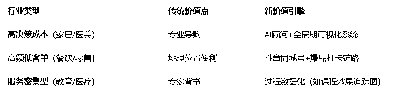

# 消费主力结构性迁移：实体企业如何重构用户注意力与决策链

> 原文：[`www.yuque.com/for_lazy/zhoubao/wbyzvv8i86b8auft`](https://www.yuque.com/for_lazy/zhoubao/wbyzvv8i86b8auft)

## (8 赞)消费主力结构性迁移：实体企业如何重构用户注意力与决策链

作者： 楚川

日期：2025-02-25

不管你是在实体行业做 C 端，还是 B 端客户，不得不承认消费决策权基本上在 35 岁以内的人群，90 后和 00 后——互联网的原住民。

**这意味着：用户注意力和决策链发生了质的变化。**

**  **

**这篇文章可以跟上一篇在生财发布的连起来看，也可以把 2 月份的文章整合成方法论来理解。**

**  **

所以，当下所有实体行业面临的根本挑战，是消费者从“被动接受者”向“信息主权掌控者”的进化。**用户注意力阵地向短视频、社交平台、垂直社区迁徙，决策依据从品牌单向输出变为多源信息交叉验证** 。这一变化直接导致三个底层重构：

第一，**决策权力重构** ：60%以上的消费者在接触销售前已完成品牌初筛，传统营销漏斗失效；

第二，**注意力重构** ：用户单位时间接收信息量较 10 年前膨胀 200 倍以上，实体门店“地段流量”价值被稀释；

第三，**信任链重构** ：熟人推荐转化率下降 20%以上，UGC+KOC/KOL+AI 点评成为新信任节点。

我们来拆解其中的逻辑。

**Part1 客户决策逻辑的底层迁移**

**  **

**1.1 从「被动接受」到「主动掌控」**

1.  新一代消费者（90/00 后）不再依赖单向广告灌输，而是通过社交媒体评测（小红书）、垂直社区（好好住）、直播探厂等形式自主构建知识体系，甚至反向教育从业者。

2.  **行业启示：所有实体行业需重新定位自身角色——从「权威输出者」转向「信息协作者」** ，建立开放式知识库（如宜家的家居指南电子化）、UGC 内容激励计划（用户晒单返现），降低决策门槛。

**1.2 决策权重向「非标体验」倾斜**

1.  家装中设计方案确认难、服务者筛选耗时等痛点，反映出**消费者对非标准化服务流程的强参与需求** 。类似现象出现在教育（定制化课程）、医疗（个性化健康管理）等领域。

2.  **行业对策：** 开发「决策可视化工具」，如装修公司的 3D 云设计平台、服装品牌的虚拟试衣间，将抽象服务转化为可交互、可迭代的数字化体验，减少决策疲劳。

**Part2 注意力阵地迁徙：用户决策的层级渗透**

**  **

**2.1 认知渗透层（Awareness）**

**主战场** ：抖音/快手/视频号（短视频）、小红书/大众点评（图文）

**关键动作** ：将产品价值解构为虚拟产品或者极度标准化产品，如母婴店输出《奶粉成分避坑指南》、运动器材店夏天送泳裤；用 BGC（品牌内容）+UGC（用户内容）构建信息网，拦截搜索流量。

**2.2 信任渗透层（Consideration）**

**主战场：** 知乎/公众号做深度解析、社群/企业微信做即时咨询

**关键动作** ：提供可验证数据，如健身房公示教练资质扫描件；开发“决策辅助工具”，如珠宝行业 AI 试戴系统；公众号-
微信朋友圈的浪潮式发售，转发目标 2000 次等。

**2.3 行动渗透层（Conversion）**

**主战场：** 线下门店+短视频矩阵+同城直播做场景融合

**关键动作** ：门店数字化改造，如智能导购屏、自动买单等；建立“到店打卡-线上裂变”闭环，如餐饮业拍照发抖音送菜品。

**Part3 信息效率革命：实体产业的“降维打击”策略**

**  **

**3.1 卖点从“空间贩卖”到“注意力运营”**

所有行业必须建立“内容中台”，做各种视频有效攻击（[信息过载时代，自媒体广告如何突破"触达陷阱"？](https://mp.weixin.qq.com/s?__biz=MzU1NTE0MjQyNw==&mid=2247485100&idx=1&sn=c14a683251404b3162db4209708c4f79&scene=21#wechat_redirect)），高客单行业构建“决策计算器”降低心理门槛。

**3.2 全渠道宣发的组合拳**

**  **

1.  **「线上埋点+线下引爆」的 O2O 流量漏斗**

**线上：** 通过短视频教程（如家居搭配技巧）、AI 顾问（如服装尺码推荐机器人）完成认知教育、探店达人的各种话题种草、职人做经验日常。

**线下：** 门店转型为体验实验室，如书店增设沉浸式阅读舱，匹配线上荐书数据；建材城设置材料破坏性测试区，验证线上宣传性能。

1.  **KOC 社群的「信任裂变」运营**

母婴店搭建「宝妈共创社群」，用户参与选品测评并享受分红；

夏令营的渠道达人帮发朋友圈和社群，享受线索、成交的两端奖励；

健身房推行「会员训练日志共享」，形成自律打卡社区；

保洁阿姨的招工裂变，享受升级或者直接佣金奖励。

1.  **「反向营销」击穿信息屏障**

主动暴露行业潜规则（如装修增项清单模板）、公示服务失败案例（如家居配色翻车合集），**通过「不完美真实感」建立信任** 。医疗器械行业可借鉴此模式，公开不同体质用户的康复数据波动。

信息透明化的时代，**隐瞒成本＞坦诚成本** ，如餐饮业必须明示预制菜身份；**触点多元** ：需在 20+平台维护信息一致性；十分注重**反噬效应，** 1 条差评需要 50 条好评对冲。

**当用户手持智能手机走进行业，本质是在用整个互联网的认知对抗单个企业的信息体系。** 实体产业的生存法则不再是“占地为王”，而是**用知识密度对抗信息熵增，用透明化重建决策效率** 。未来的胜负手，在于谁能将消费者“被迫的决策参与”，转化为“愉悦的认知共创”。

* * *

评论区：

暂无评论