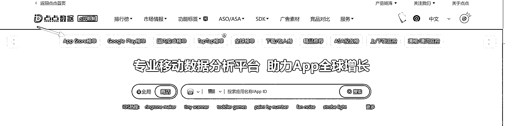
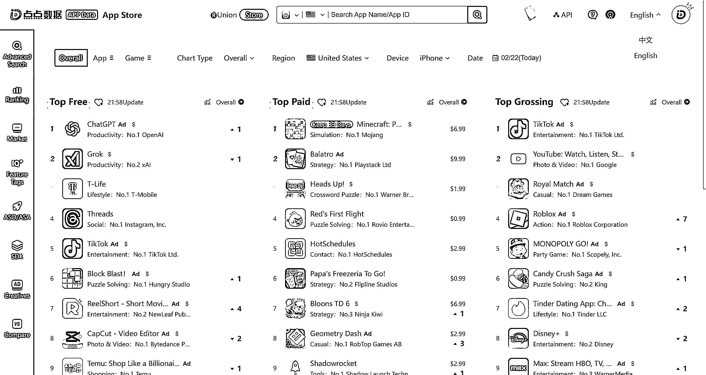
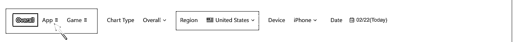
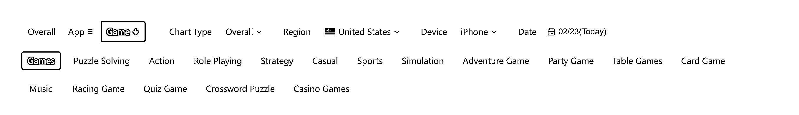
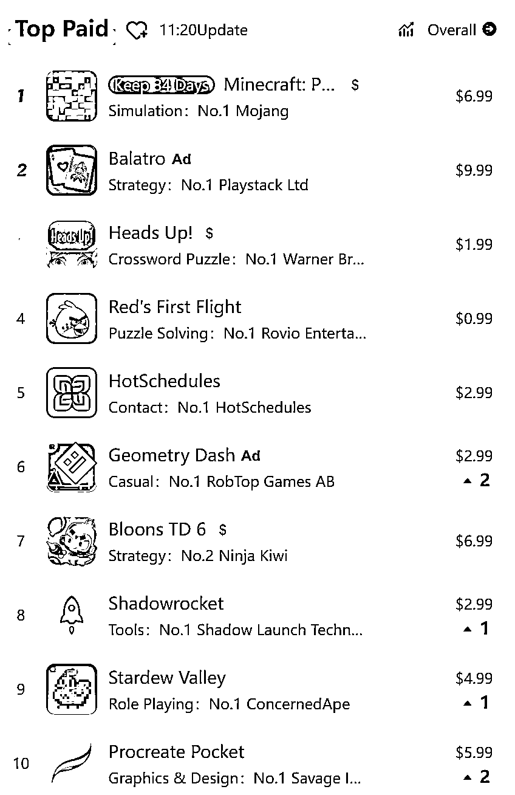
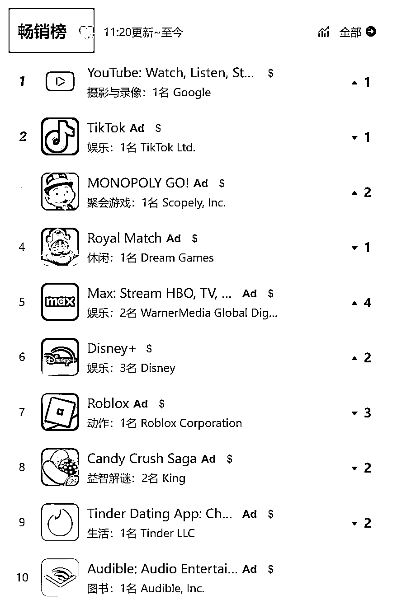
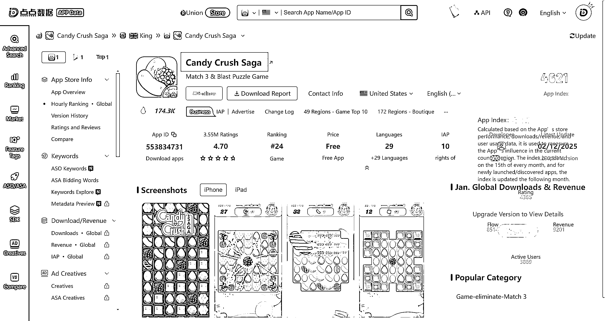
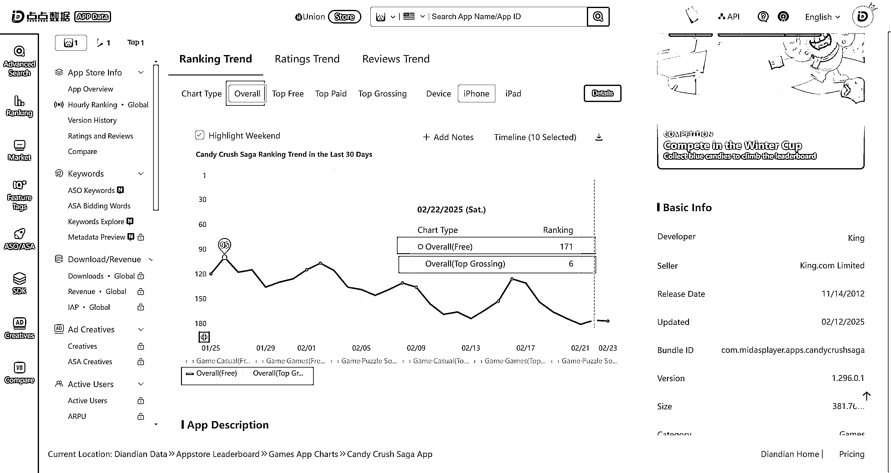
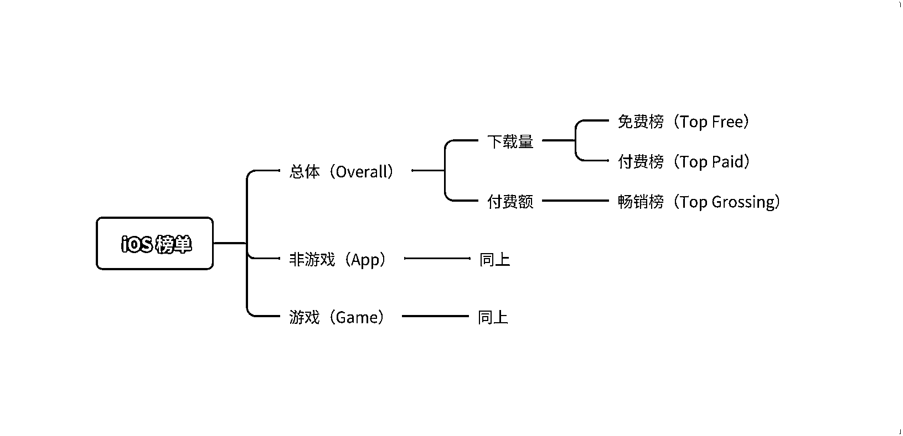

# 海外营销技能：看懂 App Store 榜单

> 原文：[`www.yuque.com/for_lazy/zhoubao/ii8xhfsa9do74cq8`](https://www.yuque.com/for_lazy/zhoubao/ii8xhfsa9do74cq8)

## (精华帖)(121 赞)海外营销技能：看懂 App Store 榜单

作者： 梁山

日期：2025-02-26

各位圈友好，不少朋友在看海外的 App 的机会，App Store 毫无疑问是最权威的榜单，这篇文章会帮助大家看懂榜单

如有格式问题，可移步飞书

[海外营销技能：看懂 App Store
榜单](https://jt0evptqde.feishu.cn/docx/RTYHdtIBZoyRTLxpQtrcMb5Cnhd)

感谢生财里的两位老师@哥飞 @杨涛 对我的帮助

欢迎与大家交流~

* * *

# 什么是 App Store 榜单

App Store 榜单指苹果应用商店的 App 排名，我们可以看到哪些 App 下载量最高，哪些 App
的收入最高。可以类比国内的小米、华为应用商店榜单。

海外最主流的应用商店就是「App Store」（苹果应用商店） 和「 Google Play」（谷歌应用商店）。

本文以「 苹果应用商店」为例，讲解如何查看和分析榜单，「 谷歌应用商店」的查看和分析方式类似。

出于行文方便，下文的「 苹果榜单」、「 iOS 榜单」、「 App 榜单」都指代「App Store 榜单」

# 为什么要关注 App Store 榜单

实话讲，查看这个榜单不会立刻给你带来收益，即使你关注到某个 App 某天突然涨了 100 名，它的收益也不会分给你一毛钱。

与我而言，关注 App 榜单主要是保持自己对市场的敏感性。作为一个海外营销从业者，必须亲身在一线获得一手信息，才能对市场的变动保持敏锐。

你不需要自己挨个监测每个 App 的下载量（事实上这根本做不到）， App Store 已经帮你做了；你不需要看了新闻媒体才知道市场上什么 App
很火，App Store 可以提供最权威的一手数据（官方数据是最权威的数据）。

笔者作为负责海外市场的用户增长产品经理，每天上班第一件事就是查看今天的榜单，当你关注足够久，市场上有什么风吹草动自然逃不过你的眼睛。

下面我会带着大家一起了解如何使用 App 榜单，其实一点也不复杂。

# 从哪里可以查看 App Store

从自己的苹果手机就能查看。但营销人员要关注的内容比较多，手机上操作还是不太方便，所以一般会通过「 点点数据」和「 七麦数据」这种第三方网站来查看。

需要注意第三方网站自己不产生榜单，它们是监测榜单不同的榜单（ iOS、Google 等），然后聚合呈现在网站上。榜单的内容和你在手机上看到的完全一致。

我平时用「 点点数据」多一些，下面就以这个网站为例讲解如何查看榜单。其他第三方网站的使用方法类似。

该网站需要注册，注册过程很简单就不讲了。网站有一些功能付费后才能使用，但免费版提供的信息已经完全足够我们用了。

进入网站后点击「 App Store 榜单」即可进入

另外特别提醒，如果你从事海外市场营销，强烈建议直接使用英文，因为很多词翻译成中文后理解困难，不如直接看英文。

# 榜单的分类维度

很多新手觉得 iOS 榜单复杂到让人眼花缭乱，根源在于没弄懂榜单的分类维度太多，理解榜单的维度是看懂榜单的关键。

1.  榜单分类

2.  Overall

3.  包含游戏和非游戏，也称「 总榜」。默认选这个，反映了市面上所有应用的情况

4.  App

5.  此处的「 App 」和「 App Store」的「 App 」极容易混淆。

6.  这里的「 App 」应该理解为「 非游戏类应用 」或「 非游戏类 App 」

7.  而「 App Store」的「 App 」，就是你平时理解的「 App 」

8.  这里也可以筛选具体的类目，如图像视频（Photo & Video）、娱乐（Entertainment）、教育（Education）等

9.  Game

10.  游戏类

11.  如果选择 Game，那么榜单里只展示游戏类应用的排名。同样你也可以选择具体的游戏类目来查看榜单，如解密（Puzzle Solving）、动作（Action）、角色（Role Playing）

12.  

备注：「 榜单分类」并不是官方叫法

1.  地区

我们这里选美国（United States）

1.  Chart Type

不用管，这个只影响榜单的呈现形式

1.  Device

默认选 iPhone，因 iPad 量太小

1.  Date

一般选当前时间

# 详解三大榜单

理解上文的维度后，再来看榜单就很简单了。下面的截图都是基于榜单类型=Overall

1.  Top Free （免费榜）

2.  统计范围

免费下载的 App

1.  统计指标

近期下载量

（实际的统计方式 App Store 并没有公布，民间推测是近期每天的下载量加权之后的排名，当日的下载量权重最大。简单理解为「
近期下载量」没有任何问题。这里的「 近期」官方没有给出，可以理解为最近三天）

1.  重要性

最重要的榜单。

由于「App Store」只分别提供了免费榜和付费榜，没有提供同时包含免费&付费的应用的榜单，考虑到付费应用仍是少数，所以当榜单分类=overall，此时的
Top Free 榜单可以近似理解为「 全部 iOS App 的榜单排名」。

平时我们说某应用到了榜单第 x 名，其实都是指在免费榜的第几名。

1.  关注数量

Top 20

尽管免费榜很重要，但我们肯定没有精力每个 App 去查看，关注前 20 个就可以。能进入前 20 的，都是超级巨头或未来之星。

1.  关注内容

前几名的位置有什么变化？

有无新入榜的应用？

新入榜的应用，可能是什么因素导致的排名（下载量）上涨？

头部应用的获客渠道有哪些？

有无排名涨幅很大的应用？

哪些应用从 Top 20 掉队？

什么类目的应用占比高？

各个国家的头部应用有什么差异？

……

1.  Top paid（付费榜）

2.  

3.  统计范围

4.  需要付费才能下载的 App

5.  对国内用户而言，付费下载实在不常见，但还海外仍有一些应用是需要付费才能下载的。注意这里容易与接下来的「Top Grossing」混淆，因为都是涉及钱。这里是统计「 不付费不能下载」的应用，不关心你下载之后的付费情况。

6.  统计指标

7.  近期下载量

8.  （如同免费榜，官方也没有公布付费榜具体的排名机制，可以简单理解为近期下载量）

9.  重要性

10.  一般。除非你是做付费应用的，不然不用太关注

11.  关注数量

12.  这个榜重要性一般，关注 Top 10 就可以

13.  关注内容

14.  同免费榜的关注内容

16.  Top Grossing（畅销榜）

17.  

18.  这个榜单中文翻译为「 畅销版」，很容易造成困惑。「 App Store 榜单」本身就可以理解为畅销程度排名，那此处的「 畅销」又如何理解？

20.  这时候直接看英文的好处就体现出来了，这里的官方叫法是 Top Grossing，Gross 有收入的意思。平时电商里的讲的 GMV 全称就是 Gross Merchandise Volume。

22.  所以这里中文改成「收入榜」「 应用内购榜」就好理解了。

23.  统计范围

24.  所有 App ，不区分是否付费下载

25.  统计指标

26.  应用内收入。主要统计用户在应用里的付费情况，一般是充值、购买虚拟物品等。

注意：电商这种购买实物商品的应用，不在 Top Grossing 榜统计范围内。不然这个榜单肯定是清一色的电商，成了电商榜单。

1.  重要性

一般

1.  关注数量

Top 10

1.  关注内容

除免费榜提到的关注内容，还可以对比下这个榜和免费榜各自前几名的变动频率，哪个榜变得更快。

留个思考题，这个榜单谁保持在前 10 名的时间最久？

# 案例

1）不同时间段的榜单对比

下图左图是 25 年 2 月中旬的美国免费榜 Top 10，右图是 24 年 12 月底的排名，可以观察下变化。

多说一句，右图的 # 2 是字节旗下的 Lemon8，当时的背景是 TikTok 禁令即将发布，所以替代产品的排名迅速上来了。

 images.zsxq.com/FuRWhNA-4rsj3ZZPj_OHveg527Vt) images.zsxq.com/FslrtroHwMLhc0pio3P5SiOiXAnF)

2）Kalshi 为什么来得快去得快

第一张图，24 年 11 月初，从没有存在感突然成为总榜#1，然后迅速下降。

第二张图，25 年 2 月出，再次突然上涨，但这次涨幅没上次那么大，只涨到总榜#207，然后迅速在榜单消失。

这个 App 体量很小，正常情况我们根本不知道它的存在。但 24 年 11 月那次表现实在亮瞎眼，所以我后来一直有关注。可以看看这个 App
的功能，结合当时的政治、体育新闻，相信读者肯定能知道它上涨的原因。

 images.zsxq.com/FtCwQ9riwXdSb5OtqLGc9QmihIkB) images.zsxq.com/Fid45v3iq1lNM167RPXtvNJ9jcnR)

3）Candy Crush Saga：游戏常青树，三消吸金王

有这么一款神奇的游戏，发行于 2012 年，爆火十余年，安装量 10 亿+，几乎没有低谷区，这就是三消之王 Candy Crush Saga

在榜单里点击具体的 App 可以进入详情页面

Chart Type 我们选择 Overall，下面出现的指标比较多，我们只选择 Overall（Free）和 Overall（Top Grossing）

可以看到这款游戏下载量排名（Overall - Free）是 171，一点也不高；但收入排名（Overall - Top
Grossing）是 6，说明收入更多由存量用户贡献。

这个游戏运营十余年，还能长期在收入榜排进前 10，实在是太强了。

# 浅谈不同的榜单

本文着重讲了海外的 iOS 榜单（即 App Store 榜单），海外营销从业者同样也需要关注 Google Play
榜单。但是从经验来看，两个榜单在相差不会太大。考虑到大家时间精力有限，我认为只关注 App Store 榜单已经足够让你对市场保持敏锐的嗅觉。

最后谈一下国内市场的榜单。因为国内特殊的应用生态，榜单远比海外多，

应用系统榜单：国内 iOS App Store 榜单

手机厂商榜单：小米、华为、oppo、vivo 等榜单

第三方渠道榜单：应用宝、百度、360、豌豆荚等

这导致了国内用户增长从业者无所适从，根本不知道该看哪个榜单，而且不同榜单的数据相差很大，比如某应用在 A 榜单是前 3，但在 B 榜连前 10 都进不去。

根据我的经验，国内只需要关注 iOS App Store 榜单。曾经笔者在某个 App
里负责的拉新渠道多次出现现象级的增长，我特意对比了我这个渠道下载量大幅增长期间 App 在国内各榜单的表现，iOS
榜单可以说是非常精准的，与我们内部看到的下载量趋势基本吻合。

小结

如果你觉得以上内容还是太复杂，不需要了解这么细致，你只需要理解下面这张图就可以。

作者：梁山

原创作品，转载需经作者同意。

全文完

* * *

评论区：

11 : 学到新东西啦！谢谢

大卫 : 短小精悍的文章，有收获