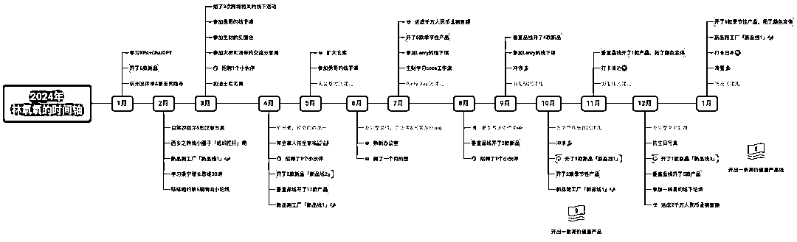
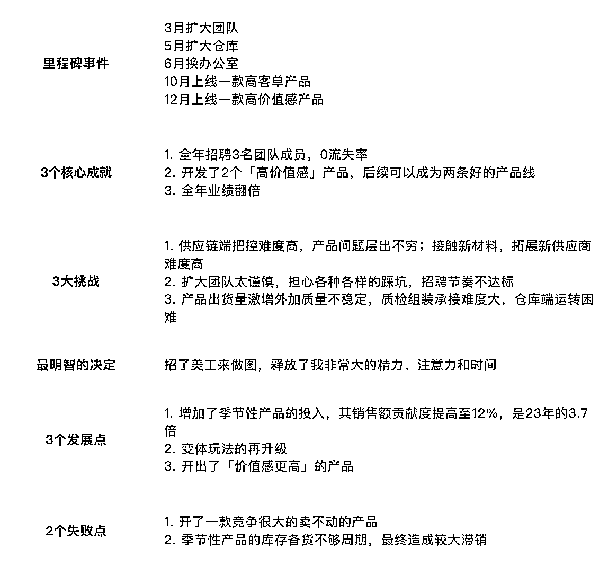
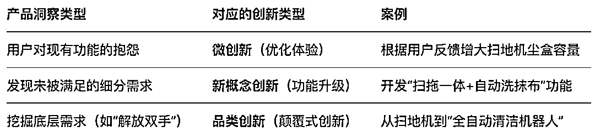
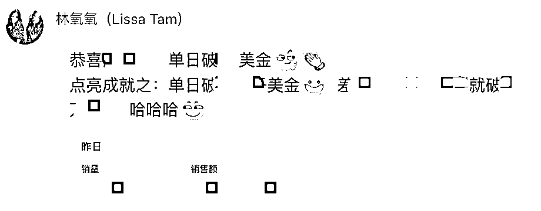
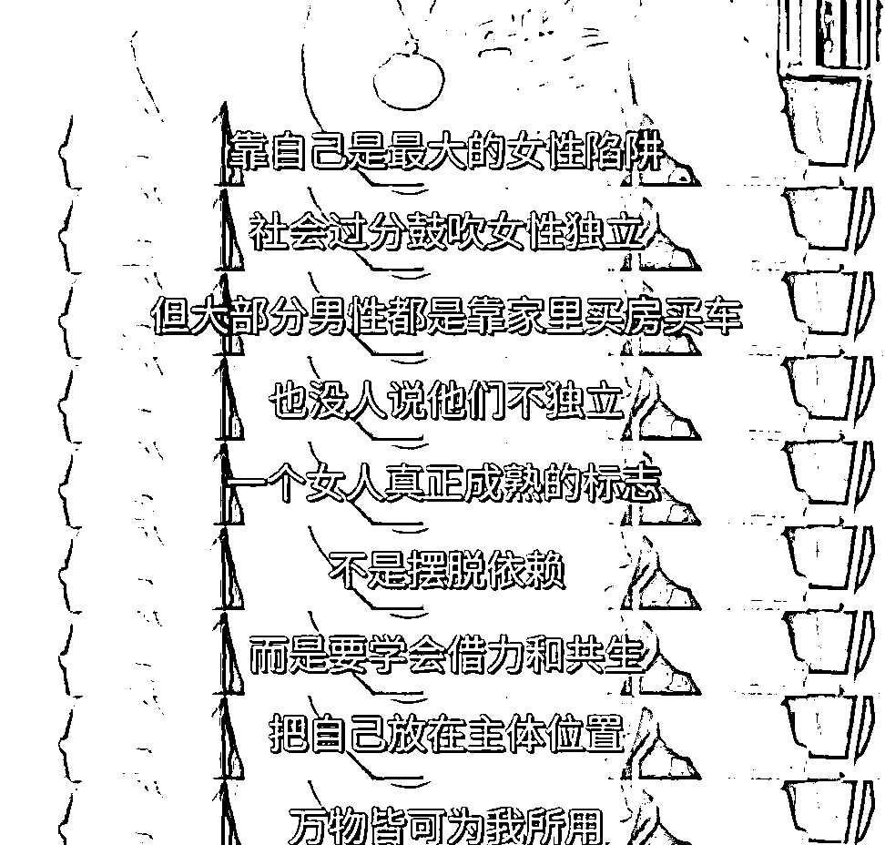
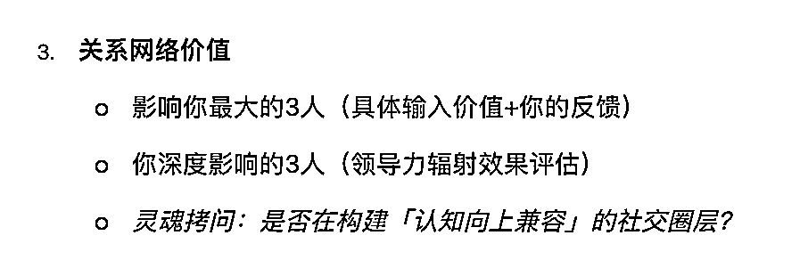
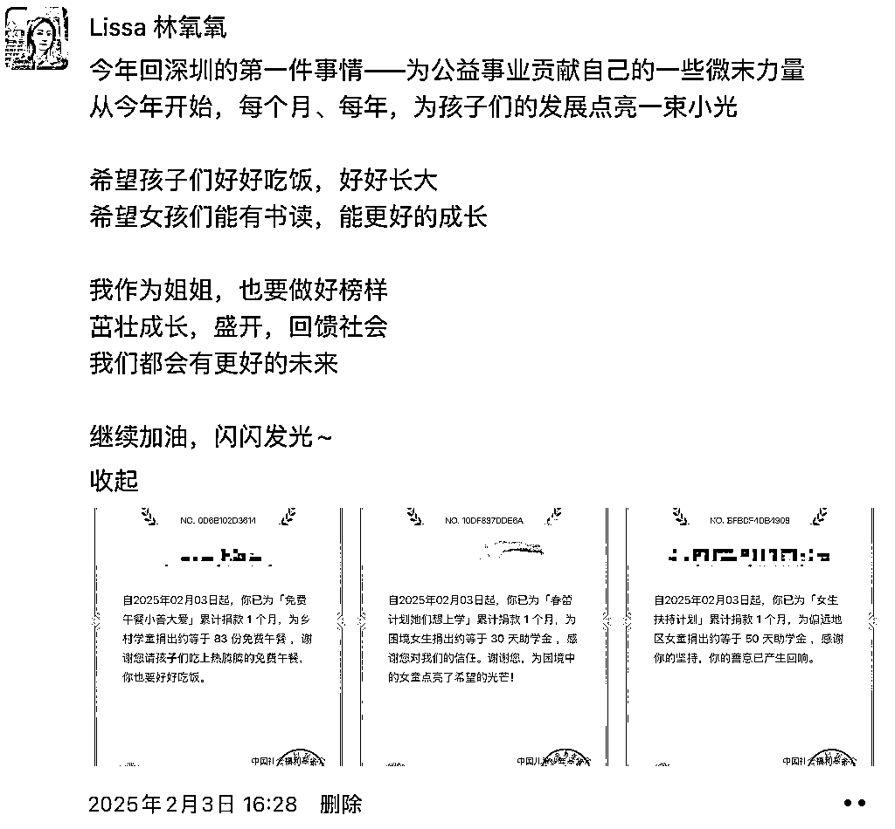
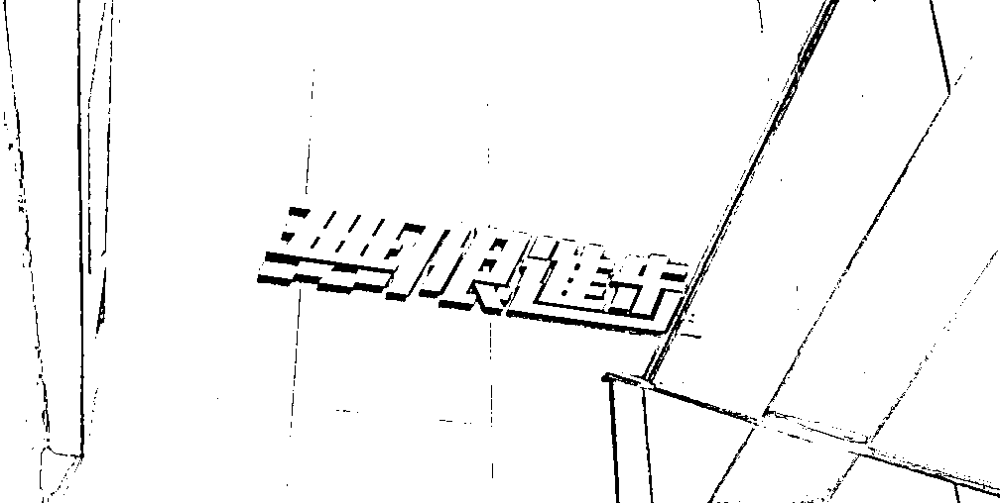

# 在不确定中，构建确定性增长

> 原文：[`www.yuque.com/for_lazy/zhoubao/zzhp20abciqaz4uc`](https://www.yuque.com/for_lazy/zhoubao/zzhp20abciqaz4uc)

## (21 赞)在不确定中，构建确定性增长

作者： Lissa 林氧氧

日期：2025-02-25

嗨咯生财有术的大家，又到了拖延症患者一年一度总结的时候了 :)

我是 Lissa 林氧氧，一个在深圳做跨境电商的搞钱女孩。（这个文章标题是 deepseek 起的，哈哈哈，我的脑子🧠死机了，想不到更好的了）

24 年过得很快，赶路的时候没觉得什么，回头看，这一年做了好多事，很充实。业绩增长、产品线增加，团队搭建……经历过两轮完整周期后，对于「卖货」这件事情，更有感触了。

以下是我的全年总结，内容包含我的 2024 年时间轴、我自己的底层性格变化、我的新的产品开发方法及团队搭建上的成长、以及我的 2025 年的关键词，希望对你有价值。

## **一、我的 2024 年复盘**

### **（一）我的 2024 年时间轴**

这是我的 2024 年时间轴。

2024 年，我新开了两个还不错的品线，尽可能地将垂直品线铺开，差不多总计新增 45 款产品，业绩翻了两倍。

这一年，我在产品和团队上花了很多时间，也获得了不错的回报。这一年，我的生活与工作进入了一个让我非常舒服的新阶段——融洽。

**oh!!! 我终于是张弛有度的在创业了——这让我现在在做的事情变得长期，变成了真正的一份事业。**

这一年，我接触了更多的板块，很明显，我的创业，终于步入正轨了。

在[23 年的复盘](https://articles.zsxq.com/id_7774fsi0tmii.html)中，我提到想要「**做一些价值感更高的产品** 」，今年我推进了，并且取得了不错的效果。

说实在的，这太难了，两个产品，大概花了一年的时间，才最终落地。其中一个开私模，遇到了很多新材料造成的各种问题，对别人来说可能是常识，对我们来说真的就是天降大坑。还有则是新接触的材料，需要找新工厂，而在和工厂对接沟通这块，一直是我的死亡短板。

Thanks God, 一年时间，我做到了。并且从结果反馈来看，很不错。

24 年我列出来的核心成就和挑战、发展和失败，其实也都是围绕着“产品”和“团队”来的。[运营层面上的策略，和之前都差不多](https://mp.weixin.qq.com/s?__biz=MzkxNDI5MTMxMw==&mid=2247484265&idx=1&sn=104739f7219c1f54eea58ec78d691c15&scene=21#wechat_redirect)，唯一不同的是，**通过时间积累起来了一些链接资源，在新品推广的时候能为之所用** 。

### **（二）我的底层性格变化**

22 年测试过我的盖洛普才干，时隔两年，24 年 11 月底的时候，我又测试了一遍我的盖洛普才干，又找了醒醒解读。

 images.zsxq.com/FujXyUzwtcwzhiQoGU_yeEqqmcsF) images.zsxq.com/FkxxuA3xOIuL_7zxMZoHliEDkR2h)

 images.zsxq.com/FkTkyA0k_5fBIyY4vsvxCv5GYAce) images.zsxq.com/FiHYpfZBVSSO6_OsZs9IOHDvud5h)

对比 22 年中测试的结果来看，我的变化肉眼可见，用醒醒的描述来说就是：日子比以前过得好了（笑死）。

谁懂，看到这个测试报告，我自己都要流下欣慰的眼泪。虽说可能盖洛普的首次测试结果，或许更能反映一个人的底层特质，但每一次的测试，都能反映出「觉察后的刻意自我调整」的结果。

我的影响力大维度从第一到第四了，战略思维变成了第一，关系建立也往前靠了。

我的竞争才干下去了，我自洽了；通过业务的正向反馈，我自信了，内心也踏实了；通过团队搭建过程不断磨练自己，我成长了。

控制情绪、控制并调整对他人的期待；严于律己、宽于待人；从自己获得结果，转为支持别人获得结果。

这些业务上的增长与团队搭建上的成长，也是我接下来想和你分享的。希望我的经验，能帮到你。也希望 25 年，能遇到一些同频的人，创业之路一起成长。

## **二、产品和团队中的新成长**

### **（一）我的新开品模式**

**  **

**我的开品模式，从**[数据化选品](https://articles.zsxq.com/id_ttgkj58gmmro.html)******「不成品线的多个产品」，到****[垂直品类精铺](https://articles.zsxq.com/id_7774fsi0tmii.html)****「同一个品线的多个产品」，再到现在的需求场景开发产品。**

我所说的需求场景开发产品，是指通过数据或者是从熟悉的领域，找到一个天花板相对较高的市场，通过对用户的使用场景、需求痛点、产品颜值等深入研究，提炼出来当前产品的痛点、用户的基本需求期待需求和兴奋需求（KANO 模型），对产品功能进行改进优化、迭代，对外观进行重设计，从而开发出一个全新的产品。

其中功能上一定要和市面上的竞品做出差异化，要做出「我们的性价比更高、功能更多，或者我们的结构更好用」的感觉，颜值上要比竞品做得更好看。

我的核心工作，就是找出这样的市场，然后深度研究用户需求。

经过这几年的创业，我感觉我仿佛在这块有点“初始天赋值”，我能相对更容易地感知到用户想要什么，他痛在哪里，以及他能够怎么改，然后针对性进行产品优化迭代。

***�****技能杂糅，形成了我的组合竞争优势**

回想起来，我能做到，或许是因为我的技能点太散了。而这些稀碎的技能和经历，让我有了一些对产品的直觉——

我创业以来直到 24 年的 8 月份，产品图片全是我自己做的，拍摄也是我跟的，我的审美得到了极大的提升；我在处理差评的时候能够感知到用户的情绪，能够推己及人，删差评率是比较高的，我对于用户的「情绪」感知力，相对也更强；那么我看到一个市场后，如果我判断有机会，在深入调研后，我就会手绘产品方案，然后打样落地，拿回来测试个一周进行优化，最终再改再试再改再试。

就这样形成了我的独特的组合竞争优势。

而因为开出来的产品有竞争优势，那么运营端会省力很多。而在市场天花板比较高的前提下，我们的客单价能拉高，产品销量也算可观。

用两个数据来支撑我的观点：

1. 我做了创新/微创新的产品，转化率最高可以到 40%。

2. 在很多次库存不足的时候，我们会直接关掉广告，或者涨价，单量没有太大的影响，且往往库存补足后，单量很快会回归。

 images.zsxq.com/FgtuxkHitHyFema9YAL_b8wHxlSI)​ images.zsxq.com/FqH4DP6cGE2eFjTM126ny51Eq5dK)

之前我做的比较多的是微创新的产品，这也意味着没有太多的门槛，被抄相对简单，留给我们起跑的时间可能也就 3-6 个月。后来我们做的创新度更高的私模产品，起跑时间大概就有 6-12 个月了。

我们运营端要做的，就是充分利用资源，起跑即冲刺，牢牢占住要去的位置。转化率优秀，单量不错，关键词位置榜首，关键词收录数量尽可能多。让后面抄作业的同行，难以超过。

***�****关于用户洞察与产品创新**

上周听尚媛媛老师的线下课的时候，我发现这块有一门专业的课程，叫做《用户洞察》。它把我前面所说的「感知用户需求并进行创新落地」系统化了，在设计公司，或者互联网大厂里，会有一个专门的岗位，负责用户调研分析，一般叫做「用户体验研究员/用户研究分析师」。

**产品洞察与产品创新的结合，本质上是“发现需求”与“创造价值”的闭环过程。**

用户洞察，是通过对用户进行调研分析，产出用户调研报告、行为分析模型、需求优先级排序（如 Kano 模型）、改进建议方案等。

而用户洞察之后，就是产品创新，也就是我们将调研结果落地产品的过程。它可以按照创新程度，分为三种：微创新、新概念创新、品类创新。

我们比较常进行的，就是微创新，通过对 VOC 的调研分析（一般比较多是看差评），进行产品优化迭代。

新概念创新，则是时间周期较长一点的功能升级，一般是通过 VOC（结合好评，看用户提及的额外功能需求）及深度的用户使用场景行为分析（比如我们买样品回来，模拟用户进行场景使用）、行业经验、AI、竞品分析等，找出潜在痛点和需求点，提出假设，再通过问卷、访谈等验证需求的优先级。

而品类创新，则是挖掘用户未被满足的底层需求（用户可能说不出来，自己也不知道原来自己有这个需求），创造全新品类。比如之前很火的 Beatbot，做泳池清洁机器人，[创始人带着团队租了一间带泳池的别墅，深度体验一周后，挖掘出来了“水面清洁”这个需求，去年拿到了安克创新、高瓴创投等投资。](https://mp.weixin.qq.com/s?__biz=MzIzMjU0NDY5OA==&mid=2247487637&idx=1&sn=365e8c4399e5e7433b88684420bfa4b1&scene=21#wechat_redirect)

创新程度越大，所要求的调研深度、精力消耗、时间花费也越大，对应的风险也越高。

但究其根本，其核心要求就是：要在某一品类里深耕。我所提及的「更有价值感的产品」，几乎都是通过深耕某一个品类，识别到用户更深度的需求，然后创造某个功能和创意升级的产品。

也就是说：选择某一个品类 → 进行微创新升级 → 获得更多的用户数据，发现新需求，进行新概念性创新 → 获得更多用户数据及使用场景数据，推动品类创新。

如：有线吸尘器 → 大功率有线吸尘器 → 大功率无线吸尘器 → 自动扫地机器人。

然后又能自上而下进行产品迭代升级：品类创新提供方向 → 新概念创新落地为具体产品 → 微创新持续优化。

如：自动扫地机器人 → 扫拖一体机器人 → 扫拖一体自动洗抹布扫地机器人

### **（二）我在团队上的一些成长**

24 年年初，我设定好了这一年的基础团队框架，虽然在招聘过程中有点拖延，但整体结果比 23 年要好太多了。

关于团队，我有几个比较核心的成长。

***�****领导者的情绪稳定及沟通方式很重要**

在 5 月份的时候，我还稍微会有点控制不住的情绪波动。当时运营有关于产品推广的问题没有任何想法，把问题抛给了我，而我那时的沟通方式很有问题，没控制住情绪，带了「反问、感性的情绪感慨」。

但其实整个沟通过程我自己察觉到不对了，过程别扭、结果不符合预期。但我当时还不清楚是哪里的问题，我当时问了 aggen，他和我说：

“在遇到既定问题而对方显得无法解决、又没有什么想法、想要抛掉问题的时候，要学会积极引导，不要有任何吐槽表现，或者语言过于随便。”

比如「广告费花了一百多美金，只出了一单」，要以此为案例，引导运营进行分析，帮助她一起从源头找原因，找对策，一起解决问题，而不是形成一种“对立感”（虽然自己完全没有这种想法）。不要有任何情绪。

那是我印象中最后一次产生沟通和情绪方面的问题。后来我所有沟通，都是基于“让我们一起来把这个事情解决，把这个事情做得更好，我们可以从哪些方面出发入手，来拓展思路。如果我们都没想法，没关系，那我们先看看能做些什么，能否树立一个可以行动的清单出来，边做边看”
这个底层思路， 并且我打心底真的就是这样想的。

我会有意识的观察自己的情绪，如果在沟通过程中，我自己有任何的情绪波动，我会主动和自己说停，深呼吸，然后重新进行沟通。**有时候文字过于冰冷，我也会有意识的让自己“对话”，面对面说话的时候，更亲切，更温和，更有情感，也少了许多因文字传达失真而带来的“揣测”与“内耗”。**

冷静，理智，有方向；控制好自己，积极阳光，充满能量，是作为一个好的领导者的基本修养。

这是我 2024 年觉得自己成长最大的一部分。

***�****小公司，谈不上管理，更多是人情，是关系**

这一条，怎么说呢，我认为这确实也是看阶段，看人，看关系。在初期，时间和精力都有限，更重要的是业绩，是创收。放开权限，信任，粗管。况且，优秀的人是不需要管理的，他们自然会对自己有要求。

而我在这个阶段，确实主要还是靠「人情与关系」，确切的来说，是靠“信任”，以及“我真心实意对你好”。

不是靠演的，而是我真的、发自内心的，真心实意的对你们好，无条件的信任。

我做了几件事情：

1. 每个月会有一次团建活动，打羽毛球、出去玩，或者在办公室自己做吃的等等。

2. 每次活动我几乎都会拍照，并且把大家修的美美的，然后把照片打印出来。

3. 每个月会开一次月会，会一起复盘产品情况，会在月会中问大家对公司的建议和优化点，会不断强调，有事情或者有问题需要帮助，一定要说，不要内耗。不舒服也要说出来，因为其他人不一定知道这个是你的不舒服，甚至没有留意到。

4. 办公室一定会有零食，牛奶可乐等饮品在，饿了或者想吃的时候，随意拿取。

5. 每次日销售额到达新的高度，都会有全公司的下午茶奖励，每周也会有下午茶。最多的时候，一周喝三次下午茶。

6. 每个特别的节点，比如圣诞、春节，会带着大家一起装饰办公室，给办公室「换皮肤」。

 qK6a-ICMC53sRZbKT) images.zsxq.com/FmbUoeKBVrG90q8LKuM_jh-m1DoI)

**  **

***�****要打胜仗，庆祝每一个胜利**

我算是比较喜欢夸夸的人。

图片做得好看，夸夸！销量到了新高度，夸夸！销售额到了新高度，夸夸！拿下了 BSR，夸夸！

正如上一条说的，我们日销售额到了新高度，我一定会发出来，并且大家一起喝个下午茶开心一下。要是历史性节点，我会打印出来贴墙上。

我喜欢这种快乐又友好的工作环境，大家努力工作，每一分成果都被看见。

而我也会努力开品，让这份快乐和成就感，一直延续下去。不断有新的刺激点上来，然后不断会有新的胜利和成就感出现。

***�****不要空谈人情，更要钱给到位，老板要大方**

这一年来，我有一个很大的觉察：**老板的逐渐大方，代表着管理能力的逐渐上升。**

3 月份刚招到人的时候，我就把手头最赚钱的品线分出去了，而且大部分是老品。决定分出去之前，我确实也肉疼过，我劝自己：只有把好产品分出去，运营感受到了产品的好，才会更有意愿留下来，并且产品管的细致，一定是越来越好的。公司资源分配不是零和博弈，一起把蛋糕做大才是正解。

因为吃过开荒的苦，所以我从来都觉得，自己把路走通了，再招人来复制做大，才是对大家更负责的做法。我们运营转正就能拿提成，这个体验会很好吧。

产品给力，运营给力，销售效果好，提成也拿得多。公司挣钱，大家信心十足，公司的福利待遇也更好，开品积极性更高，拿到好产品的概率更高，有更高的业绩，就能拿更多的提成。一个妥妥的正循环。

每一次分资源、分钱的肉疼感，都是我的一次成长，我也会锻炼自己，有更高的格局和视野，来看待整个公司的经营和发展。

***�****招人要招自己喜欢的，为自己而招人**

小团队公司氛围很重要，招人是来为自己干活的，因此这个人你喜不喜欢、用的顺不顺手，非常重要。

很多时候就是因为那么一点点的犹豫，最终招进来发现确实大家性格价值观不合，就很消耗双方的时间了。

我之前觉得招人主要是能力很重要态度很重要，现在我反而觉得，**价值观匹配是第一重要，态度第二，能力第三** 。价值观往往在招聘和第一个月相处中，体现在沟通丝滑程度及好感度上。

为自己而招人。招来的人是为你帮忙的。你很重要，你的感受很重要。应聘者如果他们觉得不合适、不匹配，他们自己会选择不来。

因此，核心关注自己的感受，并且尽可能地对你招进来的，选择信任你、选择来帮你、选择花时间陪你走这一路实现你的目标的这些人好一点。

**公司能跑多远，完全取决于创始人的能力** 。你也应当更努力地去学习和成长，提高判断力，提高自己找方向和找钱的能力，才能够让这些选择来帮你的人也有更大的成长空间。

————————

说了这么多，其实总结起来，小公司真的要靠老板拼命干，言传身教。躬身入局，亲自把手弄脏。

我可以是工作狂，加班到深夜，但我不会要求我的员工和我一样也是工作狂。我作为老板，我本就应该更努力，肩负更重的责任，把公司做得更好，让信任我以及努力工作的员工，有更好的未来。

我说的话，我做的事，一定是我自己相信的，是我自己有很强的使命感和信念感的。

我相信我的这家小公司，一定可以为了同一个目标奋斗努力的，一定是有人情味的，一定是热爱生活的，一定是向阳而生，有追求的，一定是有态度的，是希望变得更好，不断打磨自己和自己的作品的。

**正是这些点点滴滴，构成了公司的价值观** 。招人要首先招“味道对的、价值观匹配的”，这又呼应上了。

## **三、2025 年我的核心关键词**

当我复盘完 2024 年的整个轨迹后，我其实很开心，我有成长，有生活，工作事业也有突破。当然，我也有没做到的事情，遇到了许多新问题。有感恩的人，也有被感谢时刻。文章太长，暂时也不提了。前路漫漫，我们总能一点点地把问题解决，把事情做好。兵来将挡，水来土掩嘛。

保持心态上的“Gain（收获）”，而不要掉进“Gap（差距）”中。我做复盘的意义也在于此，观察自己每一年的进步，发自内心感慨到：哇，我又变得更好了，这一年可真是丰富多彩啊！

内心富足，精神充裕，自信，积极阳光，充满动力。

这就是我现在的状态。

2024 年我们在谈论十倍增长，我定下了一个三年目标。2025 年仍在目标前行路上，**我想今年我的核心关键词有三个，一个是「渠道」，一个是「借力共生」，一个是「社会价值」。**

***�****渠道拓展**

今年新的增长，我想有一部分应该会来自于渠道拓展。

我们之前是只做亚马逊美国站的，随着产品体系的完善，以及价值量感产品线的开发，慢慢可以开始拓展欧洲站以及其他渠道，比如沃尔玛、独立站等。

年初的时候了解了一下欧洲站的商标注册及店铺 VAT、各国家不同法规要求等等费用，成本是比美国站高挺多的。门槛越高，竞争相对也小一些。更重要的是，我们如果现有产品有量，欧洲五国铺过去就可以了。包括美国的其他销售渠道也是同理可得。

好好好，又回到了团队搭建和招人上了，哈哈。希望今年也能有很好的运气，能招到很好的团队成员。

***�****借力共生**

这个词儿是庆奶说的，我借用过来表达一下。

我在前几年一直说的女性独立，世界很大靠自己，到了 24 年，一个比较直观的感触是，**真正的独立不是只靠自己，而是要心智成熟，学会如何借力合作** 。

事情是做不完的，钱是挣不完的，更重要的是，如何找到对的人，如何分钱。

此外，就是关系网络建立。同行业可深度交流的朋友，经验丰富愿意指点自己的前辈，以及生活中能够聊天闲扯的好朋友，在关系网络中都应该要存在。关系不是被动等待的，而是要靠自己主动规划的。这块我在今年看的一本书《别独自用餐》中，有一些比较大的体会（
雪球 Kerrey 送我的，谢谢 Kerrey! ）

多出去交流学习，也建立生活中的好友关系。好友不求多，一三五个足矣。

从前我只想着工作，现在我会有意识的去和我喜欢的人聊天，出去玩也会记着她们，给她们买伴手礼。所有的关系都要靠维系，你的时间花在哪里，结果就在哪里。

**创业路漫漫，可一定不能让自己孤独的走呀。**

***�****社会价值**

年初回到深圳后，第一件事情就是设定公益“月捐”，把每个月的盈利，分一部分出来回馈社会。我也是戴上腾讯公益的小红花了，哈哈。

我选了三个，一个是免费午餐，一个是女生上学，一个是女生扶持。

为了孩子更好的明天，为了女生更好的发展。这是我作为一个搞钱女孩，做得最闪闪发光的一件事了。女孩们加油！

关于社会价值，我自己的感受，不仅仅是在捐赠上。

我认为其实商业也是一种社会价值；做更好、更有价值感的产品，真正解决用户痛点和需求，也是一种社会价值。

希望今年，我能够在商业上，能够在产品端，有更高的造诣和成长。也希望未来，我还能坚持做一些专业内容的分享，用我的知识，帮助到更多同频人。

创业这个游戏，真是越来越有趣了 ;)

最后最后！感谢@亦仁老大、@杨涛涛哥的持续优质信息，让我们有更大的视野和最新的优质搞钱动。感谢
@Lenry、@拓跋勇的无私分享，我的垂直成长资讯与交流沟通来源地。感谢我的好朋友@左烨紫，我们互相吐槽和分享焦虑，让焦虑变得没那么焦虑，哈哈。

特别感谢@醒醒同学，因为你，我再也不用担心，我说的内容会被 judge、被指点被审判，在你这里，我不用怕出错，我可以非常放心自在的表达。

以下是我在生财有术的精华帖（按时间排序）

[`t.zsxq.com/eNZcw`](https://articles.zsxq.com/id_7774fsi0tmii.html) 我是如何做到百万美金销售额的? ｜Lissa 林氧氧的 2023 年总结

[`t.zsxq.com/03E27qvjM`](https://t.zsxq.com/03E27qvjM) 手把手教你如何选出月入上万的单品

[`t.zsxq.com/03RvRzFqr`](https://t.zsxq.com/03RvRzFqr) 我是如何毕业两年晋升为跨境电商大厂经理的

[`t.zsxq.com/03AUZrVZn`](https://t.zsxq.com/03AUZrVZn) 手把手带你在亚马逊开店卖货

[`t.zsxq.com/03QneyJyJ`](https://t.zsxq.com/03QneyJyJ) 10 人团队做亚马逊年营收 7000w 的方法论

[`t.zsxq.com/03z3NJa2b`](https://t.zsxq.com/03z3NJa2b) 疫情下，跨境电商还有机会入局吗

[`t.zsxq.com/033nu7MFM`](https://t.zsxq.com/033nu7MFM) 不靠广告，如何在亚马逊 3 个月把一个产品做到 100W 销售额

[`t.zsxq.com/03MFMjQF6`](https://t.zsxq.com/03MFMjQF6) 我是如何 3 个月时间推出一个类目老大商品的

一篇分享贴

[`t.zsxq.com/17KzThejb`](https://t.zsxq.com/17KzThejb) 我是如何度过亚马逊创业这一年（经历/营收/时间管理/日常）

* * *

评论区：

慧慧孙 : 好强！