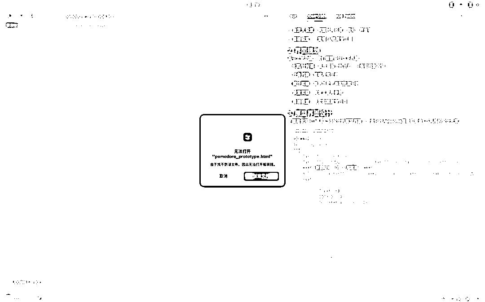
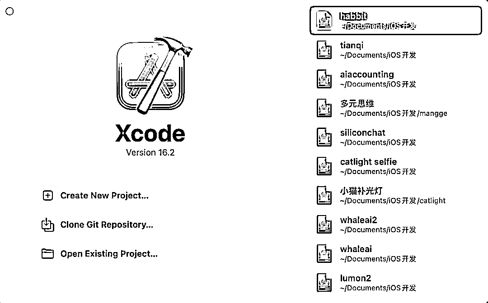
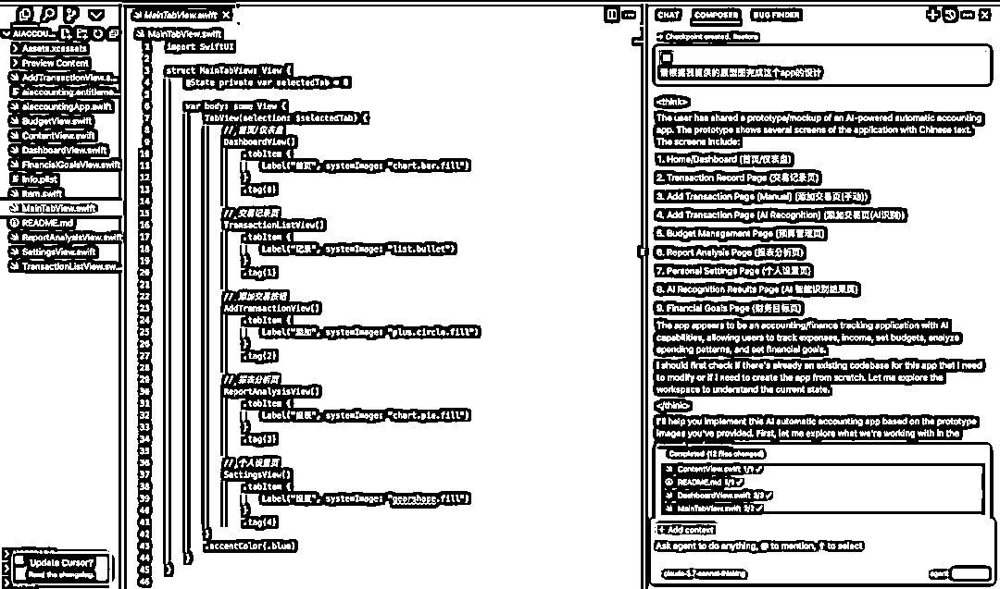
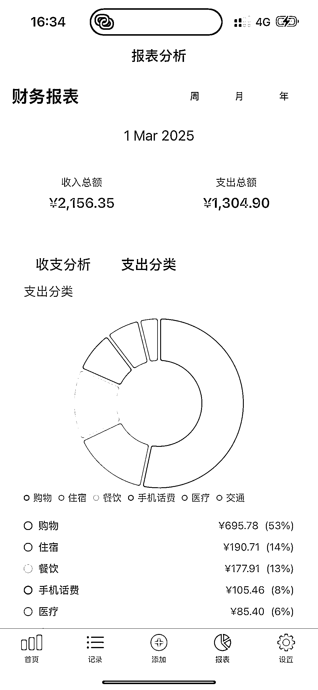

# Cursor+Claude3.7 的绝杀：从原型到 app，两步完成 app 开发

> 原文：[`www.yuque.com/for_lazy/zhoubao/duxo1wkytb70ak56`](https://www.yuque.com/for_lazy/zhoubao/duxo1wkytb70ak56)

## (45 赞)Cursor+Claude3.7 的绝杀：从原型到 app，两步完成 app 开发

作者： AI 进化论-花生

日期：2025-03-02

最近在 X 上看到了一些人在用 Claude 3.7 Sonnet 生成
app 原型图的尝试，受到启发，发现这么先生成不同界面的原型图再让 Cursor 基于原型图开发 app 会是很好的尝试。尤其是，你也可以不两步直接生成，而是在过程中更可视化地思考你要生产的原型，这对于非专业的产品经理来说，会是好得多的方式。

我今天做了些尝试后，效果让我感到惊艳。这里给大家介绍下具体的操作方式。

**步骤一：新开项目文件生成 HTML 原型图**[​](https://www.bookai.top/cursor/app_2step#步骤一新开项目文件生成 html 原型图)

可以参考我的提示词，修改其中的要求。

我想开发一个 ai 自动记账 app，现在需要输出原型图，请通过以下方式帮我完成 app 所有原型图片的设计。

1、思考用户需要 ai 记账 app 实现哪些功能

2、作为产品经理规划这些界面

3、作为设计师思考这些原型界面的设计

4、使用 html 在一个界面上生成所有的原型界面，可以使用 FontAwesome 等开源图标库，让原型显得更精美和接近真实

我希望这些界面是需要能直接拿去进行开发的

**这里有三个关键点：**

1、选择 Claude 3.7 Sonnet 模型，不建议 thinking

2、选择 composer normal 模式，或者说 0.46 版本中 editor 模式，不要选择 agent，不要选择 agent！

3、由于一次性生成的 html 代码文件会太长，中间可能会截断或创建失败，你可以点击生成失败的代码文件，cursor 会提醒你是否创建文件，然后把已经生成的一部分代码复制到新创建的文件中；接着，@对应代码文件，要求 cursor 继续补全文件。

然后，打开补全完成的 html，你就获得了类似下面的整个 app 所有主要界面的原型图👇

## **步骤二：让 Cursor 根据原型图创建 app**

用 Xcode 创建一个新项目，然后在 Cursor 中打开项目的根目录（如果从来没开发过 iOS 项目，不知道这一步如何操作的，可以先去看此前 Cursor 航海的教程或者我之前的 iOS
app 开发视频）

在 Cursor 打开的 iOS app 开发项目根目录中发送上面得到的 app 原型图，然后要求：

请根据我提供的原型图完成这个 app 的设计

**这一步依然有三个关键点：**

1、选择 Claude 3.7 Sonnet 模型，thinking 或非 thinking 都可以试试

2、选择 agent 模式，必须选择 agent！

3、这个过程中不断 accept 生成的代码文件就好了，创建完成后如果在 Xcode 调试出现 bug，可以把 xcode 的报错提示复制回 cursor，修 bug 场景建议使用 thinking 模型。

我这次测试过程中，两个步骤分别出现了一次 cursor 生成出错和一次 Xcode 报错，其他都一切顺利，得到的结果远超我的预期了。

甚至，这个 app 大部分功能都已经是可以正常操作，逻辑正常的。

这个两步生成 app 的策略其实都离不开 Claude 3.7 的能力，核心用到了两点：

1、Claude 3.7 生成原型的能力惊人

2、Cursor agent 模式+Claude 3.7 基于原型图多步骤完成任务能力惊人

下面是其他一些原型图

* * *

评论区：

A 米 : 太及时啦，正在学习使用 figma，就看到这个[强]

道法自然 : 厉害，打开了新思路，原来还在想着用 figma 做图呢[强][强][强]

一鱼两吃 : 这个思路太强了