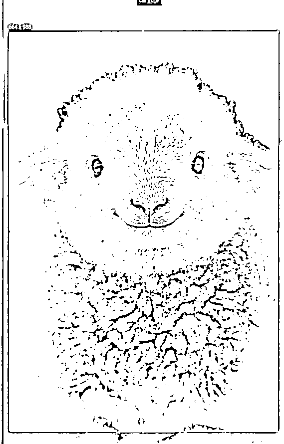

# AI 雪地萌宠，单条作品点赞 20W+，萌宠赛道最新流量密码，全流程拆解

> 原文：[`www.yuque.com/for_lazy/zhoubao/bysag2wn22fhdpa9`](https://www.yuque.com/for_lazy/zhoubao/bysag2wn22fhdpa9)

## (32 赞)AI 雪地萌宠，单条作品点赞 20W+，萌宠赛道最新流量密码，全流程拆解

作者： 大鹏

日期：2025-02-25

##### 大家好，我是大鹏

##### 最近刷抖音的时候偶尔看到一类萌宠账号流量跑的非常好

##### 相信很多老铁也都刷到过，很多博主都是靠它疯狂涨粉变现~

##### 作品基本上都是几千几万的点赞，涨粉也贼猛！

##### 新号发了 20 条视频直接粉丝过万！

##### 视频形式其实非常简单，就是一个非常可爱的小绵羊在雪地上面

变现的话也非常简单，吃平台的流量分成收益

制作一条视频直接同步到多个平台，可以吃到视频号的创作者分成、抖音的广告分成、伙伴计划等等

像这种视频几万的点赞，播放量怎么也得几百万了，一条视频流量分成几百块问题不大。

另外我看有些博主也在收徒，这收一个估计就得几百块

这种账号应该不缺想学习的人

##### 总的来说，变现还是非常可观的。

今天我就带大家来学习下这个视频到底是怎么制作出来的

可以看到这种视频形式非常简单，就是把一张小羊的图片变成视频就可以了

最关键的是**这张图片怎么做？**

今天我们来学两种方法。

废话不多说，我们直接上实操：

**一、图片制作**

**1、图片参考**

随便打开一个对标视频，把视频画面截图保存下来

然后打开即梦 AI，选择图片生成功能，把刚才保存的截图上传作为参考图，然后在文字输入框这里可以简单输入一下图片描述

比如我输入：一只非常可爱的小绵羊幼崽站在在窗户外面的雪地上盯着镜头，身上落满了雪花。

图片比例选择 9：16，稍等一会儿图片就生成好了，挑选一张效果最好的保存下来就搞定了

这种是最简单的模仿对标的方法，但你做出来的图片跟对标非常像。

如果你想做出自己的风格，也可以试着自己写一下提示词

**2、也就是第二种方法，写提示词**

我们可以看着图片先来描述下这只小羊，然后再描述下场景，最后再加上一点细节描述词，比如风格、构图、视角等等。

这样一整段提示词就出来了

我们把提示词整理下放到即梦里面生成看下，如果生成出来的效果不满意，可以继续调整优化提示词，直到生成你想要的效果为止。

当然这种方法比较麻烦，如果你想换个动物就需要重新想描述词，对于语文不太好的同学来说简直太折磨了。

不过，不用担心，作为大鹏的粉丝，这些问题我都帮你们想到了

我帮大家做了一个** *AI 雪地萌宠图片生成器：*****[`www.coze.cn/s/i5L1vqb5/`](https://www.coze.cn/s/i5L1vqb5)**

只需要输入动物名称即可自动生成 AI 雪地萌宠图片，高效创作。

**  **

**二、图片转视频**

图片生成好之后接下来就是要把图片转换成动态视频效果。

这一步就非常简单了，打开可灵 AI，选择图生视频功能，把前面生成好的图片上传到首帧这里

图片转视频提示词可以根据你的需要随便填写，比如我输入：小绵羊看着镜头微笑，天空中有雪花飘落。 images.zsxq.com/FpJEZTWmPaWkznX0dBd4rwbFAP3n)

生成质量和时长根据自己需要选择，最后点击生成，稍等几分钟，不出意外的话就能得到一段你想要的视频了~

最后把你生成好的视频下载下来，导入到剪映里面，加上你喜欢的背景音乐就可以导出发布了。

这一步太简单了就不给大家演示了~

以上就是这种 AI 雪地萌宠视频玩法的详细教程了，你学会了吗?

好了，今天的分享就到这里，如果你也对 AI 视频变现感兴趣的话，欢迎来找我聊聊~

* * *

评论区：

逸蒙 : 怎么加你？