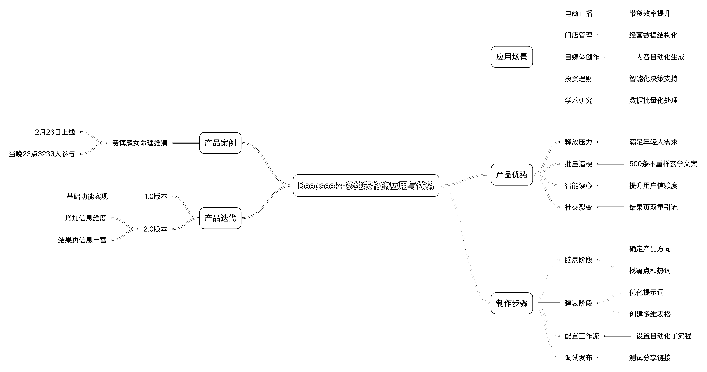
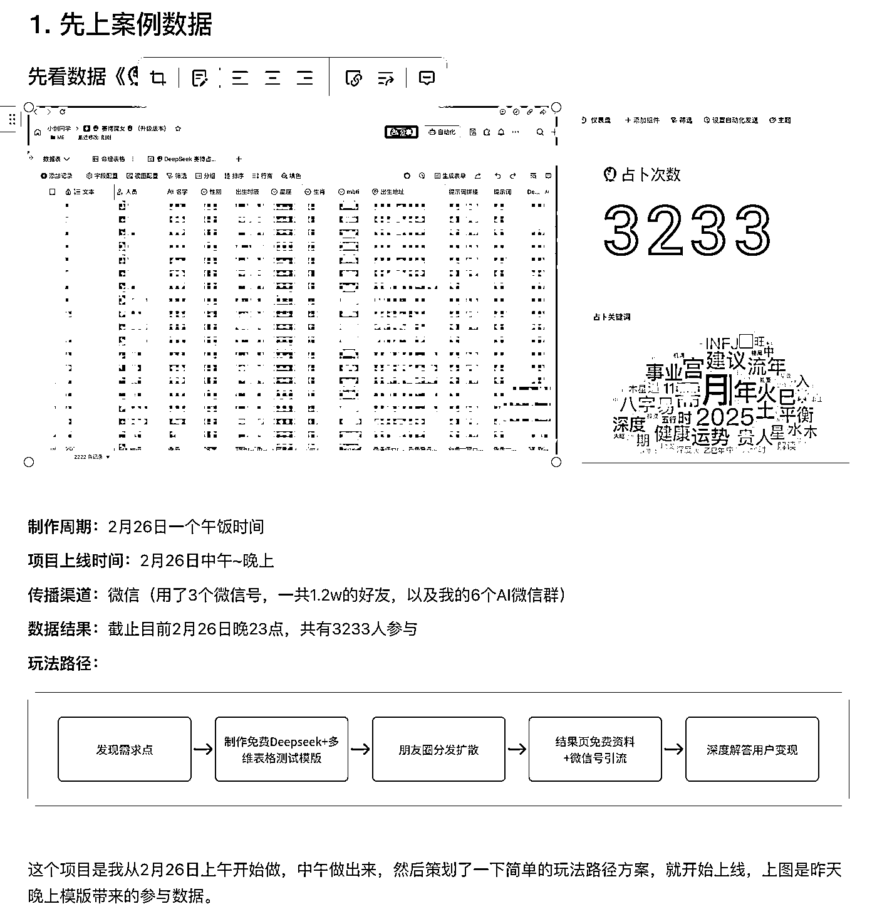
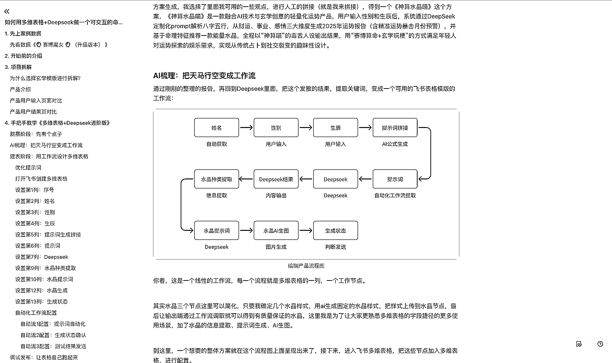

# 如何用多维表格+Deepseek 做一个可交互的命理推演产品《手把手进阶教程》

> 原文：[`www.yuque.com/for_lazy/zhoubao/hsw9va27pe9177uq`](https://www.yuque.com/for_lazy/zhoubao/hsw9va27pe9177uq)

## (26 赞)如何用多维表格+Deepseek 做一个可交互的命理推演产品《手把手进阶教程》

作者： 小创同学

日期：2025-02-28

**这是一篇关于 Deepseek+多维表格的应用的手把手教程，用时 16 个小时编辑完成，全文 6000 字。**

**内容大纲：**

**Deepseek+多维表格的应用场景**

可应用于电商直播、门店管理、自媒体创作、投资理财、学术研究等场景。

能批量化、业务化、结构化处理工作，节省时间和金钱。

是一人公司的神器，3 天的活 3 分钟搞定，节省几倍甚至几十倍时间和金钱。

**命理推演产品案例**

以“赛博魔女”命理推演产品为例，2 月 26 日午饭时间制作，晚上上线。

通过微信传播，截至当晚 23 点，3233 人参与。

**命理推演产品的优势**

满足年轻人释放压力需求，具备批量造梗、智能读心、社交裂变特点。

DeepSeek 能自动生成 500 条不重样玄学文案。

**产品版本迭代**

从 1.0 版本到 2.0 版本，用户输入页面增加信息维度，提升专业度和信赖度。

结果页信息丰富，结合专业术语与易懂文风，结尾双重引流。

**制作步骤**

脑暴阶段确定产品方向，用秘塔搜索找痛点和热词，结合 Deepseek 生成方案。

建表阶段优化提示词，在飞书创建多维表格并设置各列。

配置 3 个自动化工作流子流程，最后调试发布，分享链接测试。

**知识点讲解**

多维表格自动化工作流。

多维表格产品封装。

Deepseek 等字段捷径能力。

AI 表格公式能力。

 oLVkqcSq1b)

具体内容，查看飞书[`r1vak6ov9p.feishu.cn/docx/MXscdrpH9oEvHOxBK3Zcgf8fnhf?from=from_copylink`](https://r1vak6ov9p.feishu.cn/docx/MXscdrpH9oEvHOxBK3Zcgf8fnhf?from=from_copylink)

* * *

评论区：

锂电公社 : 老板为啥不做一个小程序

小创同学 : 小程序没有多维表格+AI 有想象

锂电公社 : 很受益，我可能要借鉴一部分，引入到小程序

小创同学 : 算命的小程序被封概率超级高的，但是算命需求一直都非常旺盛，我自己就经常去测测 A 上付费咨询

锂电公社 : 免费的，吃广告行不

小创同学 : 这种度控制不好就变成封建迷信，被下架

锂电公社 : 让我好好想想，感谢感谢

小创同学 : 我在小红书做能量相关的号都被平台永封[流泪]