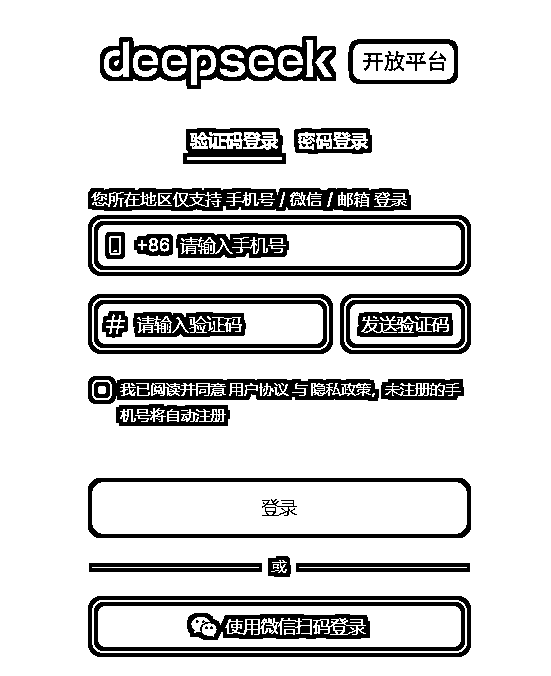
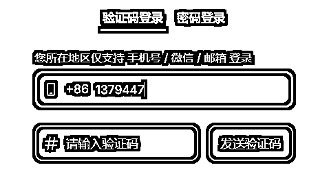
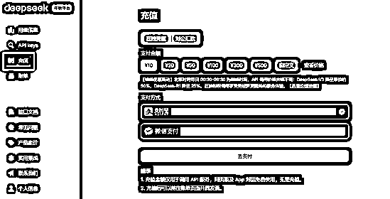
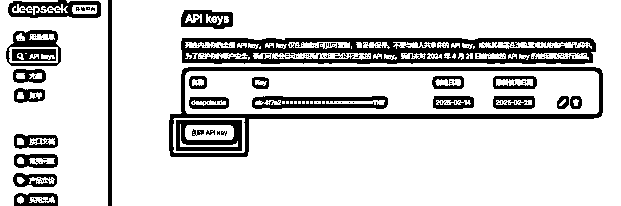
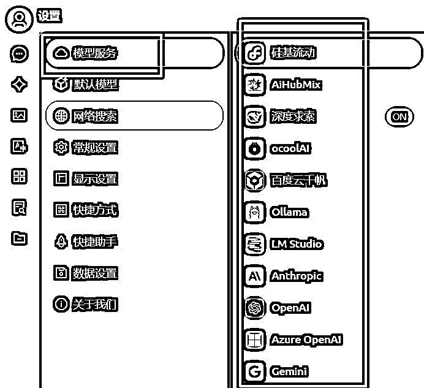
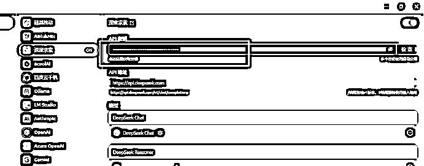
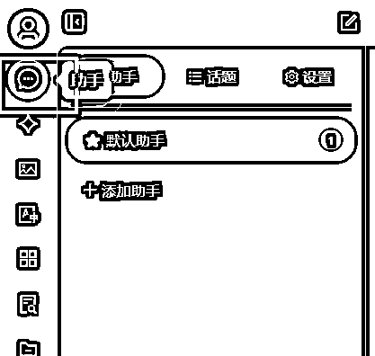
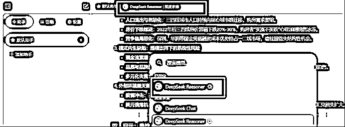
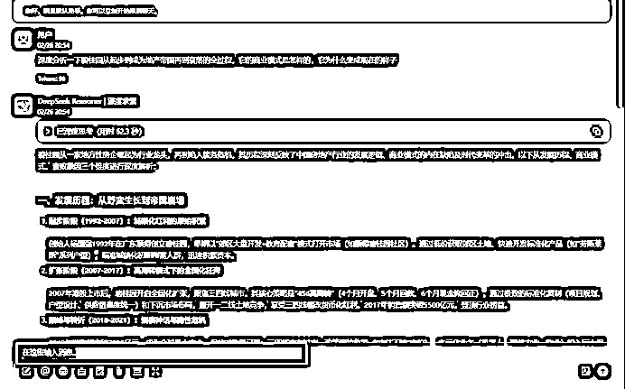

# deepseek 的官方版效果还是更好一些，分享一下能不限量使用的小方法

> 原文：[`www.yuque.com/for_lazy/zhoubao/rltnipv2xxvbi6im`](https://www.yuque.com/for_lazy/zhoubao/rltnipv2xxvbi6im)

## (21 赞)deepseek 的官方版效果还是更好一些，分享一下能不限量使用的小方法

作者： 平子

日期：2025-02-26

1、打开 deepseek 的开放平台官网 [`platform.deepseek.com/`](https://platform.deepseek.com/)

2、注册一个账号

3、点充值，先充 10 元试试（要实名认证）

4、创建一个 key，后面有用

5、下载一个第三方的平台叫 cherryai [`cherry-ai.com/`](https://cherry-ai.com/)

6、在左下角，找到它的配置页面

7、找到 模型服务的配置页面，市面上主流的平台都在这

8、找 深度求索

9、把之前创建的 key 填写到 API 密钥这里

10、打开右上角的开关

11、点击左上角，找到聊天页面

12、聊天窗口上分，有一个选择模型的入口。选 deepseek reasoner（也就是推理 R1）

13、开始聊天

* * *

评论区：

在旅途的车 : 这个还是要计算调用次数和费用吧？

平子 : 是呀

牧羊人老郭 : 这种只有电脑上操作吗？有手机上可以用的吗？

平子 : 暂时没找到