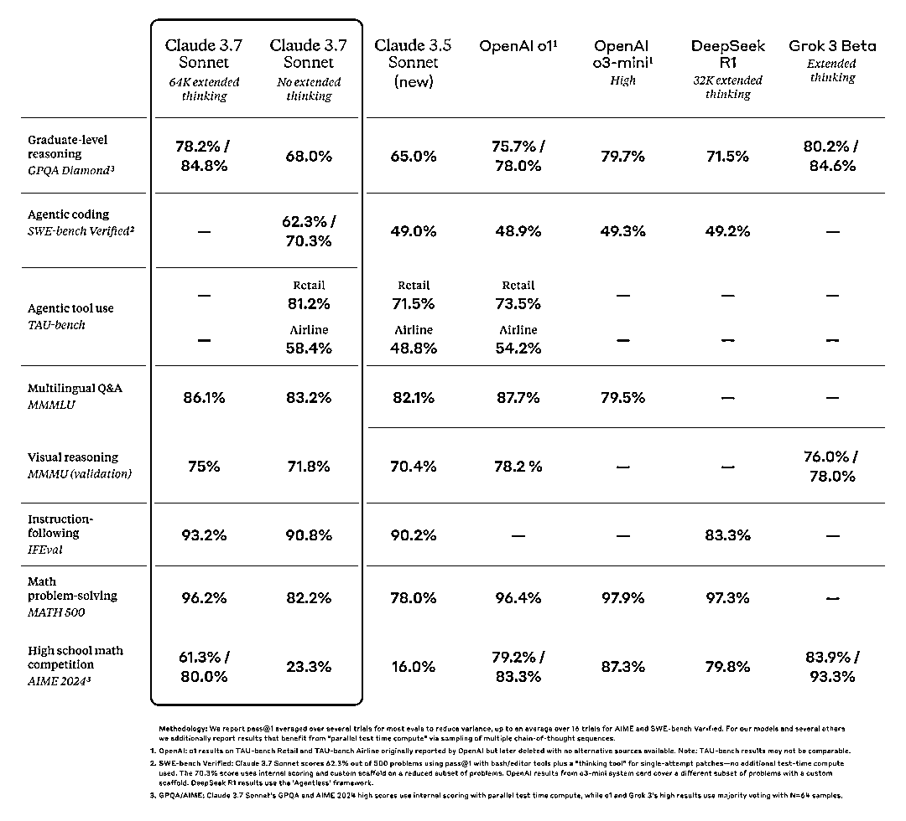
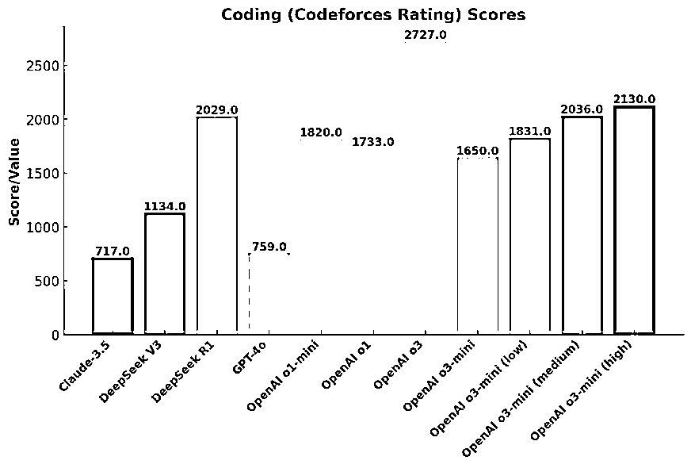
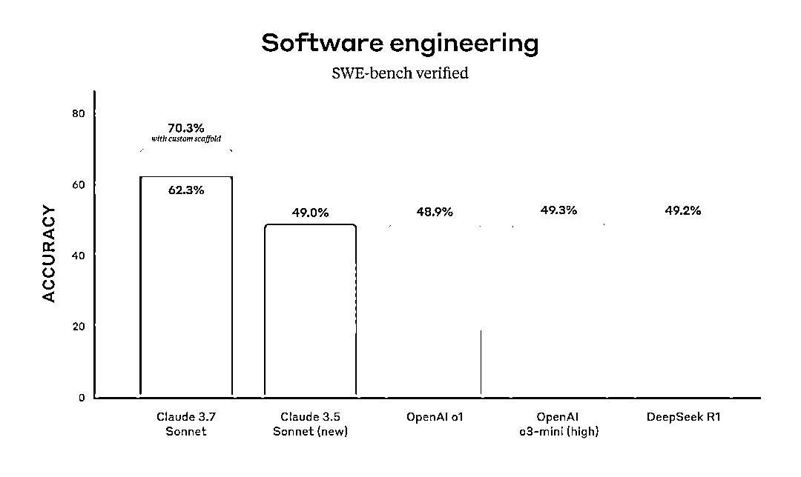
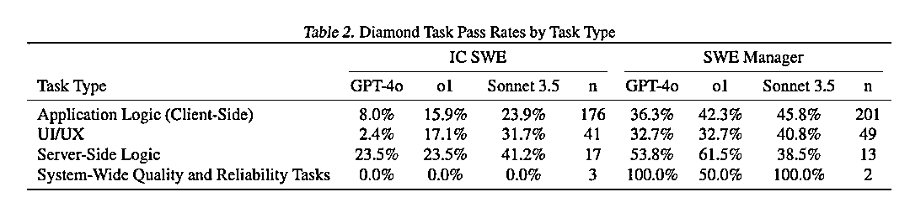
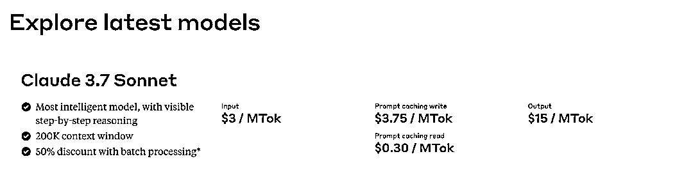
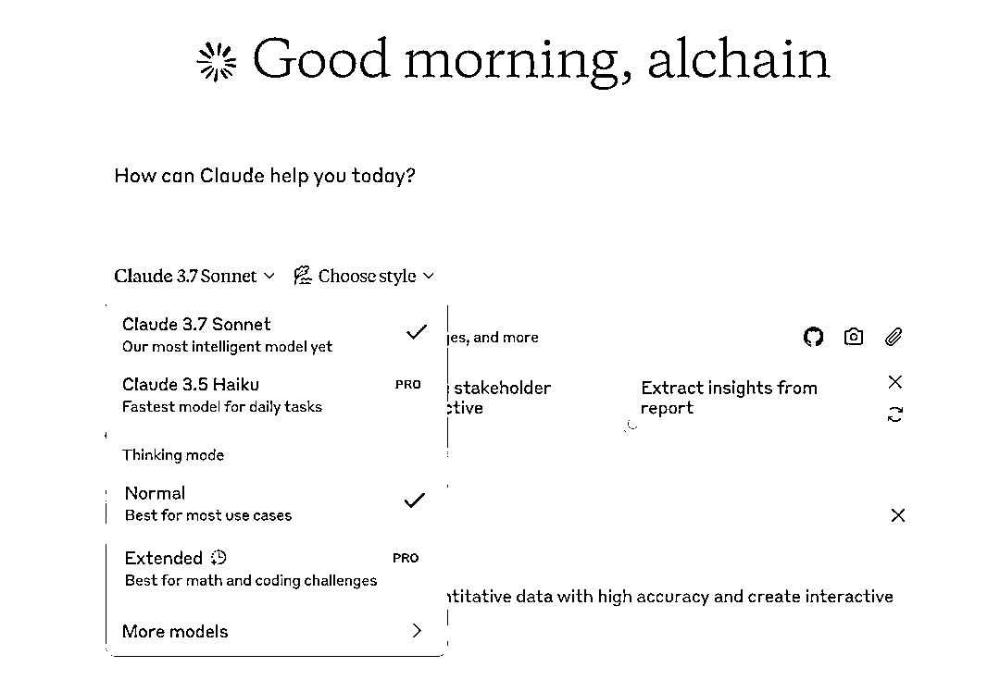
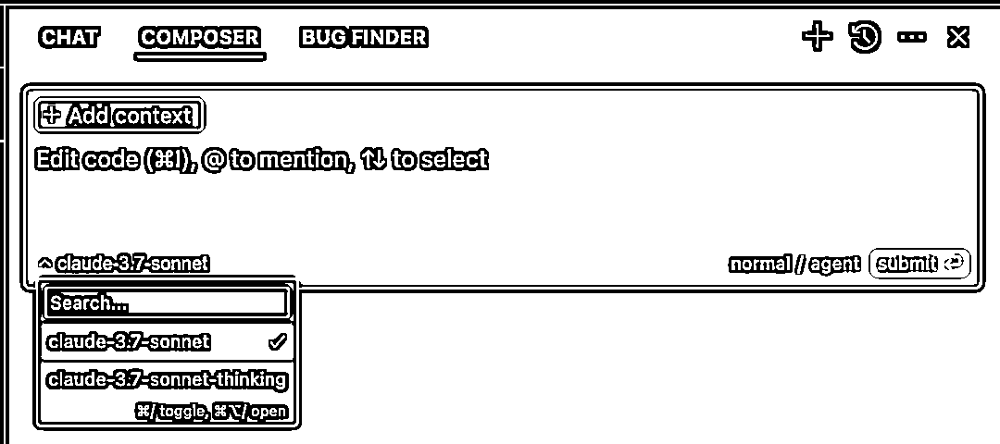
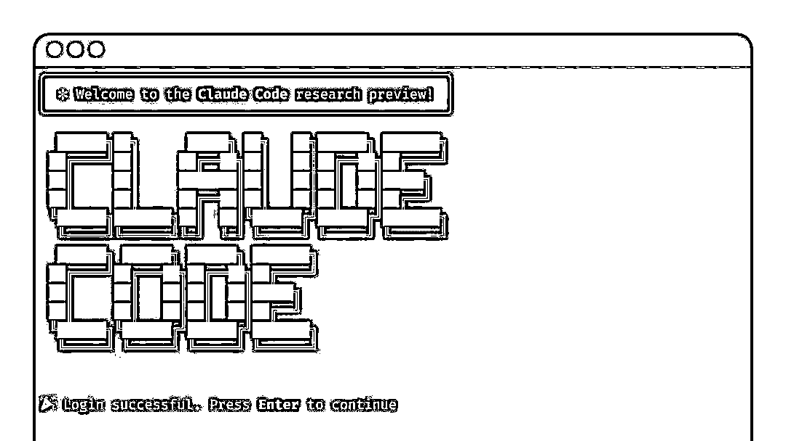

# Claude 3.7 Sonnet 深度解读 重新定义 AI 编程能力和推理模型

> 原文：[`www.yuque.com/for_lazy/zhoubao/mix9ph8xa58l6haa`](https://www.yuque.com/for_lazy/zhoubao/mix9ph8xa58l6haa)

## (22 赞)Claude 3.7 Sonnet 深度解读 重新定义 AI 编程能力和推理模型

作者： AI 进化论-花生

日期：2025-02-25

今天凌晨，Anthropic 的新模型 **Claude 3.7 Sonnet** 发布。如果只用一句话总结的话，那就是：**现实软件工程的 AI
编程能力又得到了一大突破，你可以在 Cursor 等 AI 编程工具中无脑选择使用这个模型，并且放弃任何没有接入这个模型的 AI 编程工具。**

从 AI 编程的范式来看，上一个临界点发生在 2024 年 6 月。那时 **Claude 3.5 Sonnet** 让 AI 编程能力有了质的飞跃，让
Cursor 这个打磨了一年多的 IDE 产品得以起飞进入大众视野，并且 Claude 3.5 Sonnet + Cursor 这种组合让 AI
编程真正突破了“可用性临界点”，让 0 基础不会写代码的人也可以尝试通过 AI 编程创造产品，享受创造的魔法。

从去年 6 月至今，你可能在无数新模型发布的 benchmark 中看到它们如何超越 Claude 3.5 Sonnet，比如 OpenAI 的
o1、o3，DeepSeek V3、R1，Grok 3 等等。但现实是，**真正在使用 AI 编程工具写代码、开发产品的人都会感受到，Claude 3.5
Sonnet 才是这期间唯一最好的编程模型。**

这个结论可能有点反直觉，但我想跟你说说为什么。

### **编程竞赛和软件工程是两回事**

大多数 AI 模型在发布时，都会用 **Codeforces** 这样的评估标准来衡量编程能力。Codeforces
是一个国际编程竞赛平台，你可以把它理解为“算法比赛”，类似奥数竞赛，但面向计算机科学领域。

但……你应该能理解，**编程竞赛和现实世界的软件工程压根就是两回事** 。

拿奥数举例，获得奥数金牌的人，未必会成为数学家，甚至不一定会在数学领域深耕。现实世界里，各大互联网公司的 CTO、顶级架构师，大多数都不是靠编程竞赛出身的。

同样，一个 AI 模型在 Codeforces 里刷高分，证明的是它在算法推理、数学计算上的能力，但不代表它能帮你开发一个真正能跑的 Web
应用，更不代表它能维护一个百万行代码的企业级项目。

### **Codeforces 为什么成为 AI 编程能力评测的主流？**

**原因很简单：它够标准化，够简单，也够容易优化。**

一个 AI 模型要想在 Codeforces
竞赛中拿高分，本质上就是提升它的数学推理能力、算法优化能力，以及代码补全能力。这些能力可以通过调整训练数据、优化推理策略来提升，而评测标准也是客观的——代码跑不跑得通，耗时多少，结果对不对，这些都可以量化。

而 Codeforces 的任务，往往是**自包含的、无上下文依赖的、单文件代码** ，AI
只需要专注于写出一个正确的算法，而不需要考虑代码如何融入到一个已有的代码库里，不需要关注软件架构，也不需要管理依赖关系。

对于大模型来说，这种任务很好优化。只要你给它提供足够多的编程竞赛题，让它大量练习，它的 Codeforces 得分自然会不断上升。

这也是为什么，我们会看到 OpenAI、DeepSeek、xAI 等厂商在新模型发布时，都会强调“我们的 AI 在 Codeforces
上又超越了 Claude 3.5 Sonnet 了！”——因为这个 benchmark 的分数最容易提升。

但问题是，**这真的对现实世界的 AI 编程能力有参考价值吗？**

### **为什么 Codeforces 分数高 ≠ 现实软件工程能力强？**

如果你真正在用 AI 写代码，你应该已经发现了 AI 编程的几个典型问题：

1.  它可以写出一段完美的算法，但你让它在一个大型项目里修 Bug，它可能连代码库的结构都搞不清楚。

2.  它可以在几秒钟内写出一份精妙的动态规划解法，但你让它优化数据库查询，它可能直接生成一段低效 SQL。

3.  它能写 Leetcode Hard 级别的代码，但你让它改一个前端 UI 组件，它可能会完全无视设计规范，写出一堆拼凑出来的 CSS。

这些问题，**都不是 Codeforces 能测出来的** ，因为 Codeforces
评测的是“一个独立算法任务能不能解出来”，而软件工程关心的是“这个代码能不能在一个庞大的代码库里正常运行”。

换句话说，**AI 在编程竞赛上赢过 99.9% 的人类了，但它依然不能替代现实世界的程序员。**

### **真正衡量 AI 编程能力的标准：SWE-bench 和 SWE-Lancer**

如果 Codeforces 不能反映 AI 编程的真实能力，那什么可以？

目前有两个更值得关注的评测标准：

1.  **SWE-bench Verified（衡量 AI 修 Bug 能力）**

2.  **SWE-Lancer（衡量 AI 在真实软件工程任务中的表现）**

### **SWE-bench Verified：AI 真的能修 Bug 吗？**

SWE-bench Verified 不是让 AI 解算法题，而是让它去修真实的软件 Bug。

这些 Bug 都来自开源项目，AI
需要在不破坏原有代码的前提下修复它们，并通过自动化测试验证修改是否正确。换句话说，这是在模拟**现实世界的代码维护工作** 。

在这个测试里，Claude 3.7 Sonnet 拿到了 **70.3%** 的成功率，比 Claude 3.5 、OpenAI
o1、o3-mini、DeepSeek R1 都提升了 20%以上，这完全是研发级的胜利。

这意味着，Claude 3.7 已经可以在大多数情况下，稳定地帮你修复代码错误，而不像以前的 AI 那样，修完 Bug 可能还得你自己再修它留下的新
Bug。

### **SWE-Lancer：AI 在真实软件开发中的竞争力**

SWE-Lancer 是 OpenAI 提出的一个新评测标准，它直接从自由职业者平台 **Upwork** 里选取了 **1488
个真实的软件开发任务，总价值 100 万美元** ，然后让 AI 去竞争这些任务，看它能不能完成并“赚到钱”。

任务分成两类：

1.  **IC SWE（独立开发者任务）：AI 需要像自由职业者一样，真正开发功能、修复 Bug。**

2.  **SWE Manager（技术管理任务）：AI 需要评估多个开发者提交的方案，并选择最优解，相当于扮演“技术负责人”。**

OpenAI 罕见的在发表这个测试标准的论文里承认，Claude 3.5 Sonnet
是比 o1 和 GPT-4o 好得多的模型，这篇论文数据可以得到一些很有趣的结论：

1、Claude 3.5 Sonnet 依然是最佳的现实世界软件工程的编程模型选择，能完成大约 40%的任务； 2、大模型在技术管理任务（SWE
Manager）的成功率明显优于独立开发者任务（IC SWE），所以这是说技术管理者更容易被 AI 替代？
3、AI 在服务端逻辑类任务上的成功率优于前端任何和 UI/UX 任务（尽管一般人现在会判断 AI 编程更适合用来写前端代码）。

### **Claude 3.7 Sonnet = 现实 AI 编程能力的又一次突破**

所以综合看这次 Claude 3.7 在 SWE-bench 的表现，以及 SWE-Lancer
中 OpenAI 的评估，说明 Sonnet 的编程能力不仅仅停留在“刷题”，而是真的在现实软件工程中更有用。

所以，如果你想用 AI 编程，**不要只看 Codeforces 的分数，要看它在 SWE-bench 和 SWE-Lancer 里的表现。**

现在的结论很简单：**Claude 3.7 Sonnet 是目前 AI 编程的最强选择，远比任何 Codeforces 刷分高的模型更适合现实开发。**

在得出这个结论之后，我们可以再深入看看 Claude 3.7 Sonnet 有哪些特性，以及他们同步发布的一款工具 Claude Code。

## **Claude 3.7 Sonnet：推理是一条连续的光谱**

Anthropic 对模型推理的看法和其他公司（OpenAI、DeepSeek、Grok）都不太一样，他们更认为模型的推理能力不是 0 和 1 之间有泾渭分明的边界的，而更像是一条连续的光谱。

所以他们没有推出专门的推理模型，而是推出了一个混合模型（hybrid reasoning
model），你可以自由选择让模型是否思考，以及…思考多久。在调用 API 的时候，你可以自由限制模型思考的 token 数，通常来说，更长的思考能获得更好的表现，最长的思考 token 可以长达 128k，听起来就挺烧钱的。毕竟这个模型的每百万输入 token 还是需要 3 美元，百万输出 token 是 15 美元，比 OpenAI 的 o3-mini 和 DeepSeek
R1 都贵了好几倍。

不过现在在 C 端的产品形态上，还没体现这种差异，在 Claude 自己的产品上，你可以通过选择“Extended”去激活思考。

在 Cursor 中，有 Claude 3.7 Sonnet 和 Claude 3.7 Sonnet
thinking 两个模型可供选择。我的建议是，在常规开始一项任务的时候，你选择常规的 Claude 3.7
Sonnet 模型即可。在处理 bug，或者需要模型帮你做规划，你希望它能做更多思考时选择 Claude 3.7 Sonnet
thinking 模型，并且在选择的时候，你可以提示词中直白地要求思考更多时间，考虑更多方案即可。



## **Claude Code：一个不太一样的 AI 编程工具**

Claude 3.7 之外，Anthropic 还发布了 **Claude Code** ——一个完全基于终端的 AI 代码代理。

如果你用过 Cursor 或者 Copilot，你可能会觉得 AI 编程工具应该是 IDE 里的智能补全助手。但 Claude Code
走了另一条路：它直接在 **命令行** 里运行，可以帮你修改代码、提交 Git 变更、修 Bug，甚至管理整个代码库。

说白了，**它更像是一个“AI Shell 助手”，而不是一个 IDE 里的智能补全工具** 。

但目前来看，Claude Code 还是一个雏形，它的问题也很明显：

1.  **它的权限管理还不够完善，AI 直接在你的终端里操作代码，万一改错了文件，可能会造成损失。**

2.  **它的用户体验跟 IDE 助手完全不同，需要适应新的工作方式，看起来挺酷，但挺不新手有好的。**

所以，你可以试试 Claude Code，但暂时别指望它现在就能完全取代 Cursor。

我很期待 Claude 3.7 和前段时间 OpenAI 的 SWE-lancer 的发布能让各大模型产商们再干点正事，卷一卷真正有用的现实的软件工程的能力。

AI 距离人类中级工程师的水平又更近了一步，或许我们终于有时间思考那个终极问题：

如果代码不再是瓶颈，我们要用怎样的想象力重新定义软件？

* * *

评论区：

老鹰 : 今天已经用上 3.7 了[憨笑][憨笑]