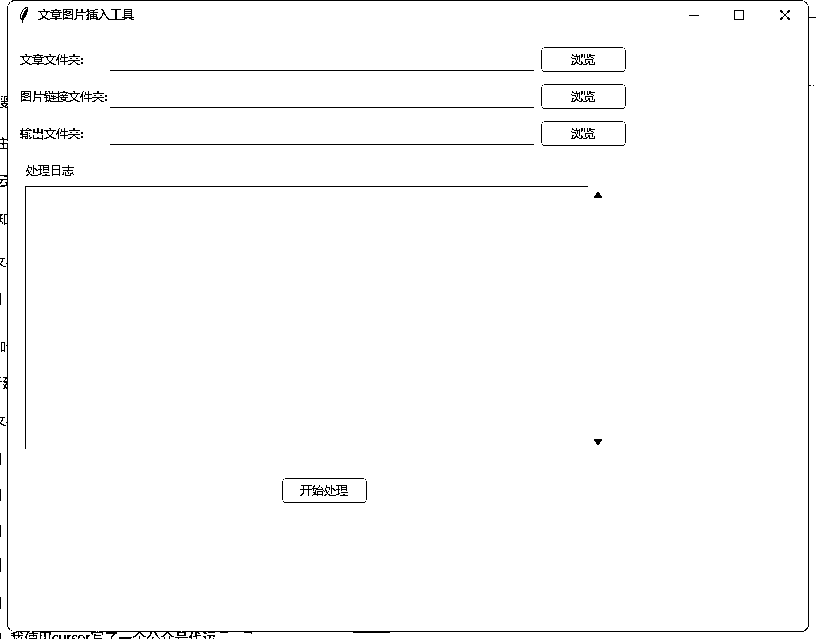

# 如何利用 cursor 实现文章中自动批量插入图片

> 原文：[`www.yuque.com/for_lazy/zhoubao/mu223pru5oocvglg`](https://www.yuque.com/for_lazy/zhoubao/mu223pru5oocvglg)

## (9 赞)如何利用 cursor 实现文章中自动批量插入图片

作者： 锂电公社

日期：2025-02-27

# 代运营批量文章插入图片是一个痛点

公众号代运营在文章中自动插入图片是一个痛点，也是我的一个痛点，通过对 cursor 学习以后，我实现了文章的插图和自动排版。主要是利用了两个点：

1.先将图片链接插入到 txt 文档中

2.将图片转换为 html 格式

3.在 96 编辑器做还原（这里主要是借鉴了猫哥的方式）

4.运行后，可以看到 GUI 界面，

注意每个文档是一篇文章的图片链接，然后根据文章文件名称和图片的文件名称对应匹配插入。

文末有脚本的源代码，大家自行下载使用！

import os

import random

import tkinter as tk

from tkinter import filedialog, ttk, messagebox

def insert_images_into_text(text_file_path, image_links_file_path,
output_file_path):

try:

# 读取文章内容，保持原有格式

with open(text_file_path, 'r', encoding='utf-8') as f:

text_content = f.read()

# 读取图片链接并去重

with open(image_links_file_path, 'r', encoding='utf-8') as f:

image_links = []

used_links = set()

for line in f:

link = line.strip()

if link and link not in used_links:

image_links.append(link)

used_links.add(link)

# 随机选取 3-5 张图片

if len(image_links) > 5:

num_images = random.randint(3, 5)

image_links = random.sample(image_links, num_images)

elif len(image_links) > 3:

num_images = random.randint(3, len(image_links))

image_links = random.sample(image_links, num_images)

# 如果图片数量小于等于 3，保持所有图片

# 将文章分割成段落，保持原有的换行符

paragraphs = text_content.split('\n')

# 计算插入位置

# 只计算非空段落的数量来确定图片位置

non_empty_paragraphs = [i for i, p in enumerate(paragraphs) if p.strip()]

total_paragraphs = len(non_empty_paragraphs)

total_images = len(image_links)

insert_positions = []

if total_images > 0:

step = total_paragraphs / (total_images + 1)

for i in range(total_images):

pos = non_empty_paragraphs[int(step * (i + 1))]

if pos >= len(paragraphs):

break

insert_positions.append(pos)

# 插入图片

final_content = []

image_index = 0

for i, paragraph in enumerate(paragraphs):

final_content.append(paragraph)

if i in insert_positions and image_index < len(image_links):

final_content.append('') # 图片前的空行

final_content.append(image_links[image_index])

final_content.append('') # 图片后的空行

image_index += 1

# 写入新文件

with open(output_file_path, 'w', encoding='utf-8') as f:

f.write('\n'.join(final_content))

return "success"

except Exception as e:

return f"error: {str(e)}"

class ImageInserterGUI:

def **init**(self, root):

self.root = root

self.root.title("文章图片插入工具")

self.root.geometry("800x600")

# 创建主框架

self.main_frame = ttk.Frame(root, padding="10")

self.main_frame.grid(row=0, column=0, sticky=(tk.W, tk.E, tk.N, tk.S))

# 文件夹选择区域

self.create_folder_selection()

# 日志显示区域

self.create_log_area()

# 执行按钮

self.create_execute_button()

def create_folder_selection(self):

# 文章文件夹选择

ttk.Label(self.main_frame, text="文章文件夹:").grid(row=0, column=0, sticky=tk.W,
pady=5)

self.articles_path = tk.StringVar()

ttk.Entry(self.main_frame, textvariable=self.articles_path,
width=60).grid(row=0, column=1, pady=5)

ttk.Button(self.main_frame, text="浏览", command=lambda:
self.browse_folder(self.articles_path)).grid(row=0, column=2, padx=5, pady=5)

# 图片链接文件夹选择

ttk.Label(self.main_frame, text="图片链接文件夹:").grid(row=1, column=0, sticky=tk.W,
pady=5)

self.images_path = tk.StringVar()

ttk.Entry(self.main_frame, textvariable=self.images_path,
width=60).grid(row=1, column=1, pady=5)

ttk.Button(self.main_frame, text="浏览", command=lambda:
self.browse_folder(self.images_path)).grid(row=1, column=2, padx=5, pady=5)

# 输出文件夹选择

ttk.Label(self.main_frame, text="输出文件夹:").grid(row=2, column=0, sticky=tk.W,
pady=5)

self.output_path = tk.StringVar()

ttk.Entry(self.main_frame, textvariable=self.output_path,
width=60).grid(row=2, column=1, pady=5)

ttk.Button(self.main_frame, text="浏览", command=lambda:
self.browse_folder(self.output_path)).grid(row=2, column=2, padx=5, pady=5)

def create_log_area(self):

# 创建日志显示区域

log_frame = ttk.LabelFrame(self.main_frame, text="处理日志", padding="5")

log_frame.grid(row=3, column=0, columnspan=3, sticky=(tk.W, tk.E, tk.N, tk.S),
pady=10)

self.log_text = tk.Text(log_frame, height=20, width=80)

self.log_text.grid(row=0, column=0, sticky=(tk.W, tk.E, tk.N, tk.S))

scrollbar = ttk.Scrollbar(log_frame, orient=tk.VERTICAL,
command=self.log_text.yview)

scrollbar.grid(row=0, column=1, sticky=(tk.N, tk.S))

self.log_text['yscrollcommand'] = scrollbar.set

def create_execute_button(self):

# 创建执行按钮

ttk.Button(self.main_frame, text="开始处理",
command=self.execute_process).grid(row=4, column=0, columnspan=3, pady=10)

def browse_folder(self, string_var):

folder_path = filedialog.askdirectory()

if folder_path:

string_var.set(folder_path)

def log(self, message):

self.log_text.insert(tk.END, message + "\n")

self.log_text.see(tk.END)

self.root.update()

def execute_process(self):

# 检查路径是否都已选择

if not all([self.articles_path.get(), self.images_path.get(),
self.output_path.get()]):

messagebox.showerror("错误", "请选择所有必要的文件夹路径")

return

# 清空日志

self.log_text.delete(1.0, tk.END)

try:

result = match_and_insert_images(

self.articles_path.get(),

self.images_path.get(),

self.output_path.get(),

log_callback=self.log

)

messagebox.showinfo("完成", result)

except Exception as e:

messagebox.showerror("错误", str(e))

def match_and_insert_images(articles_folder, images_folder, output_folder,
log_callback=print):

try:

if not os.path.exists(output_folder):

os.makedirs(output_folder)

# 获取所有文章文件

article_files = {}

log_callback("文章文件列表：")

for file in os.listdir(articles_folder):

if file.endswith('.txt'):

name = os.path.splitext(file)[0]

article_files[name] = os.path.join(articles_folder, file)

log_callback(f" - {name}")

# 获取所有图片链接文件

image_files = {}

log_callback("\n 图片链接文件列表：")

for file in os.listdir(images_folder):

if file.endswith('.txt'):

name = os.path.splitext(file)[0]

image_files[name] = os.path.join(images_folder, file)

log_callback(f" - {name}")

# 显示匹配结果

log_callback("\n 成功匹配的文件：")

matched_files = set(article_files.keys()) & set(image_files.keys())

for name in matched_files:

log_callback(f" - {name}")

log_callback("\n 未匹配的文章文件：")

unmatched_articles = set(article_files.keys()) - set(image_files.keys())

for name in unmatched_articles:

log_callback(f" - {name}")

log_callback("\n 未匹配的图片链接文件：")

unmatched_images = set(image_files.keys()) - set(article_files.keys())

for name in unmatched_images:

log_callback(f" - {name}")

# 匹配文件并处理

processed_count = 0

for name in matched_files:

output_file = os.path.join(output_folder, f"{name}.md")

# 调用原有的插入图片函数

result = insert_images_into_text(

article_files[name],

image_files[name],

output_file

)

if result == "success":

processed_count += 1

log_callback(f"成功处理: {name}")

else:

log_callback(f"处理失败: {name}, 错误: {result}")

return f"完成处理 {processed_count} 个文件"

except Exception as e:

return f"错误: {str(e)}"

if **name** == "**main**":

root = tk.Tk()

app = ImageInserterGUI(root)

root.mainloop()

# 脚本链接：

[`si06f5z4e71.feishu.cn/wiki/TDl3wg7HxiTuNpkg3wsc5Dj4neg?from=from_copylink`](https://si06f5z4e71.feishu.cn/wiki/TDl3wg7HxiTuNpkg3wsc5Dj4neg?from=from_copylink)

* * *

评论区：

锂电公社 : [`si06f5z4e71.feishu.cn/wiki/TDl3wg7HxiTuNpkg3wsc5Dj4neg`](https://si06f5z4e71.feishu.cn/wiki/TDl3wg7HxiTuNpkg3wsc5Dj4neg)

以梦为马 : 有没有好用的翻墙工具

半扇咸鱼 : 不要在这里讨论这个哦