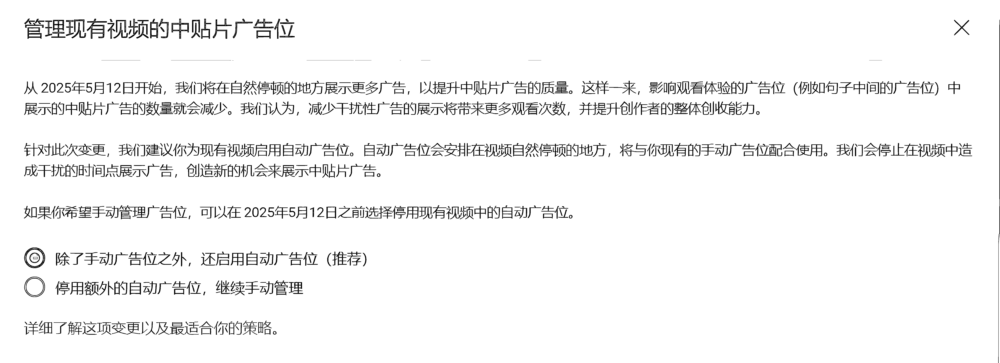
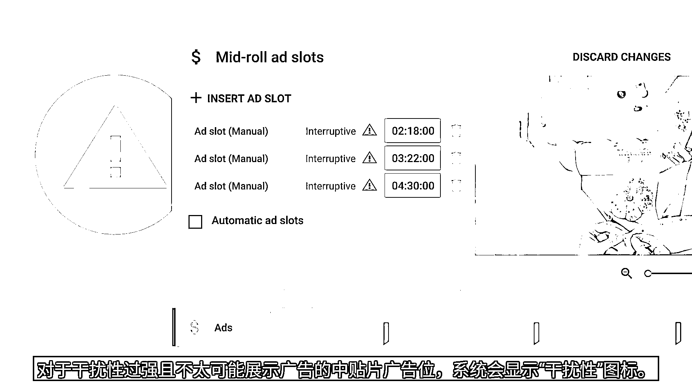
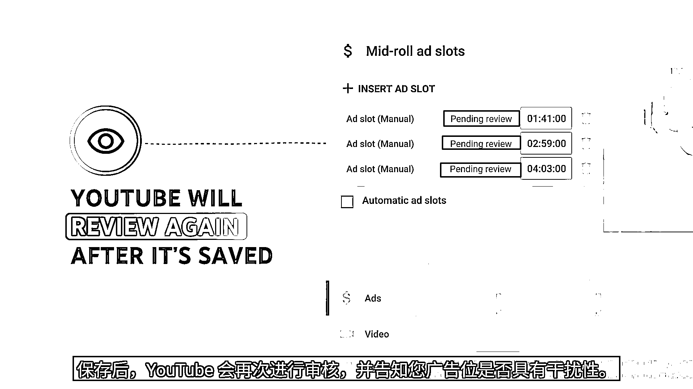
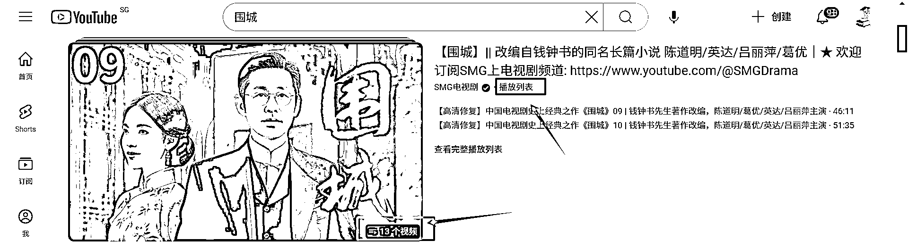
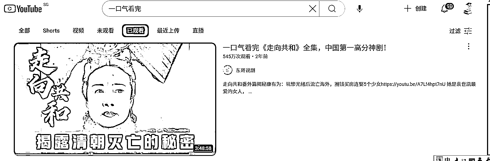

# （油管重大更新）启用长视频“中贴片广告自动插播”功能，帮助油管博主多赚钱。

> 原文：[`www.yuque.com/for_lazy/zhoubao/qaqegoxll1g4tx58`](https://www.yuque.com/for_lazy/zhoubao/qaqegoxll1g4tx58)

## (19 赞)（油管重大更新）启用长视频“中贴片广告自动插播”功能，帮助油管博主多赚钱。

作者： 书情小跟班

日期：2025-02-28

前言：关注 YouTube 官方最新趋势是很有必要的，也就是在昨天留意到这个通知

更好的观看体验见飞书文档

【油管重大更新】启用长视频“中贴片广告自动插播”功能，帮助油管博主多赚钱。

[`rlwxa0zgke.feishu.cn/docx/AK5zd884Moq0GVxx83ZcepBenFf`](https://rlwxa0zgke.feishu.cn/docx/AK5zd884Moq0GVxx83ZcepBenFf)

往期的更新见飞书文档

做 YouTube 的一些常识 [`rlwxa0zgke.feishu.cn/docx/P2DYduGbkoW0nqxcRZgcL6xKn7I`](https://rlwxa0zgke.feishu.cn/docx/P2DYduGbkoW0nqxcRZgcL6xKn7I)

这个官方文档
管理长视频中中贴片广告的插播时间点 Hans#zippy=,在-youtube-工作室中管理广告插播时间点,新上传视频的中贴片广告位,现有已上传视频的中贴片广告位,中贴片广告质量反馈功能)

我要官方文档中要留意的内容列出来了

## 在 YouTube 工作室中管理广告插播时间点

确定中贴片广告展示位置的方式有 3 种：

1.  自动广告位：您可以启用自动投放的中贴片广告，这意味着由我们负责找到最合适的自然停顿之处来投放广告，为观看者打造更加平衡的体验。

2.  手动广告位：如果您选择手动确定广告位，请尽量选择在自然间歇点投放广告，以达到理想的效果。应避免将中贴片广告位设置在不恰当的时点（例如一句话中间或动作中间），以免破坏视频流畅性。如果您在制作内容时有意识地设置了自然广告位，可以使用手动广告位来确定广告的展示时间。

3.  手动广告位和自动广告位相结合：您可以使用自动中贴片广告，作为对手动添加的展示位置的补充。如果您手动选择的展示位置会影响视频流畅性，我们将为您找到更合适的展示位置。

设置中贴片广告位后，请使用中贴片广告质量反馈功能 Hans#qualityfeedback)检查是否有任何广告会造成干扰。您可以将中贴片广告位调整到自然停顿的地方（例如转场位置），以提升观看者体验并提高收入。

我们就直接选上面的 【除了手动广告位之外，还启用自动广告位(推荐)】 就好了，也就是官方文档中的第 3 点

1.  **手动广告位和自动广告位相结合：您可以使用自动中贴片广告，作为对手动添加的展示位置的补充。如果您手动选择的展示位置会影响视频流畅性，我们将为您找到更合适的展示位置。**

我们在手动插入广告的时候，留意一个点，如下图，如果出现红色感叹号，那么你就要重新调整这个广告位置

解读：我个人认为 YouTube 的这次更新是为了提升观看体验而更新的这么一个功能。

在这个功能没有推出之前，YouTube 博主是可以自己手动来进行广告位置的插入，这个插入的位置不一定会很合理，这次更新后，YouTube 官方认为不合理的地方会出现一个红色感叹号。

在以往可能的情况是观众正听得入神，一句话刚说到一半，“咔嚓”一下跳出广告，等广告播完，都记不起前面讲什么了，这就影响观众的一个观看体验。

YouTube 此次更新对广告进行了优化，目的是让观众观看时没有中断感。YouTube 官方会对广告位置进行干预了，这就要求我们在做视频的时候按章节来。

如果我们再按老思路进行手动插播广告的做法在 2025 年 5 月 12 号就不是一个明智的决定了，你手动插播广告，位置不合理，YouTube 官方就不会在你插入的位置播放广告了。这也是不建议大家手动管理广告位的一个原因了

补充一些常识：不管是手工还是自动插播广告，视频长度都要 8 分钟以上，当然了，你也别硬为了凑够时长为了 8 分钟而 8 分钟，你这套路观众也不傻，一个方案是你把这一类视频做成一个合集，几个视频合在一起。

举个例子，像一些电视剧解说，一集一集解说，如果某一集解说不够 8 分钟，那么后期可以弄一个整个电视剧全集解说的一个合集。类似于一口气看 XXX 系列。

同一个系列的视频做成插放列表的形式，如下图 【播放列表】
【13 个视频】，观众看了一个视频会自动看下一个视频，再整一个合集，也就是前面说的一口气看 XXX 系列。

类似于这种一口气看完 XXX 系列，是非常拉时长的

* * *

评论区：

暂无评论