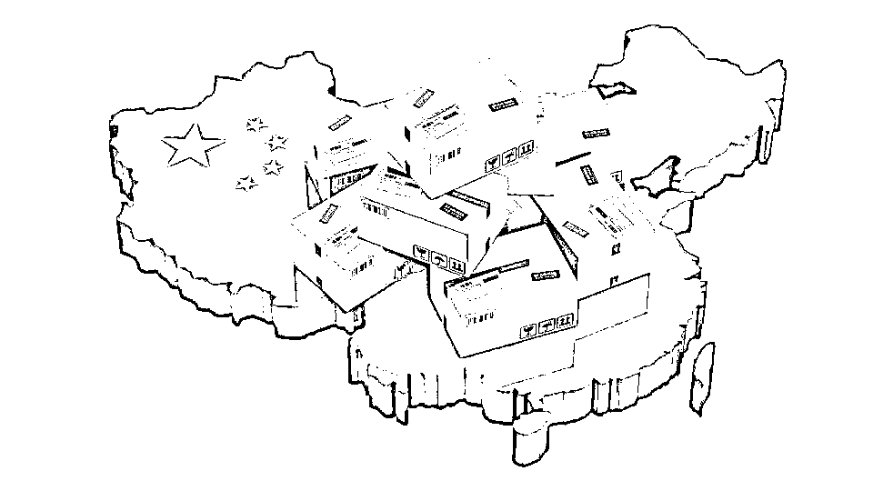
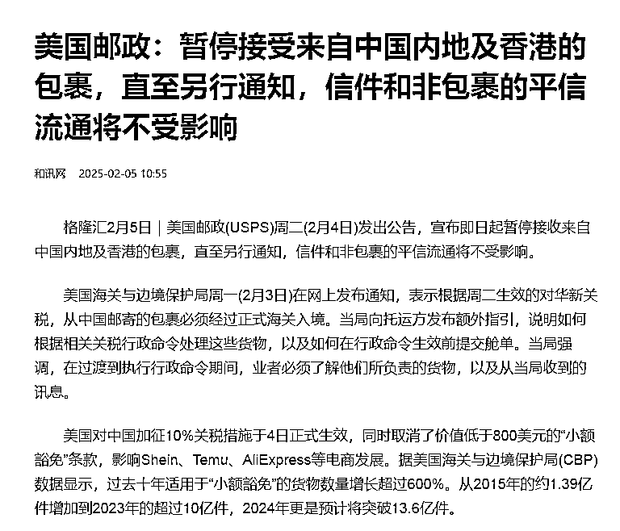
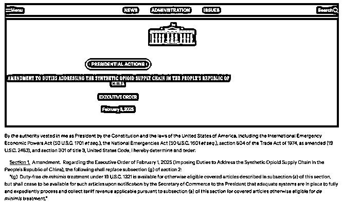

# 如果 T86 真的取消，跨境电商将面临什么样的挑战？

> 原文：[`www.yuque.com/for_lazy/zhoubao/otkcagdnp0of6of4`](https://www.yuque.com/for_lazy/zhoubao/otkcagdnp0of6of4)

## (9 赞)如果 T86 真的取消，跨境电商将面临什么样的挑战？

作者： 国民弟弟的跨境十年

日期：2025-02-24

最近，关于美国是否会取消 T86 政策的讨论越来越热，很多人都有自己的看法。但是，作为一个有 10 年经验的跨境电商卖家，我觉得有很多专家的观点并不完全接地气。所以今天，我想从一线卖家的角度，来谈谈如果 T86 真的取消，我们跨境电商行业会怎么变化。

### T86 取消：为什么会这么重要？

首先，T86 政策，简单来说，就是美国对价值低于 800 美金的包裹免收关税的政策。很多卖家利用这个政策，通过低成本的小包裹进出口商品。这一政策的取消，会对很多依靠低成本小包的卖家造成很大影响。

**政策变化背景：**

*   **2025 年 2 月 4 日深夜，美国邮政（USPS）突然宣布，全面暂停接收来自中国内地和香港的入境包裹。**

也可以看看以往的文章~[`articles.zsxq.com/id_rw26ved5l8w1.html`](https://articles.zsxq.com/id_rw26ved5l8w1.html)

*   **不足一天次日便恢复。**

**为什么暂停 T86 政策？** 问题出在美国海关。根据海关与边境保护局的数据，目前每天进入美国的低价值商品已超过 400 万件，是 2022 年日均 190 万件的两倍多。突然取消 T86 流程，意味着这些包裹必须转到更复杂的 T1 清关模式。如果用生活中的例子来说，就像原本每天能顺利通过安检的游客，突然间被要求每个人都要接受严格检查，连鞋子都得脱下来；对于海关来说，这无疑是一次巨大的挑战。

更直接的后果是，包裹堆积如山。就拿纽约肯尼迪国际机场来说，仅仅在 T86 暂停的这两天，就有超过 100 万件包裹滞留，机场仓库几乎塞满。美国邮政服务（USPS）甚至一度暂停接收来自中国和香港的包裹，虽然很快恢复了，但混乱的局面让人完全没预料到。

目前来看，特朗普的暂停决定确实给跨境行业争取了一个短暂的缓冲期。但这并不意味着问题已经解决。正如许多美国媒体报道中提到的“delay”和“pause”这样的词语所暗示，取消关税豁免只是被推迟了，并不是完全放弃。换句话说，这场风波还远没有结束。

### 如果 T86 真的取消，跨境电商会受到哪些冲击？

#### 1. 清关方式的变化

如果 T86 被取消，跨境电商卖家的清关成本将大幅上升。当前，我们常用的 T86 方式几乎是“免清关”的，而如果转到 T11（简易清关）或者 T01（一般贸易）模式，清关费用就会变得更高。

以一个简单的例子来说，如果你的产品采购价是 2 美元，按照 40%的税率，T86 模式下几乎不收税，但如果走 T11，清关费用就得多出 2.6 美元，税费还要加上，这样一来，产品的成本可能一下子增加 70%，这对于大多数小包裹卖家来说，几乎是不可承受的负担。

#### 2. 小包卖家的转型挑战

很多卖家会选择通过转口贸易来应对取消 T86 的政策。所谓转口贸易，就是将货物先发往其他国家或地区的监管仓，再通过这些仓库运输到美国。这样可以暂时延续 T86 的政策，但这条路也不是没有风险。

首先，如果美国全球范围内取消 T86，那这条路也就没有用了。其次，若美国对货物来源进行严格检查，转口贸易的风险也大大增加。所以，这并不是一个可以长久依赖的解决方案。

#### 3. 对平台和大卖家的影响

对于像 TEMU、SHEIN 这样的全托管平台，转口贸易几乎不可能操作，因为他们的业务规模已经非常庞大，涉及的产品种类和量大到几乎不可能通过这种方式解决清关问题。SHEIN 这种依赖快速时尚产品的公司，受影响会更大。因为这类产品普遍税率较高，即便美国优化了清关程序，税金的上涨仍然会带来沉重的压力。

TEMU 的情况稍好一些，毕竟它的商品种类较为多样，虽然同样受影响，但他们有更大的运营灵活性和选择。尽管如此，长期来看，这些平台都会面临更高的成本压力。

### 跨境电商卖家的应对策略

**1.多平台布局：** 跨境电商不仅仅依赖一个平台，一个市场，多平台、多站点的布局非常重要。这样即便某个市场的政策变化较大，你还能从其他市场获取收入，避免过于依赖某一个国家的销售。

*可以参考以往的文章~[`articles.zsxq.com/id_u3ozgmvvvps6.html`](https://articles.zsxq.com/id_u3ozgmvvvps6.html)

**2.优化供应链：** 无论政策如何变化，优化供应链和提高产品的研发能力依然是最有效的应对方式。如果供应链足够强大，即便面对高额的税收和清关成本，也能保证竞争力。

**3.现金储备和财务管理：** 做好现金储备，特别是在政策调整的过渡期。如果你能有足够的资金去应对突然的涨价或运营问题，即便遇到短期困难，也能确保继续运营下去。

**4.灵活调整产品定价：** 如果 T86 真的取消，很多产品的成本会上涨，你可能需要通过调整定价来应对这一变化。记得，价格调整要适当，既不能过高导致失去竞争力，也不能过低让自己承受过大的运营压力。

### 总结

T86 政策的取消肯定会对跨境电商行业造成一定的冲击，特别是对于那些依赖小包裹和低成本模式的卖家。虽然面临的挑战不少，但我们依然可以通过灵活应对、多元化布局来减少影响。未来的政策变化不可预测，但作为跨境电商创业者，最重要的是始终保持敏感，及时调整自己的策略，优化供应链和财务管理，才能在这场全球竞争中持续保持竞争力。

记住，跨境电商的世界充满挑战，但也充满机会。你能应对变化，就能在这场游戏中稳步前行。

以上！

**国民弟弟相关创业的故事文章推荐：**

**跨境电商认知分享，个人创业者从 0 到 1000w+**

[`articles.zsxq.com/id_8n2o7gax71fr.html`](https://articles.zsxq.com/id_8n2o7gax71fr.html)

**3 分钟搞定美国公司，150 美金，超简单**

[`articles.zsxq.com/id_exggkcb30j69.html`](https://articles.zsxq.com/id_exggkcb30j69.html)

**3 分钟，如何远程开美国实体银行,送 2340 入金奖励。**

[`articles.zsxq.com/id_ubk2osmj6wzb.html`](https://articles.zsxq.com/id_ubk2osmj6wzb.html)

**美国收款工具：**

美版支付宝 Venmo:[`articles.zsxq.com/id_x73bbkhkkzau.html`](https://articles.zsxq.com/id_x73bbkhkkzau.html)

* * *

评论区：

暂无评论