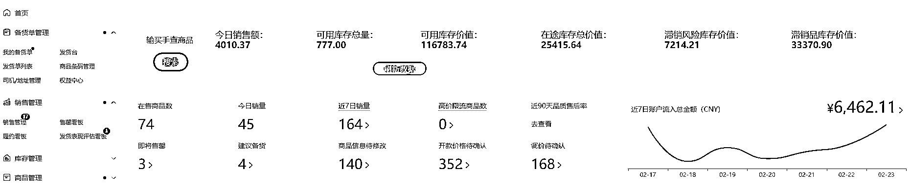

# 实战 15 天！从日销 0 到月销 12 万，我们正在跑通的 Temu 电商增长模型（第四次分享）

> 原文：[`www.yuque.com/for_lazy/zhoubao/odptx9maa2qg93rw`](https://www.yuque.com/for_lazy/zhoubao/odptx9maa2qg93rw)

## (12 赞)实战 15 天！从日销 0 到月销 12 万，我们正在跑通的 Temu 电商增长模型（第四次分享）

作者： 企鹅

日期：2025-02-25

### 📈  **实战 15 天！从日销 0 到月销 12 万，我们正在跑通的电商增长模型**

**——高客单打法+精准引流品策略全拆解（附关键数据）**

#### 🔥  **项目速览**

✅  **15 天战绩** ：日销 0 元 → 月销 12 万（目标 30 万冲刺中）

✅  **利润模型** ：毛利率 37.5%（客单利润 9-300+元双引擎驱动）

✅  **现金流** ：已提现 1.7 万（回款周期 30-45 天实战验证）

✅  **新品弹药库** ：600 款测试 → 160 款首单 → 持续筛爆款

### 🎯  **一、为什么定这个目标？**

**核心公式** ：**30 万/月 = 高客单利润品（70%）+ 低客单引流品（30%）**

1.  **现状对标** ：当前日销 4000 元（达成率 40%），日均毛利 1500 元

2.  **增长空间** ：

3.  🔺  **客单价提升** ：优化高利润品结构（现有商品池再筛选）

4.  🔺  **转化率突破** ：通过 20-30 元引流品拉新（成本 10-20 元/利润 3-9 元）

5.  🔺  **上新加速度** ：每周 600 款测品 → 日均发货量翻倍

### 📊  **二、关键数据仪表盘**

完成进度

**日销售额** 4000 元 10000 元 ████▋ 40% **日毛利额** 1200-1500 元 3000-4000 元 ███▊ 35% **商品池储备** 160 款首单品 300+潜力款 ██▋ 53% **动销率** 27%（160/600）50% ➡️ 需强化选品

### 🛠️  **三、爆款运营三板斧**

**1****.** **高频上新：每周 600 款测品**

1.  **底层逻辑** ：**5%爆款率=30 个潜力品** （当前 160 款待二次筛选）

2.  **执行动作** ：

3.  ✔️ 每日对接 40+供应商（稳定发货链路）

4.  ✔️ 首单测试 → 3 日有动销的标记为热销款

**2****.** **高低客单组合拳**

**价格区间** 100-300 元 0-30 元 **成本/利润** 高毛利润空间成本 100 元/利润 100 元 **核心作用** 利润护城河引流+拉复购 **运营侧重** 主图质感升级秒杀价钩子设计

**3****.** **现金流管控**

⚠️  **警惕！** 平台回款周期 30-45 天 → **必须留足运营资金**

1.  当前已回款 1.7 万元（年前订单验证模型可行性）

2.  每日毛利 1500 元中，100%直接投入新品开发（滚动增长）

### 💡  **四、可复用的 3 条经验**

1.  **“20 元法则”** ：

2.  拒绝无意义低价战！**20-30 元区间既能引流，又能保住高动销** （实测转化率提升 2 倍）

3.  **“首单测款-二次爆破”模型** ：

4.  600 款初筛 → 160 款首单 → 精选 30 款集中资源打爆（当前执行中）

5.  **高客单品的隐藏价值** ：

6.  高价用户自带精准标签 → 后期可导流私域做 CLV（客户终身价值）

### 🚀  **五、下一步作战计划**

1.  **爆品攻坚** ：2 月底前从 160 款中筛选出 TOP50（转化率>3%）

2.  **视觉升级** ：高客单价主图全部实拍重制（3 月核心动作）

***� 写在最后**

这个从 0 到日销 4000 的模型，核心在于大量上新“用高频上新对冲不确定性”+“用价格分层锁定精准流量”。

**如果你也在做电商，不妨思考：**

1.  你的测款基数是否足够大？（我们每周 600 款）

2.  是否错把“低价”当“引流”？（20 元也能有 37%毛利率）

**评论区开放交流，一起迭代玩法！**

* * *

评论区：

暂无评论