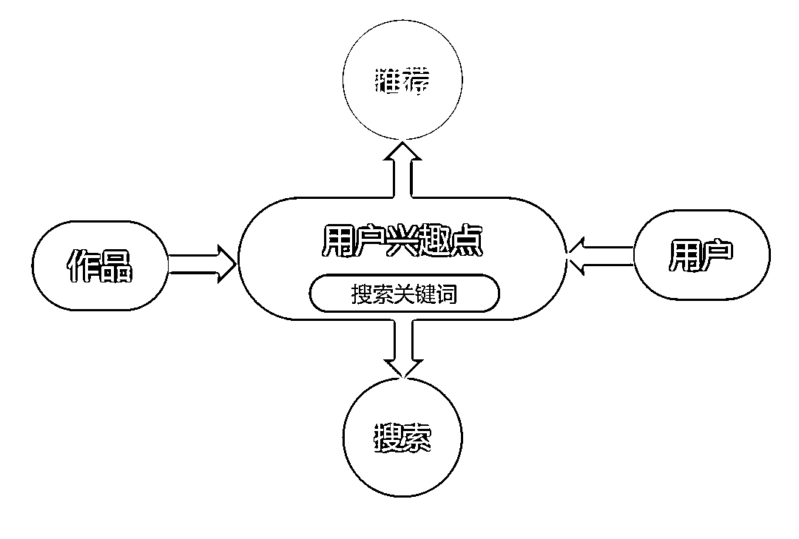
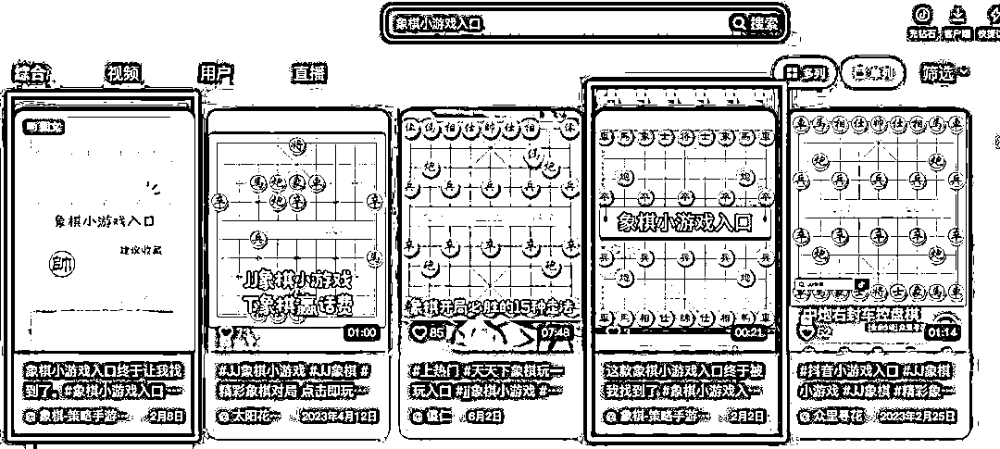
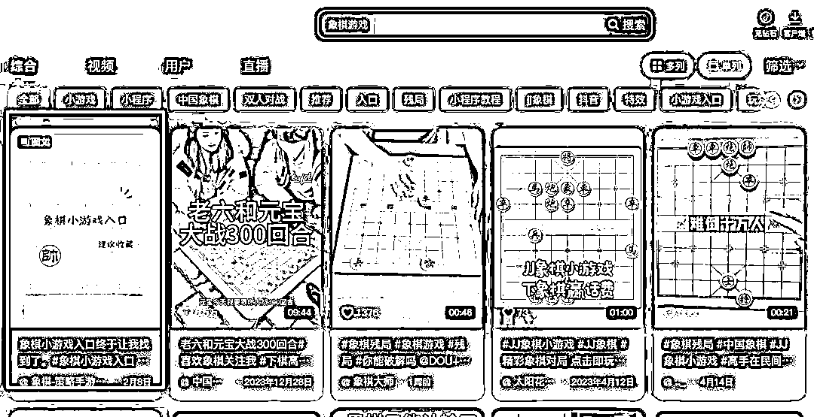
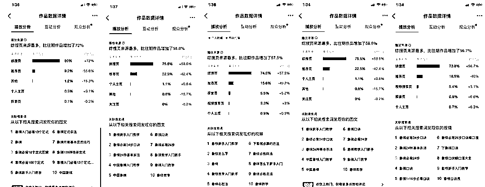
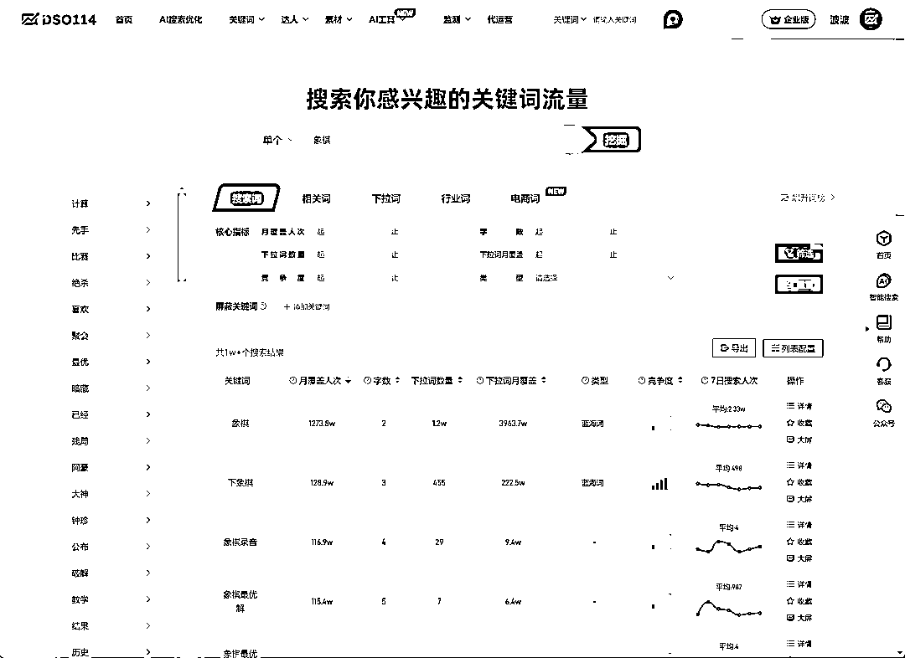
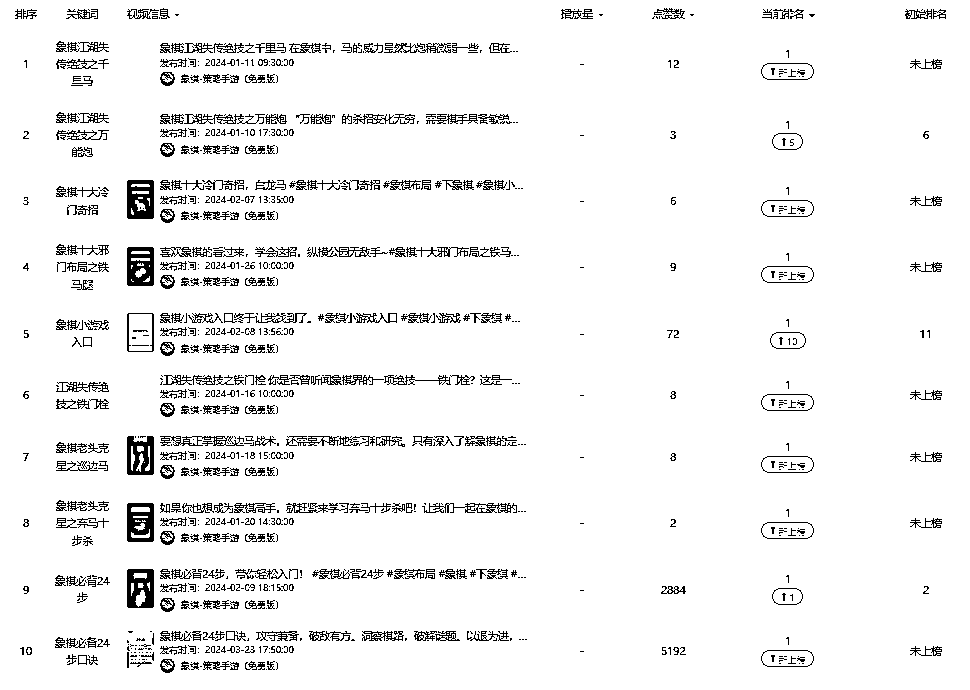
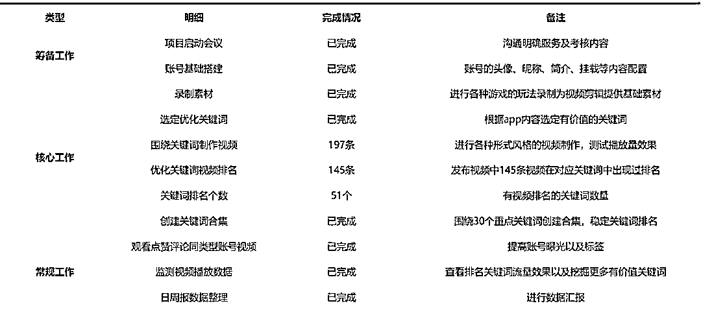
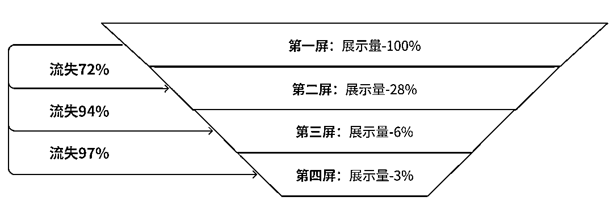
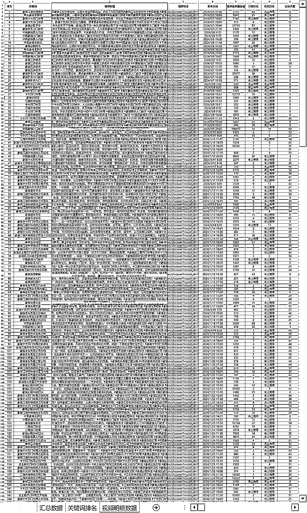

# 轻度游戏 App，抖音搜索（DSO）引流实战案例

> 原文：[`www.yuque.com/for_lazy/zhoubao/kg0h4oikchgvon8u`](https://www.yuque.com/for_lazy/zhoubao/kg0h4oikchgvon8u)

## (36 赞)轻度游戏 App，抖音搜索（DSO）引流实战案例

作者： 波波@抖查查@爱盈利

日期：2025-03-01

轻度游戏虽然单用户氪金能力不强，但是广告效益，以及未付费能力还是非常不错的。且 App 的开发加维护成本不高，完全可以作为持续的赚钱业务。

传统的应用商店 ASO，或者是买量模式，要么量小不够用，要么成本可能过高，扛不住，那么今天波波给大家介绍一下我们最新研究的 DSO 方法，邮件近似于黑科技了。^_

抖音平台除了推荐流量

搜索流量也非常大了

80%的抖音月活用户会发起搜索

有搜索量大的词！同时转化用户的难度较低，只要搜索曝光量稳定提升，下载量也会随之而来。下面我们就看看这种类型的 app 在抖音做短视频搜索推广，如何选词覆盖生产内容，以及最终的效果是如何？

**小游戏之一：象棋**

**  **

因为象棋的用户是固定人群，这个群体就算 10 年以后依然存在，且体量庞大，所以针对象棋的 App 产品，就可以通过 DSO（抖音搜索优化）方式进行引流。

我们先看下一些关键词的优化效果：

搜索一些关键词，内容排在第一位

持续获取用户转化

视频用户主要来自于搜索精准流量

**抖音搜索优化，我们简称 DSO**

**D** ouyin **S** earch **O** ptimization

**主要步骤：**

**选词 >覆盖>排名优化>点击率优化>完播/停留/互动>引导>转化**

**  **

**争抢量级比较大的关键词** ，是流量争夺的焦点，词搜索量大，排名靠前会吃到大量的自然搜索量，所以盯的人多，难度相对最大，一旦优化上去了，就吃到自然流量了，守住位置会相对容易。

其次是，相关关键词下面出现新的优质视频内容，会出现在搜索结果的前列，（新内容权重）所以如果想始终保持在重要关键词的 TOP3-TOP5，也需要经常更新最新的优质内容。

**海量长尾关键词控守，** 这些词量级较小，但是胜在争抢不激烈，可以通过生产大量内容去批量覆盖，然后整体守在较高位置，积累下来，也可以获取大量的搜索用户。恰恰是因为争抢度低，内容创作简单，反倒是这部分是可以堆人拼执行力，稳定获取的流量。试想下哪怕一个词每天只有 1 个精准流量，覆盖 1 万个这样的词每天也会积累出 1 万个精准流量，还是非常可观的。^_

**选词工具推荐：**[www.dso114.com](http://www.dso114.com)，可以**找词** 并查看**搜索量数据** ！

工具显示象棋相关的优质选词大于 1 万条^_

针对象棋小游戏，我们采用的选词以及排名优化情况如下：

形成稳定的内容生产工作流：

搜索优化月报情况

**  **

**更多关于搜索流量的知识点：**

1.  抖音长尾词量级非常大，累计起来流量会很大且争抢不激烈；

2.  当前自然搜索排名基于不登录的 PC 版本的排名来定；（手机版有广告位，一般是两个位置，还有可能根据用户行为千人千面）

3.  近期发布的内容，短期权重会更高，有机会把老视频挤下去；

4.  合集累计多条视频权重，很多搜索词，合集内容都排在第一位；

5.  账号粉丝量一般不直接影响发布视频的初始权重，但是粉丝多的账号，有利于发布视频的初始阅读量以及互动数据，会作为搜索权重的参考指标；

6.  通过投放 dou+提升互动数据（尤其是近期互动），可以提升搜索排名；

7.  搜索结果中，一般排在前 3 名的内容流量会最大，占据整个流量分配的 80%以上，而前三名本身也遵循 7：2：1 的流量分配比例；

8.  一般的优化节奏是，刚开始优化 1-10 天上排名。热度高的词每天排名都有变化，7-14 天视频权重会下降，除非数据一直很好，可以长期留在高位。

9.  视频内容的优质程度比较关键（质量分），如果质量太烂很难优化到前面；

10.  尽量不要重复用同一个镜头或者画面；

海量长尾关键词优化抢占流量入口

当然可以借助 AI 的力量进行选词与生产

**DSO114****已经介入****Deepseek**

**  **

**结束语：**

流量越来越贵是不可逆的，所以我们流量获取的同学，要始终去研究新的引流渠道，做到差异化竞争，才能避免竞价排名和 ecpm 争抢的死局。走出自己的流量春天！

欢迎大家找我来交流 DSO 优化方法^_

历史 DSO 文章：

[财税线索获客：抖音搜索（DSO）案例拆解](https://articles.zsxq.com/id_l4pkliu5gf9k.html)

[留学行业在抖音一天免费搞几百条精准线索！](https://articles.zsxq.com/id_hwrs6kaqghs3.html)

[波波：抖音搜索流量里蕴含的赚钱密码！（10000 字长文，含多个赛道案例）](https://articles.zsxq.com/id_renwhgmzr7qm.html)

* * *

评论区：

超人 : 学到了，app 推广新思路

小吉玛丽亚 : 眼睛会了！