# AI达人秀赛道1000万播放开通高级YPP,万播1刀高收益路径复盘

> 来源：[https://e1de4f91un3.feishu.cn/docx/ZCHMdv5zto9TV7xMPDxclT0RnWf](https://e1de4f91un3.feishu.cn/docx/ZCHMdv5zto9TV7xMPDxclT0RnWf)

# 引言

大家好，我是cc，前端开发。去年10月下旬，看到了亦仁发的超级标，开始接触shorts，中途换了两次方向，最终在过年期间，出了个700万+的爆款，理论上开通了初级ypp，对，你没看错，当时就是理论上开通了初级ypp(因为遇到了个棘手的问题)。我的账号整体数据并不好，百万+视频只有1个，千万+视频0个。当然现在已经真正开通了高级ypp，收益120刀(截止到3月4号)，2月19号寄出的PIN码，3月5号也收到了。


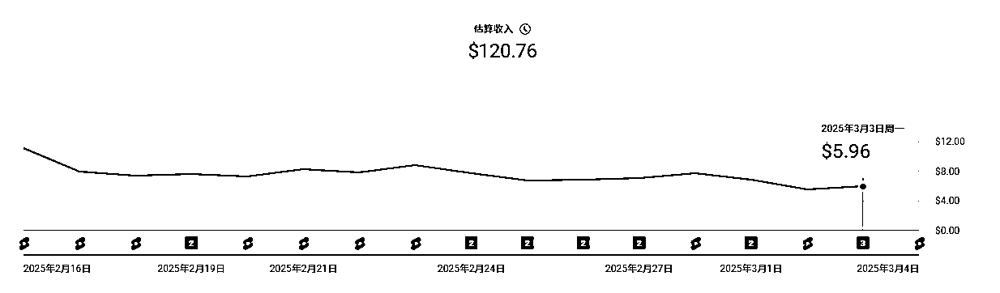

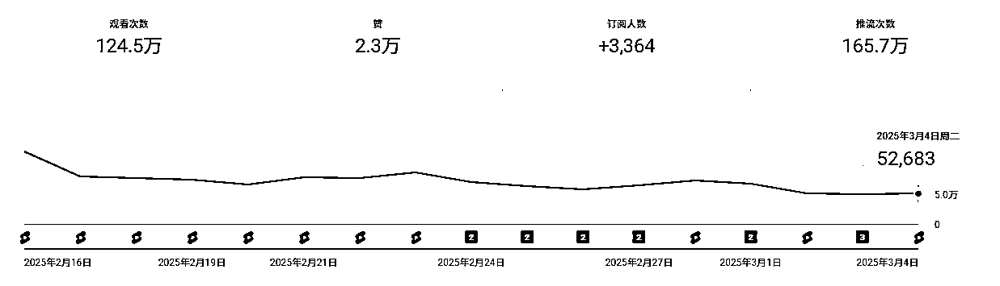

下面，我将完整复盘，从0到1000万所经历的过程。

# 起步摸索期（2024-10-25~2024-12-03）

10月25号入局的shorts，这是我的第一个视频，算是动物融合赛道。一直到12月3号，总共发了十个类似的视频。

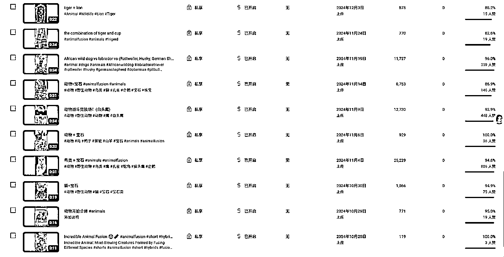

为什么一个多月才更新十条视频？

因为实在太耗时间了，下面是其中的一个视频。每个图，每个视频都是ai生成的。

耗时间，耗心力。每次都是做着做着就想放弃。

最后能断断续续坚持一个月，一个很重要的原因就是盼着12月的航海，上Youtube的船。

对了，这个期间，其实我的方向也是有点偏了。当时一直在刷生财shorts相关的贴，期间各种技术层出不穷，看得我眼花缭乱，每种技术都想去尝试下。

主要时间花在制作一个页面，下载油管视频，自动提取每个场景的帧，然后用api提取关键词做成prompts，再调用api根据提示词生图。本来还要写调用api把图做成视频的，发现太贵，就搁置了。

说了一堆总结就是四个字：自动化。

后面我想明白了个道理。流程都没跑通，啥成绩都没有，路还没走稳，就想着跑。跑得起来吗？

当自己已掌握的技术，满足不了现有项目的放大，就可以再去研究更合适的技术了。

这种情况，一直持续到快航海的时候。

# 航海实战期（2024-12-04~2024-12-26）

千呼万唤的航海终于来了。

这个时候，我打定主意要放弃动物融合这个赛道了。期间有尝试做过宝宝走秀，AI转绘，但是最终还是选择了达人秀。主要缘由就是看到了曹教练 的这篇帖子

https://wx.zsxq.com/group/1824528822/topic/1525128211555482

24天就3600万的播放了啊，啥也不说了，直接开干吧。并且，我根据曹教练这篇帖子里面的提示词，总结了一套当时觉得还不错的提示词模板。

我是把这套模板给chaGPT补充完整。用这套模板生成的视频，播放基本都是破万。

但是，逐渐显现出了两个问题，一个就是很难破两万，二就是印度人太多了。

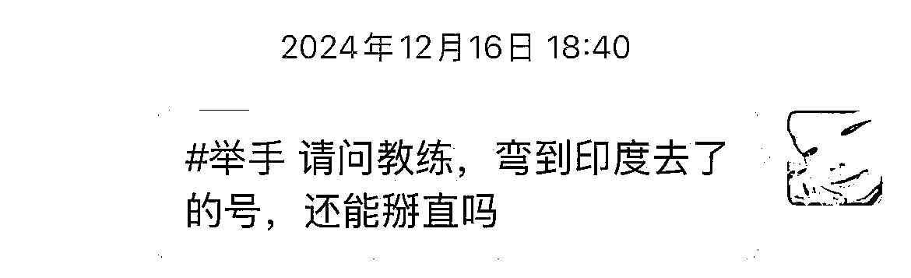

当时，这两个问题让自己很焦虑。而且正好又听了老马教练的直播，关于故事号/解说号。听完直播的那天晚上，整个人很烦，想换赛道，为什么，很简单啊，故事号/解说号，美国人看得多，开通ypp后收益高。

但是最终还好，经历了这么多，我很清楚知道自己的弱点是什么，故事号/解说号最主要就是要去找解素材，我每次找素材基本都会，找着找着就忘了自己要干嘛了，并且看到了差不多的素材，就会犯选择困难症。总之，找素材对我来说，是最耗费时间的。这些都是当时我的想法。

并且，当时我也想通了一件事，收益的高低都是开通ypp之后的事了，现在的我距离ypp还差得远，不能因为这件事，让自己焦虑。

现在，我明白了，要想短时间内有上千万的播放量，基本都得有阿三助力才行。

最后，我还是选择继续做达人秀。同时，每天开始更新两个视频。

航海快结束的时候，我刷到了下面这个视频，当时只有600万多的播放。

https://www.youtube.com/@Chineseblueandwhiteporcelain/shorts

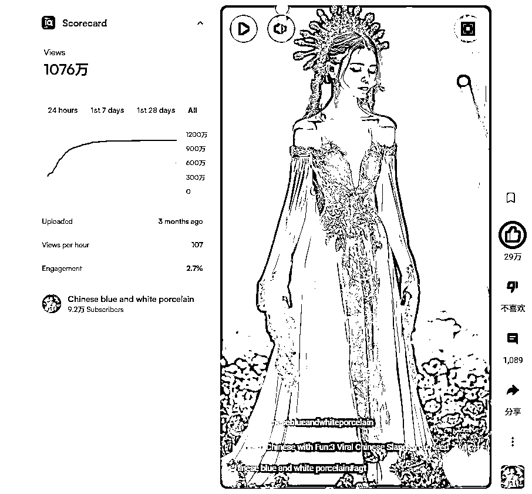

当时，我做的是人和动物的达人秀，就没想完整复刻这个视频，只改了下，做出了下面这个视频。

这个视频在一个礼拜后，跑到了30万+。

https://www.youtube.com/@AIrion-p7q/shorts

这个是我当时的对标号。

# 原地踏步期（2024-12-27~2025-01-19）

这个时期，开始逐渐确定了核心思想，以最短的路径跑通ypp。

期间，几乎是一直在模仿对标号，播放量偶尔上个十万+，没什么太大进步。

中间的优化方向基本是，从一个美女，到两个美女，到三个美女。貌似美女越多，流量越好一样。

有了一套属于自己的手搓工作流。

即梦出图，利用重绘来维持背景不变，人物一致性在维持背景不变的情况下，几乎变化不大，我的提示词前面都是这样开头的，虽然生成出来的美女相貌有一点不同，但是并没有特别大的区别。

```
fullbody,an amazingly beautiful Asian beauty, 
```

这时我开始发现，随着逐渐不做人与动物的达人秀后，阿三的占比开始下降了。

下图是前期，动物融合和人与动物融合的达人秀观众地理数据：

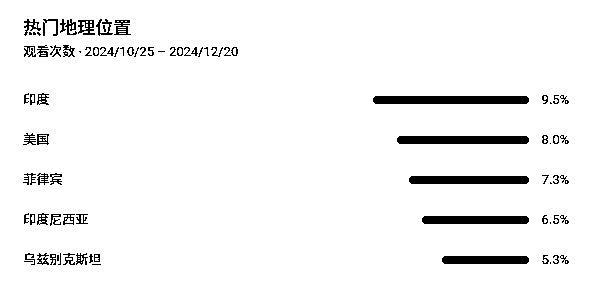

下图是，人与各种物体融合的达人秀观众地理数据：

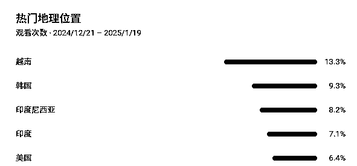

这个时期，人开始有点迷茫了，两个多月了，总播放量才不到两百万，都不知道要做什么内容了。有的圈友，一个航海期间就达到了ypp的门槛，我这个两倍航海的时间，ypp也就达成了十分之一。当时，真的挺希望能有个续航。

没人交流，一个人闭门造车很容易陷入死胡同。所以，当得知有个陪跑小组后，就直接报名了。

# 实战陪跑期（2025-01-19~）

当时，我还更新了几天美女与各种物体的达人秀，按照了手册上曹教练分享的即梦智能参考出图，但是数据仍然没有任何起色，这个时候，我都准备好跟教练约个1对1的了。

这个时候，正好主业也比较忙，晚上投入的时间没法太多，我就想找个更简单的视频来做，就想到了青花瓷。我发现青花瓷这个号，前不久又爆了个千万+的视频。这次，我准备较完整的复刻了。

步骤如下：

1.  提取爆款视频的四张关键帧

1.  用豆包提取出四张图片的提示词

1.  即梦出图

用即梦出图的时候，出现了个问题。提示词有点暴露，即梦出不了图。我就把提示词变成了英文，即梦就正常了。

但是，没想到，在我看来，美女不够美，整体效果也一般的视频，竟然开始要爆了。

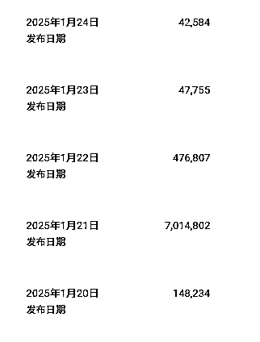

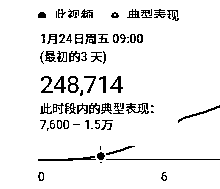

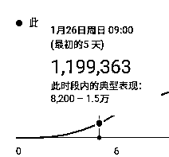

才三天，这个视频，就20万+了，五天直接破百万了。

后面，我就直接拿着这个爆款视频的提示词直接出图，偶尔做些细微的改动。

四张图片的提示词：

```
fullbody,Young woman, exquisite makeup, long hair, sparkling crystal crown, dangling earrings, off-shoulder gown, deep V neckline, exquisite embroidery and lace patterns on the gown, long flowing sleeves, floor-length skirt , there are delicate decorations on the skirt, standing in a sea of blue and white flowers, with a spotlight shining behind her, mysterious, elegant, dreamy, and glamorous.

fullbody,Young woman, exquisite makeup, long hair, blue flower headdress, strapless dress, sweetheart neckline, dress decorated with blue flowers, flowing long sleeves, floor-length skirt, standing in a sea of blue and white flowers, with a spotlight shining behind her, mysterious , elegant, dreamy, cool.

fullbody,Young woman, exquisite makeup, black hair, gorgeous blue headdress with many ornaments and tassels, blue embroidered ancient costume, off-shoulder design, exquisite decoration on the chest, wide and flowing sleeves, floor-length skirt, patterned skirt , with a spotlight shining behind it, mysterious, elegant, dreamy, and glamorous.

fullbody,Young woman, exquisite makeup, black hair, gorgeous blue headdress with flowers and other decorations and tassels, blue and white porcelain style ancient costume, off-shoulder design, delicate patterns on the chest and skirt, wide and elegant sleeves, hands on the abdomen , classical, elegant, gorgeous, porcelain texture, mysterious, with a spotlight behind it, mysterious, elegant, dreamy, glamorous.
```

原视频：

数据：

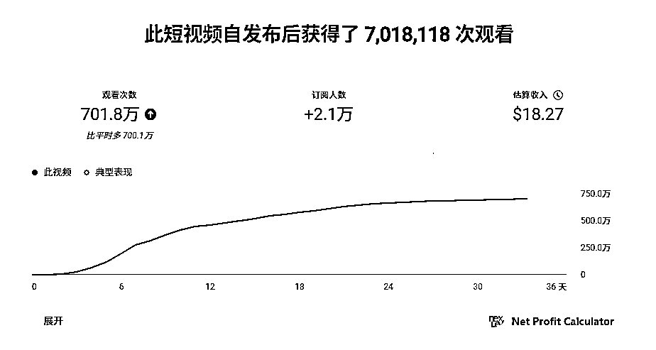

之前都准备过年断更几天的，但是这个视频刚好是这期间，迎来了一波流量。所以，过年那几天，每天晚上都在坚持做视频。

初级ypp也可以开通了。但是问题来了，我遇到了做这个号以来最大的一个问题。

## 收款棘手的问题：Google AdSense暂停收款

### 问题再现

开通ypp的第二步，要绑定ads账号。

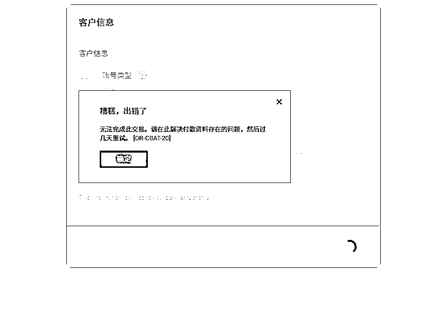

我的ads账号，是个几年前注册的老号，从没用过。这次用来绑定ypp，我改了下用户地址，然后就收到了如下的邮件，

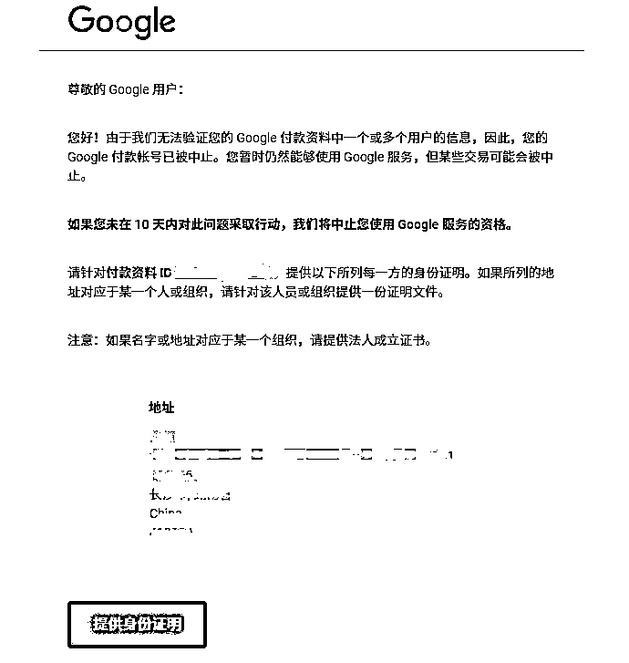

我按照要求提供好了资料，然后就显示个人资料正在接受审核，是1月30号提交的审核。

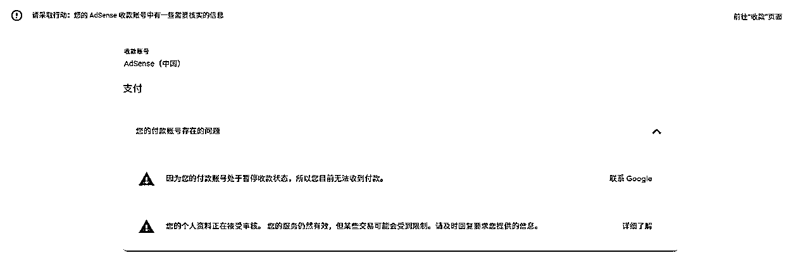

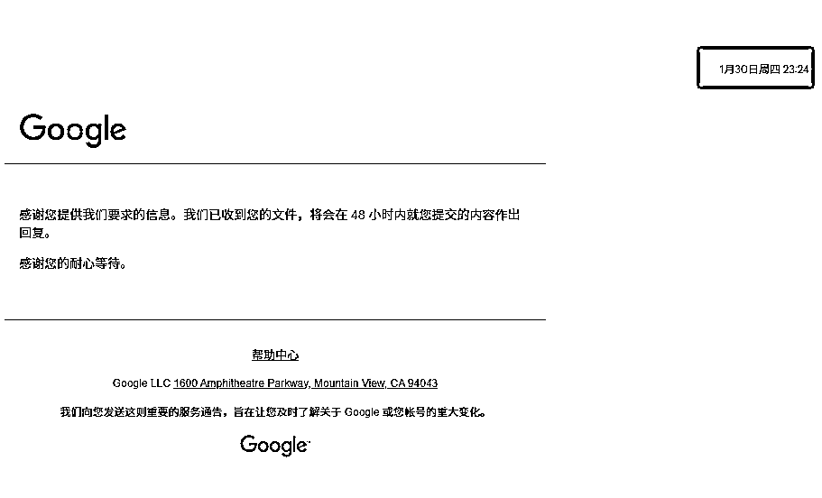

说48h会给答复的，但是过了一个多礼拜，都没有消息。

并且，这个时候也无法关闭这个账号

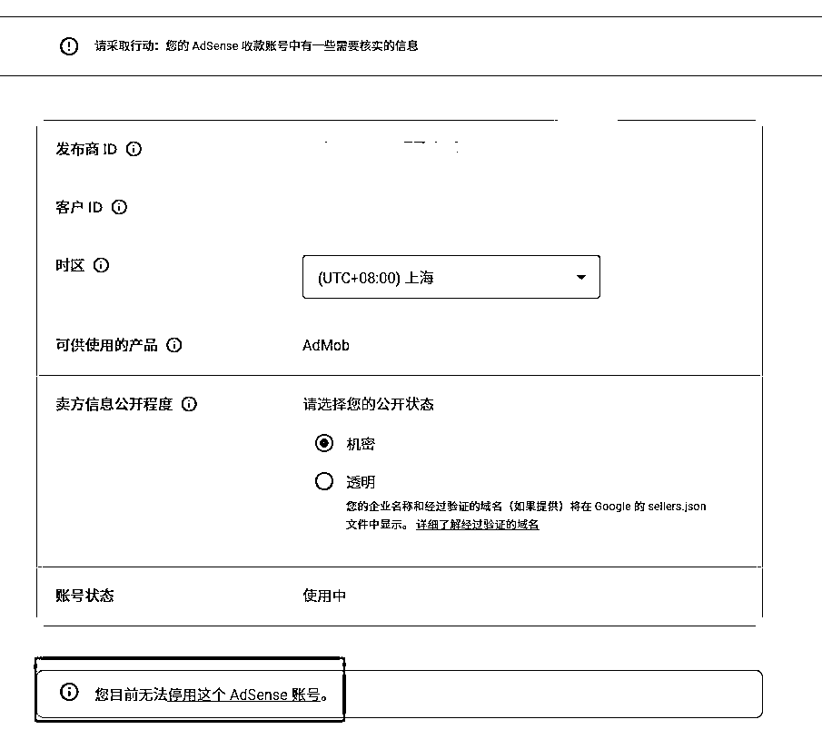

导致我ypp无法开通。

中途，我又催促了一次，还反复提交了3次审核资料。

但是，一直没结果。

人也开始逐渐焦急起来，求助教练，询问圈友，油管上搜，都没有找到解决方法。

同时，我也在ads上找到反馈页面，填写反馈，去社区发帖求助，都没结果。

### 解决方法

最后，曹教练要我去看看老胡的视频里，看看有没有提到类似的问题。

没有完全一样的，我找到了个差不多的。

https://www.youtube.com/watch?v=V32gD6WpEB8

就是这个视频里面的这句话，提醒了我。

尝试通过ypp的支持帮助解决。

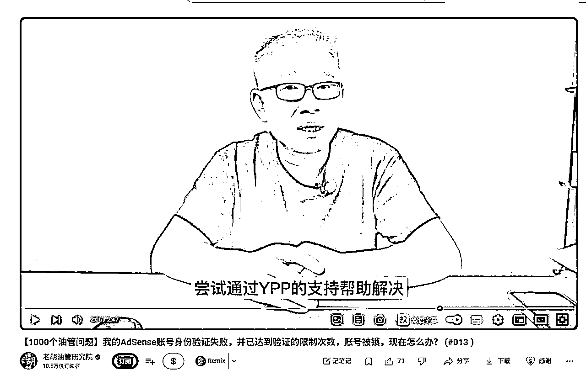

当即，我马上找到反馈入口，填写了自己的问题。

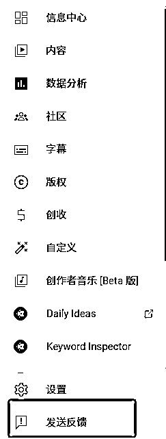

结果，第二天上午，我就收到了YouTube回我的邮件，

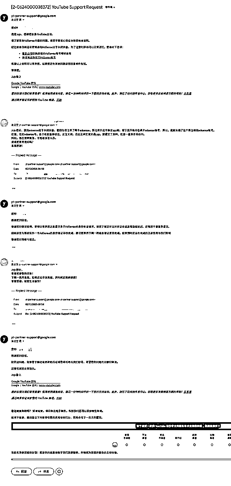

客服人很好，很好说话，也很愿意帮忙。

这天的下午，我就收到了ads资料审核通过的邮件。

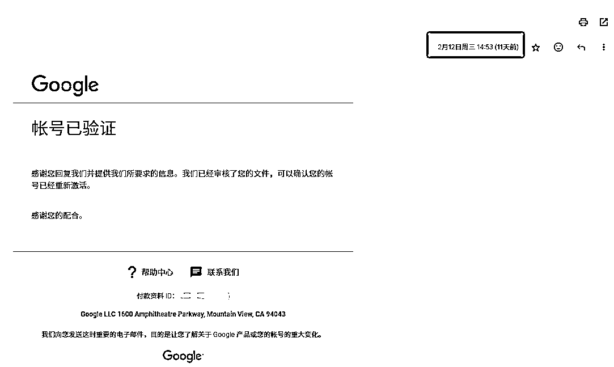

至此，困扰我将近两个礼拜的问题终于解决了。

正如老胡视频里所说的，adSense的支持非常糟糕，基本不解决问题。

有类似的问题，最好直接去寻求Youtube的帮助，参考以上方法解决。

这个时候，我账号的总播放，也来到了1000万播放，成功开通高级YPP。

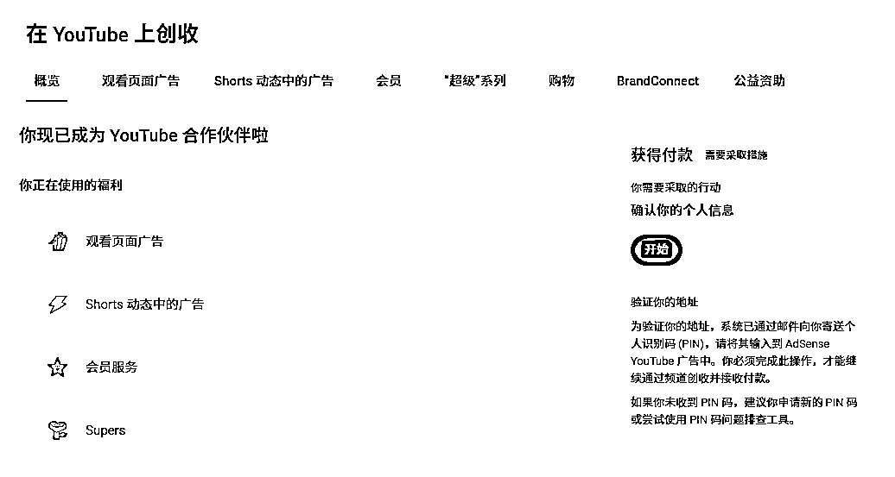

# 总结

大家都知道，YouTube账号后台观众发达国家和地区占比高，收益相对也就高点。但是达人秀普遍都是印度排名靠前。因为印度人就喜欢看这种猎奇，人与动物融合，动物与动物融合。这种印度占比高的达人秀，万播一般是0.3~0.6刀左右；我的达人秀，可以做到万播1刀，因为我的观众分布发达国家占比相对较高，下图是我的号最近的观众分布；下面我会分享我的达人秀制作技巧，提高发达国家和地区观众占比。

（印度人可以带来大量的播放量，短期内可以靠印度人提供的播放量开通ypp，前期离不开阿三的助力。）

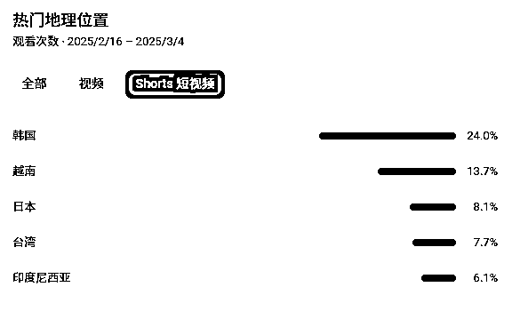

关于达人秀如何做到高收益万播1刀，我总结了一下：

*   达人秀美女肤色，不要太黑，白点好。就以韩国美女为模板，不要弄成那种皮肤黝黑的东南亚美女，同时身材也要好点，大长腿啥的。

*   第一二张图，不要用我国的传统服饰，不然会留住较多的东南亚国家的人，并且播放量一般也不会太高。

*   尽量少做恶心，猎奇，怪异之类的。

大家可以看下这个视频，皮肤黝黑的美女，

下面是这个视频的观众，

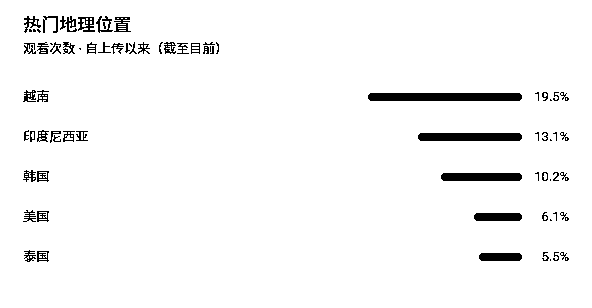

很明显，韩国人不太爱看这样的美女。

再看看这个视频，

这是观众，

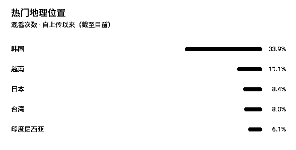

这两个视频发布时间相隔两三天，播放量第一个一万多，第二个三万多。韩国人还是爱看这种肤色白点的美女。

最近一直在想，这一路走来，最大的收获是什么。写着写着我突然明白了，最大的收获就是自信。

还记得去年十二月航海刚开始的时候，跟教练的聊天。

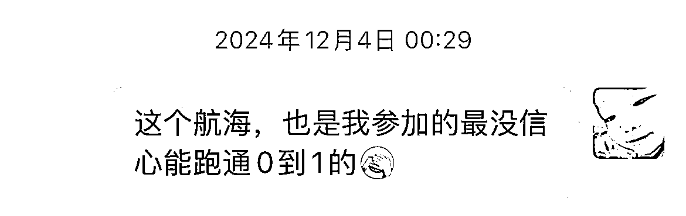

回首来时路，荆棘已过，繁花初开。

长路虽远，愿与诸君共赴星海！

真的非常感谢生财有术，非常感谢YouTube私教陪跑社群，感谢 @七天老师、@方波妮教练、@Gary教练 对文档的大力指导。感谢@时光 圈友，青花瓷爆款赛道的首创。