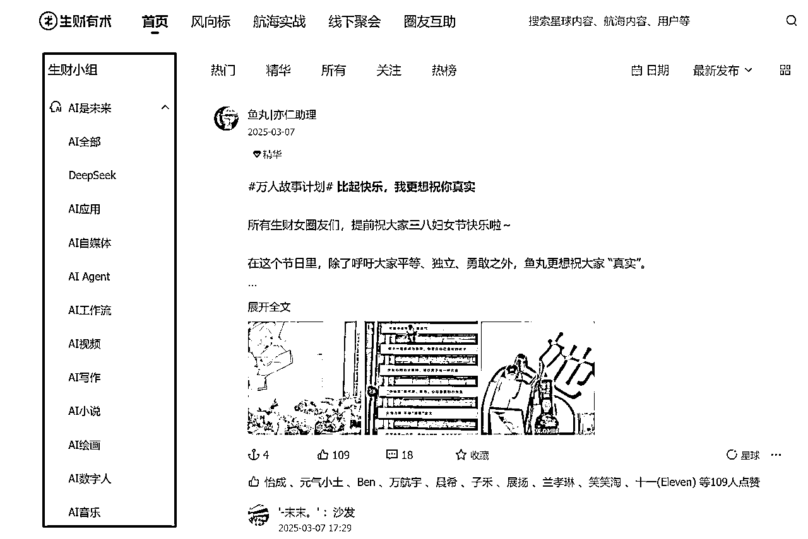
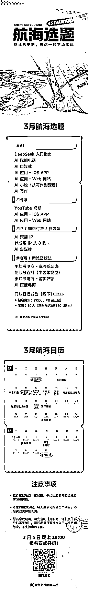
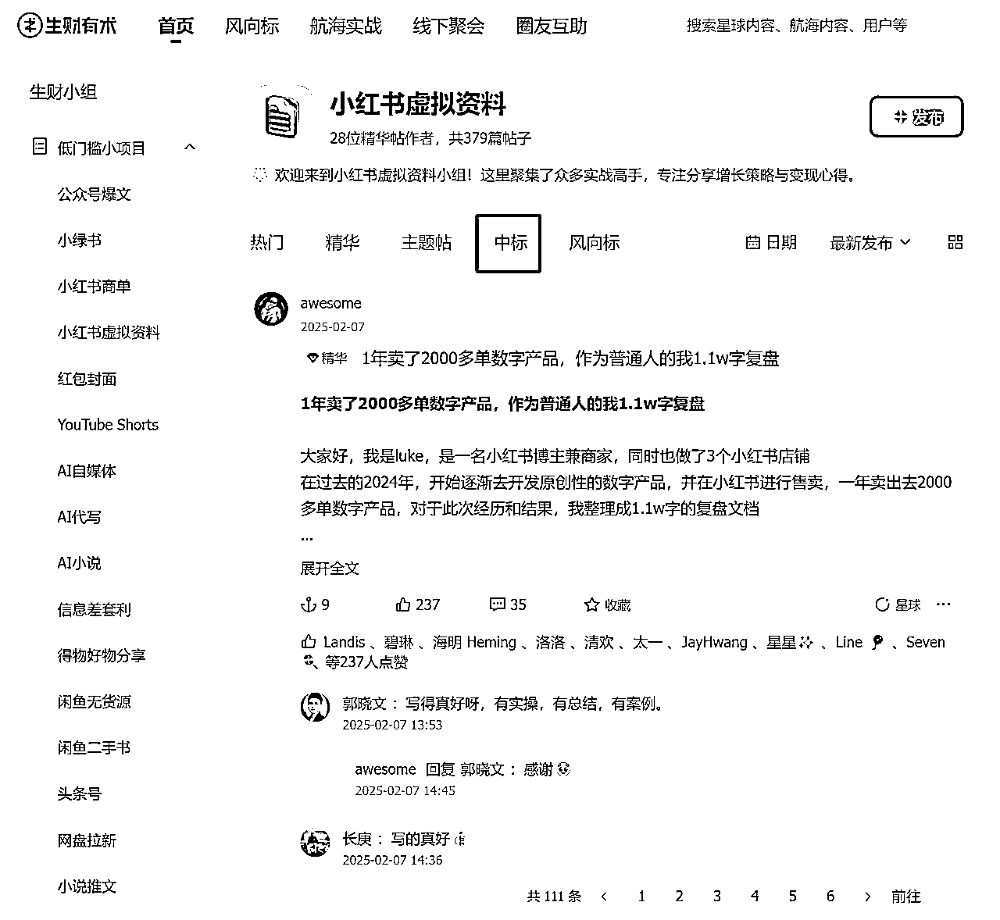
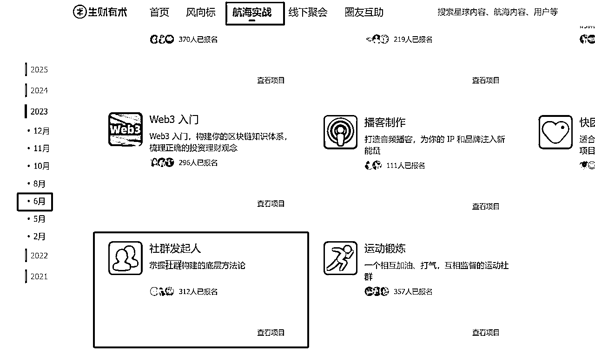

# 亦仁直播整理：2025航海主题解读

> 来源：[https://pcuddnfsui.feishu.cn/docx/ANrodf07toC39Xxo646cRdU1nFf](https://pcuddnfsui.feishu.cn/docx/ANrodf07toC39Xxo646cRdU1nFf)

## 开场白

给大家聊一聊为什么要来做这个直播。其实我还是个i人，所以一般来说就是我还是比较喜欢躲在后面。但是呢，我觉得就是这一次正好我们这个航海开放了，是一个比较好的时间点，所以还是过来跟大家讲一讲。然后开年回来呢，也差不多有一个多月了。然后，大家都在规划自己做什么。然后，接下来要往哪个方向发力。

我们3月份航海，其实花了很多时间去准备，所以我觉得还是有必要上线给大家直播，讲一讲我们背后的有什么意图。然后这样大家可能在参与航海的过程中就不会有那么纠结了，然后遇到问题也该知道往哪个方向走。

然后第二个点，其实我自己其实也是想去尝试一下，就是我自己内心里面觉得，有一个事情，如果你越是不想做，那我觉得你越是去挑战一下，这里面其实有很大的机会和增量。对于我来讲，其实是我不愿意往前走很多，包括直播，包括这个去演讲什么的，包括写作其实也是我不愿意写，我觉得还是不想写。但事实上，我觉得这里面其实有很大的空间和增量。

其实，我们所擅长的事情，这里面的一些价值点很容易就被我们挖掘掉。对于我们那种恐惧的害怕的事情，这里面其实如果你去尝试一下，你就可以发现自己很多没有体验过的东西。所以我也是通过这一次来尝试一下，然后去感受我的内心的这份紧张，内心的那个小恐惧，所以我自己也去往前走一走吧。

然后我觉得可能我们很多圈友其实在生财里面，包括选航海的时候，其实也会有这样的一个处境，就是可能会觉得一些选题自己可能不太会，比如说去做一些编程，或者去做一些应用，觉得好像很难，这个时候也挺纠结的。那其实我想通过这样的一个行为，有点像行为艺术，想通过这样的行为告诉大家，其实没什么恐惧的，你往前多迈几步，其实也不过如此。比如我现在这个直播对我来讲其实也没什么特别大的，这个你开播了发现也就如此，人不会死的。所以我希望那个咱们的圈友，能感受到这份勇气，所以如果说你在看这个航海的时候，你觉得有些东西很难，你往前走一走，其实没什么。

## 航海选题的变化

我们这一次的这个航海选题其实有很大的变化，我们这一次的航海选题虽然这个船不多，但是其实是真正的生财严选。我也花了很多时间跟我们的团队一起去说这一期航海，我们带着大家往哪个方向去做。其实生财的航海，它其实是和外面的这些项目有很大区别，我们特别的是为我们的生财圈友量身定制，我觉得生财圈有很多它自己的特点。

比如说大多数人啊，我们都还是偏普通人，所以我觉得就是可能在外面会讲创业，做很大的事情，但是在生财，大多数人还是说，通过自己的一些尝试，通过一些积累，然后能赚到一些这个还不错的这个回报。所以围绕这个圈友的特点呢，所以我们也是去做对航海做了一些调整。

### 第一个调整：有足够大的空间和机会

这一次的航海选题会更长期导向：以前航海我们可能会希望能够给大家一些非常及时的反馈，但是其实有一些反馈很快，但是空间很小，可能一波流，那这一次我们可能选题就pass掉了。这一次我们希望带着大家能长期的深耕在一个领域。这个领域可能有两到三年，你在里面生根都不会发现这个赛道没了，然后这里面有足够大的空间和机会。那具体的待会我会去讲这个例子，我们会把这个航海选题给大家稍微拆解一下，然后这里面有什么大的机会空间，我给大家仔细的讲。

### 第二个调整：聚焦在有十倍空间的方向上

其实是我希望能带着咱们的圈友，聚焦在几个大的能够有十倍空间的这个方向上，比如说这个AI。比如说出海，比如说做一些IP相关的事情，这些大的方向上。

我觉得是生财经过了非常多的思考，非常多的这个推演，然后觉得这些空间很大，我们也希望带着我们更多圈友往这些方向来走。其实我们发现很多圈友在自己选项目的时候，其实他的这个信息源包括他的视野其实不够开阔，就导致他的选择其实是空间是非常小的，所以同样的时间，同样的努力，你产生的结果是完全不一样的。

所以，生财包括我，包括我们团队，包括生财的很多智囊团，其实是帮助大家去选择方向。正确的方向上，你去努力，那你其实是可以事半功倍。

### 第三个调整：有闭环和快速的小反馈

我们还是希望能有一些闭环，然后有一些快速的小反馈。比如说我们给大家推荐的这几个项目，里面其实是这个反馈会有的。比如说我们会给大家推荐这个做YouTube的短视频，它其实这个项目本身就是一个闭环。正常来讲，你去比如某音去做一个视频，你要做账号，账号做完之后，你还要做产品。产品做完之后，你还要去考虑如何去商业化。

但是生财包括我们团队给大家选的项目，尽量的让大家只专注在一个点，才能有些反馈。所以，这也是我们希望能给圈友带来的。

### 第四个调整：低成本的切入

第四个就是我们希望我们的圈友可以低成本的切入进来，不要一上来就去花几十万去开个店，或者是去投入去囤一批货呀，我觉得这样就是不太好。低成本的去试，一旦有一些反馈，我们再逐步的往前推进。

这几个点，就是有更长期的这个空间，然后能有十倍的发展方向，有闭环，然后可以低成本的切入，这个就是我们在选题上的一些变化。

## 生财有术与航海理念

今天有很多这个老圈友，然后也有很多这个新同学，可能还不知道生财有术是什么，那可能更不知道这个航海是什么。

我稍微简单介绍一下。航海其实是生财里面你可以简单理解成是一个行动的训练营。生财有术里面有很多年轻的这种圈友，其实我自己非常相信：

在一个正确的方向下，你只要持续的去行动，持续的去尝试，那么你拿到结果其实是非常非常自然的事情。在正确的方向下，这个是大前提。

那生财的航海，其实就是这样一个组合。

航海就是由我们生财来选方向，然后再设计一个行动的氛围，带大家下场。那么一段时间之后，那可能是一次航海，也可能是几次航海。那么拿到结果，我觉得就是比较自然的事情。

所以航海就是这么一个我们设计的组合，方向生财来选，然后行动生财带着你下场，那你跟着走就一段时间之后就会有反馈。

但是呢，这里面我也得纠正一下一些圈友的认知，其实不是说你赚到钱才叫有结果。

其实很多圈友之前跟我们讲，参加一次航海也没有赚到钱。但是实际上，你通过行动，你去提高你的认知，你掌握了很多技能，你获取了经验，包括你去链接的一些圈友，链接的一些资源，其实这些东西都叫结果，都是小结果。

然后当你这些小结果你积累的足够多之后，然后再去做一件事情，你很有可能就会把这些连点成线，最后就取得了一个大结果。这个大结果可能就是大家所期待的，赚到了还不错的这个回报。

就拿我自己来讲，其实我在做生财有术之前，我也做了很多很多尝试，包括我开过淘宝店，然后自己去各种论坛去写过文章，引过流，公众号也写过，然后也去兼职帮别人去运营论坛，运营社群。这些点就是在之前其实我根本不知道它能产生什么价值和意义，我只是去尝试，我想有一个期待的回报，我就去做各种尝试。

直到生财有术，我发现这些点突然就连点成线，我一下子就获得了一个非常大的回报。所以在生财参加航海，我觉得大家的这个预期，或者这个心态上要放好，不是一次就能赚到你想要的那个大的回报，但是慢慢的积累，然后在一个合适的时间点，然后把你的优势发挥出来，你就可以取得很不错的回报了。

所以这个是生财为什么要做航海，我觉得这是背后的一些理念，我也想跟大家去对齐一下。

## 本次航海的大方向

这一次航海其实有几个大的方向。

### 第一个大方向：all in AI

AI其实是已经毫无疑问是一个时代的机会了，我们所有人都得去学习和参与AI的这波浪潮。不管你是老板也好，你是上班也好，还是你做自由职业。所有人，没有一个人例外，你都得去参与，主动的或者被动的卷入这波浪潮。

你要么就主动的去将你的业务和AI结合，我觉得这就是生财可能现在在做的事情，将我们的业务和AI狠狠的结合在一起。

要么如果说你现在还没有业务，你就跳进AI，然后成为AI时代的原住民。我觉得这个时候反而是一个优势，你没有历史包袱，你直接跳进来了，所以你可以更多的去看很多机会。

现在可能很多AI的一些机会，生财是没法去做的。因为我们要把我们的基本业务给做好，我们要去优化我们的产品和服务。但是如果之前你没有业务，你现在去做AI，反而是有些优势的。

这就是有一本书里面叫创新的勇进，往往是那些边缘人，他还没有一些基本盘，这个时候跳进一些新的机会的时候，他就能抓住。

#### 1.AI：生财最核心的战略

所以生财团队，本身其实也在做很多AI相关的这个机会和尝试。我们自己内部其实也在讲叫all in AI，已经把AI作为了生财的一个最核心的战略。

我给大家讲一讲，就是我们现在做的一些尝试，我有一个合伙人，叫坤汀。他以前是做这个，我们有一个高阶俱乐部叫航海家。他会访谈那些可能年入千万的这些航海家，那我们其实经过这段时间的讨论，其实我们做了一个决定，就是我们将这个账号的名称改成了叫坤大汀学AI。他的名字叫坤大汀，这个账号我们直接改成了坤大汀学AI。

我希望他，就是去代表生财，代表我们团队，也代表咱们圈友出去，去找整个中国，甚至世界上最牛的一批把AI用得好的人去学习，去访谈他们。他们到底怎么在用AI？AI和各行各业怎么去结合？然后在AI时代有什么新的机会？大家可以去关注一下这个【坤大汀学AI】这个视频号，那么未来他会去访谈很多厉害的人，用AI厉害的人，大家可以关注他的这个内容。

生财星球其实这半年，也产生了非常多的这个AI的相关内容。我觉得如果说你是圈友，你应该感知非常明显，包括我其实这半年我看生财内容，我的这个体会就非常非常强。我经常有一种：原来还可以这么玩AI，我会经常有这样的一种感受。如果你是圈友，那我觉得你一定要去看生财里面AI相关的内容。

然后我们还把所有的AI的内容整合到一起，就是在生财的官网，我们有一个叫生财的AI小组里面，我们有十几个分类，包括什么AI自媒体、AI应用、AI编程、AI音乐、AI视频等等。

这里面我觉得这些内容都非常有价值，就是我觉得你加入生财，你可以其他内容都不看，但是你一定要把AI的相关内容看完，只要你看完你的这个门票绝对就是回本，门票就是绝对回本了。

包括我们接下来也会成立一个叫AI传术师俱乐部，那这个其实就是我们要将生财里面用AI最牛那批人，然后他们把AI去应用的非常非常厉害，我们要把这些人给聚集在一起。然后我们也会拿出，可能是几百张生财门票，我们要送给整个市面上最优秀的这些玩AI的人，我们把它聚集到生财有术。

然后我们要跟他们交流，跟他们碰撞，然后大家互相的去分享。所以这个也是我们即将成立的这个AI传术师俱乐部。如果大家现在这个AI玩的好，AI用的好，那么我建议你一定要在生财里面去把你的这个经验、认知分享出来。未来我们会把所有这些人形成一张网，这里面会产生很多化学反应，我觉得价值会非常非常大。

#### 2.AI与生财官网

我们的生财官网，就是生财有术的这个首字母【https://scys.com/】官网也会增加很多这种AI相关的功能和体验。

比如说我们最近可能会上线精华帖概读功能。

生财有术的精华帖很有价值，可能很多精华就是上万字，说实话，真正能看完的人不多，我是少数的几个全部看完的人，但是我也花了挺多时间、所以我们正在创建一个功能，通过AI，自动的把这个精华帖给它提炼关键信息、关键价值。这样的话，大家一天就可能把这一期几篇精华帖全部看完，然后再挑你感兴趣的。

然后，我们还会上线一个功能，就是我们用AI来辅助分析风向标。

风向标其实是生财的一个情报产品，我们网罗全世界各行各业、各个领域，一些跟赚钱相关的一些资讯和信息。在我去评选这个风向标的时候，很多人会提问说这个事情看不懂啊，然后要我去给大家分析一下。但每一个风向标去分析其实还是比较耗时间的，所以我们接下来其实会接入AI，我们用AI来帮助你去分析风向标。然后这里面有什么玩法、有什么衍生的机会、有什么流量的进一步东西，AI都会帮助你去做进一步的分析。

包括，未来我们还会开发自己的情报agent。

其实生财有自己的这个情报团队，我们团队会分赛道，比如AI呀，出海呀，然后自媒体呀，IP呀，电商呀，还有这个就是新流量，比如某某平台等等，这都是我们自己团队。但是说实话，想在某个领域你要做深其实是非常难的。所以我们现在也在讨论，就是我们要开发自己的这个情报agent。我们要把比如说AI领域，整个全网各种平台对AI的这个分析全部收录进来，用agent帮我们去分析，帮我们去抓重点。我觉得这个东西一定会很有价值，所以这些东西也是生财逐步去探索的地方。

然后生财其实除了线上这些做了尝试，然后线下其实也做了很多。比如说，我们生财最近其实租了一层楼，然后其中半层我们其实留出来了，给我们的这个圈友过来，我们一起来做一些AI的这个项目。所以生财有术AI的联合办公空间。

大家在这里面去碰撞，有人是做这个AI的这种培训的，有人是做AI产品的，有人是做这个AI应用的，大家在一起这个化学反应会非常多。

这里面有些项目合适，我们会给他一些资源，比如资金，比如帮他们去招聘，比如说帮他们去做一些流量获取等等，快速的帮助我们圈友抓住这个机会。

很多人其实生财圈友其实是个体，可能就是自由职业者或者刚开始创业，还是个体对吧，但是这个AI的发展，这个时代的发展，其实是不等我们个体的。任何一个窗口期出现，其实它不会停下等你。

同样的，除了我们这批个体，那还会有很多大团队，各种大公司都在成立各种团队去抓住这个机会。

所以我觉得生财其实是希望能够帮助大家去做一些中台的事情，帮助大家把一些可能有共性的事情给它解决掉，然后大家可以去抓住这些机会。包括生财其实也正在跟我们圈友合作成立一个AI的MCN。

如果说大家做AI的这种账号，做AI的自媒体，那我们可以帮助大家去对接一些大的这种商单，让大家可以专注于把内容做好。

所以整体上生财在AI领域做了很多很多尝试，我前两天跟我们团队开周会，我说这个我们知道这个AI方向一定是对的，一定是对的。

但是哪一件事是对的？我不知道，这里没有人知道，没有人说哪一件事一定是对的。所以我们只能AII in AI, 然后在这个方向下，我们做非常非常多的尝试。当然这种尝试肯定是低成本的，可逆的。

我们绝对不会说去做一个尝试，一下子把我们所有的这个资源全投入进去，然后去赌那个事情，对不对？这个事我觉得我们不能做，咱们圈友也不能做。做出那种可逆的尝试，然后我相信这里面一定就会有，我们找到一条路，这条路就是对的。

所以我觉得对于咱们圈友来讲，你参与航海其实也是一样，在一个大的方向下，你觉得这个AI方向没有问题，或者你觉得出海方向没有问题，那你就大胆去试。最多可能你参与航海21天，你没有反馈，那也没有什么这个大的损失嘛。

多尝试多尝试，慢慢的你就找到一条路。这条路可能是从来没有任何任何一个人告诉你，但是因为你有之前很多尝试和积累，你就发现了这条路，然后这条路就能给你带来非常大的回报。

#### 3.AI与航海选题

所以生财AII in AI，我们也做了这些尝试。其实今天我也给大家讲，生财的航海也是在这个战略下，我们做了很多选题的这个偏好，我给大家简单的来介绍一下。

##### 1.AI自媒体

这个AI自媒体，其实我在去年就重点给大家强调了这个机会，它是一个非常好的一个机会。因为趋势正在形成，大量的AI产品，大量的AI应用，其实是需要这个渠道去推广，所以这个需求非常旺盛，但是供给其实是非常少、因为AI的出现其实也就这两年，然后还没有多少人真正的意识到，这个AI自媒体有很大的机会。

它就处于一个需求很旺盛，供给很少，所以大家就能感受到，这个时候你去做AI自媒体，你的这个溢价是非常高的，而且你没有竞争对手，你没有传统的竞争对手，你很容易就起来。以前在自媒体做的好的人，他反而有历史包袱，他不可能花很多时间去学习AI，所以这个时候你去做，很容易就做起来了。

而且AI现在是全民浪潮，所以这个资本就是在里面，就是很多热钱在里面。真正的我们赚到钱，很多时候都是资本的这个热钱。如果说你辛辛苦苦去抠一点点的这个生意钱，其实非常少的，而大钱往往是在资本里面，所以AI自媒体本质上就是你的资本在推加速，就会有一部分价值流动到AI自媒体里面来。

所以生财的这一次航海就有一个AI自媒体，前面我们提出【超级标】，很多人已经下场，并且做出了结果。那这一次航海，我希望大家如果说你对内容比较敏感，有很强的这个表达能力，那我觉得你可以去尝试一下AI自媒体。如果你之前做自媒体做的很擅长的，你不妨增加一个新的一个方向。这个回报，我觉得可能会比你之前的其他选项要高。

AI自媒体其实不仅仅是做公众号，比如说做个视频号，或者说做这个某音小红书，我觉得都可以。你要去表达，围绕AI相关的一些内容，包括怎么去用工具，或者说去看看这个AI的趋势呀，反正就是大多数用户对什么内容感兴趣，那你就围绕这个去做内容，然后就可以聚合出很多很多粉丝了。

##### 2.AI应用

AI应用我们这次有两个方向。第一个方向是ios，第二个方向是web站，通过AI来做。

这里面有两个含义：第一个含义其实是因为AI编程的成熟，因为AI设计的成熟，所以现在非常多的个体其实都可以去做AI的网站了，都可以去做AI的这种苹果应用了，以前其实是非常非常难的。

第二个是因为AI的出现，很多的应用其实它需要跟AI结合。因为AI的出现，其实我们很多人已经不再用传统的搜索引擎了，这就是完全体验上的颠覆。那其实不仅仅在搜索上，在很多场景下都会有这样的颠覆。比如去看之前的排行榜，这里面我认为，大多数的这个应用都会有AI重做一遍的机会。

这就是AI应用，具体的这两个选题我会放在下面再去跟大家展开讲。

##### 3.AIGC

关于AI第三个板块其实是AIGC，或者说叫AI生成内容。第一个是AI写作，另外一个就是AI小说。

我们有两个选题，第一个是AI写作。AI写作其实我们已经在生财里面开了好多次航海了，通过AI去生成各种内容，比如说生成这个PPT，生成这个论文，然后生成这个演讲稿等等。

其实我在星球里面前段时间发了一个超级标叫AI服务。虽然AI已经发展的这么快，但是真正会用AI的人其实还是非常少的，真正的能熟练的和AI去配合的人还是非常少的。所以大多数人我觉得未来还是需要可能在某鱼上，或者说在小红书上，去找人帮他完成一些AI可以完成的一些东西。所以我觉得这背后的机会就是AI服务，我们通过AI去学会了很多技能，然后我们用这些技能去交付给别人，中间我们就可以收获到一些回报。

而另外一个就是AI小说，AI小说和AI写作本质上是一个事情，都是AI生成内容。然后类似的，还有比如AI短剧，还有之前有人在咱们的这个星球里面问，这个公众号爆文和这个AI写作和这个AI小说有什么本质区别？

其实没有区别，本质上都是用AI来生成内容，然后这些内容你在各种内容平台去把它分享出去，那平台需要这些内容，所以平台会把他的广告分成一部分给你，所以包括AI短剧，公众号爆文，然后视频号分成，还有什么YouTube广告分成，其实都是AI生成内容之后，我们在平台获得的一些总分成。我们这一期航海，有个油管的这个AI shorts，通过AI来生成各种短视频，包括甚至可以生成中视频，然后这些视频可以吸引用户，那么平台就会把他的广告费给我们一些分成。

这一期航海，我们AI里面会有几个大的选题，当然我们还有这个AI如何去赋能业务，比如说这个AI如何赋能IP，AI如何去赋能电商。我们这一期航海也会去教大家，你怎么去通过AI帮你去做你的IP定位，帮你去做你的课程，帮你去写朋友圈，帮你去写你的视觉运营的内容。这个AI都可以去参与进来。

然后生财圈友里面还有很多是做电商的，那AI其实也是深度的跟电商结合了，包括AI形成模特图啊，AI换装，AI换脸，其实都可以。所以几乎可以说AI贯穿了这一次航海的所有选题，我也是希望能够带着我们的圈友在各行各业，在各个领域把AI都用起来。

##### 4.Deepseek入门指南

还有一个就是叫deep seek入门，这个选题其实我们单独的拉出来说了，为什么我们单独的把deep seek从AI里面拉出来？

我觉得就是deep seek的出现，真正的我觉得开启了一个新的AI时代，至少对我们很多中国人来讲，deep seek开启了一个新的时代。它实现了AI下乡，让很多很多中国人都可以用AI。大家这一次过年回去，应该可以看到身边的很多亲戚其实都在用AI。我觉得deep seek的出现，这一次功不可没，而这种AI下乡就真正的实现了。

我觉得是之前叫所有人上网，移动互联网的出现让很多中国人都可以联通到互联网。而deep seek的出现是我觉得让很多中国人都可以连上到AI。这对我们这些淘金者来讲，其实背后都是我们的大机会。你在所有人都在AI的情况下，你就可以联通到所有人，那背后是很大的这个机会。所以我们围绕这个，也单独开了一个叫deep seek入门，这样一个航海。里面会有各种场景，可能有十几种场景，教大家怎么去用deep seek入门。

然后这就是我们这一次航海选题关于这个AI的板块，我们要不先跟大家互动一下？待会我会跟大家再讲，我们第二个板块出海板块。我觉得围绕这个AI选题，大家有什么问题可以评论区先提问出来，我也可以挑一些跟大家都回答一下。大家关于AI有什么问题？我来挑几个问题来回答一下吧。

###### 答疑1：AI自媒体跟这个deep seek的区别？

我觉得大家不要太过于去看我们的这个概念，deep seek本就是个工具。所以你用这个工具去做什么，完全取决于你自己。而AI自媒体，我觉得我们可以在生财的框架里面去定义一下。

简单理解AI自媒体，你可以简单理解就是叫科普AI。因为现在这个AI发展的太快了，不仅仅是大家，作为一个在这个圈子里面的人，我都能感觉到很焦虑，每天都有大的变化，每天都有很多刷屏。所以这个时候就需要有人去给大家科普，到底最近发生了什么？给大家去划重点：什么东西是值得你关注的？什么东西是不值得你关注的？什么工具值得你用？什么东西不值得你用？所以AI自媒体简单理解成就是科普AI。

当你在科普AI的时候，你就可以聚集很多粉丝。当你聚集了很多粉丝，那么很多大的这种AI的平台和产品，他们需要把他的产品触达给更多用户，他们需要找你来投广告。所以这就是AI自媒体，要通过你去科普AI，把你的影响力给构建出来，最后通过这个广告来变现。当然，广告只是其中变现方式之一，你有很多种方式。

###### 答疑2： AI小说是红利期吗？

说实话，我认为其实不算是红利期。现在以我的视角来看，其实已经属于供给很大了。因为AI小说，AI生成小说，难度其实没有大家想象那么高。其实这里面的关键点是谁能把这些喜欢看小说的人聚集起来？谁能把那些喜欢看不同类型的小说的人聚集起来？

那毫无疑问，其实就是现在的各种小说平台。所以在这个事情里面，小说平台属于强势方，所以他们能够分配到给这些去用AI写小说的人空间收益空间并不大。所以这个门槛又低，空间又没那么大，我建议大家去感受一下AI写小说，但是对于这个回报的预期不用那么高。

除非你有获客能力，你自己做了一个AI小说网站，然后独立的去获客，那这个空间是大的。

###### 答疑3：这个小红书电商前景怎么样？

小红书，我跟大家讲，如果我播着播着突然下线了，就说明今天讲的比较到位了。我自己觉得这个小红书电商的空间是非常非常大的，因为这个平台其实还没有真正的去实现很大的商业化。所以在这个平台上实现商业化的过程中，我们作为这个平台参与者都可以跟着去获得一个不错的回报。

所谓一人得道，全家跟着去升仙。所以小红书平台它正在加速的商业化进程，那这个过程中很重要的一个商业化，其实就是电商。大家可以看几乎所有大的内容平台，它的最稳妥的商业化的方式就是电商。所以小红书它一定会把电商作为它非常非常重要的一个商业化的手段。而这个过程中，我们作为参与者，去开店也好，或者说去做内容也好，我觉得这里面就会相对不错的回报空间。所以我觉得是值得投入的。

当然，这里面作为咱们生财圈友，可能基础没有那么好，对整个电商不太理解。大家可以首先要认识这个点，就是你的这个电商的能力可能不够那么强，所以这一波机会你不一定真能抓住。但是，你现在不投入去做，不去积累你电商的这些知识呀，资源啊，可能下一波又会有一个新的平台出来，那他还是会把电商作为他的重要的这个商业化手段，到那个时候你就可以抓住那个机会了。所以，我是看好这个平台的，所以如果说你想长期深耕，我觉得你是可以去试一试的。

###### 答疑4：视频号目前有没有红利呢？

我认为是有红利的，我的判断其实跟小红书是一样的。它正处于它的商业化的这个发展进程中，不像某音已经商业化非常非常成熟了。我所有讲的这个立场都是代入咱们生财圈友的立场，所谓生财圈友就是我现在想找一个副业，或者说我想低成本的，我不需要很投入的去做一个项目，这个过程中，哪些项目就适合我这样一个立场。

在这个立场下，我觉得视频号、小红书是一个很好的一个切入点。但是如果说你是一个很强的品牌，那我仍然认为你应该去某音，因为那是最大的空间，最大的机会。只是咱们作为个体散户，那确实没有那么多的这个能力去在最强的平台竞争。

###### 答疑5：AI自媒体跟AI赋能IP这两条航线有什么区别？

AI自媒体，我其实刚刚讲了，是科普AI。你简单理解成他是做一个账号，各种平台做账号，然后我去吸引粉丝，然后最后我通过商单来完成变现。所以它是做账号，它本身是一个闭环的项目了。

而AI赋能IP，我其实推荐你本身就是想做IP。你在某个领域你有优势或者特长，或者你已经在做IP了，这个时候你要把AI引入进来，去重构你的业务，去重构你的工作流。

你以前是怎么去写朋友圈的？你可能每天吭哧吭哧写个10条已经非常了不起了，你这时候你把你所有的数据导入AI，帮你生成你的AI智能体，你的朋友圈效率就会急速提升，而且会写的比你要好很多。你还可以用AI帮你去做，比如说公众号的这种封面，帮你去排版，帮你去修改你的这个文章等等，这个就是我们定义的AI赋能IP。

所以这是两件事情，【AI自媒体】可以理解成是一个项目，你即使你没有做过什么事情，你也可以去做。

【AI赋能IP】，我建议你其实本身已经是个IP了，或者说你很想去做IP，那你可以参与这条船。

### 第二个大方向：出海

我们这一次航海第二个比较大的方向，就是出海。第一个大的方向是AI，我是觉得所有人一定要去学习AI，这不是可选项，这是必须要做的事情。没有人可以离开AI，我觉得所有人都必须去参与AI里面去。

#### 1.出海的时机

那第二个选项就是出海。我前段时间给咱们生财的一个航海家，我说最近有一个关于这个tiktok的课，你要去听一听，你们现在业务很好。

这个时候正是你去了解出海的时候，你要在天晴的时候去修屋顶，千万不要说你的这个国内业务开始下滑了，你去探索这个出海怎么做，其实是非常难的。当你的业务现在在国内很稳定，甚至还在增长，那我就建议你应该去探索出海，本质上是一种对冲。

具体这个背后的东西，我觉得直播间不能讲太多，讲太多我可能今天没法再讲了。但是我觉得你一定要在你的业务还不错的时候，去探索海外的业务。因为探索海外业务，它不是一蹴而就的，它也需要时间，可能我觉得真正的，你作为一个新人去探索AI，探索这个出海取得一些结果，我觉得快的话，可能就是需要半年到一年的时间。如果慢的话，两三年我觉得都是有可能的。如果说你现在国内的业务说已经很下滑了，你再去探索这个海外，你动作一定会变形，到时候你可能会有很多的亏损，可能有很多不理性的行为。

#### 2.生财讲出海和公域讲出海的本质区别

那么在生财讲的这个出海呢，因为现在其实整个自媒体的平台，都在讲出海，这已经甚至成为一个公域的共识了。但是在生财讲出海和公域讲出海，我觉得其实有本质区别的。

这个又回到我们刚刚讲的那个点，就是生财，包括我们讲的这些内容、航海，或者我们推荐的方向都是基于生财圈友这样一个立场，我们是一个个体，我们没有很多钱，我们没有很多资源，所以在这样的一个立场下，我们讲出海，我们该怎么做。

外面讲出海，说我要去国外开个实体店，去国外开公司，去这种迪拜去做实体业务；我是从来不推荐咱们生财圈友去做，我觉得这个太重了，不是咱们这个体量应该去考虑的事情。

我觉得在生财的这个框架下讲出海，我觉得咱们讲互联网出海、内容出海。我们做一些内容，我们在国外的内容平台把它做出去，吸引海外的用户。我们做一些应用，我们再把这些应用，把这些网站推荐给海外的用户，那我们这个成本是相对低的。所以我觉得这是生财定义的出海。我也推荐生财的圈友，大家在这个语境下考虑，你到底怎么做出海这个事情。

#### 3.出海与航海选题

##### 1.web站

然后我们这一次航海呢，有两个出海的选题，第一个是web站。Web网站其实有很多种，比如有工具站，然后有资讯站，然后有游戏站等等，甚至还有英文的这个博客站，都是英文网站。就是有人问我说，为什么现在大家都用应用了吗？都用APP的吗？怎么还会有人去做网站？你在国内，你的这种需求都是通过APP被满足了，为什么还要教大家去做网站？

这里面有一个很重要的差异点，就是在海外很大的一部分流量其实仍然在谷歌生态里面，很多老外仍然习惯于用谷歌去搜索，仍然习惯在各种独立站去购买。它跟中国的这个生态是完全不一样的，中国其实是几大超级APP就满足了你所有需求，但是在国外其实仍然是web需求，就是这种web的这种网站满足了很多很多用户的需求。

我前段时间去美国玩，我要去订餐厅，我都是通过这个餐厅提供的一个web网站，然后实现了这个预定。这个东西在海外是非常非常普遍的，所以大家不要觉得好像web网站是一个逆潮流而行的事情，它在海外其实是非常普遍的。那我刚刚说的其实web网站包括了工具站，游戏站，资讯站等，这里面有很多很多机会。那我是希望大家在这次航海里面可以参与进来。

当然web网站这里面涉及到编程，可能对于一些之前没有接触过编程的人会感觉有些难啊。但是有AI编程，现在的这个能力已经远远超出了我当初的想象，所以如果说你还没有通过AI编程去体验过，那么这一次我相信你要去体验一下。你通过AI编程去把你的想法实现出来，我觉得你会获得一个非常非常高级的一个快乐，这种成就感我相信只有做过的人才能懂。

所以我们这一期航海，就是会重点的跟大家讲，就是你做了这种web网站，然后我们也会教大家一些怎么去做流量，然后第一个阶段变现仍然是靠这个adsense，就是谷歌的广告平台，这是第一个阶段。那这个做得好了，其实空间就已经非常非常大了。我们圈友其实有很多能做到月入1万美金以上，也不算很多吧，但是有不少，有一定比例能做到月入1万美金以上。当然需要时间了，所以这个我觉得是web网站第一个阶段，就是做网站获取流量，然后靠adsense变现。

然后第二个阶段是什么呢？其实是专业名词，叫micros saas。Micros saas，就是小型的saas，SaaS站其实就是software as a service。就是你提供一套这个软件，然后让用户来订阅你的这个产品，然后你每个月可以收到他这个费用。

其实我希望第一个阶段就是大家做web网站，然后靠这个adsense来变现。

第二个阶段就是其实是往订阅网站去走，往micros saas去走。那这个空间就很大了，这个空间已经能做得好的，其实一年上千万美金的都有。

比如咱们的这个圈友，比如阿彪，他其实这个网站我们可以定义成叫micros saas站。他其实已经实现了我们刚刚说的那个目标了。

那第三个阶段就是做一个SaaS网站，那个阶段就是已经没有上限了，空间会非常非常非常大。所以我跟大家讲，做web网站其实是经历这三个阶段。第一个阶段你就去做web网站，理解这里面的产品怎么做，理解怎么去获取流量，理解它的商业化是什么样子，先行那个小闭环，然后一步步做，这个空间会非常非常大。所以这个是我们在出海板块的第一个航海选题，就是做这个web网站。

第三个阶段你可以理解成，第二个阶段叫micros saas，第三个阶段把micro给去掉，就没有微型saas，它就是一个Saas站。那这样的空间其实就是非常非常大了。

有人问这个出海要英语好吗？就是我觉得是完全没必要。就是现在的这种AI能力已经非常非常非常强了，所以你不懂英语，完全没有任何问题。英语完全不是一个障碍，只要你想去，英语不是个障碍，编程不是个障碍，甚至团队都不是个障碍，你一个人就可以搞定。

##### 2.IOS应用

那我再讲第二个板块，就是在出海里面，第二个我们这次航海就是做iOS的应用，做苹果的应用。为什么我们讲做苹果应用，而不是讲做安卓应用。

首先是苹果的这个生态，整个用户的付费能力是非常强的，空间非常大。我们现在团队，其实也有一个小团队在做这个苹果应用，我们其实这个已经跑了很久了，我们的数据也非常好。具体数据我不讲，但是已经做得非常非常好了。

我们把生财团队自己真正的跑通的闭环，真正做出成绩的东西拿出来，告诉大家这个方向好，这个方向你去投入是回报空间非常大的。

然后我刚刚也讲到了，就是因为AI的介入，很多工具很多应用可以重新做一遍，所以在这个付费意识非常强的苹果生态里面，你去做一些苹果的这种应用，把AI结合进来，那这里面的空间和机会我觉得仍然是非常大的。

我觉得现在很多人讲2025年是AI应用元年，这个我是非常认同。一方面是越来越多的这个用户会接受AI，他体验的AI再也回不去了。比如说我们体验了这个，像我自己用的几个AI的这种软件，我再也回不去了，我再也不可能回到以前的那种古典的搜索了，我只能用AI搜索。

所以一旦你有了这种体验，你再也回不去了，所以我认为在AI应用里面有很多这样的机会，就是你把AI结合进来之后，你的用户一旦用了，就再也回不去了。

然后第三个就是为什么我推荐大家去做IOS应用，就是因为这个实现能力、实现成本大幅降低，这里面很多长尾的细分的需求，我们都可以实现了。

以前其实开发一个APP成本是非常高的，那对于我来讲，如果说我不准备200万预算，我都不敢去做一个APP。但现在完全不需要，你单枪匹马一个人就可以搞定这个APP，所以这里面很多细分的长尾的这种应用，你都可以做出来。只要数量足够多，这里面就会有惊喜，数量等于质量，你数量多了之后，就会有一些你根本意想不到的东西就会爆发出来。所以这个我觉得就是为什么推荐大家去做ios应用。

然后iOS应用还有一个好的点，其实是我们做web网站这里面很难的一个问题，就是支付问题，很多人做到后面发现这个支付问题解决不了；而做iOS应用，苹果就帮你解决了这个收款问题，虽然你要交一些苹果税，但是我认为这是值得的。

你把你的精力放在最重要的产品上，放在最重要的获客上，来支付这些事情。我们先付出去成本，让平台帮我们解决这些问题，我觉得新手可以去做这样的尝试。

像我们观察一些iOS的应用，或者收入榜单，其实做的好的，现在一个月，做的最好的，我们观察到一个月能有1000万美金收入，是非常非常非常恐怖的。这个就是我为什么要推荐他们做，我把这个逻辑给大家分享一下。

##### 3.YouTube视频

然后出海第三个赛道，第三个选题其实是做这个YouTube短视频和中长视频。

去年12月，我们就已经带了几千人去做了这个YouTube，然后其实也有不少人取得了一些反馈，但是这个事情的反馈周期比我们想的要长。所以我们在这个航海结束之后，我们又开了这个私教陪跑。航海结束之后，我们又带着差不多100个同学，我们找了两个教练跟着我们，去带人家深耕下去，去做这个YouTube的这个短视频也好，长视频也好。

然后在大概陪跑了一个多月，我们就看到很多同学取得的结果，大概100多个人，开通了100多个合作伙伴计划，那就意味着你开通了在这个平台的盈利能力。当然目前这个收益还不是特别突出，我觉得这个是很正常的，因为它需要时间。我预判可能再过个两三个月甚至半年就会有很多圈友，他的成绩就会很突出了。我觉得大家可以一起跟我期待一下。所以我们这个月的航海也有这个YouTube的短视频和中长视频。

如果说你想去参与这个，那我觉得你可以报名这个航海，这里面你会学到如何去用AI去做视频，我觉得这也是一个非常非常有价值的技能。AI生成文字、AI生成图片和AI生成视频，我觉得AI生成视频是最有难度且最有价值的一个能力。所以如果说你参与这个航海，那我建议你把这个AI生成视频，这个能力好好的学一下，怎么去用各种AI工具生成这种视频，怎么去剪辑，我觉得这个能力非常非常值钱。你即使不靠这个航海本身赚到钱，这个能力本身，我相信都能让你找到一个非常好的工作了。

这个就是我想讲的第二个板块，关于出海。所以航海我觉得最重要的两个板块，包括生财今年最重要的两个大的方向：第一个就是AI，all in AI，我们要带着圈友all in ai。然后其次就是我们要去做出海尝试，在天晴的时候修屋顶，把出海这个事情试起来。

当然，最好的AI和出海结合，那就是跨航海了，你一个事情可以把两个都结合起来，我觉得这个是很有价值的。

我们稍微停一下，然后看看大家关于这个板块有什么问题。

###### 答疑1：生成视频的是哪个航海？

我们的这个YouTube航海。YouTube就是让你去做各种短视频、中长视频，然后通过这个视频，传到平台里面来。平台会给你流量，然后你的流量大了之后，会给你广告分成。这是我们的YouTube航海。

###### 答疑2：对这个web网站没概念的人可以做吗？

我觉得生财里面其实是这样，我们对于新手是非常友好的，这个也是我当初做生财有术很重要的一个理念。

当初为什么我们叫生财有术，为什么不叫生财有道？

我觉得在我17年开始做生财有术的时候，因为那个时候其实创投是非常热，包括整个投资、融资，是非常热门的，我发现我身边的很多人其实是聊的事情非常高大上，都是聊这个投资、融资估值，然后要做改变世界的事情。

但是很少有人聊我到底怎么去赚点钱，怎么去做一点事情获得回报，让我自己的生活，让我家人的生活变得好一点。这个事情很少有人谈，而我觉得这个事情其实是我们所有的普通人真正需要的东西。

所以我就说我要做生财有术，我要帮助很多像我一样的这种没有太多的背景，没有太多资源的人，我们一起去做点事情，赚到钱，让我们的回报好一点，所以这就是我们现在的出发点。

所以你问我没有背景，我没有这个基础，我能不能去学web网站？我认为完全可以，生财其实就是对新人非常友好，你没有基础没有问题，因为在生财，你的很多东西都可以现学。你只是说我稍微慢一点，那慢一点就慢一点了。

只要你方向对了，慢一点又怎么样呢？方向对了，那路再长，其实也不怕。所以你是新手，没有任何问题，大胆去参与。

###### 答疑3：AI自媒体和小红书虚拟产品哪个更适合这个宝妈？

这个我待会第三个板块会给大家展开讲，就是这个小红书虚拟店铺，我有什么观察啊，哪个更适合你，这个问题我待会儿再回答。

###### 答疑4：没有参与过航海的小白，报名哪个能容易拿正反馈？

就是讲正反馈，我当然理解，就是对于新人其实是需要有一些正反馈来让自己坚定下来，可以往前走，所以这个我非常理解。如果说对于你，我的建议是什么呢？

我建议你有两个方向，第一个其实是做AI服务。AI服务简单来讲，或者具体来讲就是AI写作。你先通过学习AI能够生成各种内容，然后你把这个能力掌握之后，你去外部的平台去给别人做服务，去接单。

你去帮别人去完成他的演讲稿，你去帮别人去做他的PPT。当然，这个收益可能会比较小，但是你能看见这个回报进来。这过程中，你也会锻炼你的服务能力，锻炼你的交付能力，锻炼你的沟通能力。我觉得这是一个还不错的方向。当然，它的天花板可能不是那么高。

然后第二个是，我觉得你去做AI生成各种内容，然后把那个内容传到各个平台。比如说，我们生财过去做了好多期的公众号爆文，你把AI引入进来，然后做文章。其实这里面我认为仍然有非常多的细分方向是可以挖掘的。虽然竞争很激烈啊，但是仍然有细分方向可以挖掘，你去做了，你可能每天能获得个几十块钱的这个反馈，对你来讲其实是非常不错了。

当然还有比如这个视频号的广告分成，你去用AI生成视频，然后去做一些这种短视频传到视频号。流量大了，你也可以获得广告分成。比如我最近其实就看到一个例子，还挺有意思的，不知道大家有没有刷到。比如说我经常看到的视频都是10万+点赞，10万+分享，10万+评论。

它是什么视频呢？就是它会选取一个热点的一个片段，比如说很暖心的照顾小猫的一个片段，然后最先给你看这个片段，最后把这个片段用一张照片给它呈现出来。然后整个账号可能就是什么用画画讲什么事情，所以这个这样的账号其实我看到很多，而且流量非常大。

那我觉得大家都可以做呀，这个内容生产能力，你知道找什么是热门视频，最后通过AI把这个东西给它做成一张照片，剪到视频后面，那最后你就靠这个广告分成，我觉得这个也是一个不错的机会，大家可以去尝试一下。

所以回到刚刚问题上，就是小白可以做什么，我就建议你通过学AI生成内容，要么去做服务，要么传到各个平台上去获得广告分成，这空间不大，但是可能是一个还不错的小副业了。

### 其他方向选题

刚才讲了这个AI和出海，这是两大最重要的方向。那除了这两个方向之外，其实我们还有一些我们认为还不错的这个机会，还不错的这个方向，可能是相对投入产出比比较高的这样方向，我们会把它作为选题推荐给大家。

##### 1.小红书电商与视频号直播

所以这里面第一个就是这个小红书电商，小红书电商以及我们刚刚说的这个视频号直播，这两个赛道我认为是当前还是有红利的。所谓有红利就是咱们普通人进来也可以参与，也可以获得流量。比如说，咱们现在现在其实没有某音相关的航海了，为什么？

因为对于咱们普通人，现在去抖音做是非常非常难的，因为这个平台已经商业化非常成熟了，所以机会非常少。而在小红书的电商、视频号直播，我认为非常有机会。

所以这里面我们有一个叫在小红书里面有一个高客单蓝海，这里面你可能不要囤货，然后你去选一些有利润空间的一些品，然后在小红书去卖。然后在这过程中，你逐步积累体感，然后慢慢的去把你的供应链做扎实，把你的品牌做扎实，把你的这个内容做扎实，慢慢的跟着平台升级成一个比较有这种能力的品牌商家。

同样视频号直播，我觉得仍然是很有机会。真正的视频号直播打通了，特别是对那些有私域的人，比如咱们生财很多圈友都在我们的微信上，那我觉得是非常适合去做视频号直播的。

所以这两个，我们这一次的视频号直播，其实也选了一个叫中老年的这样一个群体。因为视频号的这个大多数群体还是这个中老年，我们围绕这个群体去做一些内容，去做一些商品，我觉得这个反馈会更快一点。

所以这是两个选题，如果说你对电商感兴趣，如果说你对这个直播感兴趣，那我觉得可以去尝试一下。

##### 2.小红书的虚拟产品

然后还有一个选题，就是叫小红书的虚拟产品。

大家可以注意，我的这个表达叫小红书的虚拟产品，它既不是小红书也不是虚拟产品，而叫小红书的虚拟产品。

我觉得我在这边把它连起来，其实是有深意的，其实在之前生财做过好多次航海，做电子资料，做电子书，做各种资料的这种引流等等。那当时我们其实没有把它和这个小红书连起来，所以大家需要做很多，比如我们在小红书发内容引流到我们的私域，然后做转化。

随着这个小红书对于这个引流的进一步管控，其实这个事儿我觉得现在去投入产出比已经非常低了。但是同时随着这个引流的堵住的同时，其实小红书正在释放出一个新的机会，因为大家都知道堵不如疏。我不可能只堵而不给一个出口，那用户的需求在，商家的需求在，你只堵，那只能把你的用户就是让给别的这个平台。所以我也看到就是小红书正在规范这个类目、规范这个品类，就是这个电子资料，然后这个虚拟产品。

所以现在你的虚拟产品是可以在小红书开店的。所以这就意味着这个品类在小红书在形成，这个机会我觉得是对于大多数圈友是一个成本很低的一个机会，因为你不需要去做电商，得去做货，虚拟资料，虚拟产品。

你把你脑袋里面知识把它提炼出来，或者你把你收集的资料，整合一下变成一份资料，然后在小红书开一个虚拟店铺，然后再在小红书直接做内容，直接在小红书上闭环成交。

其实我们已经看到了很多很多做的非常好的这个案例了，比如说这个什么模板，比如说这个一些陪跑，比如说这个什么考研资料等等。我觉得其实在小红书看到非常多的案例了，其实大家可以去生财官网，里面有一个叫小红书小组啊，然后里面有一个叫中标的一个选项。然后大家点进去看，可以把那个里面的中标全部刷一遍，你就能看到非常多的这个案例。

你看了那些案例之后，你就理解我在说什么东西了。所以这里面如果说大家还不理解这里面是什么，你去看一看那里面的大家分享的风向标，你就知道这里面其实是有机会的。

我觉得大多数人其实在认知上还停留在说我要在小红书上做内容，引流到私域来成交，现在在小红书直接闭环了。那这个我觉得他的这个空间可能是比我们很多人想象的要大得多的。我其实已经看到了几个百万级的案例。

所以如果说你想去做这样的一个小红书，那你可以选这个赛道去试试看，我觉得这个细分的品类是非常多的。

##### 3.养成系IP与AI赋能IP

第二个我要讲的叫相对于红利的这几个事情，第三个我在讲的其实叫养成系IP，有这样一个航海。

我不认为这个是有红利，但是我认为其实是大多数个体、大多数人都要做的事情，就是做IP。现在其实有很多企业家像雷军呀，然后像周鸿祎呀，江南春，都在自己出来做IP。

因为大家都意识到做IP是成本最低、效率最高的一种和用户建立信任的方式，我觉得这是最高效的，没有之一。你砸品牌预算去推广很多东西，都不如你自己作为真人出来跟大家交流。

而所有的这个交易，我认为本质上是信任。

你作为一个真人出来跟你的用户交流，你做大自己的IP，这种效率是非常非常高的。

所以我们围绕这个IP大的这个方向下，我们其实有两个选题，第一个其实是叫AI赋能IP，我刚刚讲过了。

第二个选题就是做养成系IP，就我们想面对那些，如果说你还没有很大的影响力，但是你在持续的成长，你在持续的进化，那你也许可以去做一个养成系IP。你在你的朋友圈说我正在学什么东西，我在生财里面学很多内容，学AI，我可以做一个群，我会把我每天学的东西分享到群里面。那这些人会见证你的成长，见证你的变化。

而这些你的成长，你的变化，就是当别人能看见变化的时候，对你的信任会进一步加强。所以未来你就会拥有自己的一批铁杆。我们讲1000个铁杆计划，其实不需要，我觉得大多数你有100个铁杆，很多事情你就可以跑起来了。

所以我们说的这个养成系IP，就是希望大家先把自己的这些朋友圈，那些认可你的人，给他聚集起来，向他们汇报你的学习，你的思考，你的进步。那这些人未来就是你的合作伙伴，你的合伙人，就是你的超级朋友，所以这个就是我们IP方向的这个洞察，所以我们最终把它落成这个养成系IP，来带着大家去落实这个事情。

这个就是整体上除了AI、除了出海，在其他几个模块，我们的一些判断和洞察，然后最后我们把它落实航海，希望大家在行动中去感受这些趋势。然后最后呢，可能能抓住一些小机会啊，我觉得就是我们的航海实战做得不错了。

感谢条形码大哥发来的火箭，马哥也是很厉害，马哥应该是我的社群老师。我早期做社群，当初我们就是17年做知识星球，然后条形码老师就做了一个叫社群的社群，星球的星球，所以他那里面的用户都是做社群做的比较好的人。所以早期，也包括现在，其实我也跟马哥经常交流，学到了很多做事情的底层逻辑。

马哥有一套课就是怎么做社群，在咱们生财里面有个航海，我觉得如果说你要做社群或者你要做IP，或者要做围绕人的这个聚合，那我认为那个航海手册你一定要看一下，非常非常有价值，而且非常底层逻辑。

##### 4.同城发售

刚刚有一个人提问说同城发售，那这个其实是我们的一个高阶航海，高阶航海就是相对会比较深入了。我们会选教练，然后带着我们的一些圈友，可能这个团队不会特别多，几十个人，在线下那么一段时间，深入的去做一件事情。那同城发售其实就是这样的一件事情。

我们在前面的几期已经大概带了有几百个圈友去做这样的一个发售，其实这里面有不少圈友有不错的回报了。那么这一次我们继续是跟孙策合作，带着大家去做发售。这里面可能会有一些直播发售的玩法，以前的发售其实是更多会带着圈友去商家，然后跟商家在这个朋友圈私域做发售。那现在就是带着大家去跟商家去聊，然后帮商家在直播间就是做发售，大概是这样一个玩法。

###### 答疑1：小红书蓝海电商和虚拟电商怎么选？

我觉得这个看你自己吧，如果说你现在相对想低成本的去做一些尝试，那我觉得你可以做虚拟电商。

但说实话，所有能够低成本的去尝试的事情，同时等于叫空间不大。因为你可以低成本的进来，意味着所有人都可以低成本进来，所以它的门槛是非常非常低，就也意味着它会竞争非常激烈。

所以你每做这样的一些事情，你就会隔一段时间就得换方向。

所以在咱们生财有术办公室，我在墙上讲了一句话，叫【做难而正确的事情】。我们希望选择那些有门槛的有壁垒的这样的事情，那我们去做。

那我们做难的事情，我们就会发现越做越简单。但是如果是你去选那些低门槛的简单的事情，那你就会发现越做越难，这个其实是一个很核心底层逻辑。

当然这个看阶段，比如对于生财，对于我现在的阶段，我们会优先去选择做难而正确的事情。但是如果说你还刚开始，你还没有一些反馈成型，那你就去做一些门槛低的、可以带来一些反馈的事情，哪怕这个事情空间不大，你也可以去做。其实很少有那种就门槛又低，空间又大的事情，这个其实很难有。

所以我们得取舍，我们得接受。我们要么选择这种门槛低，但空间不大，要么选择这种门槛高很难的事情，但是空间很大的事情，必须做出取舍。很难有这种既要也要，全部完美的选项非常少。

###### 答疑2：没做过IP的普通人是做AI赋能IP，还是做养成系IP？

我建议你做养成系IP。因为AI赋能IP，我们的定位是那些已经做了IP，或者说就是他对做IP有比较强的兴趣，那么想深入去做的这些人。你什么都没做过，那我建议你去尝试一下，做养成系IP，体验一下。

###### 答疑3：广州联合办公间什么时候能开？

生财现在在杭州有一个联合办公空间，我们现在有大概30个圈友在这边一起办公，那现在这个氛围非常好。这个本质上其实是生财的一个尝试，我们希望把一些圈友，特别是做自由职业的，或者刚开始创业的人聚合在一起。我觉得大家创业都很孤独，因为我自己就是这么一路走过来的，早期创业的时候，就是在共享空间租了几个工位，然后周围的人全部都不认识，很孤独。

所以，我是希望帮助那些早期的创业者，咱们再搞个空间，大家可以一起聊，然后每周我们组织一些活动和分享。所以杭州作为一个试点，这个试点跑通之后，我们可能会在其他城市联合一些圈友去做，比如说北京的、上海的、广州的、深圳的，我们也同样的做联合办公空间。具体的这个时间点我现在还不能说，但是如果快的话，我觉得今年应该是可以在很多城市去铺开的。

杭州办公空间怎么申请？星球里面有帖子。许老师正在负责这个事情，所以可以去搜索许老师发的帖子，然后那里面有表单可以去填写

### 亦仁寄语

然后我最后还有一个板块，再跟大家讲一讲，然后我们就进入这个提问互动。整体上我给大家分享了今年的航海选题有什么变化，以及生财有术为什么做航海？然后接着跟大家讲了航海选题的几个大的板块，AI、出海，以及我看到了相对可能有这么小红利的一些机会。但是呢，我最后还是对于咱们的圈友，还是有几句这个期待也好，或者说有一些这种想法。

##### 1.如何面对焦虑

说实话，现在我能感受到很多咱们圈友很焦虑，不管是大环境还是自己对自己的要求，其实挺焦虑的。不仅是做副业，包括很多创业老板都很焦虑。我也能感受到，包括过去的这两年，我自己其实也会有一些焦虑的状态。

但是我觉得大家可能要有一个平常心看待这个事情，就是焦虑很多时候不是坏事，焦虑它的另外一面就是意味着你确实想变好的一个动力。

所以，当你焦虑的时候，你要接纳自己的焦虑，不要影响自己的生活状态，不要影响自己做事状态。他背后其实是有一个更好的一个意图在那边，告诉你其实你知道自己想变得更好，只是现在还缺一点机会，缺一点能力，但是没关系。

我刚刚讲了这么多选题，我不是想给大家去说你必须立刻入场。当然，你现在如果有精力、有时间去做，我觉得是非常好的。但是如果说你现在没有时间，你工作很忙，或者说你很多事情让你没有精力抽出来，也不用太焦虑。我觉得任何时候入场都不晚。任何时候去做一些项目都不晚，都有机会。每个时代都有每个时代的红利，每个年龄段的人都有每个年龄段的红利，所以把自己做的特别好，任何时候才都不晚。

就像邓小平说的，这个叫敢为天下后。我觉得我们普通人也要有敢为天下后，不急着有一个红利就一窝蜂钻进去，先观察观察，先看一看。很多时候你观察、看一看，再入场，其实机会仍然是有的。

##### 2.理解事情发展的规律

第二个就是我觉得我们这一次航海调整的一个方向，整体上是希望带着大家往有纪律的方向走，而不是一波流，而不是说做一次然后就结束了。我们希望带着大家往有纪律的方向走，带着大家去做一些有纪律的事情。这个过程中大家要理解事情的发展是有规律的，没有一个人可以一口吃成一个胖子，也没有一个人可以跨越无数的这个这个阶段，一下子从一个没有经验的年轻人能实现你理想中的财务自由，这个都是非常非常难的。

理解事情发展的规律，它就是有规律，就是一点一点来，就是你得积累很多东西之后，最后连点成线。你发现，你就到了那个地方，所以理解事情发展的规律，不要着急，更长期的去看待很多事情。

虽然咱们生财有术，其实在外界的很多人眼里面，觉得这里面很多短平快的案例，但是我还仍然强调大家可以更长期的看待一些事情。因为只有你长期的去看待一些事情，你才能抓住一些非常不错的机会，才会不焦虑，才会真正的谋定而后动。

##### 3.焦虑的反面是具体

第三个，我觉得对于咱们圈友的期待，就是要行动，不要焦虑。当你感觉到焦虑的时候，当你感觉状态不好的时候，就去行动，就去写作，就去拍视频，就去编程，就去写朋友圈。你去行动，你的注意力就不会在问题上了，不会在自己身上了，而会在问题上。

当你在解决问题的时候，你的这个注意力就不会让自己状态很差。所以，你就去解决一个又一个具体问题。

所以有一句话叫焦虑的反面不是不焦虑，而是具体，所以去做一些具体的行动，你的整个状态就会非常非常棒。我们航海最重要的一句话就是叫何以生财，唯有行动；何以生财，唯有实战。那背后其实有个理念，就是当你觉得你焦虑的时候，当你觉得跟不上时代的时候，你就去做点事情，你的这个焦虑感就不会那么强了。

##### 4.不给自己设限

最后一个点，我们很多圈友其实在星球里面也会问，我有什么优势，然后什么项目适合我。我想给大家讲的就是，在你的早期，其实你的优势还不突出。在你没有做过足够多的尝试之前，你其实你的优势那不叫优势，所以在早期不用给自己设限，说我好像不能去做直播，好像我不能去做写作，好像我是一个运营人，我不能去做编程；我的那个逻辑能力不行，我就不能去做数据分析。

我觉得不用给自己设限，现在在AI的这个辅助下，我认为什么事情我们都可以做，除了造火箭，我们做不了。大多数生财里面的项目，我觉得我们都可以做，都可以尝试。所以不要给自己设限，多尝试，生财里面的那些航海都可以参与。如果你不参与，航海手册看一看也会有很多收获。

所以不要设限，当你尝试了足够多之后，比如说我在做生财之前，我是07年上的大学，从07年到17年这十年间，我不夸张的讲，我可能尝试了有100个项目。这里面可能有一大半失败了，有一小半成功了，有一些赚到了还不错的钱，有一些赚了小钱。但是我自己不设限，我什么都可以做。我可以做内容，我也可以去做产品，我甚至我自己去再学编程，虽然学了几次也失败了，但是我仍然想学编程。AI编程，我也在学，所以不设限，什么都可以做，什么都可以试。带着这种想法，我觉得你去看看什么方向选题适合你，那也许你的这个空间就会大了很多。

然后这个就是我觉得我要给咱们这个圈友的一些叮嘱，或者说一些期待，也希望大家就是能够在这次航海里面选到适合自己的，选到适合自己的。

我们航海什么时候报名结束？3月11号，是下周的周二，还有足够多的时间，你去看一看这个所有的选题，看一看所有的这个手册，然后你来感受一下，不要报太多，两个够了。你报太多，其实是我觉得你又不行动，你就是想看一看，没必要对吧？两个够了，我觉得真正的其实你选一个就够了。其他航海手册，我们是都开放给所有圈友看的，你看航海手册感受一下。

##### 5.生财418

然后我希望，如果在听的应该有很多生财圈友，包括航海去跟上。如果还不是生财圈友的，我也不建议你现在加入，说实话，我也不建议你现在加入。

为什么呢？我们现在的价格是3365块钱。虽然我认为这个价值非常非常高，非常非常划算，但是我们418会有这个小的优惠，不会很多，就是因为生财就是已经过了前面几年，我们就是价格会很高，然后在418开放的时候，稍微会便宜的比较多。但现在其实我们价格会比较稳定，所以也不会有很大的折扣，但是会有一个小折扣，可能有个几百块钱，三四百块钱会有这样的小折扣。

所以如果说你想加入生财，那我觉得418那段时间可以加入。如果说你不在意几百块钱，你就是想现在跟着航海去做，那我觉得你也可以，毕竟时间最宝贵。所以如果说你想加入，那你可以去看咱们生财的这个公众号，然后联系咱们的这个鱼丸，然后去感受一下。这个你自己做决定，我觉得都可以。

就算你不加入生财，我觉得也没问题。其实，我是希望所有的人，你们都可以做一些尝试，然后找到自己的这个兴趣和爱好，然后能赚到一些钱，我觉得这个就非常好。你加不加生财，我都无所谓，好吧，但是你加生财，我肯定很开心。

有人问这个老用户折扣有多少。说实话还没定出来，其实今年生财的这个418就是和往年都非常不一样。其实往年我们在一月份，大概就是在418前三个月，我们就开始考虑418怎么做，那今年其实我跟团队讲，我们不要急，我们要多花一些时间去建设，要把我们这个社区建设好。

多做一些踏实的事情，少花点时间去销售。

那我不是说这个销售不重要，而是说我觉得这个事情本质就很简单，你把你的产品，你把你的客户服务好，那个销售是很容易的。

这就是我认为的做难而正确的事情，你把你的服务，你把你的产品，你把你的社区经营好，销售就很简单。但是你花了很多时间去去销售，你的这个产品、服务呀，你的内容没做好，你真的是在做一个难的事情，你越做越难。

所以我也是把这个理念跟我们同事讲，我们今年不急，至少到3月份，我们距离这个418还有一个多月，我觉得还不急，还没到时间。所以整个续费的政策，我们还没讨论出来，所以大家再等一等，但是我相信，就是肯定会给老用户比较大的这个优惠的。这个逻辑就是要对于那些认可你的人，对于那些支持你的人，你要给出足够大的回报，我觉得这才是一个双向的一个奔赴，所以我觉得老用户也不用急，咱们圈友不要急，那肯定是有足够多的这个福利价格的。

那最后有一些问题大家可以提出来，我们再跟大家互动一下。

###### 答疑1：web和iOS哪个机会大？

我觉得都很大，都是远远超过生财有术天花板的这个事情。做得好的空间都比生财有术这个事情空间大，所以都可以去做。那做iOS呢，可能前期会有一些投入，你需要有一个苹果电脑，你还要有一个开发者账号，所以相对的会有一些门槛，那你就看你自己是选择有些有门槛的事情，还是选择一些低门槛的事情都可以，空间都很大。如果说你在纠结，那我告诉你就随便选。

我在这边再给大家分享一个决策逻辑，就是如果说你纠结一个事情，你不知道选A还是选B，那你去设计一下，让你选择的回撤成本很低。

比如说选web航海还是选IOS航海，其实无所谓，选错了，那最多是199块保证金，你要不回来了，仅此而已，所以没有什么大的回撤成本，那你就随便选，不要把你的注意力放在这个事上纠结。选一个，然后就把你的注意力集中去做事就好了。但是有一些这个选项，其实这个回撤成本非常非常高，那你要谨慎的选择，认真的思考。

所以选航海就是一个回撤成本很低的事情，如果你纠结，那你抓阄，随便抓一个就往前做就好了。

我再讲一下，就是做个广告，就是我的合伙人坤汀，做了一个号叫【坤大汀学AI】。然后这个号其实是我们生财的，我同事给我准备了一张纸，坤大汀学AI，其实这是生财AI战略的一部分。

我希望我的合伙人其实是公司最重要最重要的资源之一了，当然，我也是公司资源。最重要的资源之一去学AI，同时去访谈那些AI用的好的牛人，到底他们是怎么用AI去实践的，怎么把AI跟业务结合起来，怎么去找到AI里的机会？所以他会有一些访谈，有些直播。所以如果说你对AI感兴趣，那可以关注他的视频号。

###### 答疑2：老带新有多少折扣？

我们正常的这个分销或者赏金是20%。今年可能会提高一点，不太确定，所以大家想推荐，非常感谢，但是不用太在意这个佣金。我觉得其实靠佣金也没有赚多少钱，更多的其实是我觉得你把好产品推荐给你的朋友，我觉得他会感谢你的，他会感谢你的。其实生财的这个用户，咱们的圈友，有1/3其实是靠推荐来的。我觉得其实真正的就是人生之幸，人生幸事就是遇到一个贵人。这个贵人带你进入一个不同的行业，不同的圈子，所以如果说你身边很多有一些人你觉得挺认可他，可以把生财有术推荐给他。然后我觉得你会是他的贵人。

当然也遇到说给别人推荐生财有术，然后被别人骂割韭菜什么的。我觉得这种情况下就一笑了之，很多时候就是没到阶段，就一笑了事，你就说你说的对，你不要跟他去辩论。

###### 答疑3：web和YouTube的空间哪个更大？

我们生财的选题，每一个空间都挺大的。YouTube，我跟大家讲，就是我们昨天有一个朋友过来。他投了一个项目，就是做YouTube的电影解说，一年几千万美金。

你说这个YouTube的空间大不大，当然大，我觉得很多时候事在人为。你就说这个公众号爆文这个事情，空间大不大，很多人做，做的好的人仍然可以一年赚个百万以上。

很多时候，事在人为，所以就是从零到一的一个事情跑通之后，剩下来就是加杠杆放大。

杠杆包括你团队杠杆、你的资金杠杆、你的媒体杠杆、你的产品杠杆。你如果把这些杠杆都加上，它是可以做到非常非常大的。

比如说现在我们做的那个YouTube，我们圈友可能一个人做一到两个号，但是我那个朋友，一个人做几百个账号。所以，你一下子就知道这空间多大了。我觉得不要问这空间大不大，生财的这个选题空间都挺大的，关键是你能不能抓住这个机会。

怎么一个人做几百个号，这个肯定是有很多工具，包括有很多这个软件的支持，一般人肯定做不了的。

###### 答疑4：同城直播发售，多讲一讲。

我觉得大家去星球看这个孙策，就是我们这个航海的教练发了一个帖子，他讲的比我深入，去看一看就可以很深的了解了。

没报名的航海都可以看到资料，我们从去年的418到现在有70场航海，每一场航海都有手册，几万字手册。我觉得这个手册价值非常非常高，你没有报名这个航海，你也可以去看手册，我们对于所有圈友都是开放的，你就可以去看手册。

明天我合伙人坤汀会有另外一场直播，和这个SKY，也是咱们生财一个很厉害的航海家，会讲AI如何去赋能职场，如何去帮你提效。所以大家可以关注一下，可以预约一下。明天坤汀会跟这个SKY对聊，如果有时间有精力可以听一听那个直播。如果你还在职场，如果你还刚开始对AI不太熟悉，那我觉得你听那个直播应该会很有收获。

也感谢这个大家的配合，就是我第一次直播，我觉得大家给了我很多情绪价值，包括很多小伙伴给我送了这个火箭，送了很多热度，非常非常感谢。这个直播其实我做下来，我的体感就是很多时候你觉得很难的事情，很多时候你觉得恐惧的事情，你迈出那一步，你就会发现不过如此。所以我鼓励大家，你觉得赚钱很难，你觉得生财的航海很难，你就去试试对吧，没什么大不了的。

##### 6.生财朋友圈

如果说大家听了这些东西有一些想法启发，我觉得可以在生财的朋友圈，可以去发一些你的感受。我再种草一下生财朋友圈，我觉得这个其实是这段时间我们做了很重要的调整。如果说你关注生财的这个内容，你会发现我把生财朋友圈调到了一个很高的权重，就放在了这个中标旁边。

为什么放在这个中标旁边，其实我是觉得AI时代，内容、答疑，已经没那么难了。

我觉得更重要的其实是人和人连接。而生财其实我觉得非常难得的，就是把一帮真正的有情有义的、真正的利他的、真正厉害的小伙伴聚在一起。所以我们希望通过生财朋友圈让大家去展示自己，让大家去互相看见。所以如果说你愿意在生财的朋友圈去发一些照片，发一些自拍，我非常非常欢迎。

如果是你有一些启发呀，有些收获呀，也可以发到生财朋友圈。我们到时候可以在朋友圈见。