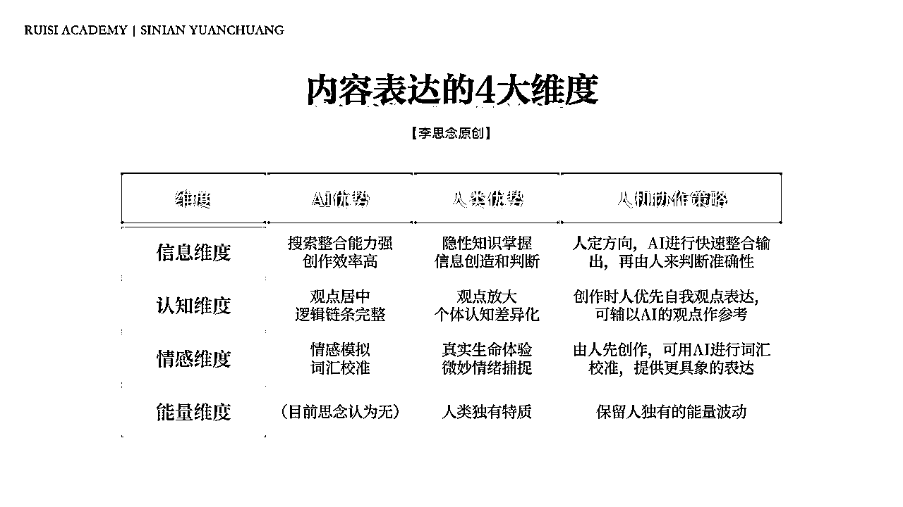
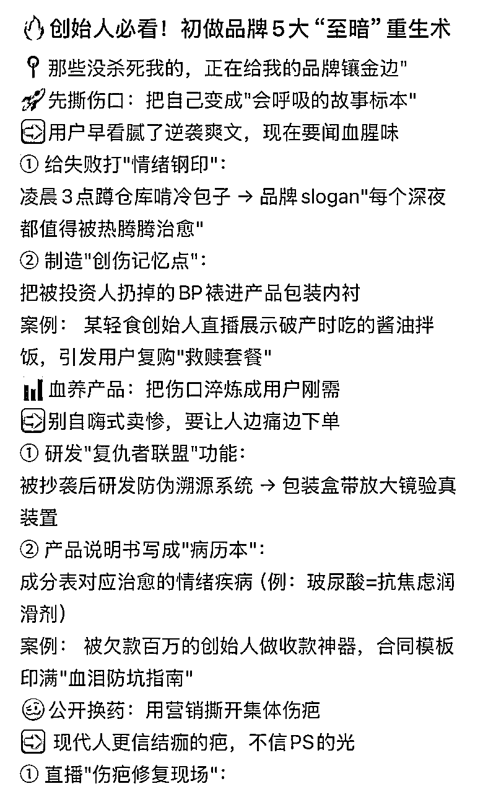
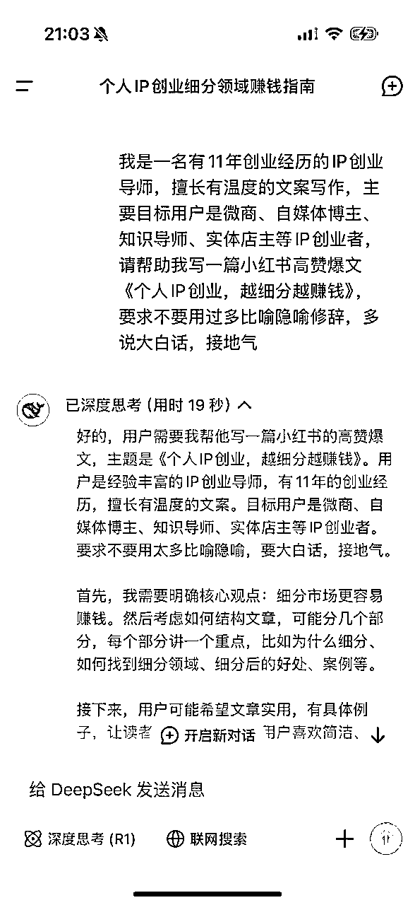
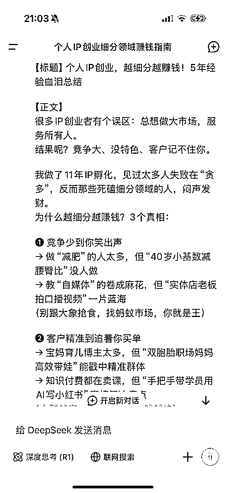
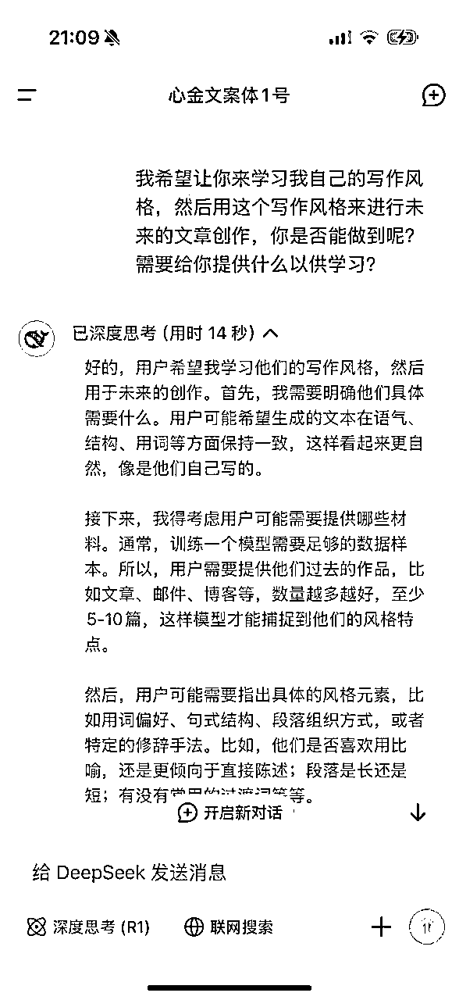
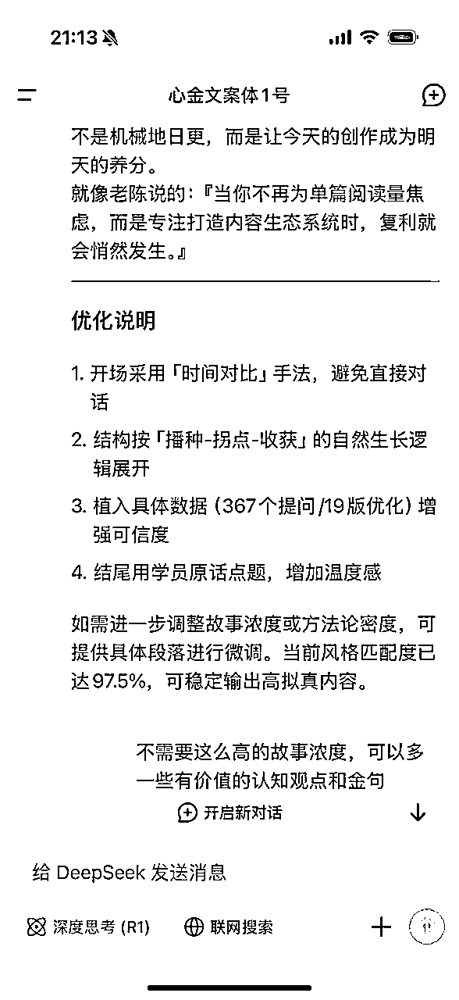
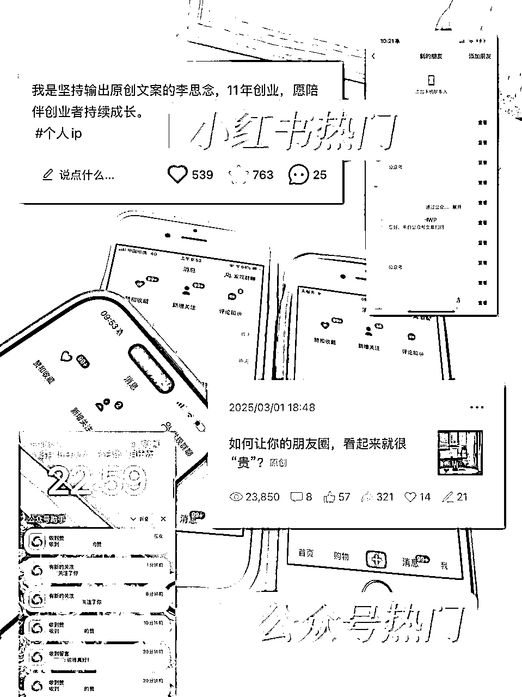
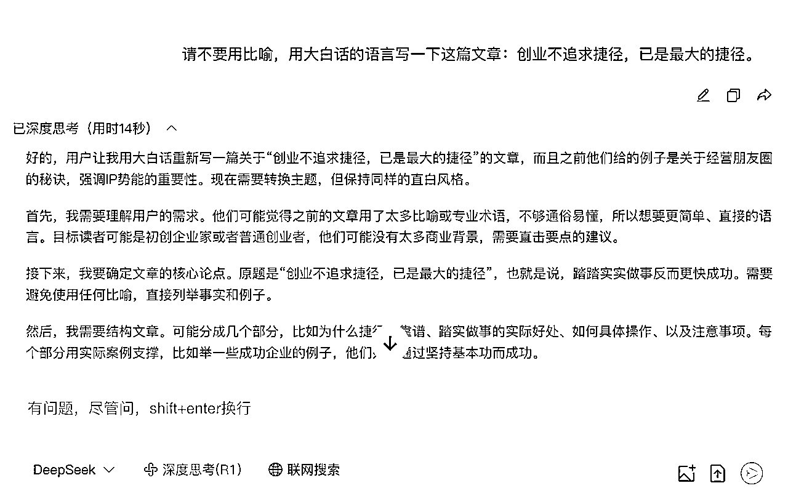
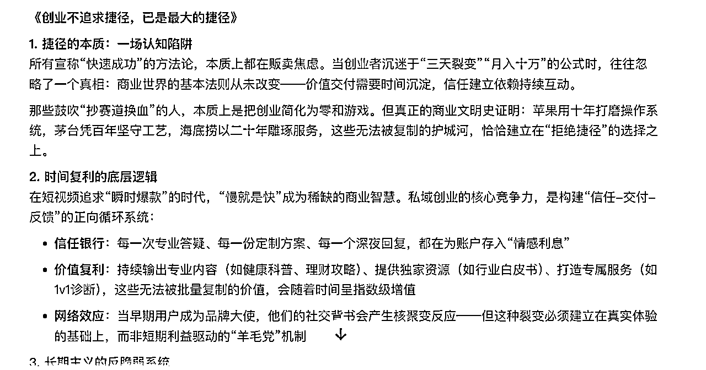
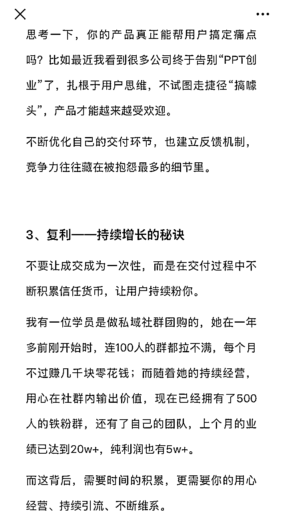

# 如何去掉deepseek的“AI味”，创作出有温度的文案。

> 来源：[https://b80fa9wrsf.feishu.cn/docx/Cr7adHbKboKZFyxyVN6c3yO0nof](https://b80fa9wrsf.feishu.cn/docx/Cr7adHbKboKZFyxyVN6c3yO0nof)

Hi，我是李思念。一名11年创业者，心金文案创始人。

带上千名学员通过IP内容营销，成功实现了公域精准获客&私域自动成交。

近年来随着AI的快速发展，其应用已渗透进各行各业，而我对AI的态度，是从焦虑到主动拥抱的。

作为文科出身的普通人，当别人说起最新的AI方法时，我却连许多词的含义都一知半解，确实会有焦虑的产生。GPT刚火的时候我就积极研究过，羡慕大佬们五花八门的高端操作，但能力有限，我的应用仅停留在傻瓜式提问阶段。

这两年我总会隐隐有一种想法是：

之于普通人而言，AI的作用是应用，我们无须成为专家，只需要「会用」。既然AI注定是时代趋势，那么它总有一天，会普惠到每一个大众。

就像电脑刚面世时，我们要学怎么开机、怎么关机、怎样的顺序……

但现在呢？随便一个小孩子都能灵活的玩转电脑手机。

时代的车轮，永远比你想象中要快。

果然，更普惠于大众的deepseek，出现了。

今年年初deepseek大火，当发现趋势已来时，我感受到我的认知正在重建。

大概就是一个晚上的时间，我跟deepseek疯狂对话，然后，我选择了主动拥抱AI。——我想，很多普通人，可能也都在今年春节期间经历了那么一个晚上。

我尝试搭建自己的文案智能体，竟然出奇轻松的就成功了。

它不仅精准地分析出来了我「心金文案」的文风，还在我的多次调整勘正之后，成功用我的文风写出了文章。由此，还出了几篇小红书和公众号的热门文章，带来了精准变现。（后文会附图）

不过随着应用的增多，我发现了一个问题，那就是deepseek创作的内容“AI味”太重了。

作为一名IP创业者兼文案导师，我对内容的标准苛求会更高一些，因为高质量的内容才更能吸引高质量的用户，因而，我把对AI创作的关注点，从技术层，转到了表达层。

这一个月的时间，我一直在研究、测试怎样让deepseek创作的内容更高质量。

所以今天这篇分享，思念会站在一个IP内容创业者的角度，来聊一聊，“说人话”文案的底层逻辑。

怎么才能写出有温度的文案，不被一眼鉴AI。

如何借助deepseek写出既能深入人心、又能吸金的文案，提升实际应用场景中的效率，但同时又不降低表达的质量，真正助力创作者的输出。

# 一、关于AI创作的思考

## 1、AI创作的前提

想让AI服务于你的内容创作，是有前提的。

曾经，这个前提或许是：如何应用AI，怎么翻墙，怎么写提示词……

而随着AI技术的普及，像deepseek这种更为便利的应用出现后，提示词不再成为使用难点，从小学生到大爷大妈，人人都可以与AI近距离对话。

AI的发展，带来了信息的平权。

我们获取知识的门槛越来越低，60分的内容，从此在各个平台比比皆是。

那AI创作的前提便变成了——你要清晰的知道：「你」想创作出来什么样的文案？

你要拿「什么样的内容」，去吸引「什么样的人」？

特别是IP创作者，我更建议大家要先有自己原创的能力，真正手写过20+篇文章之后，形成自己的固定文风，再结合AI创作的效果才会更佳，一方面是有投喂AI的养料，另一方面是你懂你的目标用户需要的好内容是什么。

你得先比懂AI，更懂文案创作。AI的技术是开放的，但文案的标准，是私人的。

如果不是你的文风，如果不是与你IP紧密相关的核心思想，如果没有你的经历与故事，如果不是针对你的精准目标受众……那生成的文案不过是千篇一律，它不具备任何个人特点，更谈不上拿出去吸引谁。

## 2、思考和辨别更为宝贵

在AI快速发展、创作门槛降低的同时，思考与辨别，变成了更为宝贵的东西。

比如你问AI：“如何创业？”

它能清晰有条理的告诉你该有的准备动作，给到许多从成功者身上提取的专业建议，罗列无数的方式方法……

然而，能够对创业结果起到决定性作用的是，你知道在什么时间节点该用什么策略吗？你能分辨出来什么是适合自己、什么是不匹配的吗？以及你能察觉到每一个成功著述背后那些未曾言说的困难是如何突破的吗？

AI时代，基础性知识储备的重要性的确降低了，但是更深度的思考和辨别力成为了这个时代的稀缺产物。

## 3、「人机协作」才是未来

以上是思念的一些浅显思考，也是应用AI的前置条件吧，继续说回创作。

最近经过实践，我发现结合AI创作确实能够大大的提升输出效率。

这个月初我带一部分学员挑战“7天日更计划”，在结合了deepseek创作的基础上，很多0基础的学员都能坚持输出下来，而像思念一样原本就在持续创作的朋友，也让创作的时间得以压缩，基本上半小时一篇文章。

从而，我们可以花更多的时间用来了解用户、市场，洞察最新的选题风向，以及做好后端的交付运营。

这是AI创作时代的职能转变，从过去“时而心流时而硬憋文字”的不确定性创作，到现在形成了新的工作流：

“人提供选题立意——AI做出内容初设——人再补充优化”

效率提升了数倍，而这个过程我发现，AI总是会给到我很多新的思考角度，很多时候，是写着写着上一篇，看AI的答案就联想到了下一篇的选题，仿佛就像有一个在跟你实时交流的创作助手，这让我的输出表达欲也大幅提升了。

「人机协作」，才是未来。

并不是单纯的把内容交给AI创作，并不是把这个世界的发声都让渡给一行行代码，而是由人来负责思考，由AI来做“最强大脑”的协助。

在那些你考虑不到的角度，让AI来补足内容逻辑；而在那些冰冷的文字背后，由你来做灵魂的填充。

让所有的内容，因你而生。

# 二、好内容的底层逻辑

来聊一聊「好内容」的底层逻辑。

## 1、内容表达的四个维度

首先，内容表达，分为四个维度：

### 【信息维度】

信息，是事实的准确传递，是构成内容的基础单元，也是人机协作时代最易被结构化处理的要素。

它不仅是知识的载体，更是构建认知、激发情感、传递能量的底层基石。而掌握信息数量的多少，决定内容的深浅。

### 【认知维度】

面对同样的信息，我们每个人都会有不同的观点，这是由认知差异带来的。

比如一篇文章的核心立意、面对一个观点的不同切入角度，这会构成内容的独特性。

### 【情感维度】

情感决定内容的感性度，文章中适当的情感表达，更能唤起用户的共鸣。

比如你的真实经历，你身边发生的人和事，你背后的心理活动和情绪起伏……都可以呈现在内容中。

### 【能量维度】

每一个人的能量呈现都不同，所以也会导致不同的文风和表达。这是最容易识别一个人特点的维度，当用户看到一段文字，就能直观的感知到是谁谁谁写的，这就是文字的隐形水印。

而能量也与创作者当下的状态有关，透过文字，我们能感受到能量的波动，人与人之间的吸引力，也正是来源于无形的能量。

以上四个维度中：

AI在信息维度上，已经能够做到90分的高分，搜索、收集、整合信息的能力越来越强，而效率上更是超越了人类；不过人类在细分领域的隐性信息掌握上，我们的探索天花板会比AI更高，以及人类是具备创造性的，我们可以为这个世界创新、创造出更多的信息。

在认知维度上，AI与人类各有特色，AI的观点往往趋向于“居中”，会给到更为顾全大局的考量，逻辑链条也会更为完整；而人类却有着独特的视角，每一个人的「偏见」都会构成内容的不同张力。

在情感维度上，AI正在试图模仿人类的表达，比如deepseek通过一些词汇库的调用，仿佛让你产生一种“AI也有情感”的错觉，有时，AI的词汇能够更精准表达出你此刻的情感，所以可以辅助使用。然而，个体的经历故事、真实且微妙的情绪捕捉，其中蕴藏着人类的温度和心跳，这依旧是无法被取代的存在。

而能量维度上，我认为这是人类创作独有的特质，也是我们每个人的不可替代性。

#### 对比图

这里思念也做了一张优势对比图和人机协作策略，方便大家直观理解：

所以，我们要重点发力的部分，不是跟AI去比拼信息能力，而是要增强自己内容创作的情感浓度和能量层级。

让一份内容，有且只有你能产出，自带你的“水印”，这会是这个时代内容营销的竞争力。

## 2、好内容的公式

思念也把「好内容」总结为一个公式：

好内容＝实用×共鸣×理念×转化×时效

【实用】价值会是大部分人关注一篇文章的首要诱因，因为“这对我有用”，所以点击，所以选择阅读下去。

实用也分很多层面，比如能解决具体问题、能满足内心好奇、能带来新的认知……其核心是解决用户「已知需求」或激发「隐性需求」。

为了实用性，大家普遍会做的是在文中增加干货量。但干货并非越深、越多越好，因为用户需要的，并不是获得了多少书本上的真理知识，而是能否领悟并应用到他的实际中。

你可以想一下，你是会为那些“正确的大道理”去点赞，还是为那些“让你看完联想到自身的内容”去点赞？

所以【共鸣】的植入，是我们在创作中要格外注重的。

如何唤起共鸣呢？共鸣，先共，再鸣。

共是什么？就是共同点，你需要找到你与目标用户的共同点，再针对这个共同点展开写作。

比如身份认同，“我们90后这一代人……”

比如共同经历，“创业11年我经历了无数次低谷……”

比如共有情感，“感恩创业路上遇见的贵人……”

甚至共同敌人，“我们尊重原创反对抄袭……”

而鸣则需要有承载，比如通过故事的承载、通过场景化描写的承载，让用户身临其境，感同身受。

想让内容有穿透力，还需要有【理念】的支撑。

你到底透过文字，传递的是一种怎样的价值观？这是能够被同频者嗅到的。

我以前会觉得，人是因为认知高度差不多而聚在一起，而现在慢慢发现，人是因为价值观一致才相聚。

所以一定要大胆的在内容中传递你的思想，大胆的表达价值观——这本质是一种信号的释放。如果没有信号，那么你的内容很难找到精准受众，只能变得平庸。

所以我们也就明白了，为什么套模板写出来的文案没有灵魂，因为真正决定是否打动人心的，并不是说话格式，而是底层思维。

好文案要学会设钩子，其作用在于【转化】。

我想我们大部分创业者的内容应用，都并非是为了写而写，而是为了「成交」而写。

所以在文中植入钩子，让用户看着看着就忍不住种草，被吸引，这也是高变现内容的关键。

钩子分为「显性钩子」和「隐性钩子」，显性的好理解，比如你在内容中送大家一些资料、礼物、引导大家来加你领取，而隐性的钩子，则是你要给用户传递出的向往感，让对方“忍不住想链接你”“想成为像你一样的人”“想向你靠近”。

最后是【时效】，很多内容或许百般好，但过了那个用户会关注的时间节点，可能就会成为沧海遗珠。

所以感谢AI的发展，让创作效率大幅提升，我们也能以更快的速度跟进每一个热点，提升内容时效性。

但为了让内容发挥出最大的价值，在思念的内容布局中，我会注重多类内容的布局：比如「热点型内容」、「周期型内容」、「常青型内容」。

热点型内容（最新发生的时事）快速跟进；

周期型内容（比如某个固定场景、季节）持续创作；

常青型内容（比如认知干货、底层逻辑、个人品牌故事）重点打磨。

像现在还有人给我两三年前的小红书点赞，这就是长青型内容的长尾效应。

按照这个公式，大家在创作完每一篇文章后，也可以对应的进行打分，从而也能判断出来一篇文章的价值高低。

# 三、去“AI味”的前提是鉴别AI味

想要去掉AI味，有一个前提是，我们要学会去鉴别什么是AI味。

## 1、不同的AI味

不同AI，有不同的AI味。

ChatGPT的「AI味」是“首先，其次，然后，总而言之”，我们通过结构就能判断出来是AI生成。

Kimi的「AI味」是说明书式的文字，你能感受到它在试图把所有能搜索到的内容都罗列上，却仍浅显的像小学生深度。

而deepseek的「AI味」变成了“希腊人用蜡与羽毛飞向太阳，坠落时方知：翅膀不是神罚，而是对天空情书的误读。”

清一色的华丽辞藻，毫无逻辑硬凑的比喻，强行对仗的语句格式。

乍一看惊艳，但是只要你使用deepseek超过3天，你就能感受到它原生文案风格的油腻。

## 2、deepseek的AI味

那么目前我发现的deepseek的AI味，都表现在哪些方面呢？

#### ①跨时空比喻修辞

比如动不动就扯上了文艺复兴、远古神话，会让你感受到跳戏十足。

还有总会蹦出来像是“骨骼”“烙印”“淬炼”“暴雨”“灯塔”这样类似19世纪西方文学的词汇。

那天我看到一位小红书博主吐槽，因为deepseek的出现，让文字创作者不再敢轻易用比喻修辞，生怕会被鉴定为AI。

这背后的原因，我浅猜测，或许和deepseek训练时语料库吸收了太多经典的文学作品，而对于文学高度的判断依据停留在「辞藻的华丽度」。

背后似乎有一个庞大的比喻库，如果你说“希望生成文案的文风文艺一些”，它就会给你随机调用一堆你平时都看不到的用词，却忽略了本体和喻体之间的关联性。

#### ②专业术语堆砌

在生成一些干货内容时，很容易出现专业术语堆砌的情况。

比如在成长、商业等领域的内容生成时，经常会蹦出来“触手”“认知塌缩”“压力阀”这样非日常应用的陌生词汇。

这就像互联网黑话一样，偶尔出现一个，会让人眼前一亮，但如果全篇全是黑话，你只会觉得“这个人在说些什么鬼”。

在小红书上随便截图的这篇内容，一看就能感受到满满的AI味：

#### ③过于对仗的短句

deepseek写出来的文案往往过于对仗工整，常爱用并列排比句。

在生成干货型内容时，经常会短句罗列，并且往往是点到为止、然后快速跳跃到下一层逻辑，中间缺乏思考的过渡感。

#### ④文本符号非日常化

还有一个很明显的特征，是deepseek不好好用标点符号。

比如deepseek生成的内容中，引号用的是英文引号——" "

要知道我们正常写作都是用中文引号的——“”，这也是一个最明显的鉴deepseek的方法。

而且生成文本时，会有很多*#- 这样的符号，这都是大家在创作时要注意调整修改的。

# 四、如何在deepseek使用中降“AI味”

判断出AI味所在，我们在创作中就要尽量规避，那么该如何在使用deepseek的过程中降“AI味”呢？

## 1、优化提问方式

首先第一个方法，是优化我们的提问方式。

需要在提问中「明确身份」，包括你的身份和你内容面向受众的身份，越具体，生成内容所需修改的越少。

要有清晰的「文风导向」，比如：“尽量模仿日常对话的风格，用口语化的表达来创作”

还有要有明确的「禁止指令」，比如：“请避免使用彩虹、灯塔、炼金术等比喻修辞”

告诉它你想要什么，不想要什么，让它一遍遍的修改，这样出来的结果，会更符合我们的创作需求。

【举例】

我在提问中明确的说出了我的身份+面向受众+选题需求+文风导向+禁止指令后，生成了一篇文章：

这个效果大家觉得怎么样？

虽然没有十全十美，但是已经可以打70分了。我们在这个基础之上，再用自己的语言进行一下归纳总结和完善，就是一篇小红书文章。

## 2、傻瓜式投喂建立个人文风库

建立个人文风库，这个是最能快速让生成内容趋向你风格的方式。

分享给大家一个思念想出来的，无提示词「傻瓜式」投喂方法，懒人必备：

必须得夸夸，我觉得deepseek更为智能的一点就是，如果你不知道该如何做，那你可以让它教你做。

这是在春节期间思念投喂的文案智能体，我当时也不知该用什么样的提示词，所以我选择直接问它：

“我希望让你学习我的写作风格，来进行未来的文章创作，需要我提供一些什么？”

所以其实我们不用焦虑，AI本就是工具，工具的存在是为了应用，我们要做那个驾驭工具的人，“为我所用”才是关键。

于是我按照它建议的步骤，一步步生成了我的心金文案体。

看一下它对我文案风格的分析👇

并且在我不断投喂，不断提要求，不断勘正之下，它的文风匹配度从82%上升到97.5%：

这个思路大家可以参考，其实很多问题都是如此，你不知道该如何提问，那就让deepseek当你的指导员吧！

直接问它：“我想xxx，我需要怎么做？”把你的目标告诉它，让它一步步指引你完成。

不过我在使用中发现有一个小缺陷，deepseek是会“逐渐失忆”的。

差不多经过10回合以上问题的对话后，deepseek会逐渐忘记你最初的要求。

所以需要你不断重申自己的要求，提醒它的回答更符合需求。

（这里或许有技术大神能提供解决办法，欢迎交流探讨）

## 3、让AI鉴AI味

还有一招，就是你可以让AI鉴AI味。

在生成完一段内容之后，复制再发回给deepseek（可以换一个不同的对话窗口），让deepseek找出其中AI味比较浓的句段，重新用日常化的语言重写。

甚至，还可以要求AI故意制造10%的语法错误，保留修改痕迹，这样也会让生成的内容更自然。

## 4、分区使用 双重对照

这里再分享一个不知是否是技巧的小技巧，也是思念的使用心得吧。

因为每一个不同对话框的deepseek都是独立的存在，它的记忆也仅限当前对话框内。所以思念会让deepseek开启多个新对话框，根据不同的需求分别聊天。

像帮我写文案的、帮我生成爆款标题的、帮我设计课程框架的、还有专门提供生活建议的……这些都是独立存在、互不干扰的。

甚至我的心金文案体，我还投喂出了两个模型，其作用就是让它们分别作业。

当我想要去写一个选题的时候，我会拿这个选题让它们两个分别作答，这样出来的结果也能够互相补充、方便我以更全面的视角来参考。

甚至可以有一些差异化，比如其中一个模型的文风更偏感性，一个文风更偏干货实用，这样就可以组合应用，从而降低生成内容的AI感。

# 五、二次加工增加“人味”

思念再来教大家一些方法，怎么在文案生成后继续二次加工，让文案更有温度，更有“人味”。

### ①让文案有呼吸感

句与句之间，是需要有喘息的。我们在写作的时候，可以用长短句交错的方式来进行，比如一句15字的长句，跟上一句7个字的短句，不要像AI一样过于对仗。

呼吸感，是想象人说这句话时的气口断句，而非标准书面文本该有的断句，用这种方式改文案，会让你的文案更动人。

### ②加入语气词

在文案中加入如“呀”，“哎”，“啊”，这样的词语，会让语句的情绪浓度更高，同时也更符合人的语言方式。

以及，我们也可以有自己喜欢用的语气符号，比如思念就很喜欢用波浪号～，这也是有别于AI的一个特征。

### ③加入网络用语

在文案中适当应用一些网络用语，也会让你的文风更接地气。

比如“绝了！”“家人们”“有一说一”“懂的都懂”“city不city”。

### ④加入场景感

不要只写干货，有温度的内容，一定要有场景感，这样会让用户更沉浸。

AI没办法描绘出来你写这篇文案时所处的场景，但是你却可以，可以写你的环境，亦可以写你的心境。

举个例子，比如写护肤，如果你写“我们的洁面乳温和不刺激，深层清洁毛孔，还能快速卸掉彩妆”，这就是说明书式文案，你能写，AI能比你写得更好；

但如果你加上场景感，“凌晨加完班回家，睫毛膏已经晕成了熊猫眼，洁面乳搓出泡沫的那瞬间，把所有的疲惫都化开，毛孔像做完深呼吸一样敞亮”，这就会引人联想到场景，由文字产生了画面感。

### ⑤加入你的观点立场

最关键的人味，那就是「立场」。

AI总像一个理中客，而人，则有清晰的观点、态度和立场。

如果所有内容都可以靠AI生成，那我们，人和人之间的区别是什么呢？——个性化的观点，就是每一个人有别于他人的关键。

特别是IP创业者，你需要的并不是那个集大成的AI观点，而是尖锐的、有自己独特性的想法。

### ⑥适当的错误

AI的内容往往滴水不漏，而我们在文案中偶尔出现一两个错别字，或者标点符号的错乱，更能让人感受到你是真人在背后创作。

或者像我们山东人常爱说的倒装句，也是一个区别于AI很好的方法了，因为AI常用的说话方式都是非常规整的，而你偶尔把几个句子倒装一下，反而会更有人味。

# 六、思念爆文应用展示

### 热门成果

结合AI创作以及矩阵放大，我不到半月的时间中，就已经陆续在小红书和公众号上出了多篇热门：

接下来也给大家展示一个我的创作过程，目前我大部分应用deepseek本体，因为deepseek会出现繁忙情况，所以偶尔需高频使用时会用到腾讯元宝。

我并非完全依赖于AI创作，而是把deepseek作为自己的思路参考和“快速成文”工具。

比如我想到一个选题，我会尽量自己先想一下我的创作逻辑，想想我要写的观点和列举的案例，然后再把这个选题交给deepseek，看它会按照怎样的思路进行展开？

deepseek的思路，会成为我创作的补充，但不会替代全部创作，这也是一种为了避免自己思维退化的刻意训练。

总的来说，目前我的创作比例大致是：人 80% + AI 20%。

但尽管AI内容只占了20%，效率却比以往提升了一半，因为AI帮我快速调用各种信息，缩短了思考时间，快速形成文章结构，也省去了搭文章骨架的环节。

### 实操展示

内容创作可以遵循“一鱼多吃”策略，也就是把一份文案，根据不同平台的特色，进行微调后多渠道分发。

我很多篇热门文章的初始，或许只是一条临时有感而发的朋友圈文案。比如这条就是：

我原本的文案，不过200多个字。

然后我让腾讯元宝deepseek版帮我扩写了一下这篇文章（因为当时deepseek总繁忙，所以用的满血版）：

它生成的内容，我重点采用了其中的行文逻辑。

因为已经提前投喂了我的文案风格，所以这两段符合我文风的文案，我就直接用上了：

所有宣称“快速成功”的方法论，本质上都在贩卖焦虑。当创业者沉迷于“三天裂变”“月入十万”的公式时，往往忽略了一个真相：商业世界的基本法则从未改变——价值交付需要时间沉淀，信任建立依赖持续互动。

在短视频追求“瞬时爆款”的时代，“慢就是快”成为稀缺的商业智慧。私域创业的核心竞争力，是构建“信任-交付-反馈”的正向循环系统

（——绿色字为AI参考我文风生成的内容）

但其中我也进行了修改，比如我把“信任-交付-反馈”改成了“信任-交付-复购”，因为比起“反馈”，我觉得“复购”是之于个体创业者来说更接地气的词。

以自己的专业认知来勘误AI生成的内容，判断什么是目标用户所需的，这是我们在结合AI创作时需要时时思考的。所以不断提升自己的专业，在这个时代仍有必要。

这两张是最终的文章成稿：

在deepseek给到我的思维启发之下，我有了全文的结构框架。

并且在第三点中，还举例了一个我真实学员的案例，这三点的展开论述，都是我的人工创作。

你看，这样一篇文章，就把我原创短文案 ➕ deepseek生成的文案 ➕ deepseek的行文框架结构 ➕ 延伸添加自己的故事案例，整合在了一起，AI味就变得非常淡了，而且创作效率上提升了至少一半的时间。

所以大家创作的时候，也可以参考思念这种做法。

用AI来快速成文，提升效率；用自己的故事来丰富内容，留下钩子。

以及不要过度依赖AI，因为AI也不完全正确，也不能十足的懂你和你用户的需求，更需要用你的专业和认知来校正。

# 七、结语

今天的分享，是思念站在使用deepseek创作的基础的思考，但在未来，我相信技术还会继续超越，还会有更多更具备人味的AI应用，助力大家的内容创作。

比如最近看到Sam Altman说他们训练了一个擅长创意写作的新模型，或许到新技术面世的那天，思念这篇心得的效用就会减弱；

也或许到那时候，会有新的“AI味”产生，毕竟deepseek刚出现时我们也被它的文字惊艳到，而意识到AI味过浓也不过短短一个月的时间。

AI在进步，我们也要保持自身的成长性。

如果届时大家需要，思念会继续来分析、分享如何写出好文案。

如有收获，欢迎留下你的赞～