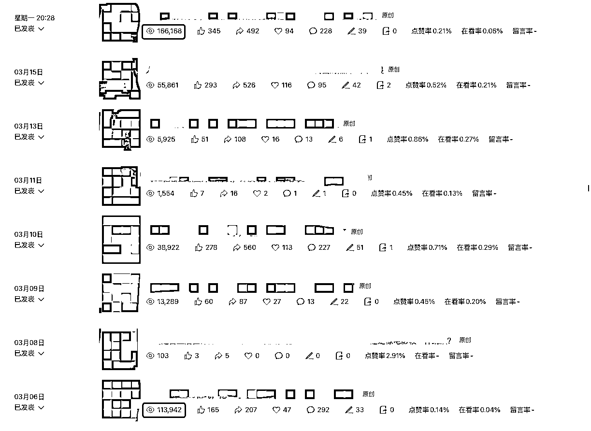
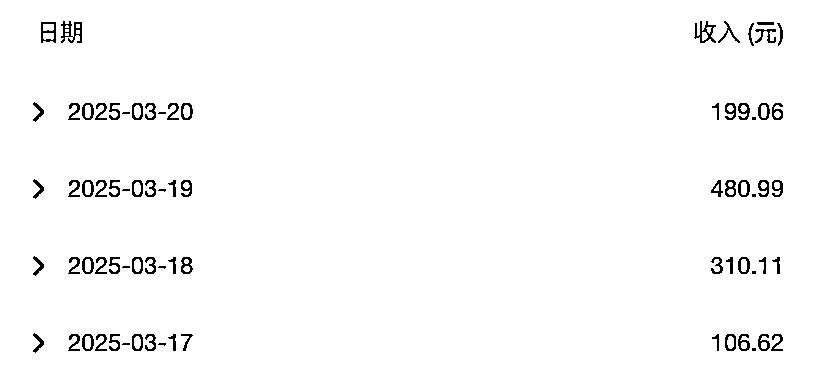
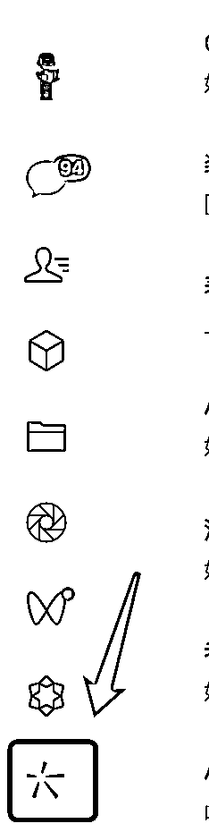
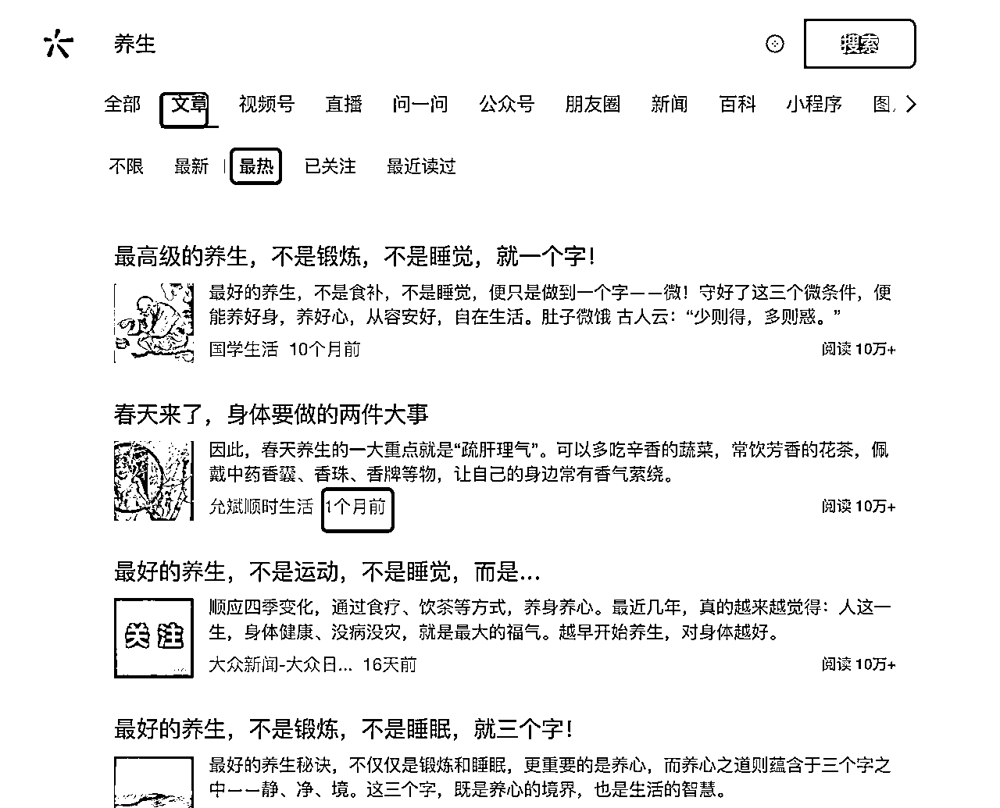
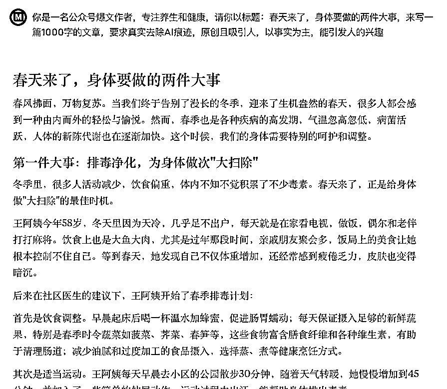
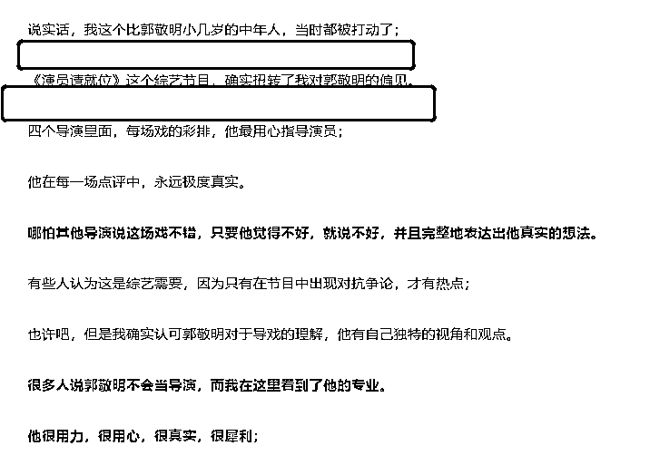
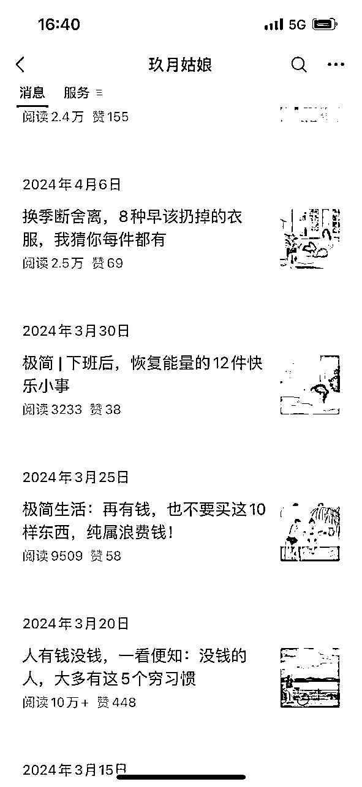

# 5分钟教你，一篇10W+的公众号爆文是如何诞生的？

> 来源：[https://hez86518tv.feishu.cn/docx/DUVHdHdymoSwR0xwiajcd3hGnte](https://hez86518tv.feishu.cn/docx/DUVHdHdymoSwR0xwiajcd3hGnte)

| 版本 | 更新描述 | 作者 | 更新日期 |
| V1.0 | 新建文档 | 科学羊 | 2025-03-21 |

* * *

大家好，我是科学羊🐑，（10W+）爆文公众号专栏日更作者，知名报社签约编辑、海外内容创业实践者、游戏视频创作者、B站游戏UP主。

好久不见❤️，今天我又来生财分享干货啦～

前几期我分享了关于海外的赛道，那么本期我想分享下国内的，也就是国内知名的卷王赛道——爆文公众号。

大家还是不要小看公众号这个赛道，也不要认为它是不是夕阳黄昏，其实在我看来公众号已经不是副业这个档次了，而是人人应该必备收益的零花钱福利。

也就是说，我们对待公众号这个赛道，从以往的航海来看，可能你需要认认真真学学基础，学习运营，练习写作...，但现在已经不是了，除非你没有任何基础。

不过，现在大家很多都可以做到RPA，不过这个也不是我想分享的，RPA固然有用，但是有时候不可控，也有一定的学习成本。

好，废话不多，我们正式开讲～

* * *

在这之前，我先给大家看下近期的测试成果

# 一、测试数据展示

不过，本期我不分享关于公众号的基础、运营、以及其它注意事项，本期作为微精品部分，主要是想为各路大佬提供一些我自己测试的经验。

# 二、如何写出10W的爆文

假如你是个公众号小白，你不妨先了解下，一篇爆文的运行机制是怎样实现的。

假如你是一名大佬，我可以分享下近期我浅陋的经验，看能否给你带来启发。

一般来说，一篇文章如果你想要快速获得10W+，有以下4个步骤是缺一不可的！

第一：找对标、找爆款（7～8W以上，最好是10W+）的文章；

第二：刷文（2遍以上）；

第三：手改+润色优化；

第四：查从和检查；

第五：发布；

好，接下来我们一一拆解。

## 2.1 找对标，找爆款

这个地方很多人都基本明白的，就是在微信搜一搜里去查，现在PC版微信也是支持这个功能的。

打开搜一搜，假如我们以「养生」为例，找到文章 > 最热 > 然后找到1个月以内的文章（最好是小众爆款，大号没有参考意义）

然后呢？

是不是打开他的文章看一下，拿里面的内容刷？

不不不，没意思，我教你的东西绝对要原汁原味，越简单越好！

直接拿标题，内容看都不用看，我们的目标是收益，而不是看他的文章写了啥。

因为现在有AI，所以你不需要担心内容的问题，我们只需要拿到爆款的外壳就好了。即使你拿了他的文章内容去刷文，还有被警告侵权的担忧。

比如，你直接拿到了这篇《春天来了，身体要做的两件大事》，拿到标题之后就是下一步。

## 2.2 刷文

这里的刷文，指的是用你拿到的标题生文，我用的AI 指令也非常简单。现在的AI不需要你训练很长的prompt了，一切从简。

养生类：

你是一名公众号爆文作者，专注养生和健康，请你以标题：春天来了，身体要做的两件大事，来写一篇1000字的文章，要求真实去除AI痕迹，原创且吸引人，以事实为主，能引发人的兴趣

好，接下来把这个指令丢给GPT或者Claude，让它生文即可。

如果你觉得不满意，可以把Claude生成的文章，再给GPT刷一次。

注意这次就可以把Claude生成的文给GPT做参考，大家注意这两个工具之间也可以互换，不存在谁先谁后。

你是一名公众号爆文作者，专注养生和健康，请你以标题：春天来了，身体要做的两件大事，来写一篇1000字的文章，要求真实去除AI痕迹，原创且吸引人，以事实为主，能引发人的兴趣。

以下是参考：

春风拂面，万物复苏。当我们终于告别了漫长的冬季，迎来了生机盎然的春天，很多人都会感到一种由内而外的轻松与愉悦。然而，春季也是各种疾病的高发期，气温忽高忽低，病菌活跃，人体的新陈代谢也在逐渐加快。这个时候，我们的身体需要特别的呵护和调整....

我试过，这样做的目的是增加AI与AI之间模型的差别，增强原创性。

这样，第二步就完成了。

## 2.3 手改+润色优化

接下来，如果你觉得写的不够好，或者AI味道太重，你可以手改。所谓手改就是增加：「图片」（一定要加）+ 断句 + 润色。

没错，这一步很重要，可能需要一点点写作的常识，比如：

粥左罗说的，文章写作，需要空行，就像之前星友告诉我减小阅读压力；

文章要配图，增强阅读体验...

重点的地方加粗、划线、变色....

实际上也就是你要发文前仔细阅读和检查你自己的文章，是不是自己体验没问题。

我真诚建议：做公众号的朋友，还是多看看爆款的内容排版，这是一篇文章或者一个产品的UI美观性。

另外，还有一个地方也要非常注意，就是你的封面和贴图最好能够统一，尽量用同一个风格的图。

## 2.4 查从

我认为查从还是要的，比如易撰类似的平台可以检查。

https://www.yizhuan5.com/

检查除了查从以外，还要注意「敏感词」这个也很重要，有敏感词的话，平台是不给你做推广的。

## 2.5 发布

发布无所谓定不定时，什么时候都行。

我认为新号并不要在意时间这个问题，因为一旦推流，就会持续很长时间。

做老号可能要培养用户的阅读习惯，所以就需要定时，比如我的「科学羊」就是每天早上 07:30前后发布。

# 三、我对爆文的理解怎样的？

我对爆文的理解，总结了以下几点：

第一，运气，我认为自媒体的项目其实都带有部分的运气成分在里面，因为自媒体的作品不是你和客户面对面，他满意了就给你付钱，而在于你的作品是否被平台推广？

那如何提高运气成分呢？

很简单也很暴力，就是多做多发即可。很多人做公众号如果是为了流量主，真诚建议多开几个号，因为每个号的权重是不一样的，发了什么，加了什么标签都有可能影响号前期的入池。

当然，也许这只是快慢的问题，好的作品，早晚都会被发现。

比如我在油管里发了30个作品，意外就有一个300万的爆款…，当然，前提是你的作品要满足下面我写的要求。

第二，标题，毋庸置疑，无可挑剔。无论你写什么样的文章，标题不刺激，哪怕上万，也没法爆。

我之前了解过，标题带有元素，如数字、金钱、性等刺激性概念会加大对阅读欲望的感官。

你想想，如果你的文章真的想让更多人看到，最好偶尔带点刺激的东西。

之前有个朋友评论我的文章说，垃圾标题党，就是看着你的标题进来的，结果文章是驴头不对马嘴，骗子！

额，我想回复他，我不这么写，你也不看啊。

所以，不在刀尖上行走，你体会不了前所未有的成就。这，也是一种认知升级。

第三、重复，一定要相信，爆款的东西一定还会爆，

从去年到今年我写了360多篇原创文章，60%以上的文章是上万，有10%的以上的文章是爆款。

其实，我很少会拿自己爆款文章再写，因为我是坚持每天写新的内容。

所以后来，我改变了这个态度，还是偶尔把自己写过的东西拿来再更新改改发出去，结果发现还是爆，甚至比之前发的数据还要好。

可能是粉丝比那时候更多吧。

第四、结合，好的东西一定是有价值的，我喜欢阅读，会看各种各样的文章，我觉得这篇文章好的话，我就想，能不能去找一篇写类似文的10+标题，拿来一合，不就是一篇新文章了吗。

最后，我给大家分享一点公众号引流的技巧。

建议偶尔发一些爆款小绿书，因为小绿书不存在原创的问题，只需要照抄就好。这样做的目的是激活你号的权重。

另外，还能给我们带来信心。

还有，新手做公众号，建议不要太追求文章质量，你辛辛苦苦写了一天，结果发出去半年没人看，还不如“随便写写”。

注意，我的意思是，不用费太多神去做它，只要做到随意、到位即可。等你IP满满积累一定程度了，就需要认真输出了。

# 四、公众号起号问题？

最近我又空手搞定了一个号，现在基本在公海运行了，起步估计月入过2K没问题。通过自己的方法，我测试了不少号，总结出3个经验：

1、如果你的账号起号之后没起量，然后换了领域继续更，然后又换... 3次以上就不要再更了，注销重开。当然，我试过更换了几次也起来的，只是时间周期长；

2、如果一个号一直起不来，如果你不着急，可以放1个月继续更，还是可以起量的；

3、公众号我强烈建议在一个领域深耕，尽量不要变，我做的好几个号都是在一个领域里。当到积累到一定程度，你的号就会被自然推广，你只要稍注意标题基本都能爆；

# 五、总结

所以，总结下来就是一句话：重点在于找到爆款标题，善用AI工具，注重排版美观，并确保内容通过查重和敏感词检查，这样才能打造出吸引读者的高质量爆文。

好，以上是本期的分享啦，感谢圈友的支持～

# 往期精华帖生财分享