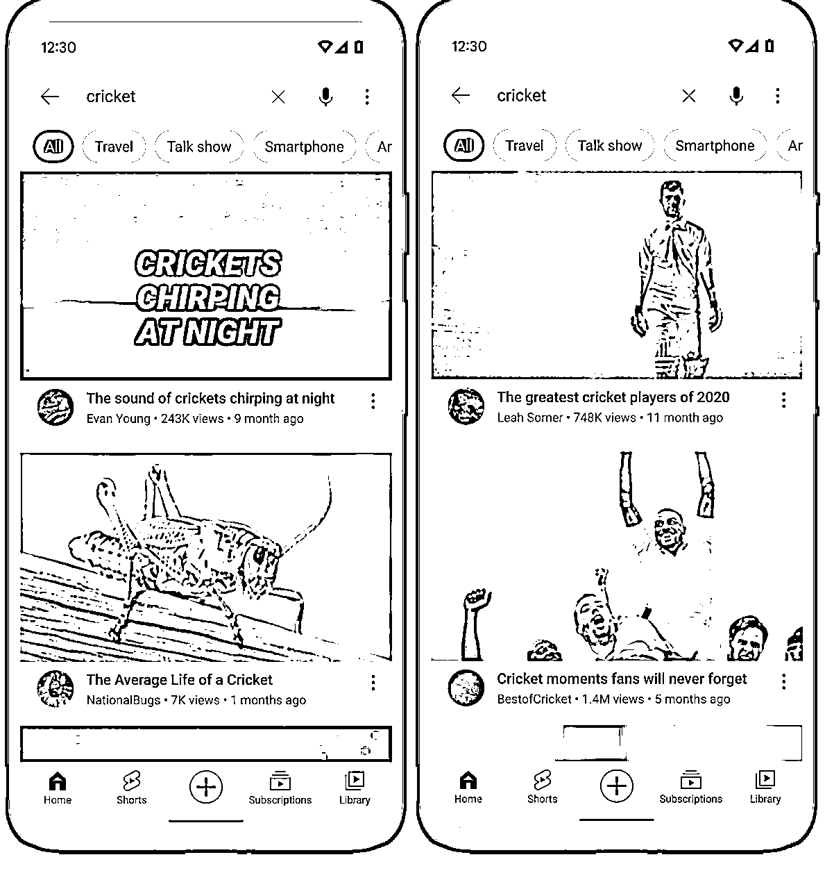
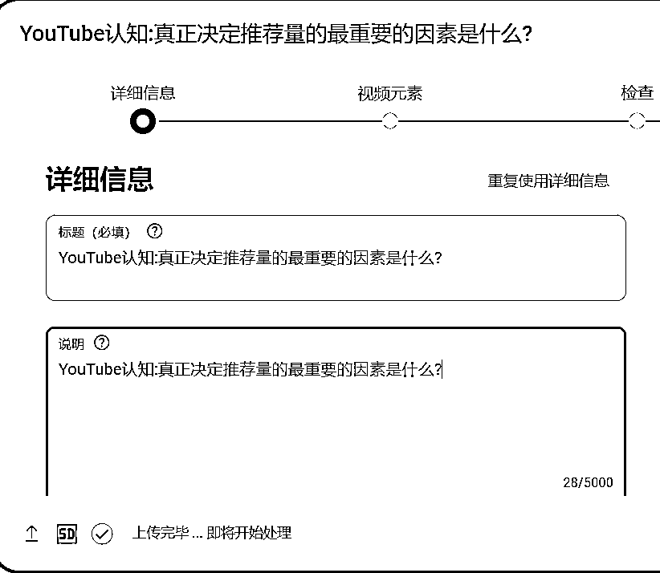
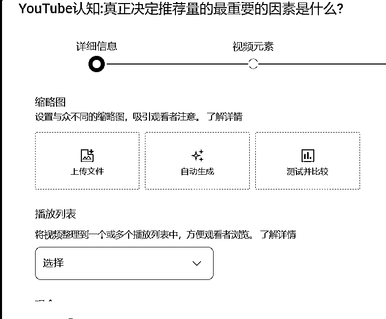
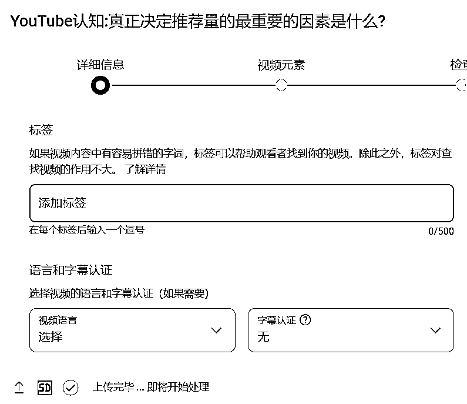
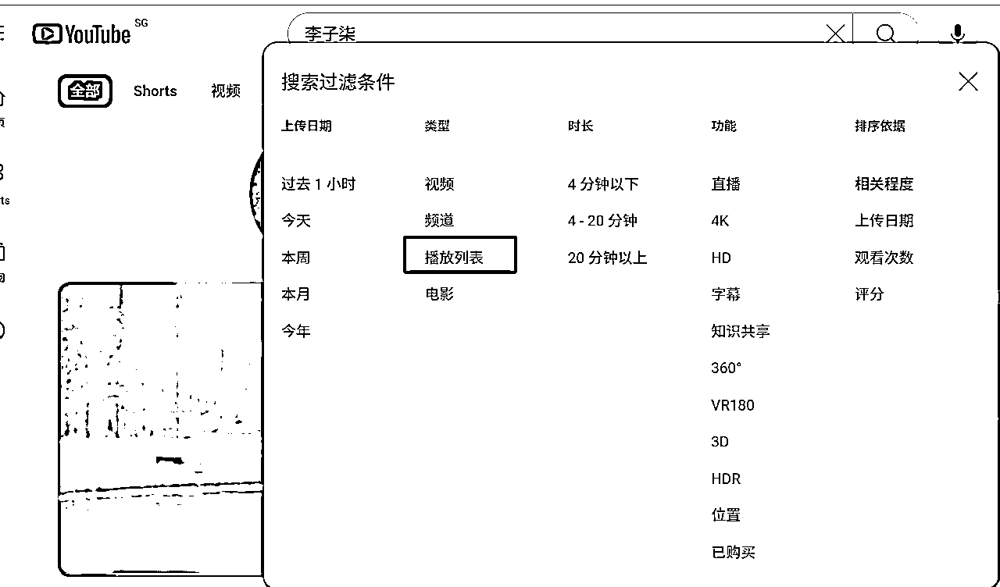
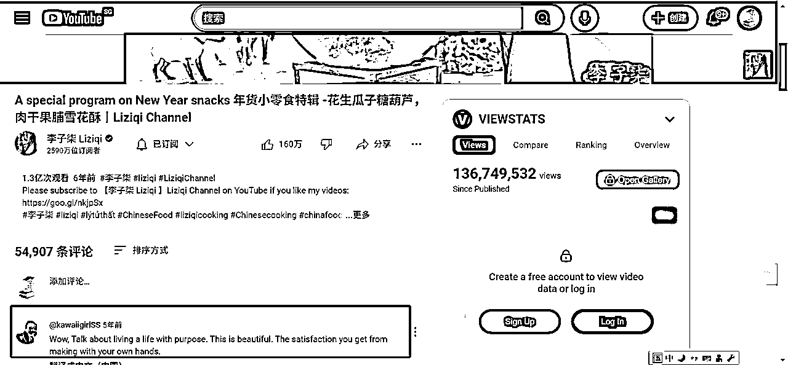
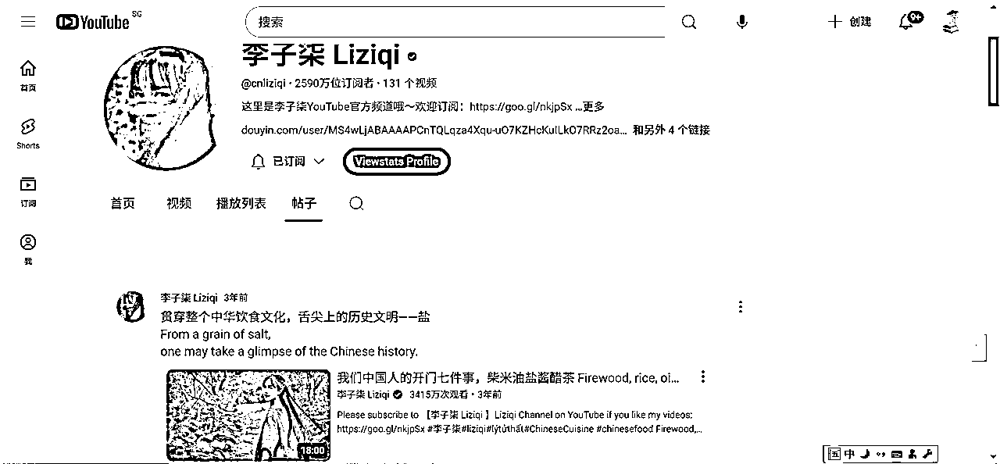

# 如何有效推广YouTube频道?这篇文章为你分类整理，你要收藏好。

> 来源：[https://rlwxa0zgke.feishu.cn/docx/DkCodA37eoJRX1xuNDvctCIPnLh](https://rlwxa0zgke.feishu.cn/docx/DkCodA37eoJRX1xuNDvctCIPnLh)

推广频道从大类分为三大类型：

1、被动型

2、主动型

3、付费型

### 1、被动型

被动型推广顾名思义，被动型就是你处于被动状态，等待别人找上门来，但这并不意味着你什么都不用做。这里的“被动”指的是，你完成前期工作后，就像守株待兔一样等着别人来找你。

被动型推广的做法：

#### 1、进行搜索引擎优化（SEO）

你要关注关键字，尤其是长尾关键字，还要搜寻热点话题，围绕这些关键字和话题制作节目。这样做的意义在于，让你的节目能被别人搜索到，从这个角度来说，你是被动等待被搜索的。

不过，在视频制作选题时，你得用心关注这些关键字，选择热点趋势话题。

补充资料：关于YouTube 的搜索排名系统的说明

每分钟都有超过 500 小时的内容上传到 YouTube，如果没有人帮助您对所有视频进行分类，您几乎不可能找到所需的内容。

YouTube 的搜索排名系统就是这样做的，它通过对大量视频进行排序，找出与您的搜索查询最相关、最有用的结果，并以有助于您找到所需内容的方式呈现这些结果。

在 YouTube 搜索中，我们优先考虑三个主要因素来提供最佳搜索结果：相关性、参与度和质量。

根据搜索类型的不同，这三个要素的重要性也不同。为了评估相关性，我们会考虑很多因素，例如标题、标签、描述和视频内容与搜索查询的匹配程度。

参与信号是确定相关性的重要方法。我们会综合用户的参与信号，例如，我们可能会查看特定查询的特定视频的观看时间，以确定其他用户是否认为该视频与查询相关。

最后，在质量方面，我们的系统旨在识别信号，帮助确定哪些频道在特定主题上展示了专业性、权威性和可信度。

YouTube 不接受为在有机搜索结果中获得更好的位置而支付的费用，我们也不会对谷歌拥有的内容比第三方创作者的内容给予更优惠的待遇。

除了这三大要素外，我们还努力使搜索结果与每个用户相关，如果您开启了搜索和观看历史记录，我们还可能会考虑您的搜索和观看历史记录。

这就是为什么您的搜索结果可能与其他用户相同查询的搜索结果不同。下图是一些并排示例，显示了用户的类似搜索如何会因这些因素而有所不同。

每个用户的搜索结果可能不同。例如，如果用户观看大量体育视频并搜索 “板球”，我们可能会推荐板球运动视频，而不是有蟋蟀的自然视频。

官方文档链接

#### 2、要做好频道设置

不管别人是通过搜索还是推荐看到你的视频，若想订阅你，往往会到你的频道页面一探究竟，看看你这个频道主究竟是何方神圣。

频道里有多个页面，如首页、视频、播放列表、频道、社区和简介等。你要对频道进行“装修”。

我看到一些圈友，YouTube频道首页是一片空白，如果是刚注册的频道可以理解，如果是已经发了不少视频，那么还是一片空白，那就有点说不过去了。

频道设置至关重要。你是否精心设计和编排了各个页面？有没有用心撰写频道简介？频道关键字是否设置妥当？YouTube提供的默认页面，你是否都填充了内容？播放列表是否整齐有序，能让观众一眼看出你主要做哪几大类内容？一旦观众了解这些，就可能订阅你的频道。

频道设置，如果展开讲也可以是一个专题，这里提一点，那就是频道首页可以设置一个预告片，如果你有自己的产品，那么这个预告片就是你自我介绍的一个窗口，这里举例，这个窗口是什么，如下图这个视频就是给没有订阅的人看的。

如果你没有自己的产品，那么这个页面可以放你播放量高的视频，有自己的产品，就是宣传你个人产品的一个地方，关于频带设置细节后续专门写一个文章介绍这一块好了。

#### 3、视频的元数据，包括封面、标题、说明、标签等等。

这部分内容一定要有吸引力。

YouTube准备推荐你的视频，可封面太难看，观众看到却不愿点击，你就白白错失了一次宝贵机会。YouTube为你展示了视频，观众却不点击，实在可惜。因此，你要重视视频的元数据，让YouTube的算法能够认识、发现并推荐你。

被动型推广的这三个方法，核心都是先把基本功做扎实，把自己能做的部分都做好了，至少视频到底会有多少人看，看的观众是否会进行订阅，这就不是你能控制得了的了。

这里补充下之前已经写好的内容，有些内容会有重复，不过侧重点会有所不同

##### 为什么你的YouTube视频没人看，如何做改进，吸引更多观众看你的视频？

一个YouTube视频被更多人看，这里提三个较为关键的指标

1、 封面 2、标题 3、视频质量

用户是否愿意看，我们不能从主观去认为这个视频就一定很多人看，这是活在自己想象的世界中

用户观看的逻辑，他第一眼看到的是你视频的封面，然后再读标题，在封面和标题都符合他内心的需求，他才会点击看视频的内容部分

封面和标题是两个整体，这两个是决定用户是否点击视频的关键因素，封面吸引注意，标题提供信息，共同作用产生点击率。

在YouTube是早期对于观看时长没那么重视的时候，一些骗流量的人，往往把封面和标题做得让人很有点击的冲动，后来YouTube做了调整，把视频的观看时长，观看完成度的比重调大了，因此靠封面、标题骗点击也不那么有利可图。

因为广告是用户在看视频中插入的，因此不得不提到视频的质量。

想要你的视频更多人看，一般用到的是AB测试，封面和标题都要做调整，比如说测试不同封面对观看量的影响，具体是封面影响大，还是标题影响大这个没有人给答案，要经过不断的测试。

标题是用来做SEO的，要留意这一块的流量，用户观看视频如果他很明确自己要看什么，往往会通过关键词进行一个搜索，那么得具备相关SEO的知识，如果设置更吸引人的标题同时又要满足SEO的效果，在标题这一块也是一门学问。

要抓住前面48小时的一个曝光，YouTube是非常欢迎新内容， 人们也更偏向于看新东西，想获得更多的观看，其实是要一开始就要用心，努力要对方向。

等你后面再去调整封面、标题，YouTube在推荐的时候是更偏向于推荐新的东西而不是老的视频。

当然了，我说的也是不绝对的，影响观看视频的因素是很多的，有些视频在后面也有不错的曝光率，这也是事实，有些知识是不完全新的好，但是涉及到时政类的视频，一开始就用心做总是没有错。

或者类似于新闻类，因为新闻具有非常强的时效性，那么一开始的用心流量就比别人会更多。这里指的是在48小时做封面、标题的调整。

视频质量是多维度的，不是说你视频清晰度高就如何，4K大部分情况都用不到，在YouTube 1080P已经够用了

视频质量的一个非常重要的指标是完播率，在视频的前30秒，或者前多少秒其实是很关键的，把最重要的信息，或者说精彩的信息放前面把用户的好奇心勾住对于完播是非常有帮助的。

在前面30秒勾住用户的好奇心，在后续的视频中看你做什么类型的视频了，一般往往不建议画面过于单调，比如一个人一直讲中间没有镜头的切换，这个可以参考野兽先生，他的频道 MrBeast，他目前有3.07亿的订阅量。

##### YouTube认知:真正决定推荐量的最重要的因素是什么?

先分享下YouTube推荐普遍的一个误区：

我们通常认为油管的推荐算法是为博主服务的，实际上，它更关注观众的兴趣和行为习惯。推荐的内容并不是从博主的视频出发，而是根据观众的偏好，从新旧视频中为其推荐。

所以，推荐算法实际上是为观众服务的，而不是为博主。

这里列出上传要填的信息

1.  视频说明

视频说明是否重要？其实并没有那么重要。但如果有时间，确实应该认真写一段说明，因为这是告诉油管你视频内容的机会。现在有了像 ChatGPT 这样的工具，写说明变得非常简单，你只需要把字幕放进去，让它生成一个总结，再把这个总结粘贴回去就可以了。

1.  标签

标签重要吗？其实也没那么重要，尤其是对已经有稳定垂直内容的频道来说，标签的作用微乎其微。如果是新频道，起初可以加一些标签，帮助油管理解你的内容。但一旦频道建立了一段时间，标签的重要性就几乎可以忽略了。很多人滥用标签，在每个视频里加上很多不相关的标签，这是错误的。标签的正确用法是精确、简洁。

1.  类别

视频类别同样没那么重要。你随便选择一个大致相关的类别就可以了，它对推荐几乎没有任何影响。所以不要纠结于类别问题，油管算法对这方面的权重非常低。

1.  视频文件名

关于视频文件名，很多人误以为它会影响推荐，甚至还有人说文件名必须是英文的。这完全是误解。文件名对推荐算法毫无影响，不管你用数字、下划线，还是其他语言，油管都不会去看这个。

1.  上传时间

有些人会问：是否需要在固定时间上传视频，比如每天晚上8点？其实这并不重要。上传时间只会对你的老粉丝有些影响，能让他们养成固定的观看习惯。

至于油管是否会因为你在某个时间段上传视频就给更多的推荐，答案是否定的。最好的方式是，当你视频做好之后就直接发布，不要纠结具体的上传时间。

总的来说，油管视频的元数据远没有我们想象中那么重要。真正重要的是选题、封面、标题、视频说明和视频的前30秒，这些决定了观众是否会继续观看。至于类别、标签等属性，几乎可以忽略。

一般来说，封面和标题影响用户是否点开你的视频，这是第一眼能够感知的。用户愿意不愿意看，YouTub后台有一个指标，就是前30秒跳出率。

一般的建议是，你要把你这个视频中比较精彩，或者说比较精华的部分先展示出来，把用户勾住，留下一个悬念，之前写公众号爆文的套路可以用上了。

个人认为，提高视频质量才是重中之重，最近在看《10倍比2倍更简单》这本书提到了Mr Beast，这里记录下当时的一个笔记。

吉米 唐纳森(Mr Beast) 10倍增流程的三个要素：

1、 以指数级和非线性的方式扩大思维

2、极致关注质量而非数量

3、 建立一个团队来处理80%的工作，这样你就可以专注于提高 你的技巧。

我自己喜欢YouTube，Mr Beast是一个知名人物， 我觉得他很早就知道自己要什么，这一点难能可贵，非常的稀缺，他现在的订阅人数已经超过1亿了他非常的优秀。

这里的观点也是值得学习的，里面提到一点一个视频获得500万次观看，比50个视频获得100次观看要容易得多，上传一个优秀的视频，获得的浏览量比上传100个平庸的视频要得多。

我有看过他的视频，确实做得好，这个好，好在哪？就是镜头换得很快，在你眼睛还没有觉得疲劳之前，镜头已经切换了，这里体现一个思想，花更多的时间打造精品而不是在每个普通的视频上花时间。

关注那更核心的20%，把80%的事情交给组建的团队。

具体来说，比如说雇了视频的剪辑师，剪辑师可以把100%的时间都投入进去，自己就可以从视频剪辑的繁重工作中解放出来，去思考更有价值的事了。

这里引发我的一个思考，要有识别哪些是那80%，可以外包给别人来做，哪些是20%，需要自己专注来做，这是一个好问题，好的问题是解决问题的一半了，

大多数人没有从系统结构上去思考，只局限在于2倍的努力中，没有从根本上有一个突破，这也是给我的一个启发。

### 2、主动型

主动型推广，也就是你要主动出击。主动型推广又细分为两个小类：1、油管内部推广 2、油管外部推广。在平台内部，你有办法主动出击；在平台外部，你也能进行引流。

#### 1、油管内部推广

##### 1、求转发

你可以在视频里呼吁大家转发，转发的本质是什么呢？通常是将视频转发到其他平台或群组，这样就能让更多人看到。而看到视频的人里，会有一部分点击链接回来看你的视频。所以，求转发能在油管内部起到推广效果。

##### 2、频道互推

你可以请其他频道主推广你的频道，作为回馈，你也推广他们的频道。

比如说你与其他频道主进行直播连麦，你把他们的频道链接放在说明区，同时还告之频道名称，以此为其频道引流。同时，你也让对方在直播时对你的频道进行引流。

补充一点：频道互推在前面描述的频道设置可以贴对象的频道地址，精选频道选互推的人的频道

##### 3、通过播放列表来抱大腿

原理挺简单的，那就是在搜索的时候，播放列表也是一个类型

###### 1、原理

在搜索的时候，播放列表也会被搜索出来，那么这里就可以做文章了，很简单，就是你把某类关键词在你频道做成播放列表，

###### 2、“投毒”

在你设置的播放列表最前面的视频就是一些大V的视频，接下来就是“投毒”，比如说第三个，或者说第四个就是你的视频了。

###### 3、等待

因为你播放列表最开始的时候就是大V的视频，观众看了一个视频后，如果观众不主动离开，那么视频会接着往下播放，那么就会播到你的频道了。

补充说明：

你设置的播放列表，要是某一个类主题，同时，你自己做的视频要是跟大V是同一个主题，通过播放列表 ，那么你就把你的视频跟大V的视频进行一个关联，YouTube知道你喜欢某一类型的视频就会给你推类似的视频。

也就是说，当观众在前面看了大V的视频，接着看你的视频，那么YouTube就知道观众看了你的视频了，后续就会把你频道的视频推给观众，这里有一个情况是，这个播放列表是你创建的，那么其实观众就被你带到你的频道来了。

##### 4、视频留言

这里的视频留言跟前面操作思路是类似的，那就是在大V的频道去留言，这里要注意自己的情商，做一个让人喜欢的人。

###### 细节

1、订阅目标频道，打开小铃铛

这里打开打开小铃铛原因很简单，大V发了视频你会收到YouTube官方的通知

2、收到通知第一时间观并留言

也就是说大V的视频发了后，你要进行一个站坐，你的留言越在前面被看到的概率也就越大，尤其是一些大V，他们的视频留言非常多，你晚了，那么你的留言就不在前面，大多数情况下后面的留言就不会看了，因为占据前排的位置非常关键。

比如说李七柒的这个视频1.3亿人观看，你第一时间留言，那么这些人看到你留言的几率就几乎100%，也就意味着你被1.3亿人看到

3、提供有价值的评论

对大V频道的观众有价值，有价值的频道有可能会被大V给到一个红心，或者说直接就置顶了，当你提供了有价值的评论后，这里看你评论的人里面会有一部分人对你这个人感兴趣，就有可能点开你的频道。

如果你的频道的视频是这个看你留言的观众喜欢的，那么就有可能来订阅你了。

4、不要有明显引流企图

欢迎大家来看我频道，我也做了类似的频道，放出你频道的链接，这样太明显了，吃相也太难看了，千万不要这样做，这样有可能你大V拉黑，或者你去骚扰大V的观众，那么大V可以让他的粉丝来举报你，情节严重你的频道有可能就没了

###### 为什么有用？

1、精准而且庞大的潜在流量

你去大V那里留言，你跟大V节日有交集，很明显大V的粉丝也就是你潜在的粉丝

2、自然导流，第一印象佳

你不是通过非常刻意，非常令人讨厌的方式去引流，那么自己留给别人的印象也是相对正面的，比如说老师讲课，有同学把老师讲课的重点要点通过评论的方式整理出来。

对方是顺着你的评论，点你频道的头像来找到你的频道的，这也说明对方是认可你的才对你感兴趣，印象相较于纯陌生人要更容易订阅你频道，当然了，前提是你频道是有价值的，是对方值得订阅的

3、频道关联，有利推荐

这很好理解，你可以想像下，你老在大V的视频下留言，大V给你评论点赞，大V的粉丝在你评论后面进行一个互动，同时大V的粉丝有一部分会来订阅你的频道，YouTube官方会留意这个的，会把你的频道跟大V的频道进行关联

在后续这个大V的粉丝看了大V的视频后，就会顺手推荐你的频道的视频了，这样也就蹭了大V的流量了，这个方法非常实用，大家赶紧用起来。

##### 5、直播评论引流

直播评论引流，这比视频留言引流效果更好。因为直播具有实时性，想象一下，直播时某个观众特别活跃，不断发表互动言论，其他观众就会对这个活跃观众产生好奇，可能会点击查看其频道页面。如果觉得不错，就可能订阅该频道，这就是直播评论引流的作用。

主动出击型的推广方法中，直播评论留言与视频留言有着异曲同工之妙。

###### 6、写社区帖

注意社区帖不一定是你非得进一个频道的点【帖子】才能看到，你有可能在首页就能看到某某社区帖，如果你写一些有意思的帖子发出来，能引起很多人互动，那么这些互动的人里面就有可能有部分人会订阅你频道。

补充一点：

在社区帖的类型中，投票这种形式比较简单，如果说你找了一个有意思的主题，也是非常容易火的

#### 2、油管外部的推广

这里的“外部”是针对YouTube平台而言，也就是从外部把流量引入YouTube。

你可以通过多种方式进行外部引流

##### 1、告知他人链接&社交媒体进行推广

告知他人链接或者告诉大家你有一个叫什么名字的YouTube频道，邀请大家去看看

通过群来实现。例如，在你的微信群、电报群里发布最新视频，或者在Facebook、Twitter、博客以及其他APP上发布信息，这些信息可以是链接、图片，也可以是搜索关键字。

让人们能根据你提供的信息，在YouTube平台上准确找到你的频道，并产生观看或订阅行为，这就是非常棒的外部引流方法。

##### 2、将视频以嵌入的方式在网站上显示

这里包括自建网站，或者说是在别人的网站上插入你频道的视频

### 主动型推广和被动型推广有什么差别？

主动型推广的所有引流动作都是主动出击。当然，由于主动出击需要付出更多努力，其效果自然也比被动型更好。

尤其是从油管外部引流的方式十分出色，还会得到YouTube平台的加持。 为什么YouTube会给予额外流量扶持呢？

道理很简单，你从非YouTube平台，如Facebook、微信、微博等为它拉来客源，它自然十分乐意。所以，若能从YouTube外部引流，平台会给予额外的流量扶持。

### 付费型

付费型推广，这种方法简单直接。通常情况下，付费推广的效果会比前两种免费推广稍好一些，但这并非绝对，因为影响推广效果的因素众多。

付费型推广主要分为以下两类：

#### 非Google Ads

前面提到，YouTube非常欢迎从外部为其引流。然而，若自身没有足够资源，除了在个人博客或微信上发布推广信息外，其他社交媒体大号很难为你免费推广。

其实，这种付费推广与主动型的油管外部推广本质相同，只是前者强调付费

1、你可以付费让社交媒体大号发布帖子为你引流，也可以在某些网站投放广告来吸引流量。

2、在油管内部与其他频道主合作进行付费推广。

你可以付费给大型频道主，让其在频道链接中添加你的频道。每个频道都有专属的频道页面，频道主能在页面里设置推荐频道，部分频道组就借此盈利。

若你希望某个大频道推广你的频道，可直接联系该频道组询问价格。若价格合理且你认为值得一试，不妨大胆尝试。

与之类似的方法是，让频道主在其社区页面发帖宣传，具体费用可私下协商。

还有付费采访这种合作方式，频道主在采访你时，会顺带宣传你的品牌、频道和产品。

#### Google Ads

很多人提及付费推广时唯一想到的——谷歌广告。因此放在最后介绍，是想提醒大家，除了投放谷歌广告，还有多种不同的付费推广途径可供选择。

谷歌广告推广是最为简单直接的方式。任何频道主都能开设谷歌广告账号，为自己的广告或某期视频进行付费推广。

虽说每个频道组都可自行操作推广视频，但我强烈建议：若只想花小钱体验广告系统，投入几十块、几百块自己尝试一番倒也无妨；

可要是真想严肃地推广频道或视频，务必寻求专业技术人员协助操作谷歌广告，切勿盲目自行尝试。

若不了解谷歌广告系统中的诸多陷阱，就会白白浪费大量金钱，甚至可能得出“谷歌推广无用”的错误结论。

谷歌广告推广只要运用得当，谷歌广告非常有效。所以，建议大家一定要寻求专业人士的帮助。这里没有广告，我不是谷歌广告专家，这里只是提个醒而已。

不管是被动型、主动型和付费型这三大类推广方法，这些推广方法是后面的0，视频质量才是前面的1，在节目质量尚未达到相对稳定的水平时，千万不要考虑所谓的推广，切勿舍本逐末。

那么，什么样的视频才算有质量呢？这里给出一个参考点——观看完成度。如果你的视频观看完成度仅在20% - 30%这个区间，就别在推广方面分散注意力了，更别想通过付费方式推广频道，否则只是白白浪费时间和金钱。

以上只能算是一个大纲吧，还有一些推广方法未写出，这一篇文章也不少字了，先更写到这，后面有新的再直接在这个文档进行补充。

算是抛砖引玉了，如果你有自己好的推广方法也欢迎进行补充，也希望这篇文章能给你带来一两点的启发。